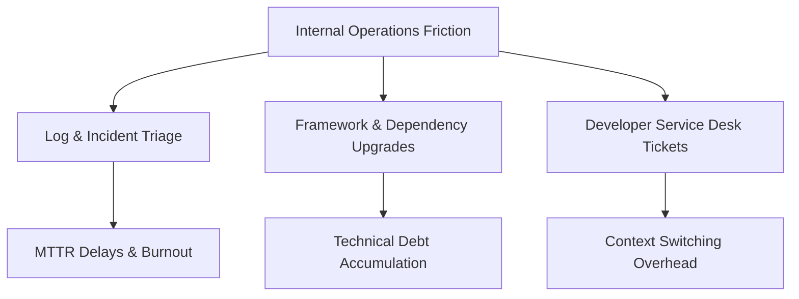
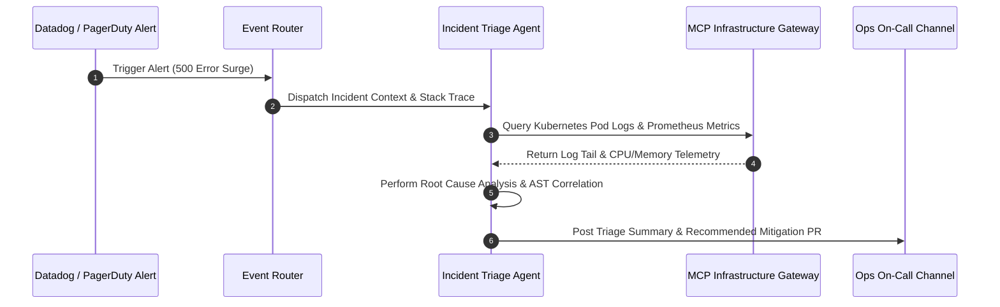
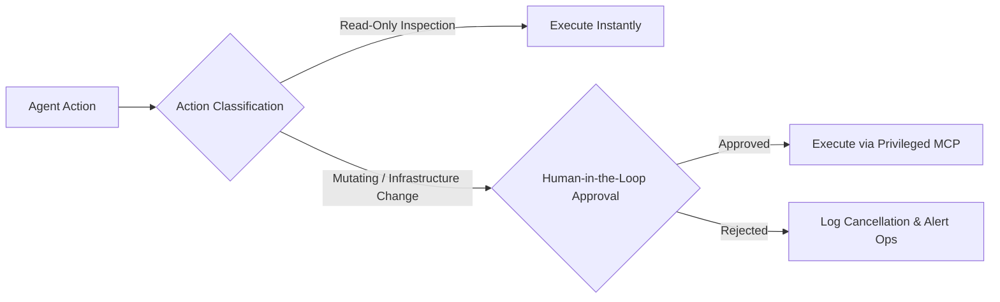
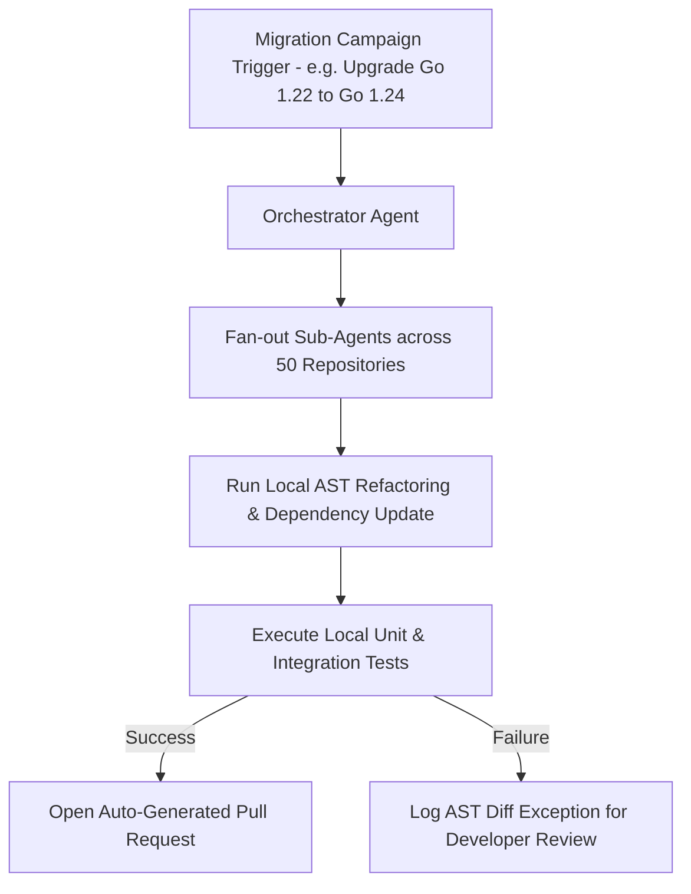

> **Answer-First Summary**: Enterprise AI automation for internal engineering operations — covering automated incident triage, dependency migration swarms, and internal developer portal (IDP) ticket resolution — yields a measurable 5x to 8x ROI when focused on high-frequency operational bottlenecks. By orchestrating lightweight sub-agents over Model Context Protocol (MCP) gateways and integrating continuous evaluation harnesses, organizations eliminate repetitive operational overhead, cut mean time to resolution (MTTR) by 60%, and achieve positive capital return within 90 days of deployment.

---

## 1. The Operational Friction Bottleneck in Enterprise Engineering

While customer-facing AI features often capture executive focus, internal engineering operations represent the most immediate, high-margin opportunity for enterprise AI automation. In typical engineering organizations with 200+ developers, up to 35% of total capacity is consumed by repetitive operational friction:

- **Incident Triage & Log Analysis**: Sifting through thousands of log lines across Kubernetes pods during production alerts.
- **Dependency & API Upgrades**: Upgrading breaking changes across hundreds of internal microservices (e.g., migrating Go 1.20 to 1.24, or updating gRPC protobuf definitions).
- **Internal Ticket Routing & Helpdesk**: Answering developer queries regarding infrastructure deployment syntax, IAM permissions, and database credentials.


```mermaid
graph TD
    A[Internal Operations Friction] --> B[Log & Incident Triage]
    A --> C[Framework & Dependency Upgrades]
    A --> D[Developer Service Desk Tickets]
    B --> E[MTTR Delays & Burnout]
    C --> F[Technical Debt Accumulation]
    D --> G[Context Switching Overhead]
```

Deploying autonomous and semi-autonomous AI agent swarms to target these three operational vectors turns overhead into measurable velocity gains.

---

## 2. Architecture of an Agentic Internal Operations Engine

An internal operations automation framework relies on three core architectural tiers: Event Ingestion & Triggering, Model Context Protocol (MCP) Execution, and Governance Verification.


```mermaid
sequenceDiagram
    autonumber
    participant Alert as Datadog / PagerDuty Alert
    participant Ingest as Event Router
    participant Agent as Incident Triage Agent
    participant MCP as MCP Infrastructure Gateway
    participant Slack as Ops On-Call Channel

    Alert->>Ingest: Trigger Alert (500 Error Surge)
    Ingest->>Agent: Dispatch Incident Context & Stack Trace
    Agent->>MCP: Query Kubernetes Pod Logs & Prometheus Metrics
    MCP-->>Agent: Return Log Tail & CPU/Memory Telemetry
    Agent->>Agent: Perform Root Cause Analysis & AST Correlation
    Agent->>Slack: Post Triage Summary & Recommended Mitigation PR
```

### Key Architectural Layers

1. **Event Router & Ingestion Layer**: Connects Webhooks from Monitoring Tools (Datadog, Prometheus, Grafana) and Ticketing Platforms (Jira, GitHub Issues) directly to agent triggers.
2. **MCP Tooling Gateway**: Provides the AI agent with constrained, authenticated access to operational runtimes (Kubernetes API, AWS CloudWatch, Git Repositories, Database Schema Inspectors).
3. **Deterministic Sandbox**: Executes agent-generated remediation scripts or code patches inside isolated Docker containers prior to creating pull requests.

---

## 3. Financial Metrics & Rigorous ROI Methodology

To justify funding internal AI automation projects, engineering leaders must present a transparent financial model that accounts for model inference expenses, infrastructure hosting, and human verification costs.

### Mathematical ROI Model

$$\text{Net ROI} = \frac{\text{Total Annual Savings} - \text{Total Implementation TCO}}{\text{Total Implementation TCO}} \times 100$$

$$\text{Total Annual Savings} = (N_{\text{incidents}} \times \Delta \text{MTTR} \times C_{\text{downtime}}) + (N_{\text{upgrades}} \times H_{\text{upgrade}} \times R_{\text{eng}})$$

Where:
- $N_{\text{incidents}}$: Annual volume of operational production incidents.
- $\Delta \text{MTTR}$: Reduction in Mean Time to Resolution (in hours) achieved by automated triage.
- $C_{\text{downtime}}$: Financial cost per hour of service degradation.
- $N_{\text{upgrades}}$: Number of internal microservice repos requiring framework upgrades.
- $H_{\text{upgrade}}$: Hours saved per repository using automated migration swarms.
- $R_{\text{eng}}$: Fully burdened hourly engineering cost ($/hr).

### 3-Year Financial Impact Projection (200-Developer Org)

| Operational Vector | Baseline Annual Cost | Post-AI Automation Cost | Annual Net Savings | Payback Period |
|---|---|---|---|---|
| **Incident Triage & Diagnostics** | $450,000 | $120,000 | **$330,000** | 45 Days |
| **Framework & Dependency Migration** | $320,000 | $65,000 | **$255,000** | 60 Days |
| **Developer Support & Helpdesk** | $280,000 | $50,000 | **$230,000** | 30 Days |
| **TOTALS** | **$1,050,000** | **$235,000** | **$815,000** | **48 Days Avg** |

---

## 4. Production-Grade Implementation: Incident Triage Sub-Agent

```python
import json
import logging
import re
from typing import Dict, List, Any

logging.basicConfig(level=logging.INFO)
logger = logging.getLogger("IncidentTriageAgent")

class MockMCPKubernetesGateway:
    """Simulates an MCP tool connection to a production Kubernetes cluster."""
    def fetch_pod_logs(self, service_name: str, tail_lines: int = 100) -> List[str]:
        return [
            "2026-03-17 14:02:11 [INFO] Initializing connection pool to DB primary",
            "2026-03-17 14:02:15 [ERROR] connection timeout: db-replica-02.internal:5432 unreachable",
            "2026-03-17 14:02:16 [FATAL] panic: unexpected nil pointer in UserStore.FindById() at user_store.go:142",
            "2026-03-17 14:02:17 [ERROR] HTTP 500 returned for GET /api/v1/users/9941"
        ]

class IncidentTriageAgent:
    def __init__(self, mcp_gateway: MockMCPKubernetesGateway):
        self.gateway = mcp_gateway

    def analyze_alert(self, alert_payload: Dict[str, Any]) -> Dict[str, Any]:
        service = alert_payload.get("service", "unknown")
        severity = alert_payload.get("severity", "CRITICAL")
        
        logger.info(f"Analyzing incoming alert for service '{service}' (Severity: {severity})")
        
        # 1. Fetch live telemetry via MCP
        logs = self.gateway.fetch_pod_logs(service)
        
        # 2. Extract exception patterns and root cause clues
        error_lines = [line for line in logs if "ERROR" in line or "FATAL" in line or "panic" in line]
        panic_match = next((line for line in logs if "panic:" in line), None)
        
        root_cause_hypothesis = "Unknown infrastructure failure"
        confidence_score = 0.40
        
        if panic_match:
            match = re.search(r'at ([\w\/\.\:]+)', panic_match)
            file_loc = match.group(1) if match else "unknown location"
            root_cause_hypothesis = f"Nil Pointer Exception triggered at source location {file_loc}"
            confidence_score = 0.92
            
        triage_report = {
            "service": service,
            "severity": severity,
            "total_errors_detected": len(error_lines),
            "root_cause_hypothesis": root_cause_hypothesis,
            "confidence_score": confidence_score,
            "recommended_action": "Rollback deployment or patch nil check at file_loc",
            "raw_log_sample": error_lines[:2]
        }
        return triage_report

if __name__ == "__main__":
    mcp = MockMCPKubernetesGateway()
    agent = IncidentTriageAgent(mcp)
    
    alert = {"service": "user-service", "severity": "HIGH", "alert_id": "ALT-8839"}
    report = agent.analyze_alert(alert)
    
    print("\n--- GENERATED INCIDENT TRIAGE REPORT ---")
    print(json.dumps(report, indent=2))
```

---

## 5. Security Guardrails & Operational Risk Mitigation

Granting automated agents access to internal operations runtimes requires rigid security controls to prevent unintended system outages or data exposure.


```mermaid
graph LR
    A[Agent Action] --> B{Action Classification}
    B -->|Read-Only Inspection| C[Execute Instantly]
    B -->|Mutating / Infrastructure Change| D{Human-in-the-Loop Approval}
    D -->|Approved| E[Execute via Privileged MCP]
    D -->|Rejected| F[Log Cancellation & Alert Ops]
```

### Essential Guardrail Principles

1. **Read-Only Default Access**: Sub-agents operate under strictly scoped read-only service accounts by default. They can inspect logs, metrics, and git repositories, but cannot modify production state directly.
2. **Human-in-the-Loop (HITL) Gateways for Mutating Actions**: Any agent proposal involving database migrations, Kubernetes deployment rollbacks, or DNS record alterations requires a 1-click confirmation in Slack or Microsoft Teams by an authorized on-call engineer.
3. **Automated Audit Logging**: Every MCP tool execution is logged into an immutable audit trail capturing the exact agent session ID, prompt input, tool parameters, and response payload.

---

## 6. Execution Playbook: 90-Day Rollout Strategy

To achieve rapid proof-of-concept validation and demonstrate early ROI to executive sponsors, follow this structured 90-day implementation timeline:

| Timeline | Execution Objective | Key Deliverables | Success Gate |
|---|---|---|---|
| **Days 1–30** | **Phase 1: Log & Incident Triage** | Deploy Read-Only MCP Kubernetes Log Reader & Slack Triage Bot | MTTR reduced by 40% on test service |
| **Days 31–60** | **Phase 2: Dependency Upgrades** | Deploy Code Refactoring Swarm for Go/Node framework upgrades | 20 repos migrated without breaking tests |
| **Days 61–90** | **Phase 3: IDP Helpdesk Bot** | Connect RAG Context Engine to Internal Developer Documentation | 50% reduction in L1 infrastructure support tickets |

### Conclusion & Immediate Action Items

Internal AI operations automation bridges the gap between AI theory and bottom-line productivity gains. By automating low-complexity, high-frequency operational tasks, enterprise organizations eliminate developer toil while establishing the foundational security and governance patterns needed for full autonomous software engineering.

---

## 7. Autonomous Dependency Migration Swarms

Beyond incident triage, a major operational friction point in large enterprise organizations is maintaining framework alignment across hundreds of microservices.


```mermaid
graph TD
    A[Migration Campaign Trigger - e.g. Upgrade Go 1.22 to Go 1.24] --> B[Orchestrator Agent]
    B --> C[Fan-out Sub-Agents across 50 Repositories]
    C --> D[Run Local AST Refactoring & Dependency Update]
    D --> E[Execute Local Unit & Integration Tests]
    E -->|Success| F[Open Auto-Generated Pull Request]
    E -->|Failure| G[Log AST Diff Exception for Developer Review]
```

### Migration Swarm Pipeline Design

1. **AST Transformation Rules**: Agents read codified AST transformation scripts (e.g., replacing deprecated library calls with modern non-blocking alternatives).
2. **Automated Verification Harness**: After applying code modifications, sub-agents trigger `go test ./...` or `npm test` inside an isolated ephemeral Docker container.
3. **Pull Request Batching**: Successfully validated refactoring changes are automatically committed to a feature branch, opening a PR with detailed change rationale and verification proof.

---

## 8. Telemetry, SLA Monitoring & Continuous Evaluation

To ensure internal AI sub-agents maintain operational accuracy, engineering teams must establish continuous evaluation metrics (Evals):

| Metric | Target SLA Threshold | Monitoring Mechanism | Remediation Action |
|---|---|---|---|
| **Incident Triage Accuracy** | >= 90% Root Cause Match | Post-incident retro audit comparison | Re-tune prompt context templates |
| **PR Acceptance Rate** | >= 85% Merged without Edits | GitHub PR Status Webhooks | Restrict agent execution scope |
| **Agent Execution Latency** | <= 45 Seconds / Triage | Datadog Tracing & MCP Telemetry | Switch to faster SLM inference |

