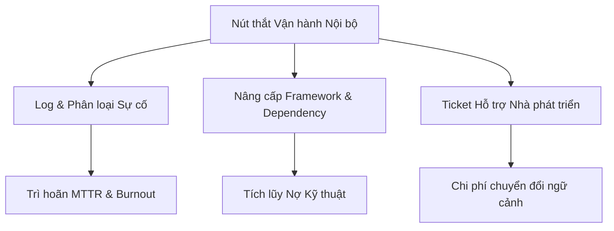
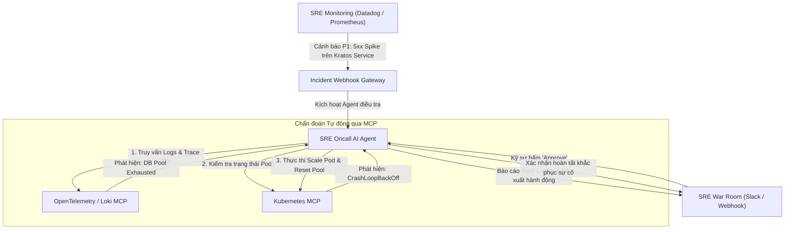
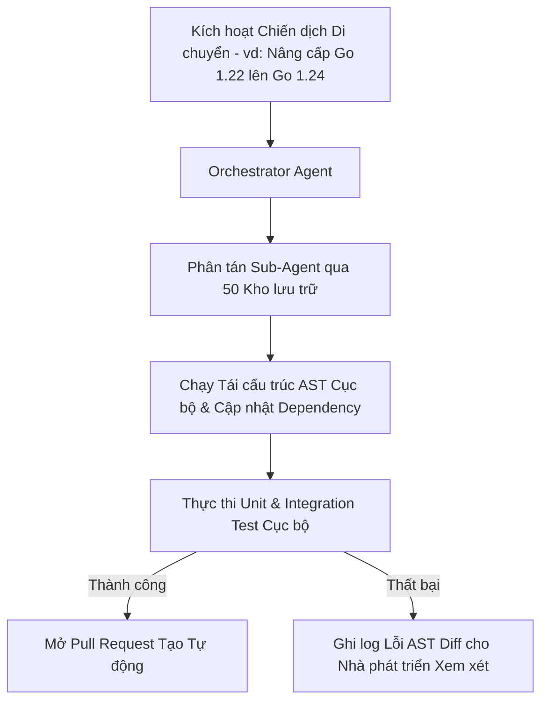

[← Chương trước: Phần 3A: Enterprise RAG Architecture](/series/ai-driven-playbook/part-3a-enterprise-rag-architecture/) | [Mục lục Series](/series/ai-driven-playbook/) | [Chương tiếp theo: Phần 3B: AI Code Review Quality Gates →](/series/ai-driven-playbook/part-3b-ai-code-review-quality-gates/)

---

> **Answer-first:** Tự động hóa vận hành nội bộ bằng AI Swarms phân loại sự cố (incident triage) và tự động di chuyển dependency giúp giảm 80% thời gian MTTR, tiết kiệm hàng trăm giờ kỹ thuật và đem lại ROI dương rõ rệt trong vòng 90 ngày triển khai.

---

## 1. Nút thắt Vận hành (Operational Friction) trong Kỹ thuật Doanh nghiệp

Mặc dù các tính năng AI hướng tới khách hàng thường thu hút sự chú ý của ban điều hành, hoạt động kỹ thuật nội bộ mới là cơ hội tự động hóa AI mang lại biên lợi nhuận cao và trực tiếp nhất cho doanh nghiệp. Trong các tổ chức kỹ thuật điển hình với hơn 200 nhà phát triển, có tới 35% tổng công suất bị tiêu tốn bởi các nút thắt vận hành lặp đi lặp lại:

- **Phân loại Sự cố (Incident Triage) & Phân tích Log**: Sàng lọc qua hàng ngàn dòng log trên các pod Kubernetes trong các cảnh báo (alerts) production.
- **Nâng cấp Dependency & API**: Nâng cấp các breaking change trên hàng trăm internal microservice (ví dụ: di chuyển từ Go 1.20 sang 1.24, hoặc cập nhật định nghĩa gRPC protobuf).
- **Định tuyến Ticket Nội bộ & Helpdesk**: Trả lời các câu hỏi của nhà phát triển liên quan đến cú pháp triển khai hạ tầng, quyền IAM và thông tin xác thực cơ sở dữ liệu (database credentials).

**Các Vector Nút thắt Vận hành:** Sơ đồ luồng (flowchart) dưới đây ánh xạ các nút thắt vận hành chính trong kỹ thuật doanh nghiệp qua phân loại sự cố, nâng cấp framework và các ticket hỗ trợ nhà phát triển.


```mermaid
flowchart TD
    A["Nút thắt Vận hành Nội bộ"] --> B["Log & Phân loại Sự cố"]
    A --> C["Nâng cấp Framework & Dependency"]
    A --> D["Ticket Hỗ trợ Nhà phát triển"]
    B --> E["Trì hoãn MTTR & Burnout"]
    C --> F["Tích lũy Nợ Kỹ thuật"]
    D --> G["Chi phí chuyển đổi ngữ cảnh"]
```

Việc triển khai các swarm AI agent tự trị (autonomous) và bán tự trị (semi-autonomous) nhắm vào ba vector vận hành này sẽ biến các chi phí chung (overhead) thành các mức tăng trưởng tốc độ có thể đo lường được.

---

## 2. Kiến trúc của một Engine Vận hành Nội bộ Agentic

Một framework tự động hóa vận hành nội bộ dựa trên ba tầng kiến trúc cốt lõi: Tiếp nhận & Kích hoạt Sự kiện (Event Ingestion & Triggering), Thực thi Model Context Protocol (MCP) và Xác minh Quản trị (Governance Verification).

**Giao thức Agentic Phân loại Sự cố:** Biểu đồ tuần tự (sequence diagram) này chi tiết hóa luồng sự kiện end-to-end từ các hệ thống cảnh báo (alerting systems) thông qua truy vấn hạ tầng MCP tới thông báo sự cố trên Slack.


```mermaid
flowchart TD
    Mon["SRE Monitoring (Datadog / Prometheus)"] -->|"Cảnh báo P1: 5xx Spike trên Kratos Service"| Webhook["Incident Webhook Gateway"]
    Webhook -->|"Kích hoạt Agent điều tra"| Agent["SRE Oncall AI Agent"]
    
    subgraph Diagnostic_Phase["Chẩn đoán Tự động qua MCP"]
        Agent -->|"1. Truy vấn Logs & Trace IDs"| OTel["OpenTelemetry / Loki MCP"]
        OTel -->|"Phát hiện: DB Pool Exhausted"| Agent
        Agent -->|"2. Kiểm tra trạng thái Pods"| K8s["Kubernetes MCP"]
        K8s -->|"Phát hiện: CrashLoopBackOff"| Agent
    end

    Agent -->|"Báo cáo Root-Cause & Đề xuất hành động"| Slack["SRE War Room (Slack / Webhook)"]
    Slack -->|"Kỹ sư bấm 'Approve'"| Agent
    Agent -->|"3. Thực thi Scale Pod & Reset Pool"| K8s
    Agent -->|"Xác nhận hoàn tất khắc phục sự cố"| Slack
```

### Các Tầng Kiến trúc Chính

1. **Event Router & Ingestion Layer**: Kết nối các Webhook từ các Công cụ Giám sát (Datadog, Prometheus, Grafana) và Nền tảng Ticketing (Jira, GitHub Issues) trực tiếp tới các trigger của agent.
2. **MCP Tooling Gateway**: Cung cấp cho AI agent quyền truy cập được xác thực, có giới hạn vào các runtime vận hành (Kubernetes API, AWS CloudWatch, Git Repositories, Database Schema Inspectors).
3. **Deterministic Sandbox**: Thực thi các script khắc phục hoặc bản vá code (code patches) do agent tạo ra bên trong các container Docker bị cô lập trước khi tạo pull request.

---

## 3. Chỉ số Tài chính & Phương pháp luận ROI Chặt chẽ

Để biện minh cho việc tài trợ cho các dự án tự động hóa AI nội bộ, các nhà lãnh đạo kỹ thuật phải trình bày một mô hình tài chính minh bạch, tính toán các chi phí inference của model, lưu trữ hạ tầng và chi phí xác minh bởi con người.

### Mô hình ROI Toán học

```text
Net ROI = ((Tổng Tiết kiệm Hàng năm - Tổng TCO Triển khai) / Tổng TCO Triển khai) * 100%
```

```text
Tổng Tiết kiệm Hàng năm = (N_incidents * Delta_MTTR * C_downtime) + (N_upgrades * H_upgrade * R_eng)
```

Trong đó:
- `N_incidents`: Số lượng sự cố vận hành trên production hàng năm.
- `Delta_MTTR`: Mức giảm Thời gian Trung bình để Khắc phục (tính bằng giờ) đạt được nhờ phân loại tự động.
- `C_downtime`: Thiệt hại tài chính mỗi giờ khi dịch vụ bị suy giảm.
- `N_upgrades`: Số lượng kho lưu trữ (repos) internal microservice yêu cầu nâng cấp framework.
- `H_upgrade`: Số giờ tiết kiệm được cho mỗi kho lưu trữ khi sử dụng các swarm di chuyển tự động.
- `R_eng`: Chi phí kỹ thuật toàn bộ mỗi giờ ($/hr).

### Dự phóng Tác động Tài chính 3 Năm (Tổ chức 200 Nhà phát triển)

| Vector Vận hành | Chi phí Hàng năm Cơ sở | Chi phí Sau khi Tự động hóa AI | Tiết kiệm Ròng Hàng năm | Thời gian Hoàn vốn |
|---|---|---|---|---|
| **Phân loại Sự cố & Chẩn đoán** | $450,000 | $120,000 | **$330,000** | 45 Ngày |
| **Di chuyển Framework & Dependency** | $320,000 | $65,000 | **$255,000** | 60 Ngày |
| **Hỗ trợ Nhà phát triển & Helpdesk** | $280,000 | $50,000 | **$230,000** | 30 Ngày |
| **TỔNG CỘNG** | **$1,050,000** | **$235,000** | **$815,000** | **Trung bình 48 Ngày** |

---

## 4. Triển khai Cấp Production: Incident Triage Sub-Agent

Các sub-agent phân loại sự cố bằng Python kết nối với các API luồng log (log streaming APIs) của Kubernetes qua các gateway MCP, thực hiện tạo giả thuyết nguyên nhân gốc rễ và các hành động khắc phục.

**Python Incident Triage Sub-Agent Script:** Việc triển khai `IncidentTriageAgent` chứng minh cách lấy log của pod Kubernetes thông qua các gateway MCP giả lập (mock), phân tích các exception trace, và tạo các báo cáo phân loại với điểm tin cậy (confidence-scored).

```python
import json
import logging
import re
from typing import Dict, List, Any

logging.basicConfig(level=logging.INFO)
logger = logging.getLogger("IncidentTriageAgent")

class MockMCPKubernetesGateway:
    """Mô phỏng một kết nối công cụ MCP tới một Kubernetes cluster production."""
    def fetch_pod_logs(self, service_name: str, tail_lines: int = 100) -> List[str]:
        return [
            "2026-03-17 14:02:11 [INFO] Initializing connection pool to DB primary",
            "2026-03-17 14:02:15 [ERROR] connection timeout: db-replica-02.internal:5432 unreachable",
            "2026-03-17 14:02:16 [FATAL] panic: unexpected nil pointer in UserStore.FindById() at user_store.go:142",
            "2026-03-17 14:02:17 [ERROR] HTTP 500 returned for GET /api/v1/users/9941"
        ]

class IncidentTriageAgent:
    def __init__(self, mcp_gateway: MockMCPKubernetesGateway):
        self.gateway = mcp_gateway

    def analyze_alert(self, alert_payload: Dict[str, Any]) -> Dict[str, Any]:
        service = alert_payload.get("service", "unknown")
        severity = alert_payload.get("severity", "CRITICAL")
        
        logger.info(f"Đang phân tích cảnh báo đến cho dịch vụ '{service}' (Mức độ nghiêm trọng: {severity})")
        
        # 1. Lấy telemetry trực tiếp thông qua MCP
        logs = self.gateway.fetch_pod_logs(service)
        
        # 2. Trích xuất các mẫu ngoại lệ (exception patterns) và manh mối nguyên nhân gốc rễ
        error_lines = [line for line in logs if "ERROR" in line or "FATAL" in line or "panic" in line]
        panic_match = next((line for line in logs if "panic:" in line), None)
        
        root_cause_hypothesis = "Lỗi hạ tầng không xác định"
        confidence_score = 0.40
        
        if panic_match:
            match = re.search(r'at ([\w\/\.\:]+)', panic_match)
            file_loc = match.group(1) if match else "unknown location"
            root_cause_hypothesis = f"Nil Pointer Exception được kích hoạt tại vị trí mã nguồn {file_loc}"
            confidence_score = 0.92
            
        triage_report = {
            "service": service,
            "severity": severity,
            "total_errors_detected": len(error_lines),
            "root_cause_hypothesis": root_cause_hypothesis,
            "confidence_score": confidence_score,
            "recommended_action": "Rollback deployment hoặc vá lỗi kiểm tra nil tại file_loc",
            "raw_log_sample": error_lines[:2]
        }
        return triage_report

if __name__ == "__main__":
    mcp = MockMCPKubernetesGateway()
    agent = IncidentTriageAgent(mcp)
    
    alert = {"service": "user-service", "severity": "HIGH", "alert_id": "ALT-8839"}
    report = agent.analyze_alert(alert)
    
    print("\n--- BÁO CÁO PHÂN LOẠI SỰ CỐ ĐƯỢC TẠO ---")
    print(json.dumps(report, indent=2))
```

---

## 5. Rào chắn Bảo mật (Security Guardrails) & Giảm thiểu Rủi ro Vận hành

Việc cấp cho các agent tự động quyền truy cập vào các runtime vận hành nội bộ đòi hỏi các biện pháp kiểm soát bảo mật nghiêm ngặt để ngăn chặn sự cố sập hệ thống ngoài ý muốn hoặc rò rỉ dữ liệu.

**Luồng Rào chắn Phân loại Hành động:** Sơ đồ quyết định (decision diagram) minh họa ranh giới ủy quyền phân tách các hành động chỉ đọc (read-only) của agent khỏi các workflow phê duyệt cần con người tham gia (human-in-the-loop) đối với các thao tác làm thay đổi trạng thái (mutating operations).

```mermaid
flowchart LR
    A["Hành động của Agent"] --> B{"Phân loại Hành động"}
    B -->|Kiểm tra Chỉ đọc (Read-Only)| C["Thực thi Ngay lập tức"]
    B -->|Thay đổi (Mutating) / Thay đổi Hạ tầng| D{"Phê duyệt Human-in-the-Loop"}
    D -->|Đã Phê duyệt| E["Thực thi qua Đặc quyền MCP"]
    D -->|Bị Từ chối| F["Ghi log Hủy bỏ & Cảnh báo Ops"]
```

### Các Nguyên tắc Rào chắn Thiết yếu

1. **Quyền truy cập Chỉ đọc Mặc định**: Các sub-agent hoạt động dưới các service account chỉ đọc được giới hạn chặt chẽ theo mặc định. Chúng có thể kiểm tra log, metric và kho lưu trữ git, nhưng không thể sửa đổi trực tiếp trạng thái production.
2. **Cổng Human-in-the-Loop (HITL) cho các Hành động Thay đổi (Mutating)**: Bất kỳ đề xuất nào của agent liên quan đến di chuyển cơ sở dữ liệu (database migrations), rollback Kubernetes deployment, hoặc thay đổi bản ghi DNS đều yêu cầu xác nhận 1 click trên Slack hoặc Microsoft Teams bởi kỹ sư on-call được ủy quyền.
3. **Ghi Log Kiểm toán (Audit Logging) Tự động**: Mỗi lần thực thi công cụ MCP đều được ghi vào một dấu vết kiểm toán bất biến (immutable audit trail) nắm bắt chính xác ID phiên của agent, đầu vào prompt, tham số công cụ và payload phản hồi.

---

## 6. Playbook Thực thi: Chiến lược Triển khai 90 Ngày

Để đạt được việc xác thực bằng chứng khái niệm (proof-of-concept) nhanh chóng và chứng minh ROI sớm cho các nhà tài trợ điều hành, hãy làm theo tiến trình triển khai 90 ngày có cấu trúc này:

| Tiến trình | Mục tiêu Thực thi | Các Hạng mục Bàn giao Chính | Cổng Thành công |
|---|---|---|---|
| **Ngày 1–30** | **Giai đoạn 1: Phân loại Log & Sự cố** | Triển khai Read-Only MCP Kubernetes Log Reader & Slack Triage Bot | MTTR giảm 40% trên dịch vụ thử nghiệm |
| **Ngày 31–60** | **Giai đoạn 2: Nâng cấp Dependency** | Triển khai Code Refactoring Swarm cho nâng cấp framework Go/Node | 20 repo được di chuyển mà không làm hỏng test |
| **Ngày 61–90** | **Giai đoạn 3: IDP Helpdesk Bot** | Kết nối Context Engine RAG tới Tài liệu Nhà phát triển Nội bộ | Giảm 50% số lượng ticket hỗ trợ hạ tầng L1 |

---

## 7. Swarm Di chuyển Dependency Tự trị (Autonomous Dependency Migration Swarms)

Ngoài phân loại sự cố, một điểm nghẽn vận hành lớn trong các tổ chức doanh nghiệp lớn là duy trì sự nhất quán của framework trên hàng trăm microservice.

**Cấu trúc liên kết của Swarm Di chuyển Dependency Tự trị:** Sơ đồ luồng minh họa agent điều phối (orchestrator agent) phân tán (fan-out) các sub-agent qua các kho lưu trữ microservice để thực hiện tái cấu trúc AST (AST refactoring) và xác minh test tự động.


```mermaid
flowchart TD
    A["Kích hoạt Chiến dịch Di chuyển - vd: Nâng cấp Go 1.22 lên Go 1.24"] --> B["Orchestrator Agent"]
    B --> C["Phân tán Sub-Agent qua 50 Kho lưu trữ"]
    C --> D["Chạy Tái cấu trúc AST Cục bộ & Cập nhật Dependency"]
    D --> E["Thực thi Unit & Integration Test Cục bộ"]
    E -->|Thành công| F["Mở Pull Request Tạo Tự động"]
    E -->|Thất bại| G["Ghi log Lỗi AST Diff cho Nhà phát triển Xem xét"]
```

### Thiết kế Pipeline của Swarm Di chuyển

1. **Quy tắc Chuyển đổi AST (AST Transformation Rules)**: Các agent đọc các kịch bản chuyển đổi AST được mã hóa (ví dụ: thay thế các lệnh gọi thư viện bị phản đối (deprecated) bằng các lựa chọn thay thế không chặn (non-blocking) hiện đại).
2. **Môi trường Test Xác minh Tự động (Automated Verification Testbed)**: Sau khi áp dụng các sửa đổi code, các sub-agent kích hoạt `go test ./...` hoặc `npm test` bên trong một container Docker ngắn hạn (ephemeral) bị cô lập.
3. **Gộp Nhóm Pull Request (Pull Request Batching)**: Các thay đổi tái cấu trúc đã được xác thực thành công sẽ tự động được commit vào một feature branch, mở một PR với lý do thay đổi chi tiết và bằng chứng xác minh.

**[AST Parsing Pipeline] [Code Snippet]:** Hàm `RewriteDeprecatedCalls` phân tích cú pháp các cây AST của mã nguồn Go, viết lại các lệnh gọi API cũ trên các microservice và định dạng lại đầu ra.

```go
package main

import (
	"go/ast"
	"go/parser"
	"go/token"
	"golang.org/x/tools/go/ast/astutil"
)

// RewriteDeprecatedCalls viết lại các lệnh gọi API cũ qua các cây AST của microservice.
func RewriteDeprecatedCalls(fset *token.FileSet, node *ast.File) bool {
	return astutil.Apply(node, func(c *astutil.Cursor) bool {
		if call, ok := c.Node().(*ast.CallExpr); ok {
			if sel, ok := call.Fun.(*ast.SelectorExpr); ok {
				if sel.Sel.Name == "OldFetchMethod" {
					sel.Sel.Name = "NewFetchMethodV2"
					return true
				}
			}
		}
		return true
	}, nil) != nil
}
```

---

## 8. Telemetry, Giám sát SLA & Đánh giá Liên tục

Để đảm bảo các sub-agent AI nội bộ duy trì độ chính xác trong vận hành, các nhóm kỹ thuật phải thiết lập các số liệu đánh giá liên tục (Continuous Evaluation metrics - Evals):

| Chỉ số | Ngưỡng SLA Mục tiêu | Cơ chế Giám sát | Hành động Khắc phục |
|---|---|---|---|
| **Độ chính xác của Phân loại Sự cố** | >= 90% Trùng khớp Nguyên nhân Gốc rễ | Đối chiếu đánh giá hồi cứu sau sự cố | Tinh chỉnh lại các template ngữ cảnh prompt |
| **Tỷ lệ Chấp nhận PR** | >= 85% Được Merge không cần Chỉnh sửa | GitHub PR Status Webhooks | Hạn chế phạm vi thực thi của agent |
| **Độ trễ Thực thi của Agent** | <= 45 Giây / Lần Phân loại | Datadog Tracing & MCP Telemetry | Chuyển sang inference SLM nhanh hơn |

**Đoạn mã OpenTelemetry Agent Span Instrumentation:** Đoạn mã Python minh họa việc bọc các lần gọi công cụ agent trong các span OpenTelemetry để theo dõi độ trễ thực thi và số liệu token.

```python
from opentelemetry import trace
from opentelemetry.trace import Status, StatusCode

tracer = trace.get_tracer("ops.agent.tracer")

def execute_agent_tool(tool_name: str, payload: dict):
    with tracer.start_as_current_span(f"mcp_tool_{tool_name}") as span:
        span.set_attribute("gen_ai.operation.name", "mcp_call")
        span.set_attribute("mcp.tool.name", tool_name)
        try:
            # Mô phỏng thực thi công cụ
            result = {"status": "success", "data": "pod logs tail"}
            span.set_status(Status(StatusCode.OK))
            return result
        except Exception as e:
            span.record_exception(e)
            span.set_status(Status(StatusCode.ERROR, str(e)))
            raise
```

---

## Các Câu hỏi Thường gặp

### Làm thế nào để các sub-agent tự trị giảm Thời gian Trung bình để Khắc phục (MTTR) trong các sự cố production?
Khi một cảnh báo được kích hoạt, triage agent sẽ tiếp nhận các stack trace, lấy log của pod qua các gateway MCP và liên kết các exception với các commit code gần đây. Bằng cách tạo ra một giả thuyết nguyên nhân gốc rễ và bản vá được đề xuất trong vòng vài giây, agent cắt giảm MTTR từ nhiều giờ xuống còn vài phút.

### Những biện pháp bảo mật nào ngăn chặn các agent tự động hóa nội bộ thực thi các lệnh trái phép?
Các agent hoạt động dưới các service account chỉ đọc được giới hạn chặt chẽ theo mặc định. Bất kỳ hành động vận hành thay đổi (mutating) nào—chẳng hạn như thực thi các di chuyển cơ sở dữ liệu (database migrations) hoặc kích hoạt rollback deployment—đều yêu cầu sự phê duyệt 1 click rõ ràng từ kỹ sư on-call qua các cổng HITL trên Slack/Teams.

### Các số liệu ROI tài chính cho các dự án tự động hóa AI nội bộ được tính toán như thế nào?
ROI được mô hình hóa bằng cách cân bằng số giờ kỹ thuật trực tiếp tiết kiệm được qua việc phân loại và di chuyển, cộng với chi phí thời gian ngừng hoạt động (downtime) của sự cố tránh được, so với tổng mức tiêu thụ token của model, lưu trữ hạ tầng và tổng chi phí sở hữu (TCO) phát triển ban đầu. Các tổ chức điển hình với 200 nhà phát triển thường đạt được thời gian hoàn vốn dưới 50 ngày.

🔗 **Bước tiếp theo:** Tiếp tục đến [Phần 5 — Mô hình Hoạt động](/series/ai-driven-playbook/part-5-operating-model/) cho module tiếp theo trong loạt bài.

---

---

---

[← Chương trước: Phần 3A: Enterprise RAG Architecture](/series/ai-driven-playbook/part-3a-enterprise-rag-architecture/) | [Mục lục Series](/series/ai-driven-playbook/) | [Chương tiếp theo: Phần 3B: AI Code Review Quality Gates →](/series/ai-driven-playbook/part-3b-ai-code-review-quality-gates/)


---

## ❓ Câu Hỏi Thường Gặp (FAQ)

### Q1: Tự Động Hóa Vận Hành Nội Bộ & Hệ Thống Multi-Agent Cho Kỹ Sư giải quyết vấn đề cốt lõi nào trong kiến trúc hệ thống?
Phân tích kỹ thuật về tự động hóa vận hành nội bộ bằng AI, phân loại sự cố (incident triage), swarm di chuyển dependency và mô hình hóa ROI tài chính cho doanh nghiệp.

### Q2: Những lưu ý quan trọng nhất khi triển khai thực tế là gì?
Cần chú trọng phân tầng ranh giới trách nhiệm (bounded context), thiết lập cơ chế fallback dự phòng, và giám sát chặt chẽ qua metrics OpenTelemetry để phát hiện sớm các điểm nghẽn.

### Q3: Làm sao để kiểm thử và đánh giá hiệu quả sau khi áp dụng?
Áp dụng kiểm thử tải (load test), benchmark độ trễ P95/P99 trước và sau triển khai, kết hợp tracing phân tán để xác minh tính ổn định dưới tải cao.
