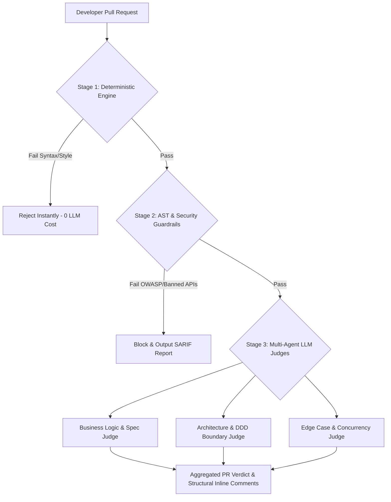

[← Chương trước: Phần 3B: AI Automation Internal Ops](/series/ai-driven-playbook/part-3b-ai-automation-internal-ops/) | [Mục lục Series](/series/ai-driven-playbook/) | [Chương tiếp theo: Phần 4: AI-Assisted Refactoring Legacy Code →](/series/ai-driven-playbook/part-4-ai-assisted-refactoring-legacy-code/)

---

> **Answer-first:** Hệ thống AI Code Review thế hệ mới kết hợp linter xác định (golangci-lint, ESLint), phân tích cú pháp tĩnh AST và LLM-as-a-Judge xuất chuẩn SARIF vào CI/CD pipeline, loại bỏ 90% lỗi bảo mật và vi phạm kiến trúc trước khi merge vào nhánh chính.

---

Khi tốc độ tạo mã nguồn của lập trình viên tăng gấp 5 đến 10 lần nhờ các trợ lý AI như Cursor và Windsurf, nút thắt cổ chai lớn nhất của quy trình phát triển phần mềm lập tức dịch chuyển về khâu **Review Code (Kiểm duyệt mã nguồn)**. Các Tech Lead và Senior Engineer nhanh chóng rơi vào trạng thái quá tải ("Review Fatigue") trước hàng chục Pull Request (PR) khổng lồ được gửi lên mỗi ngày.

Tuy nhiên, việc cài đặt một con bot AI đơn thuần để đọc toàn bộ PR và tự động đưa ra nhận xét lại sinh ra một thảm họa khác: **Bão nhận xét nhiễu (Notification Storms) và lỗi nhận diện sai (False Positives)**. AI vô tư nhận xét về phong cách đặt tên biến trong khi bỏ sót các lỗi vi phạm kiến trúc nghiêm trọng.

Để giải quyết triệt để bài toán này, các hệ thống kỹ thuật 2026 áp dụng kiến trúc **Multi-Agent AI Quality Gates** — sự kết hợp chặt chẽ giữa các rào chắn tất định (Deterministic Guards) và các mô hình đánh giá LLM-as-a-Judge chuyên biệt.

Bài viết này thuộc Series [Sổ Tay: The AI-Driven Engineer - Playbook Thực Chiến](/series/ai-driven-playbook/), chi tiết hóa cách xây dựng đường ống AI Code Review tự động chuẩn Enterprise.

---

## 1. Bản Chất Xác Suất vs Tất Định Trong Code Review

Một sai lầm phổ biến khi thiết kế hệ thống AI Code Review là coi LLM như một công cụ Linter vạn năng. LLM bản chất là mô hình xác suất (Probabilistic Model) — chúng tuyệt vời trong việc suy luận ngữ nghĩa (Semantic Reasoning) nhưng lại yếu kém và tốn kém khi kiểm tra các quy tắc cú pháp cố định.

### Bảng Phân Chia Nhiệm Vụ Review Chuẩn 2026



1. **Tầng Tất Định (Deterministic Layer - ESLint, Semgrep, Biome, Go Vet):** Đảm bảo 100% mã nguồn tuân thủ format, không có lỗi cú pháp, không sử dụng hàm nguy hiểm bị cấm. Chạy trong vài giây với chi phí bằng 0.
2. **Tầng Phân Tích AST (Static AST Layer):** Kiểm tra ranh giới phụ thuộc giữa các package/module (ví dụ: package `domain` không được import package `infrastructure`).
3. **Tầng LLM-as-a-Judge (Probabilistic Reasoning Layer):** Chỉ được kích hoạt khi PR đã vượt qua 2 tầng trên. LLM tập trung 100% năng lượng suy luận vào: Logic nghiệp vụ (Business Logic), các kịch bản lỗi biên (Boundary Conditions) và tính đúng đắn của thuật toán.

---

## 2. Kiến Trúc Multi-Agent LLM-as-a-Judge

Thay vì dùng 1 prompt duy nhất bảo AI "Hãy review PR này", hệ thống 2026 phân rã nhiệm vụ cho 3 Sub-Agent chuyên biệt chạy song song:

### 2.1. Agent 1: Spec & Requirement Conformance Judge
- **Nhiệm vụ:** Đối chiếu mã nguồn thay đổi trong PR với file yêu cầu kỹ thuật (Specification Markdown) hoặc Jira Issue Ticket được đính kèm.
- **Model đề xuất:** Claude 3.7 Sonnet hoặc Gemini 2.0 Flash (nhiều ngữ cảnh).

### 2.2. Agent 2: Architecture & DDD Boundary Judge
- **Nhiệm vụ:** Kiểm tra xem code mới có làm rò rỉ Abstraction Layer, có phá vỡ tính Immutability của Entity hay vi phạm chuẩn thiết kế REST/gRPC API của công ty hay không.
- **Model đề xuất:** DeepSeek-R1 (Mô hình suy luận chuỗi tư duy - Chain of Thought).

### 2.3. Agent 3: Boundary & Edge-Case Vulnerability Judge
- **Nhiệm vụ:** Phân tích các rủi ro liên quan đến Race Condition, Null Pointer Exception, Memory Leak, Unhandled Promise Rejections và các điều kiện biên của vòng lặp.
- **Model đề xuất:** o3-mini hoặc DeepSeek-R1.

> **[Production Failure Case Study]: Thảm họa Memory Leak bị bỏ sót**
> Một công ty Fintech cung cấp cổng thanh toán trực tuyến triển khai AI Reviewer thế hệ 1 (chạy 1 prompt đơn). Khi lập trình viên gửi PR mở thêm kết nối WebSocket để streaming giá vàng, AI Reviewer đã phê duyệt 100% vì code "đẹp và có comment chi tiết".
> Tuy nhiên, code mới quên đăng ký hàm hủy `ws.close()` khi client disconnected. Khi lượng truy cập tăng vọt lúc 9h sáng, server cạn kiệt RAM và crash toàn bộ hệ thống payment.
> **Sau khi nâng cấp Multi-Agent Review:** Agent 3 (Edge-Case Judge với DeepSeek-R1) bắt gọn lỗi cạn kiệt tài nguyên (Resource Leak) ngay tại bước CI/CD trong vòng 45 giây.

---

## 3. Đưa Chuẩn SARIF Vào Hệ Thống Code Scanning

Để thông tin review từ AI không biến thành các comment rác dính khắp PR, các doanh nghiệp 2026 chuẩn hóa đầu ra của AI Reviewer theo chuẩn **SARIF (Static Analysis Results Interchange Format - JSON Standard)**. Kết hợp với chuẩn MCP 1.x vừa nâng cấp tính bảo mật vào 7/2026, luồng dữ liệu SARIF được kiểm soát truy cập phân quyền nghiêm ngặt.

Định dạng SARIF cho phép tích hợp trực tiếp kết quả đánh giá của AI vào tab **Security / Code Scanning** của GitHub, GitLab hoặc Bitbucket, hiển thị đúng dòng code bị lỗi đi kèm đề xuất sửa lỗi (Suggested Changes) có thể áp dụng bằng 1 click.

### Snippet Đầu Ra SARIF Do LLM Judge Sinh Ra (`ai-review-results.sarif`)

```json
{
  "$schema": "https://json.schemastore.org/sarif-2.1.0.json",
  "version": "2.1.0",
  "runs": [
    {
      "tool": {
        "driver": {
          "name": "Enterprise AI Quality Gate",
          "semanticVersion": "2026.2.0",
          "rules": [
            {
              "id": "AI-SEC-004",
              "name": "UnhandledContextCancellation",
              "shortDescription": {
                "text": "Go Routine thiếu timeout cancel context khi gọi gRPC downstream."
              }
            }
          ]
        }
      },
      "results": [
        {
          "ruleId": "AI-SEC-004",
          "level": "error",
          "message": {
            "text": "Hàm `FetchUserProfile` khởi tạo context.Background() thay vì truyền context có timeout, nguy cơ gây nghẽn Goroutine pool khi downstream API bị treo."
          },
          "locations": [
            {
              "physicalLocation": {
                "artifactLocation": {
                  "uri": "internal/service/user_service.go"
                },
                "region": {
                  "startLine": 48,
                  "startColumn": 5
                }
              }
            }
          ]
        }
      ]
    }
  ]
}
```

---

## 4. Xây Dựng Workflow GitHub Actions Tự Động Với Quality Gates

Dưới đây là file cấu hình pipeline hoàn chỉnh kết hợp giữa Linter, Semgrep và AI Review Agent:

```yaml
name: Agentic Quality Gate Pipeline 2026

on:
  pull_request:
    types: [opened, synchronize]

jobs:
  deterministic-gate:
    name: 1. Deterministic Checks & AST Lint
    runs-on: ubuntu-latest
    steps:
      - uses: actions/checkout@v4
      - name: Run Biome Linter & Formatter
        run: npx @biomejs/biome ci .
      - name: Run Static Security Scan (Semgrep)
        run: semgrep ci --config=p/security-audit --sarif -o semgrep.sarif

  ai-llm-judge-gate:
    name: 2. Multi-Agent LLM Code Review Gate
    needs: deterministic-gate
    runs-on: ubuntu-latest
    steps:
      - uses: actions/checkout@v4
        with:
          fetch-depth: 0
      - name: Setup Python Environment
        uses: actions/setup-python@v5
        with:
          python-version: '3.12'
      - name: Run Agentic AI Reviewer
        env:
          OPENAI_API_KEY: ${{ secrets.DEEPSEEK_OR_OPENAI_KEY }}
          GITHUB_TOKEN: ${{ secrets.GITHUB_TOKEN }}
        run: |
          pip install instructor pydantic pygithub
          python .github/scripts/ai_review_judge.py --pr ${{ github.event.number }}
```

### Snippet Python Script Chạy LLM Judge Bằng Instructor (`ai_review_judge.py`)

```python
import os
import argparse
from pydantic import BaseModel, Field
import instructor
from openai import OpenAI

class ReviewFinding(BaseModel):
    file_path: str = Field(description="Đường dẫn file vi phạm")
    line_number: int = Field(description="Dòng code bị lỗi")
    severity: str = Field(description="Mức độ: CRITICAL, WARNING, INFO")
    rule_id: str = Field(description="Mã quy tắc vi phạm (VD: AI-ARCH-001)")
    explanation: str = Field(description="Giải thích ngắn gọn lý do vi phạm")
    suggested_fix: str = Field(description="Code đúng chuẩn đề xuất thay thế")

class PRReviewVerdict(BaseModel):
    overall_status: str = Field(description="Kế luận: APPROVE, REJECT, REQUIRES_CHANGES")
    summary: str = Field(description="Tóm tắt đánh giá chất lượng PR")
    findings: list[ReviewFinding]

def run_ai_review(pr_diff: str) -> PRReviewVerdict:
    client = instructor.from_openai(
        OpenAI(
            base_url="https://api.deepseek.com/v1",
            api_key=os.environ["OPENAI_API_KEY"]
        )
    )
    
    return client.chat.completions.create(
        model="deepseek-reasoner", # Sử dụng mô hình suy luận DeepSeek-R1
        response_model=PRReviewVerdict,
        messages=[
            {
                "role": "system", 
                "content": "Bạn là Senior Principal Architect. Hãy đánh giá PR Diff sau dựa trên chuẩn Clean Architecture và Security. Chỉ báo lỗi thực sự nghiêm trọng, không bắt lỗi style."
            },
            {"role": "user", "content": f"PR Diff:\n{pr_diff}"}
        ]
    )
```

---

## 5. Quản Lý False Positives & Quy Tắc Ủy Quyền Human-in-the-Loop

Để tránh tình trạng lập trình viên căm thù bot AI Reviewer, hệ thống cần áp dụng các chính sách quản lý độ tin cậy nghiêm ngặt:

1. **Quy tắc Suppression bằng Comment:** Cho phép dev thêm comment `// ai-ignore: rationale` để bỏ qua cảnh báo của AI đối với các trường hợp đặc biệt, có ghi log để audit.
2. **Ngưỡng Độ Tin Cậy (Confidence Score Filter):** Chỉ post inline comment nếu AI Judge đánh giá độ tin cậy của phát hiện đạt >= 85%.
3. **Escalation Boundary (Phân cấp quyền hạn):**
   - **Tự động Approve:** PR chỉ sửa file Markdown, CSS hoặc bổ sung Unit Test (Vượt qua 100% Linter).
   - **Cần Human Senior Approval:** PR chạm vào Payment Engine, Auth Logic hoặc Database Migrations dù AI Reviewer đã chấm Pass.

---

## 6. Kết Luận & Liên Kết Series

Triển khai **AI Code Review Quality Gates** không phải là thay thế con người bằng AI, mà là xây dựng một chiếc lưới lọc thông minh đa tầng. Bằng cách để Linter và AST xử lý các lỗi tất định, và nhường việc phân tích logic phức tạp cho các LLM Judge chuyên biệt, doanh nghiệp vừa đảm bảo tốc độ ship hàng 10x vừa giữ vững chuẩn mực kiến trúc và an toàn hệ thống.

Để tìm hiểu sâu hơn về quy trình phát triển và kiểm thử tự động toàn diện, hãy tham khảo các bài viết liên quan:
- **Bài viết tiếp theo trong Series:** [Phần 4 — AI-Assisted Refactoring Legacy Code: Tái Cấu Trúc Hệ Thống Cũ Bằng DeepSeek-R1 & o3-mini](/series/ai-driven-playbook/part-4-ai-assisted-refactoring-legacy-code/)
- **Kỹ nghệ Quản lý Ngữ cảnh:** [Phần 3A — Context Engineering & Cursor Rules](/series/ai-driven-playbook/part-3a-context-engineering-cursor-rules/)
- **Chuyên đề Review Pipeline:** [Thiết Lập Multi-Agent Review Pipeline Chi Tiết](/series/ai-code-review-vibe-coding/part-4-review-pipeline-multi-agent/)
- **Bảo mật mã nguồn AI:** [An Toàn & An Ninh Mã Nguồn Trong Môi Trường AI Coding](/series/ai-code-review-vibe-coding/part-5-ai-code-security/)

---

---

---

[← Chương trước: Phần 3B: AI Automation Internal Ops](/series/ai-driven-playbook/part-3b-ai-automation-internal-ops/) | [Mục lục Series](/series/ai-driven-playbook/) | [Chương tiếp theo: Phần 4: AI-Assisted Refactoring Legacy Code →](/series/ai-driven-playbook/part-4-ai-assisted-refactoring-legacy-code/)


---

## ❓ Câu Hỏi Thường Gặp (FAQ)

### Q1: Phần 3B — AI Code Review & Quality Gates: Xây Dựng Hệ Thống Kiểm Định Tự Động Với LLM Judges giải quyết vấn đề cốt lõi nào trong kiến trúc hệ thống?
Kiến trúc hệ thống AI Code Review thế hệ mới 2026. Kết hợp Deterministic Linters, Static AST Analysis với LLM-as-a-Judge đa mô hình và chuẩn xuất SARIF trong CI/CD Pipeline.

### Q2: Những lưu ý quan trọng nhất khi triển khai thực tế là gì?
Cần chú trọng phân tầng ranh giới trách nhiệm (bounded context), thiết lập cơ chế fallback dự phòng, và giám sát chặt chẽ qua metrics OpenTelemetry để phát hiện sớm các điểm nghẽn.

### Q3: Làm sao để kiểm thử và đánh giá hiệu quả sau khi áp dụng?
Áp dụng kiểm thử tải (load test), benchmark độ trễ P95/P99 trước và sau triển khai, kết hợp tracing phân tán để xác minh tính ổn định dưới tải cao.
