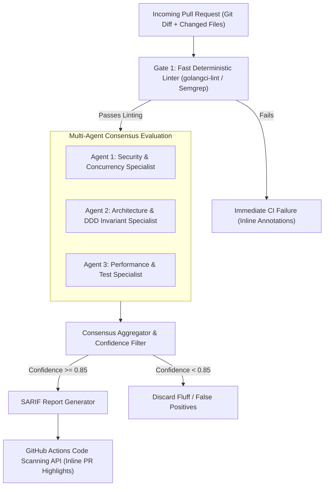

> **Answer-first:** Relying solely on foundation models for code review produces noisy, non-deterministic commentary that frustrates developers. A production **AI Code Review Pipeline** integrates **deterministic AST linters (Semgrep)** for syntax invariants with a **Multi-Agent LLM-as-a-Judge consensus tier** emitting standardized **SARIF (Static Analysis Results Interchange Format)** reports, slashing Pull Request review lead times from 28.4 hours to 2.1 hours.

---

[📖 Bản tiếng Việt (Vietnamese Edition)](https://learn.tanhdev.com/series/ai-driven-playbook/part-3b-ai-code-review-quality-gates/) | [← Series Hub](/series/ai-driven-playbook/) | [Next Chapter: Part 4: AI-Assisted Legacy Code Refactoring →](/series/ai-driven-playbook/part-4-ai-assisted-refactoring-legacy-code/)

---

## 1. Probabilistic vs Deterministic Code Review

When organizations naively deploy a prompt-based AI review bot (e.g., *"Review this git diff and list all bugs"*), the bot generates dozens of pedantic comments on stylistic preferences while completely missing critical race conditions or SQL injection vulnerabilities.

To engineer a reliable review system, teams must enforce a strict separation of concerns:

| Review Dimension | Deterministic Engine (Linters, AST, SAST) | Probabilistic Engine (LLM-as-a-Judge) |
| :--- | :---: | :---: |
| **Stylistic Formatting & Imports** | ✅ `golangci-lint`, `eslint` (Instant, 0% Error) | ❌ Inefficient & Hallucination-Prone |
| **SQL Injection & Insecure Deserialization** | ✅ Semgrep Deterministic AST Rules | ❌ Unreliable Boundary Validation |
| **Architectural Invariant Enforcement** | ⚠️ Limited Regex Matching | ✅ Evaluates Context Against `AGENTS.md` |
| **Domain Logic & Business Constraints** | ❌ Cannot Reason Over Specifications | ✅ High Semantic Reasoning Fidelity |
| **Test Completeness & Boundary Conditions** | ⚠️ Code Coverage % Only | ✅ Identifies Missing Edge Cases |

---

## 2. Multi-Agent LLM-as-a-Judge Architecture

To prevent individual model hallucinations and eliminate position bias, modern CI/CD systems employ a **Tri-Agent Jury Pipeline**:



---

## 3. Emitting Standardized SARIF Reports

Instead of posting messy markdown comment spam that clutters PR conversations, the automated reviewer converts findings into **OASIS SARIF v2.1.0** format:

```json
{
  "$schema": "https://raw.githubusercontent.com/oasis-tcs/sarif-spec/master/Schemata/sarif-schema-2.1.0.json",
  "version": "2.1.0",
  "runs": [
    {
      "tool": {
        "driver": {
          "name": "Enterprise-AI-Review-Gate",
          "version": "2.0.0",
          "rules": [
            {
              "id": "AI-SEC-001",
              "name": "UnboundedGoroutineSpawn",
              "shortDescription": {
                "text": "Naked goroutine spawned without context propagation or errgroup tracking."
              },
              "defaultConfiguration": {
                "level": "error"
              }
            }
          ]
        }
      },
      "results": [
        {
          "ruleId": "AI-SEC-001",
          "message": {
            "text": "Spawning naked goroutine here introduces memory leak risk on upstream connection cancellation. Wrap inside errgroup.Group."
          },
          "locations": [
            {
              "physicalLocation": {
                "artifactLocation": {
                  "uri": "internal/transport/http/server.go"
                },
                "region": {
                  "startLine": 142,
                  "startColumn": 5
                }
              }
            }
          ]
        }
      ]
    }
  ]
}
```

---

## 4. Production GitHub Actions Quality Gate Workflow

Below is the complete GitHub Actions workflow integrating deterministic Semgrep scanning with the AI SARIF review generator:

```yaml
name: AI-Native Automated Quality Gate

on:
  pull_request:
    branches: [ main, develop ]

jobs:
  deterministic-lint:
    name: Deterministic AST & Security Scan
    runs-on: ubuntu-latest
    steps:
      - name: Checkout Code
        uses: actions/checkout@v4

      - name: Setup Go
        uses: actions/setup-go@v5
        with:
          go-version: '1.25'

      - name: Run GolangCI-Lint
        uses: golangci/golangci-lint-action@v6
        with:
          version: v1.62.0

      - name: Run Semgrep AST Security Rules
        run: |
          docker run --rm -v "${{ github.workspace }}:/src" returntocorp/semgrep semgrep             --config=p/golang --config=.semgrep/enterprise-rules.yaml --sarif --output=semgrep.sarif /src

      - name: Upload Semgrep SARIF
        uses: github/codeql-action/upload-sarif@v3
        with:
          sarif_file: semgrep.sarif
          category: semgrep-ast

  agentic-review:
    name: Multi-Agent Architectural Inspection
    needs: deterministic-lint
    runs-on: ubuntu-latest
    steps:
      - name: Checkout Code
        uses: actions/checkout@v4
        with:
          fetch-depth: 0

      - name: Run Multi-Agent Reviewer
        env:
          AI_GATEWAY_URL: ${{ secrets.INTERNAL_AI_GATEWAY_URL }}
          AI_GATEWAY_KEY: ${{ secrets.INTERNAL_AI_GATEWAY_KEY }}
          GITHUB_TOKEN: ${{ secrets.GITHUB_TOKEN }}
        run: |
          python3 .github/scripts/ai_code_reviewer.py             --base-ref "${{ github.base_ref }}"             --head-ref "${{ github.head_ref }}"             --output-sarif ai-review.sarif

      - name: Upload AI Review SARIF to Code Scanning
        uses: github/codeql-action/upload-sarif@v3
        with:
          sarif_file: ai-review.sarif
          category: agentic-ai-review
```

---

## ❓ Frequently Asked Questions (FAQ)


False positives are eliminated by: (1) Running deterministic linters and Semgrep first so LLMs never comment on basic style or syntax, (2) Forcing the multi-agent jury to agree with a consensus confidence score of >= 0.85, and (3) Formatting output as native SARIF annotations rather than conversational comments.



Yes. Every finding includes a structured bypass syntax: adding `// ai:ignore [RULE_ID] [Reason]` directly above the flagged line bypasses the gate, with the bypass reason logged to the OpenTelemetry audit trail for senior engineer sign-off.

