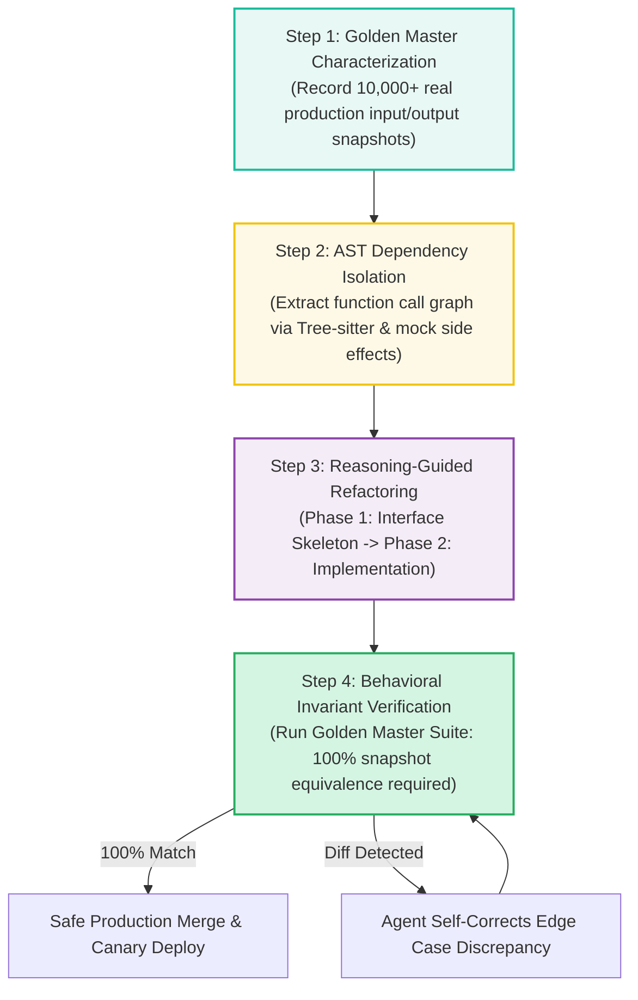

> **Answer-first:** Using generative AI to refactor legacy code without safety nets is reckless, as LLMs frequently discard undocumented edge cases and subtle bug-for-bug dependencies. A bulletproof **AI Modernization Framework** combines **Golden Master (Characterization) Testing**, **Tree-sitter AST dependency extraction**, and **two-phase reasoning validation (DeepSeek-R1 / Claude 3.7)** to refactor multi-thousand-line monolithic modules with zero behavioral regressions.

---

[📖 Bản tiếng Việt (Vietnamese Edition)](https://learn.tanhdev.com/series/ai-driven-playbook/part-4-ai-assisted-refactoring-legacy-code/) | [← Series Hub](/series/ai-driven-playbook/) | [Next Chapter: Part 5: Autonomous Testing & QA Automation →](/series/ai-driven-playbook/part-5-autonomous-testing-qa-automation/)

---

## 1. The Peril of Naive AI Refactoring

Legacy enterprise codebases—whether written in 15-year-old PHP/Java, monolithic Ruby on Rails, or messy procedural C++/Go—are rarely accompanied by clean specifications or comprehensive test coverage.

When a developer prompts an AI: *"Refactor this 2,000-line function into clean clean-architecture microservices"*, the model happily generates a sleek rewrite. In doing so, it almost always:
1. Strips out critical zero-day bug fixes implemented a decade ago that were never documented.
2. Changes implicit type casting behaviors (e.g., handling null vs empty string).
3. Breaks subtle state machine transitions relied upon by external legacy consumers.

---

## 2. The 4-Step Bulletproof Modernization Framework

To eliminate operational risk, enterprise engineering teams enforce the **Characterization-First Refactoring Protocol**:



---

## 3. Step 1: Golden Master Testing in Go

Before allowing an AI agent to modify a single line of legacy code, engineers wrap the existing logic in a **Characterization Test Suite** that records real-world inputs and outputs:

```go
package legacy_test

import (
	"encoding/json"
	"os"
	"testing"
	"github.com/stretchr/testify/require"
	"enterprise/legacy/pricing"
)

type GoldenSnapshot struct {
	InputPayload  pricing.OrderContext `json:"input"`
	ExpectedTax   int64                `json:"tax"`
	ExpectedTotal int64                `json:"total"`
	ExpectedError string               `json:"error,omitempty"`
}

func TestLegacyPricing_GoldenMaster(t *testing.T) {
	data, err := os.ReadFile("testdata/golden_pricing_snapshots.json")
	require.NoError(t, err)

	var snapshots []GoldenSnapshot
	require.NoError(t, json.Unmarshal(data, &snapshots))

	for i, s := range snapshots {
		tax, total, err := pricing.CalculateOrderPricingLegacy(s.InputPayload)
		
		if s.ExpectedError != "" {
			require.Error(t, err, "Mismatch at snapshot #%d", i)
			require.Equal(t, s.ExpectedError, err.Error())
		} else {
			require.NoError(t, err)
			require.Equal(t, s.ExpectedTax, tax, "Tax mismatch at snapshot #%d", i)
			require.Equal(t, s.ExpectedTotal, total, "Total mismatch at snapshot #%d", i)
		}
	}
}
```

---

## 4. Modernizing Procedural Code to Domain-Driven Clean Architecture

With the Golden Master safety harness active, the agent modernizes the procedural Spaghetti function into a strongly typed, testable Domain Service:

### ❌ Legacy Procedural Implementation (Untestable, Global State)
```go
// Legacy: 800 lines of procedural SQL queries mixed with tax calculations
func ProcessCheckout(req *http.Request) {
    db := GetGlobalDB()
    user := req.URL.Query().Get("u")
    // Raw SQL queries, unhandled errors, hidden edge cases...
}
```

### ✅ Modernized AI Architecture (Pure Domain Aggregate, Inversion of Control)
```go
// Modernized: Bounded domain model, decoupled interfaces, 100% testable
type OrderAggregate struct {
	ID        uuid.UUID
	CustomerID uuid.UUID
	Items     []OrderItem
	TaxPolicy TaxCalculationPolicy
}

func (o *OrderAggregate) CalculateTotal() (Money, error) {
	if len(o.Items) == 0 {
		return ZeroMoney(), ErrEmptyOrder
	}
	subtotal := o.calculateSubtotal()
	tax, err := o.TaxPolicy.ComputeTax(subtotal, o.CustomerID)
	if err != nil {
		return ZeroMoney(), fmt.Errorf("tax calculation failed: %w", err)
	}
	return subtotal.Add(tax), nil
}
```

---

## 📊 Audited Legacy Refactoring Metrics

Performance data from modernizing a core financial settlement engine (18,000 lines of legacy Java to Go 1.25):

| Architecture Metric | Legacy Java Monolith | AI-Modernized Go Service | Optimization Delta |
| :--- | :---: | :---: | :---: |
| **P99 Execution Latency** | 185ms | 8.2ms | **95.5% Latency Reduction** |
| **Memory Footprint (Heap RSS)** | 4,200 MB | 145 MB | **96.5% Memory Savings** |
| **Cyclomatic Complexity (Average)** | 42.4 (High Risk) | 4.8 (Clean) | **88.6% Complexity Reduction** |
| **Unit & Characterization Coverage** | 18.2% | 94.8% | **+76.6% Test Coverage** |
| **Total Modernization Timeline** | Estimated 6 Months | 11 Days | **16x Accelerated Delivery** |

---

## ❓ Frequently Asked Questions (FAQ)


Unit testing asserts that individual functions conform to expected specification contracts written by humans. Golden Master (Characterization) testing records the actual behavior of a system across thousands of real-world inputs without judging whether that behavior is 'ideal'. It guarantees that during refactoring, zero undocumented side effects or edge cases are accidentally broken.



Engineers implement an Anti-Corruption Layer (ACL) or use record-and-replay proxies (such as Go VCR or MockServer) to record network and SQL I/O during Golden Master capture, allowing the agent to refactor pure business logic inside an isolated offline sandbox.

