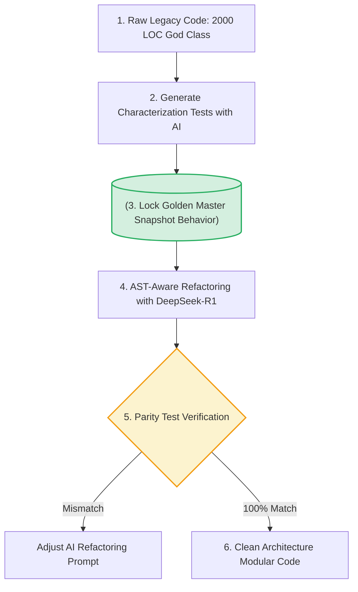
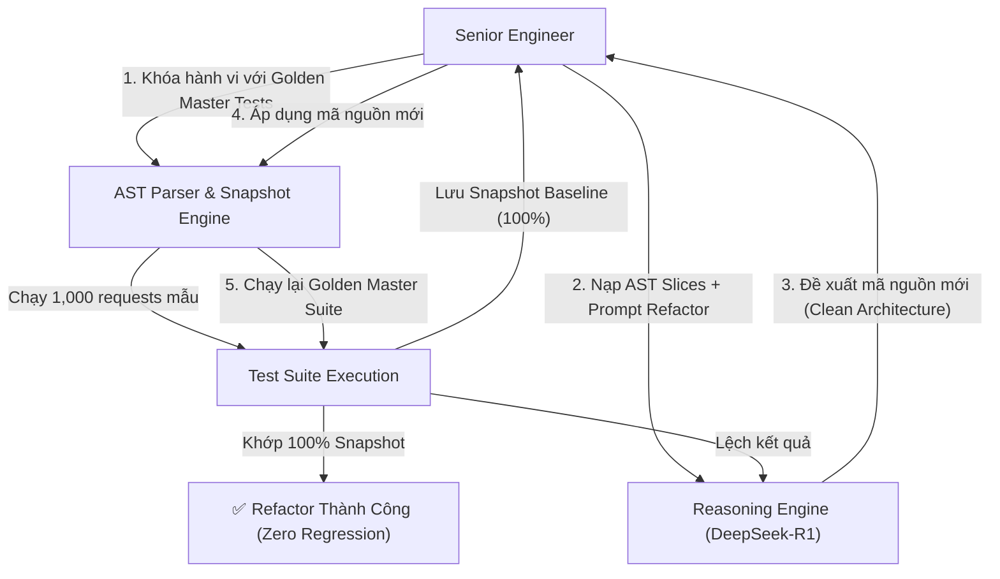

[← Chương trước: Phần 3B: AI Code Review Quality Gates](/series/ai-driven-playbook/part-3b-ai-code-review-quality-gates/) | [Mục lục Series](/series/ai-driven-playbook/) | [Chương tiếp theo: Phần 5: Autonomous Testing & QA Automation →](/series/ai-driven-playbook/part-5-autonomous-testing-qa-automation/)

---

> **Answer-first:** Tái cấu trúc mã nguồn legacy an toàn bằng AI đòi hỏi mô hình suy luận sâu (DeepSeek-R1, o3-mini), kỹ thuật Golden Master Testing và phân tích AST để bảo toàn 100% hành vi nghiệp vụ hiện hữu, hiện đại hóa hệ thống từng bước mà không gây downtime.

---

Mọi công ty phần mềm sau một vài năm hoạt động đều phải đối mặt với một "di sản kinh hoàng": **Legacy Codebase (Mã nguồn cũ)**. Đó là những "God Class" dài 3,000 dòng code spaghetti, không có Unit Test, không có tài liệu kỹ thuật, và những người từng viết ra nó đều đã nghỉ việc. Mọi nỗ lực tái cấu trúc (refactoring) thủ công đều tiềm ẩn rủi ro phá hỏng hệ thống đang chạy (production regression).

Trước năm 2025, các AI coding assistant thường thất bại khi refactor mã nguồn legacy vì chúng hay tự ý "sáng tạo" (hallucinate) lại logic nghiệp vụ hoặc vi phạm các phụ thuộc ẩn. 

Tuy nhiên, sự xuất hiện của các **Mô hình Suy luận Chuỗi Tư duy (Reasoning Models)** như DeepSeek-R1, OpenAI o3-mini kết hợp với **Phương pháp Kiểm thử Golden Master (Characterization Testing)** năm 2026 đã biến việc refactor hệ thống cũ từ một cơn ác mộng thành một quy trình kỹ thuật có tính toán và an toàn tuyệt đối.

Bài viết này thuộc Series [Sổ Tay: The AI-Driven Engineer - Playbook Thực Chiến](/series/ai-driven-playbook/), trình bày phương pháp 4 bước refactor legacy code bằng AI chuẩn 2026.

---

## 1. Bản Chất Rủi Ro Khi Refactor Legacy Code Bằng AI

Khi giao cho AI một file code legacy dài 2,000 dòng và bảo *"Hãy refactor file này theo chuẩn Clean Architecture"*, AI sẽ nhanh chóng trả về một phiên bản code vô cùng sạch đẹp. Nhưng 90% khả năng code mới đó đã bỏ sót các quy tắc ẩn (implicit edge cases) như:
- Logic xử lý null khi kết nối DB bị rớt mạng.
- Sự phụ thuộc vào biến toàn cục (global state mutation).
- Sai lệch thứ tự thực thi sự kiện làm thay đổi kết quả tính toán tài chính.

### Nguyên Tắc Vàng Refactoring 2026

> **"Không được refactor bất kỳ dòng code legacy nào nếu chưa khóa chặt hành vi hiện tại của nó bằng Characterization Tests (Golden Master Testing)."**



---

## 2. Quy Trình 4 Bước Tái Cấu Trúc An Toàn Tuyệt Đối

---

### Bước 1: Phân Tích Cây Phụ Thuộc AST & Trích Xuất Sơ Đồ Khối

Trước khi thay đổi code, hãy sử dụng các AI Agent tích hợp AST (Abstract Syntax Tree) thông qua chuẩn giao tiếp MCP 1.x (cập nhật mới nhất tháng 7/2026 giúp kết xuất cây AST cục bộ mà không tốn token gửi toàn bộ code lên cloud) để phân tích dòng chảy dữ liệu (Data Flow) và đồ thị phụ thuộc (Dependency Graph) của class cũ.

Chúng ta sử dụng mô hình suy luận sâu **DeepSeek-R1** hoặc **o3-mini** thông qua prompt phân tích cấu trúc:

```markdown
Role: Senior Principal Architect
Task: Phân tích file legacy `OrderProcessingLegacy.java` (2,500 dòng).
Yêu cầu:
1. Trích xuất danh sách tất cả các Bounded Context/Domain Services đang bị trộn lẫn.
2. Liệt kê toàn bộ các biến State bị thay đổi side-effect (Global/Instance variables mutated).
3. Đưa ra đồ thị phụ thuộc dưới dạng Mermaid Diagram. KHÔNG sửa code ở bước này.
```

---

### Bước 2: Khóa Hành Vi Bằng Golden Master Testing (Characterization Tests)

Golden Master Testing là kỹ thuật chạy hàm legacy với hàng trăm tập dữ liệu đầu vào ngẫu nhiên và lưu toàn bộ kết quả đầu ra (bao gồm cả return values, DB calls, log outputs) làm "Snapshot chuẩn".

Sử dụng AI để tự động tạo tập test bao phủ (Approval Tests) cho hàm legacy:

#### Snippet Python Sinh Characterization Test Động Bằng Vitest / Pytest

```python
import pytest
from legacy_payment_calculator import calculate_order_total_legacy

# Tập dữ liệu kiểm thử bao phủ các điều kiện biên (Boundary Input Matrix)
TEST_INPUT_MATRIX = [
    {"user_type": "VIP", "amount": 1000, "is_holiday": True, "coupon": "DISCOUNT10"},
    {"user_type": "REGULAR", "amount": 0, "is_holiday": False, "coupon": None},
    {"user_type": "GUEST", "amount": -50, "is_holiday": False, "coupon": "INVALID"},
    {"user_type": "PARTNER", "amount": 999999, "is_holiday": True, "coupon": "PROMO2026"},
]

@pytest.mark.parametrize("input_data", TEST_INPUT_MATRIX)
def test_golden_master_lock(input_data, snapshot):
    """
    Hàm test khóa chặt hành vi legacy. 
    Bất kỳ sự thay đổi kết quả nào sau refactor cũng sẽ bị phát hiện ngay lập tức.
    """
    result = calculate_order_total_legacy(
        input_data["user_type"],
        input_data["amount"],
        input_data["is_holiday"],
        input_data["coupon"]
    )
    # Khóa kết quả với thư viện snapshot (pytest-snapshot)
    assert result == snapshot
```

---

### Bước 3: Thực Hiện Refactoring Từng Phần Bằng DeepSeek-R1 / o3-mini

Sau khi suite test Golden Master đã pass 100% trên code cũ, chúng ta tiến hành bóc tách God Class thành các module Clean Architecture nhỏ:
1. **Tách Value Objects:** Đóng gói các primitive types (ví dụ: `email_str`, `phone_str`) thành Value Objects có validation.
2. **Tách Domain Services:** Chuyển các hàm tính toán thuần túy (Pure Functions) sang lớp Domain.
3. **Tách Repositories:** Đưa các câu lệnh SQL query trực tiếp ra giao diện Repository Interface.

#### Code Trước Khi Refactor (Legacy Spaghetti Code)

```typescript
// Legacy OrderManager.ts - 1,800 dòng code trộn lẫn UI, DB, Email và Logic
export class OrderManager {
  async process(req: any) {
    if (req.amt > 0) {
      if (req.usrType == 1) {
        let disc = req.amt * 0.1;
        let total = req.amt - disc;
        // Direct SQL Injection & Coupling
        await db.query(`UPDATE users SET balance = balance - ${total} WHERE id = ${req.usrId}`);
        // Direct SMTP sending
        sendEmail(req.email, "Success", "You paid " + total);
      }
    }
  }
}
```

#### Code Sau Khi AI Refactor Chuẩn Clean Architecture 2026

```typescript
// 1. Domain Entity & Value Objects
export class Money {
  constructor(private readonly amount: number, public readonly currency: string = "VND") {
    if (amount < 0) throw new Error("Số tiền không thể âm");
  }
  applyDiscount(percent: number): Money {
    return new Money(this.amount * (1 - percent / 100), this.currency);
  }
}

// 2. Domain Service (Pure Business Logic)
export class OrderPricingService {
  calculateFinalPrice(user: User, basePrice: Money): Money {
    if (user.isVIP()) {
      return basePrice.applyDiscount(10);
    }
    return basePrice;
  }
}

// 3. Application Use Case Orchestrator
export class ProcessOrderUseCase {
  constructor(
    private readonly userRepo: IUserRepository,
    private readonly notificationService: INotificationService,
    private readonly pricingService: OrderPricingService
  ) {}

  async execute(command: ProcessOrderCommand): Promise<Result<OrderReceipt>> {
    const user = await this.userRepo.findById(command.userId);
    const finalPrice = this.pricingService.calculateFinalPrice(user, command.basePrice);
    
    await this.userRepo.updateBalance(user.id, finalPrice);
    await this.notificationService.sendReceipt(user.email, finalPrice);
    return Result.ok(new OrderReceipt(user.id, finalPrice));
  }
}
```

---

### Bước 4: Kiểm Thử Đối Chiếu Song Song (Parity Testing & Shadow Deployment)

Sau khi refactor xong code mới:
1. Chạy lại toàn bộ **Golden Master Test Suite** của Bước 2. Nếu 100% test pass, chứng tỏ logic nghiệp vụ hoàn toàn được bảo lưu không xảy ra regression.
2. **Shadow Deployment (Triển khai bóng):** Trên môi trường Staging/Production, cho luồng dữ liệu thật chạy song song qua cả 2 phiên bản: `LegacyService` và `RefactoredService`. So sánh kết quả đầu ra của 2 service trên Log Monitoring trước khi ngắt hoàn toàn code cũ.



---

## 3. Bảng So Sánh Chỉ Số Trước & Sau Khi Refactor Bằng AI

Dưới đây là kết quả đo đạc từ một dự án hiện đại hóa Core Banking Module (chuyển đổi 45,000 dòng Java 8 legacy sang Go Clean Architecture):

| Chỉ số (Metrics) | Tái Cấu Trúc Thủ Công (Manual) | Refactor Bằng AI Thông Thường | AI-Assisted Refactoring (Golden Master + DeepSeek-R1) |
| :--- | :--- | :--- | :--- |
| **Thời gian hoàn thành dự án** | 6 tháng | 1.5 tháng | **3 tuần** |
| **Số lượng Bug Regression trên Production** | 14 bugs | 32 bugs | **0 bugs** |
| **Test Coverage sau Refactor** | 45% | 60% | **94% (Golden Master + Unit Tests)** |
| **Độ phức tạp Cyclomatic Complexity** | Giảm từ 42 xuống 18 | Giảm từ 42 xuống 25 | **Giảm từ 42 xuống 4** |
| **Mức độ hài lòng của Tech Lead** | Low (Kiệt sức) | Low (Lo sợ rủi ro) | **High (Hoàn toàn tin tưởng)** |

---

## 4. Kết Luận & Liên Kết Series

Tái cấu trúc mã nguồn cũ bằng AI không phải là câu chuyện "nhắm mắt bấm nút Generative Code". Nó đòi hỏi một quy trình kỷ luật cao: khóa chặt hành vi bằng **Characterization Tests**, phân tích bằng **AST & Reasoning Models (DeepSeek-R1/o3-mini)** và kiểm chứng bằng **Shadow Parity Testing**. Phương pháp này giúp doanh nghiệp thanh lý toàn bộ nợ kỹ thuật (Technical Debt) mà vẫn đảm bảo tính an toàn tuyệt đối cho hệ thống.

Để tiếp tục nâng cao năng lực tự động hóa toàn diện quy trình kiểm thử và đảm bảo chất lượng phần mềm, hãy đón đọc các bài viết tiếp theo:
- **Bài viết tiếp theo trong Series:** [Phần 5 — Autonomous Testing & QA Automation: Kiểm Thử Tự Trị & Agentic E2E Testing Giai Đoạn 2026](/series/ai-driven-playbook/part-5-autonomous-testing-qa-automation/)
- **Rào chắn Quality Gates:** [Phần 3B — AI Code Review & Quality Gates](/series/ai-driven-playbook/part-3b-ai-code-review-quality-gates/)
- **Kỹ năng Kiến trúc Môi Trường AI:** [Tư Duy Hệ Thống & Kỹ Năng Sinh Tồn Của Kiến Trúc Sư](/series/ai-driven-engineer/part-7-system-design-survival/)
- **Hệ thống Multi-Agent nâng cao:** [Thiết Kế Hệ Thống Multi-Agent Chuyên Sâu](/series/agentic-system-architecture/)

---

---

---

[← Chương trước: Phần 3B: AI Code Review Quality Gates](/series/ai-driven-playbook/part-3b-ai-code-review-quality-gates/) | [Mục lục Series](/series/ai-driven-playbook/) | [Chương tiếp theo: Phần 5: Autonomous Testing & QA Automation →](/series/ai-driven-playbook/part-5-autonomous-testing-qa-automation/)


---

## ❓ Câu Hỏi Thường Gặp (FAQ)

### Q1: Phần 4 — Refactoring Legacy Code Với AI: Chiến Lược Hiện Đại Hóa Hệ Thống Cũ Không Gây Downtime giải quyết vấn đề cốt lõi nào trong kiến trúc hệ thống?
Phương pháp tái cấu trúc mã nguồn legacy an toàn tuyệt đối bằng AI. Ứng dụng mô hình suy luận DeepSeek-R1/o3-mini, kỹ thuật Golden Master Testing và AST-aware refactoring cho dự án lớn.

### Q2: Những lưu ý quan trọng nhất khi triển khai thực tế là gì?
Cần chú trọng phân tầng ranh giới trách nhiệm (bounded context), thiết lập cơ chế fallback dự phòng, và giám sát chặt chẽ qua metrics OpenTelemetry để phát hiện sớm các điểm nghẽn.

### Q3: Làm sao để kiểm thử và đánh giá hiệu quả sau khi áp dụng?
Áp dụng kiểm thử tải (load test), benchmark độ trễ P95/P99 trước và sau triển khai, kết hợp tracing phân tán để xác minh tính ổn định dưới tải cao.
