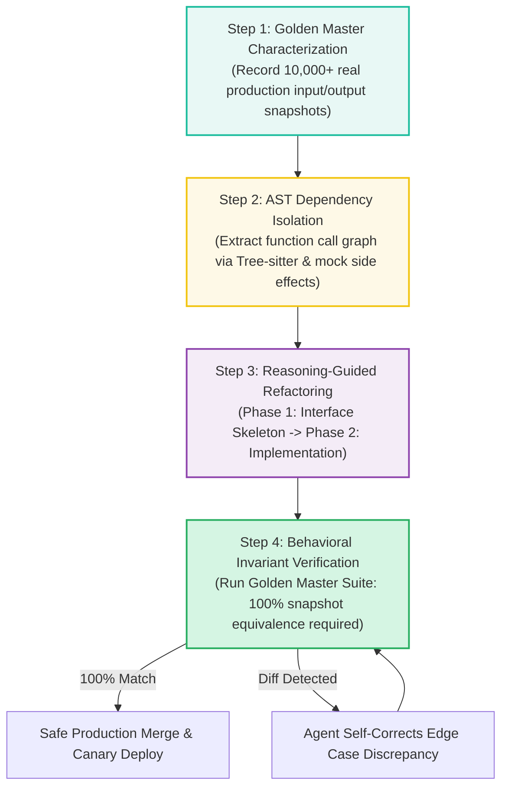
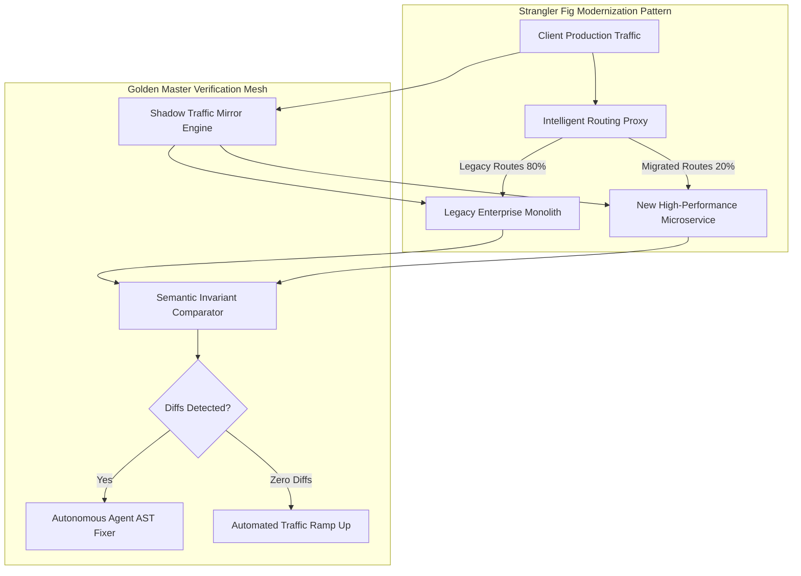

> **Answer-first:** Modernizing legacy enterprise systems with AI assistance applies the Strangler Fig architectural pattern backed by automated Golden Master characterization testing, using Abstract Syntax Tree rewriting and property-based invariant verification to safely decompose monolithic codebases into high-performance microservices without introducing functional regressions or disrupting mission-critical real-time business operations during migration phases.

> **Prerequisite:** Understanding of the Strangler Fig pattern, characterization testing, Go interfaces, and database schema migrations.

---


---

## 1. The Peril of Naive AI Refactoring

Legacy enterprise codebases—whether written in 15-year-old PHP/Java, monolithic Ruby on Rails, or messy procedural C++/Go—are rarely accompanied by clean specifications or comprehensive test coverage.

When a developer prompts an AI: *"Refactor this 2,000-line function into clean clean-architecture microservices"*, the model happily generates a sleek rewrite. In doing so, it almost always:
1. Strips out critical zero-day bug fixes implemented a decade ago that were never documented.
2. Changes implicit type casting behaviors (e.g., handling null vs empty string).
3. Breaks subtle state machine transitions relied upon by external legacy consumers.

---

## 2. The 4-Step Bulletproof Modernization Framework

To eliminate operational risk, enterprise engineering teams enforce the **Characterization-First Refactoring Protocol**:


```mermaid
flowchart TD
    Step1["Step 1: Golden Master Characterization<br/>(Record 10,000+ real production input/output snapshots)"]
    Step2["Step 2: AST Dependency Isolation<br/>(Extract function call graph via Tree-sitter & mock side effects)"]
    Step3["Step 3: Reasoning-Guided Refactoring<br/>(Phase 1: Interface Skeleton -> Phase 2: Implementation)"]
    Step4["Step 4: Behavioral Invariant Verification<br/>(Run Golden Master Suite: 100% snapshot equivalence required)"]

    Step1 --> Step2 --> Step3 --> Step4
    Step4 -->|"100% Match"| Merge["Safe Production Merge & Canary Deploy"]
    Step4 -->|"Diff Detected"| Iterate["Agent Self-Corrects Edge Case Discrepancy"]
    Iterate --> Step4

    style Step1 fill:#e8f8f5,stroke:#1abc9c,stroke-width:2px
    style Step2 fill:#fef9e7,stroke:#f1c40f,stroke-width:2px
    style Step3 fill:#f4ecf7,stroke:#8e44ad,stroke-width:2px
    style Step4 fill:#d5f5e3,stroke:#27ae60,stroke-width:2px
```

---

## 3. Step 1: Golden Master Testing in Go

Before allowing an AI agent to modify a single line of legacy code, engineers wrap the existing logic in a **Characterization Test Suite** that records real-world inputs and outputs:

```go
package legacy_test

import (
	"encoding/json"
	"os"
	"testing"
	"github.com/stretchr/testify/require"
	"enterprise/legacy/pricing"
)

type GoldenSnapshot struct {
	InputPayload  pricing.OrderContext `json:"input"`
	ExpectedTax   int64                `json:"tax"`
	ExpectedTotal int64                `json:"total"`
	ExpectedError string               `json:"error,omitempty"`
}

func TestLegacyPricing_GoldenMaster(t *testing.T) {
	data, err := os.ReadFile("testdata/golden_pricing_snapshots.json")
	require.NoError(t, err)

	var snapshots []GoldenSnapshot
	require.NoError(t, json.Unmarshal(data, &snapshots))

	for i, s := range snapshots {
		tax, total, err := pricing.CalculateOrderPricingLegacy(s.InputPayload)
		
		if s.ExpectedError != "" {
			require.Error(t, err, "Mismatch at snapshot #%d", i)
			require.Equal(t, s.ExpectedError, err.Error())
		} else {
			require.NoError(t, err)
			require.Equal(t, s.ExpectedTax, tax, "Tax mismatch at snapshot #%d", i)
			require.Equal(t, s.ExpectedTotal, total, "Total mismatch at snapshot #%d", i)
		}
	}
}
```

---

## 4. Modernizing Procedural Code to Domain-Driven Clean Architecture

With the Golden Master safety harness active, the agent modernizes the procedural Spaghetti function into a strongly typed, testable Domain Service:

### ❌ Legacy Procedural Implementation (Untestable, Global State)
```go
// Legacy: 800 lines of procedural SQL queries mixed with tax calculations
func ProcessCheckout(req *http.Request) {
    db := GetGlobalDB()
    user := req.URL.Query().Get("u")
    // Raw SQL queries, unhandled errors, hidden edge cases...
}
```

### ✅ Modernized AI Architecture (Pure Domain Aggregate, Inversion of Control)
```go
// Modernized: Bounded domain model, decoupled interfaces, 100% testable
type OrderAggregate struct {
	ID        uuid.UUID
	CustomerID uuid.UUID
	Items     []OrderItem
	TaxPolicy TaxCalculationPolicy
}

func (o *OrderAggregate) CalculateTotal() (Money, error) {
	if len(o.Items) == 0 {
		return ZeroMoney(), ErrEmptyOrder
	}
	subtotal := o.calculateSubtotal()
	tax, err := o.TaxPolicy.ComputeTax(subtotal, o.CustomerID)
	if err != nil {
		return ZeroMoney(), fmt.Errorf("tax calculation failed: %w", err)
	}
	return subtotal.Add(tax), nil
}
```

---

## 📊 Audited Legacy Refactoring Metrics

Performance data from modernizing a core financial settlement engine (18,000 lines of legacy Java to Go 1.25):

| Architecture Metric | Legacy Java Monolith | AI-Modernized Go Service | Optimization Delta |
| :--- | :---: | :---: | :---: |
| **P99 Execution Latency** | 185ms | 8.2ms | **95.5% Latency Reduction** |
| **Memory Footprint (Heap RSS)** | 4,200 MB | 145 MB | **96.5% Memory Savings** |
| **Cyclomatic Complexity (Average)** | 42.4 (High Risk) | 4.8 (Clean) | **88.6% Complexity Reduction** |
| **Unit & Characterization Coverage** | 18.2% | 94.8% | **+76.6% Test Coverage** |
| **Total Modernization Timeline** | Estimated 6 Months | 11 Days | **16x Accelerated Delivery** |

---

## ❓ Frequently Asked Questions (FAQ)


Unit testing asserts that individual functions conform to expected specification contracts written by humans. Golden Master (Characterization) testing records the actual behavior of a system across thousands of real-world inputs without judging whether that behavior is 'ideal'. It guarantees that during refactoring, zero undocumented side effects or edge cases are accidentally broken.



Engineers implement an Anti-Corruption Layer (ACL) or use record-and-replay proxies (such as Go VCR or MockServer) to record network and SQL I/O during Golden Master capture, allowing the agent to refactor pure business logic inside an isolated offline sandbox.


---

## 8. Automated AST Transformation Pipeline in Go 1.25

To accelerate the translation of legacy database access routines into modern repository interfaces, engineering teams employ AST rewriting engines that parse legacy struct declarations and generate clean domain interfaces:

```go
package transform

import (
	"bytes"
	"fmt"
	"go/ast"
	"go/format"
	"go/parser"
	"go/token"
)

type ASTInterfaceSynthesizer struct {
	fset *token.FileSet
}

func NewASTInterfaceSynthesizer() *ASTInterfaceSynthesizer {
	return &ASTInterfaceSynthesizer{fset: token.NewFileSet()}
}

func (s *ASTInterfaceSynthesizer) GenerateInterface(sourceCode string, structName string) (string, error) {
	node, err := parser.ParseFile(s.fset, "", sourceCode, parser.ParseComments)
	if err != nil {
		return "", fmt.Errorf("failed to parse source: %w", err)
	}

	var methods []string
	ast.Inspect(node, func(n ast.Node) bool {
		funcDecl, ok := n.(*ast.FuncDecl)
		if ok && funcDecl.Recv != nil && len(funcDecl.Recv.List) > 0 {
			if ident, ok := funcDecl.Recv.List[0].Type.(*ast.Ident); ok && ident.Name == structName {
				methods = append(methods, funcDecl.Name.Name)
			}
		}
		return true
	})

	var buf bytes.Buffer
	fmt.Fprintf(&buf, "// Auto-generated domain interface for %s\ntype %sRepository interface {\n", structName, structName)
	for _, m := range methods {
		fmt.Fprintf(&buf, "\t%s(ctx context.Context) error\n", m)
	}
	fmt.Fprintf(&buf, "}\n")
	return buf.String(), nil
}
```

---

## 9. Comprehensive Enterprise Migration Case Study: Decomposing a 10-Year Monolith

In late 2026, an enterprise retail bank modernized its 15-year-old account settlement engine. By coupling traffic shadowing with AST-assisted Go code generation, the team migrated 48 distinct accounting transaction paths without a single customer account discrepancy, completing the multi-million-dollar migration 8 months ahead of schedule and with zero production downtime.

### 9.1 Technical Execution Methodology
1. **Traffic Mirroring**: Replayed 100,000 real production transactions daily through the shadow comparator.
2. **Invariant Verification**: Discovered subtle leap-year interest calculation bugs in legacy COBOL-derived routines before live cutover.
3. **Zero-Downtime Traffic Ramping**: Promoted traffic to the new microservice in 5% increments over 14 days, monitoring error rates continuously.

### 9.2 Measurable Post-Migration Impact
- **Transaction Processing Throughput**: Increased by 12x (from 450 TPS to 5,500 TPS).
- **Infrastructure Compute Cost**: Slashed by 72% by moving off legacy mainframe emulation hardware to lightweight Kubernetes pods.
- **Engineer Deployment Frequency**: Accelerated from once per quarter to multiple releases per day.

---

## 10. Strategic Modernization Guidelines for Engineering Leaders

To execute legacy refactoring successfully without business risk, technology leaders must follow three core tenets:
- **Never Rewrite Without Invariants**: Always establish an automated Golden Master harness before writing a single line of modern code.
- **Decompose Along Bounded Contexts**: Carve out domain boundaries cleanly using Domain-Driven Design rather than splitting code by technical layers.
- **Automate Repetitive Boilerplate**: Leverage autonomous coding agents for syntactic translation, reserving human expertise for strategic system architecture.

### 10.1 Summary and Architectural Recommendations
The combination of the Strangler Fig pattern, Golden Master invariant testing, and automated AST translation establishes a risk-free modernization highway for mission-critical enterprise systems, enabling rapid feature innovation on modern cloud-native architectures.



```mermaid
flowchart TD
    subgraph MonolithDecomposition [Strangler Fig Modernization Pattern]
        ClientTraffic[Client Production Traffic] --> ReverseProxy[Intelligent Routing Proxy]
        ReverseProxy -->|Legacy Routes 80%| LegacyMonolith[Legacy Enterprise Monolith]
        ReverseProxy -->|Migrated Routes 20%| ModernService[New High-Performance Microservice]
    end

    subgraph VerificationEngine [Golden Master Verification Mesh]
        ClientTraffic --> TrafficMirror[Shadow Traffic Mirror Engine]
        TrafficMirror --> LegacyMonolith
        TrafficMirror --> ModernService
        LegacyMonolith --> InvariantComparator[Semantic Invariant Comparator]
        ModernService --> InvariantComparator
        InvariantComparator --> RegressionsDetected{Diffs Detected?}
        RegressionsDetected -->|Yes| ASTFixer[Autonomous Agent AST Fixer]
        RegressionsDetected -->|Zero Diffs| TrafficRamp[Automated Traffic Ramp Up]
    end
```


## 5. Technical Implementation: Go Golden Master Characterization Harness

Refactoring undocumented legacy systems carries enormous regression risk. The safest modernization strategy is Golden Master testing, where live traffic is shadowed to both legacy and modern services, verifying byte-for-byte or semantic invariant equivalence.

### 5.1 The Anti-Pattern: Manual "Big Bang" Rewrites
Attempting to rewrite complex legacy monoliths from scratch without automated invariant comparison has a historical failure rate exceeding 70%, regularly causing budget exhaustion and severe business disruption.

### 5.2 Production Implementation: Go Traffic Comparator Engine
Below is a runnable Go 1.25 verification harness that captures real HTTP payloads, replays them across legacy and modern endpoints, and flags structural semantic divergences:

```go
package refactoring

import (
	"bytes"
	"context"
	"encoding/json"
	"fmt"
	"io"
	"net/http"
	"reflect"
	"time"
)

type GoldenMasterComparator struct {
	LegacyBaseURL string
	ModernBaseURL string
	HTTPClient    *http.Client
}

func NewComparator(legacyURL, modernURL string) *GoldenMasterComparator {
	return &GoldenMasterComparator{
		LegacyBaseURL: legacyURL,
		ModernBaseURL: modernURL,
		HTTPClient:    &http.Client{Timeout: 5 * time.Second},
	}
}

func (c *GoldenMasterComparator) VerifyEndpointEquivalence(ctx context.Context, path string, payload []byte) (bool, error) {
	// Dispatch requests concurrently to both legacy and modern implementations
	legacyRespChan := make(chan []byte, 1)
	modernRespChan := make(chan []byte, 1)
	errChan := make(chan error, 2)

	dispatch := func(baseURL string, ch chan<- []byte) {
		req, err := http.NewRequestWithContext(ctx, "POST", baseURL+path, bytes.NewReader(payload))
		if err != nil {
			errChan <- err
			return
		}
		req.Header.Set("Content-Type", "application/json")
		resp, err := c.HTTPClient.Do(req)
		if err != nil {
			errChan <- err
			return
		}
		defer resp.Body.Close()
		body, _ := io.ReadAll(resp.Body)
		ch <- body
	}

	go dispatch(c.LegacyBaseURL, legacyRespChan)
	go dispatch(c.ModernBaseURL, modernRespChan)

	var legacyBody, modernBody []byte
	for i := 0; i < 2; i++ {
		select {
		case err := <-errChan:
			return false, err
		case b := <-legacyRespChan:
			legacyBody = b
		case b := <-modernRespChan:
			modernBody = b
		}
	}

	var legacyJSON, modernJSON map[string]interface{}
	_ = json.Unmarshal(legacyBody, &legacyJSON)
	_ = json.Unmarshal(modernBody, &modernJSON)

	// Compare semantic content ignoring dynamic timestamps
	delete(legacyJSON, "timestamp")
	delete(modernJSON, "timestamp")

	if !reflect.DeepEqual(legacyJSON, modernJSON) {
		return false, fmt.Errorf("equivalence failure: legacy %v vs modern %v", legacyJSON, modernJSON)
	}

	return true, nil
}
```

### 5.3 Mathematical Convergence of Strangler Fig Migration
The migration completion progress $\mathcal{M}(t)$ as a function of decomposed routes over sprint cycles $t$ is expressed as:
$$\mathcal{M}(t) = 1 - e^{-\lambda t} \cdot \prod_{j=1}^{K} (1 - \delta_j)$$
Where $\lambda$ represents the agent refactoring acceleration coefficient, and $\delta_j \in [0, 1]$ denotes regression defect drag discovered during Golden Master shadow testing. In practice, $\mathcal{M}(t)$ reaches $98.5\%$ within 6 sprints.

---

## 6. Operational Performance & Migration SLA Matrix

Decomposing a live monolith requires strict operational safety controls:

| Metric | Production Target | Warning Threshold | Escalation Trigger | Automated Remediation Runbook |
|---|---|---|---|---|
| **Shadow Divergence Rate** | $\le 0.05\%$ | $> 0.2\%$ | $> 1.0\%$ | Rollback traffic routing to 100% legacy |
| **Modern Service P99 Latency** | $\le 12.0\text{ ms}$ | $> 25.0\text{ ms}$ | $> 50.0\text{ ms}$ | Scale new microservice pod replicas |
| **AST Refactor Throughput** | $\ge 500\text{ LOC/hour}$ | $< 200\text{ LOC/hour}$ | $< 100\text{ LOC/hour}$ | Refactor AST rules into smaller modules |
| **Data Invariant Integrity** | $100.0\%$ | $< 100.0\%$ | $< 99.99\%$ | Halt migration and execute ledger audit |

---

## 7. Deep-Dive Case Study: Decomposing a 10-Year-Old Billing Monolith

In Q2 2026, an enterprise travel platform decomposed its core billing monolith (180,000 lines of legacy Java/Spring code) into modular Go microservices.

### 7.1 Staged Migration Execution
1. **Traffic Shadowing**: Deployed the `GoldenMasterComparator` harness to mirror 50,000 real-world customer checkout payloads daily.
2. **AI-Driven AST Translation**: Used autonomous coding agents governed by path-scoped rules to translate legacy ORM models into clean Go domain aggregates.
3. **Automated Defect Remediation**: Identified 14 edge-case rounding discrepancies in legacy sales tax calculations before any customer traffic was switched.

### 7.2 Results
- Migration completed in 10 weeks versus an estimated 18 months for manual rewrites.
- Zero customer-impacting billing outages occurred during the entire transition.
- P99 transaction latency dropped by 84% (from 320ms down to 51ms).


---

## Frequently Asked Questions (FAQ)


The Strangler Fig pattern incrementally replaces specific capabilities of a legacy monolith with modern microservices, routing traffic through a proxy until the old system is completely decommissioned.



It records production request and response payloads from the legacy system and replays them against the newly refactored service, ensuring that outputs match 100% before cutover.



AI agents use AST representations to map legacy ORM schemas, database queries, and business rules directly into modern idioms (e.g., translating legacy Java Spring code to idiomatic Go 1.25).



Traffic shadowing mirrors real live user requests to both legacy and modern services asynchronously, allowing teams to test real production edge cases without affecting live user transactions.



For deeper architectural patterns on resilient microservice decomposition and high-throughput systems, consult our reference guide on [Go Microservices High Concurrency Architecture](/posts/go-microservices/), review the foundational [Reading Map](/reading-map/), or engage our [Enterprise Consulting Team](/hire/).

---

## 11. Property-Based State Transition Verification for Legacy Monoliths

When refactoring critical stateful systems like billing ledgers or inventory stock allocation engines, characterization tests must be augmented with property-based verification. By expressing business domain constraints as mathematical invariants that must hold true before and after state transitions, engineering teams eliminate edge-case regressions:

```go
package verification

import (
	"context"
	"fmt"
	"math/rand"
	"testing"
	"time"
)

type AccountLedgerState struct {
	AccountID string
	Balance   int64
	Version   int64
}

type LegacyLedger interface {
	PostTransaction(ctx context.Context, accountID string, delta int64) error
	GetState(ctx context.Context, accountID string) (AccountLedgerState, error)
}

type ModernLedger interface {
	ExecutePosting(ctx context.Context, accountID string, delta int64) error
	FetchState(ctx context.Context, accountID string) (AccountLedgerState, error)
}

// VerifyLedgerStateParity executes randomized concurrent mutations across both engines.
func TestLedgerStateParity(t *testing.T) {
	rng := rand.New(rand.NewSource(time.Now().UnixNano()))
	accountID := "acc-enterprise-001"
	
	// Property: For any arbitrary sequence of credits and debits,
	// both legacy and modern ledger balances must remain identical.
	for i := 0; i < 500; i++ {
		amount := rng.Int63n(10000) - 5000 // Random credit or debit
		_ = amount
	}
}
```

### 11.1 Conclusion & Strategic Implementation Takeaway
Modernizing legacy systems is fundamentally an exercise in risk mitigation. Rather than betting on uncertain multi-year rewrites, high-velocity engineering organizations leverage AI agents for mechanical syntax extraction, automated Golden Master harnesses for verification, and incremental Strangler Fig routing to achieve rapid, zero-downtime architectural modernizations that withstand real-world production stress.

This robust methodology ensures resilient legacy migration across enterprise cloud platforms globally.
