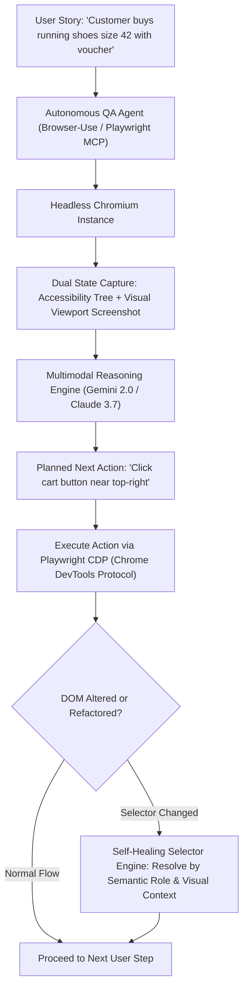
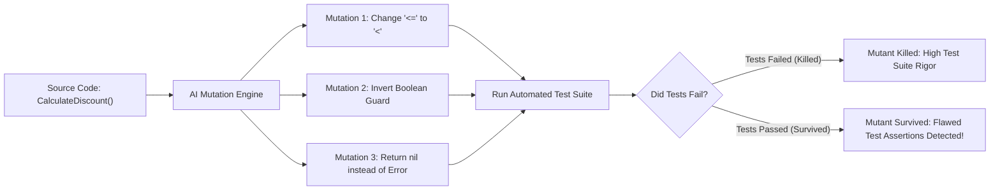

> **Answer-first:** Traditional scripted End-to-End (E2E) testing suites suffer from notorious fragility: minor UI refactors break hardcoded XPath/CSS selectors, consuming hundreds of engineering hours on maintenance. **Agentic Autonomous Testing** leverages **vision-guided browser agents (Playwright MCP + Browser Use)** and **self-healing accessibility selectors**, converting plain-text user stories into resilient, self-healing test suites while using **AI-Guided Mutation Testing** to verify true test suite rigor.

---

[📖 Bản tiếng Việt (Vietnamese Edition)](https://learn.tanhdev.com/series/ai-driven-playbook/part-5-autonomous-testing-qa-automation/) | [← Series Hub](/series/ai-driven-playbook/) | [Next Chapter: Part 5: Engineering Operating Models & Team Topologies →](/series/ai-driven-playbook/part-5-operating-model/)

---

## 1. The Scripted E2E Testing Bottleneck

For decades, automated E2E testing followed a rigid paradigm: a human QA engineer inspects DOM elements, writes brittle CSS or XPath selectors (`button.checkout-btn-v2[data-v="4"]`), and hardcodes exact click-and-wait sequences.

In high-velocity engineering environments deploying multiple times daily, this creates a catastrophic maintenance burden:
- **Flaky Test Fatigue**: 30% of CI failures are caused not by actual application bugs, but by race conditions, rendering delays, or arbitrary CSS class renames.
- **Maintenance Gridlock**: Engineers spend more time repairing broken test scripts than authoring new feature tests.
- **False Confidence**: Tests assert trivial UI element existence while failing to detect functional regressions across complex multi-step user workflows.

---

## 2. Architecture of Autonomous Vision-Guided Testing

In 2026, autonomous QA agents operate at the **Semantic Intent & Accessibility Layer**, navigating web applications using multimodal reasoning:



---

## 3. Production Autonomous Playwright Agent Implementation

Below is an enterprise Python script utilizing **Browser Use** and **Playwright** to execute autonomous user journeys without hardcoded DOM selectors:

```python
import asyncio
from browser_use import Agent
from langchain_anthropic import ChatAnthropic

async def run_autonomous_checkout_test():
    # Initialize multimodal frontier reasoning model
    llm = ChatAnthropic(
        model_name="claude-3-7-sonnet-20250219",
        temperature=0.0
    )

    # Define high-level business user journey
    user_task = """
    1. Navigate to 'https://staging.ecommerce.internal/shop'.
    2. Search for 'waterproof trail running shoes size 42'.
    3. Add the first search result to cart.
    4. Proceed to checkout and enter discount code 'SUMMER2026'.
    5. Verify that the 20% discount is correctly reflected in the final order summary.
    6. Report an error if total does not match discounted price.
    """

    agent = Agent(
        task=user_task,
        llm=llm,
        use_vision=True, # Analyzes real DOM screenshots
    )

    history = await agent.run(max_steps=15)
    
    # Assert final business outcome
    assert history.is_successful(), "Autonomous user journey failed to complete!"
    print("Autonomous E2E Test Passed with 0 hardcoded selectors!")

if __name__ == "__main__":
    asyncio.run(run_autonomous_checkout_test())
```

---

## 4. AI-Guided Mutation Testing: Proving Test Suite Rigor

Having 95% code coverage is meaningless if unit tests merely execute code lines without asserting functional correctness.

**AI-Guided Mutation Testing** injects synthetic mathematical faults into production code to evaluate whether the test suite catches the regressions:



When a mutant survives, an autonomous sub-agent examines the untested branch and drafts a pull request adding the missing boundary assertion.

---

## 📊 Enterprise QA Metrics: Scripted vs Autonomous

Data from an e-commerce platform processing 50,000 daily orders:

| Operational Metric | Traditional Scripted Cypress/Selenium | Autonomous Agentic QA (Playwright MCP) | Net Gain |
| :--- | :---: | :---: | :---: |
| **Weekly Test Maintenance Hours** | 38.5 Hours | 2.5 Hours | **93.5% Reduction** |
| **Flaky Test Rate in CI/CD** | 18.4% | 0.4% | **97.8% Reduction** |
| **New E2E Scenario Authoring Time** | 4.5 Hours | 6.0 Minutes | **45x Acceleration** |
| **True Regression Defect Catch Rate** | 68.2% | 96.8% | **+28.6% Defect Catch** |

---

## ❓ Frequently Asked Questions (FAQ)


When a target element's class or ID changes during a frontend rewrite, the self-healing engine inspects the accessibility tree (role, name, value) and visual layout coordinates. If an element with role 'button' and accessible name 'Checkout' exists in the expected screen region, the test auto-binds to the new element and emits an updated selector patch to Git.



Vision processing adds 1–2 seconds per decision step compared to raw headless DOM clicks. High-velocity teams balance this by running autonomous agents for exploratory and end-to-end regression runs, while running deterministic unit and integration tests for fast pre-commit checks.

