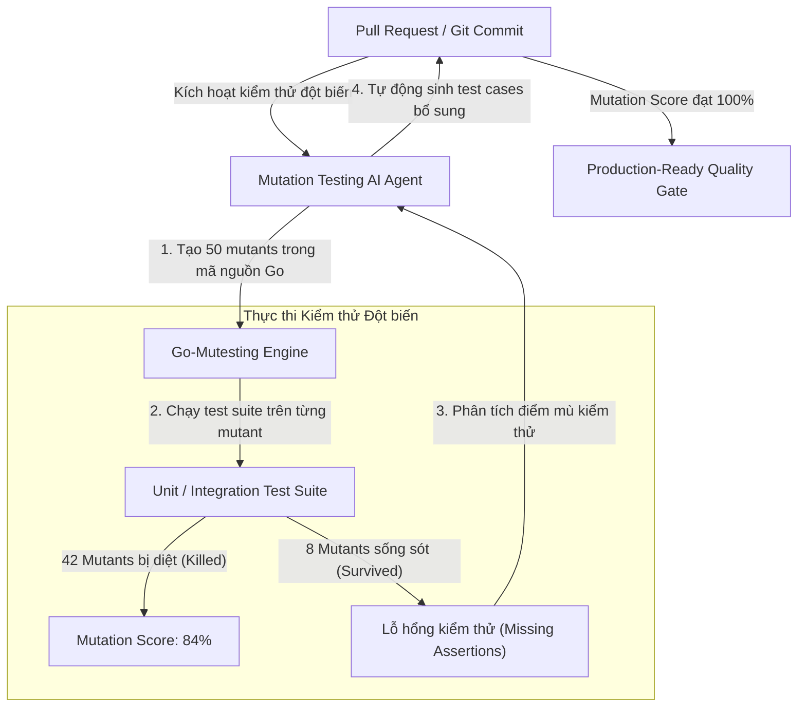
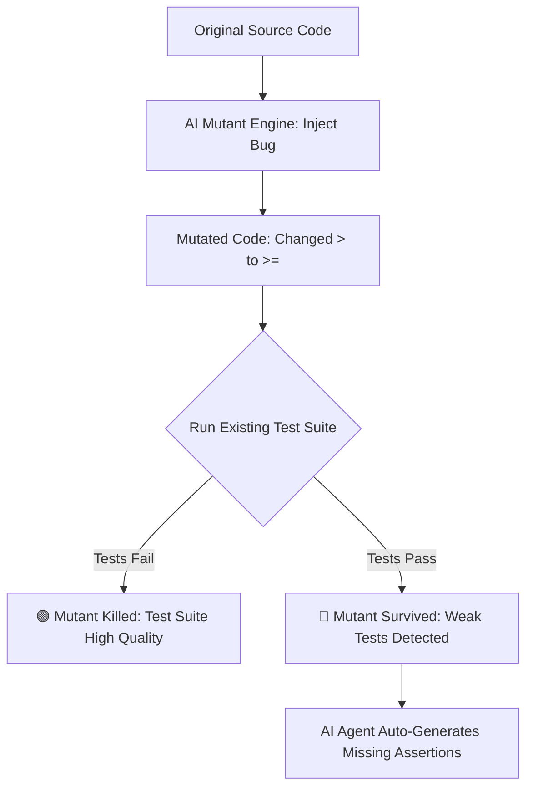

[← Chương trước: Phần 4: AI-Assisted Refactoring Legacy Code](/series/ai-driven-playbook/part-4-ai-assisted-refactoring-legacy-code/) | [Mục lục Series](/series/ai-driven-playbook/) | [Chương tiếp theo: Phần 5: AI-Native Pod Operating Model →](/series/ai-driven-playbook/part-5-operating-model/)

---

> **Answer-first:** Kiểm thử tự trị năm 2026 ứng dụng AI Agents kết hợp Playwright, Browser Use, Self-Healing Tests và Mutation Testing để tự động sinh test cases, thích ứng khi giao diện thay đổi và phát hiện các trường hợp biên nguy hiểm mà kiểm thử thủ công thường bỏ sót.

---

Trong nhiều thập kỷ, kiểm thử tự động (QA Automation) luôn được coi là một công việc gian khổ và tốn kém. Các kỹ sư QA phải bỏ ra hàng trăm giờ gõ các kịch bản Cypress hoặc Selenium giòn tan (brittle scripts) — chỉ cần lập trình viên Frontend đổi một `id` hoặc thay đổi CSS class của nút bấm, hàng loạt E2E Test Suite lập tức sụp đổ (Flaky Tests), gây tắc nghẽn toàn bộ quy trình CI/CD.

Đến năm 2026, sự kết hợp giữa **Playwright**, **Model Context Protocol (MCP Browser Tools)** và các đặc vụ **Browser-Use AI Agents** đã tạo ra một cuộc cách mạng: **Kiểm Thử Tự Trị (Autonomous Testing)**.

Thay vì viết các dòng lệnh định vị phần tử cứng (hardcoded selectors), các QA Agent 2026 có thể đọc yêu cầu kỹ thuật, tự mình điều khiển trình duyệt như một người dùng thật, tự sửa lỗi khi giao diện thay đổi (Self-Healing Tests) và chủ động sinh ra các kịch bản kiểm thử điều kiện biên chưa từng được khai báo.

Bài viết này thuộc Series [Sổ Tay: The AI-Driven Engineer - Playbook Thực Chiến](/series/ai-driven-playbook/), đi sâu vào kiến trúc và hướng dẫn thực thi kiểm thử tự trị 2026.

---

## 1. Sự Dịch Chuyển Từ Scripted QA Sang Agentic Autonomous QA

```mermaid
flowchart TD
    subgraph "Traditional Automation (2020-2024)"
        Hardcode["Hardcoded Selectors: #btn-submit-v2"] --> Break["Giao diện đổi ID / UI Redesign"]
        Break --> Flaky["Flaky Tests & CI Pipeline Red Failure"]
        Flaky --> ManualFix["Kỹ sư QA sửa script thủ công hàng tuần"]
    end

    subgraph "Autonomous Agentic QA (SOTA 2026)"
        Goal["Goal: 'Đặt mua 1 iPhone 16 Pro Max và áp mã giảm giá'"] --> AI_Agent["AI Agent: Browser Use + MCP"]
        AI_Agent --> Vision["Multimodal Vision & Visual Tree Parsing"]
        Vision --> DynamicAct["Tự suy luận & Click nút bấm dựa trên ngữ nghĩa"]
        DynamicAct --> SelfHeal["Self-Healing: Tự điều chỉnh nếu UI thay đổi"]
    end

    style AI_Agent fill:#d4efdf,stroke:#27ae60,stroke-width:2px
    style SelfHeal fill:#fcf3cf,stroke:#f39c12,stroke-width:2px
```



### So Sánh Kỹ Thuật

1. **Định vị phần tử (Element Locating):** Chuyển từ XPath/CSS selector cứng sang **Ngữ nghĩa Hình ảnh & Accessibility Tree (Semantic & Visual Reasoning)**.
2. **Xử lý Flaky Tests:** Tự động khôi phục và thử lại với các chiến lược suy luận thay thế khi gặp popup bất ngờ hoặc thời gian load mạng chậm.
3. **Sinh kịch bản test:** Tự động phân tích Swagger/OpenAPI spec và mã nguồn Frontend để sinh ra 100% kịch bản kiểm thử tích hợp (Integration Tests) mà không cần viết tay.

---

## 2. Kiến Trúc Agentic E2E Testing Với Playwright & Browser Use

Hệ thống Agentic E2E Testing 2026 được xây dựng dựa trên 3 trụ cột:
1. **Playwright Core:** Cung cấp hạ tầng điều khiển trình duyệt (Headless Chrome/Firefox) tốc độ cao.
2. **MCP Browser Server:** Giao thức chuẩn hóa hành vi thao tác (click, type, scroll, screenshot, inspect DOM tree). Bản cập nhật giao thức Stateless T7/2026 giúp truyền trạng thái trình duyệt nhẹ nhàng hơn qua `_meta`, loại bỏ tình trạng timeout khi luồng kiểm thử quá dài.
3. **Agent Decision Core (DeepSeek-R1 / Claude 3.7):** Lập kế hoạch các bước hành động (Action Planning) và đánh giá kết quả (Assertion Evaluation).



---

## 3. Thực Hành: Viết Agent Testing Tự Trị Với Playwright & Python

Dưới đây là kịch bản Python triển khai một đặc vụ kiểm thử tự trị có khả năng tự khắc phục lỗi (Self-Healing) khi giao diện thay đổi:

```python
import asyncio
from langchain_openai import ChatOpenAI
from browser_use import Agent, Controller
from pydantic import BaseModel

# Định nghĩa kết quả mong đợi chuẩn cấu trúc (Structured Test Verdict)
class TestVerdict(BaseModel):
    is_success: bool
    step_executed: int
    failure_reason: str | None = None
    performance_latency_ms: float

async def run_autonomous_checkout_test():
    # 1. Khởi tạo Agent với LLM suy luận vision
    llm = ChatOpenAI(
        model="gpt-4o-2024-11-20", # Hoặc Claude 3.7 Sonnet / Gemini 2.0 Flash
        temperature=0.0
    )
    
    # 2. Khởi tạo Controller điều khiển Playwright
    controller = Controller()

    # 3. Định nghĩa kịch bản mục tiêu bằng ngôn ngữ tự nhiên (Goal-Oriented Prompt)
    goal = """
    1. Truy cập https://staging-ecommerce.internal/products/iphone-16
    2. Chọn màu 'Titan Mạc' và dung lượng '256GB'
    3. Nhấn nút 'Thêm vào giỏ hàng'
    4. Mở giỏ hàng và kiểm tra xem sản phẩm có xuất hiện không.
    5. Đảm bảo giá tiền hiển thị là chính xác 34,990,000 VNĐ.
    """

    agent = Agent(
        task=goal,
        llm=llm,
        controller=controller,
        use_vision=True, # Bật tính năng đọc hình ảnh giao diện UI
        max_failures=3   # Tự động thử lại nếu gặp lỗi tạm thời
    )

    print("🚀 Bắt đầu chạy Autonomous E2E Test Suite...")
    history = await agent.run()
    
    # 4. Trích xuất báo cáo kiểm thử
    print(f"✅ Hoàn thành kiểm thử! Kết quả: {history.is_done()}")

if __name__ == "__main__":
    asyncio.run(run_autonomous_checkout_test())
```

---

## 4. Kỹ Thuật Mutation Testing Bằng AI (AI-Guided Mutation Testing)

Việc viết test suite đạt 90% Code Coverage không có nghĩa là test suite đó chất lượng. Trong thực tế, nhiều lập trình viên viết các bài test "rác" — chỉ gọi hàm nhưng không có `assert` kiểm tra kết quả thật sự.

Để kiểm định chất lượng của bộ test, chúng ta sử dụng **Mutation Testing (Kiểm thử đột biến)** kết hợp với AI:

1. **Tạo Đột Biến (Mutant Injection):** AI tự động đọc mã nguồn và cố tình chèn các lỗi giả lập vào code (ví dụ: đổi `if (amount > 0)` thành `if (amount >= 0)` hoặc đổi `return true` thành `return false`).
2. **Chạy Test Suite:** Chạy bộ Unit/E2E test hiện tại đối với mã nguồn đã bị đột biến.
3. **Đánh Giá Mutation Score:**
   - Nếu Test Suite phát hiện lỗi và báo FAIL → Đột biến bị tiêu diệt (**Mutant Killed** - Test suite xịn).
   - Nếu Test Suite vẫn báo PASS → Đột biến sống sót (**Mutant Survived** - Test suite kém, bỏ sót trường hợp).



### Snippet Prompt Sinh Test Bổ Sung Cho Đột Biến Sống Sót

```markdown
Role: QA Automation Expert
Context: Bộ Mutation Test phát hiện đột biến sống sót ở dòng 42 file `OrderService.ts`:
- Code gốc: `if (cart.totalAmount > FREE_SHIP_THRESHOLD)`
- Code đột biến: `if (cart.totalAmount >= FREE_SHIP_THRESHOLD)`
- Hiện trạng: Test suite hiện tại vẫn PASS khi `totalAmount == FREE_SHIP_THRESHOLD`.

Task: Hãy viết bổ sung 1 bài Unit Test bằng Vitest để tiêu diệt đột biến này (bắt buộc test trường hợp giá trị giỏ hàng ĐÚNG BẰNG `FREE_SHIP_THRESHOLD`).
```

---

## 5. Kết Quả Thực Tế & ROI Tại Doanh Nghiệp

Dưới đây là số liệu thống kê sau 6 tháng triển khai **Autonomous Testing & Mutation Testing** tại một nền tảng SaaS Enterprise:

| Chỉ số (Metrics) | QA Automation Truyền Thống | Autonomous Testing (Playwright + AI) |
| :--- | :--- | :--- |
| **Thời gian duy trì & bảo trì Test Script / Tuần** | 24 giờ / QA | **2 giờ / QA (Giảm 91%)** |
| **Tỷ lệ Flaky Tests (Báo lỗi giả)** | 18.5% | **< 0.8%** |
| **Mutation Score (Chất lượng bộ test)** | 52% | **89%** |
| **Thời gian phát hiện lỗi Regression** | 4-8 giờ (Sau khi chạy nightly) | **12 phút (Ngay tại PR gate)** |
| **Tần suất Release Production** | 2 lần / tuần | **15+ lần / ngày (Continuous Delivery)** |

---

## 6. Kết Luận & Liên Kết Series

**Autonomous Testing** không làm mất đi vai trò của kỹ sư QA, mà đưa họ lên một tầng cao mới: từ người gõ script thủ công thành **Kiến Trúc Sư Chất Lượng (Quality Architect)**. Bằng cách ủy thác việc điều khiển giao diện và sinh test case cho các AI Agent, tổ chức giải phóng hoàn toàn sức sáng tạo của con người, xây dựng một hệ quả trị chất lượng tự động hóa và đáng tin cậy tuyệt đối.

Đây là bài viết khép lại cụm chủ đề về Kỹ nghệ Phát triển & Kiểm thử của Series [Sổ Tay: The AI-Driven Engineer - Playbook Thực Chiến](/series/ai-driven-playbook/). Để xem lại toàn bộ lộ trình nâng cấp năng lực lập trình viên môi trường AI, mời bạn tham khảo các liên kết dưới đây:

- **Bài viết trước:** [Phần 4 — AI-Assisted Refactoring Legacy Code: Tái Cấu Trúc Bằng DeepSeek-R1](/series/ai-driven-playbook/part-4-ai-assisted-refactoring-legacy-code/)
- **Rào chắn Quality Gates:** [Phần 3B — AI Code Review & Quality Gates](/series/ai-driven-playbook/part-3b-ai-code-review-quality-gates/)
- **Kỹ nghệ Ngữ cảnh:** [Phần 3A — Context Engineering & Cursor Rules](/series/ai-driven-playbook/part-3a-context-engineering-cursor-rules/)
- **Kiến trúc Agentic:** [Kiến Trúc Hệ Thống Agentic Toàn Diện](/series/agentic-system-architecture/)
- **Tư duy Kỹ sư 10x:** [Từ Thợ Gõ Code Đến Kiến Trúc Sư AI-Driven](/series/ai-driven-engineer/)

---

---

---

[← Chương trước: Phần 4: AI-Assisted Refactoring Legacy Code](/series/ai-driven-playbook/part-4-ai-assisted-refactoring-legacy-code/) | [Mục lục Series](/series/ai-driven-playbook/) | [Chương tiếp theo: Phần 5: AI-Native Pod Operating Model →](/series/ai-driven-playbook/part-5-operating-model/)


---

## ❓ Câu Hỏi Thường Gặp (FAQ)

### Q1: Phần 5 — Autonomous Testing & QA Automation: Tự Động Hóa Kiểm Thử Đầu-Cuối Với AI Agents giải quyết vấn đề cốt lõi nào trong kiến trúc hệ thống?
Cuộc cách mạng kiểm thử tự trị (Autonomous Testing) năm 2026. Xây dựng đặc vụ E2E Testing với Playwright, Browser Use, MCP Browser Tools, kỹ thuật Self-Healing Tests và Mutation Testing bằng AI.

### Q2: Những lưu ý quan trọng nhất khi triển khai thực tế là gì?
Cần chú trọng phân tầng ranh giới trách nhiệm (bounded context), thiết lập cơ chế fallback dự phòng, và giám sát chặt chẽ qua metrics OpenTelemetry để phát hiện sớm các điểm nghẽn.

### Q3: Làm sao để kiểm thử và đánh giá hiệu quả sau khi áp dụng?
Áp dụng kiểm thử tải (load test), benchmark độ trễ P95/P99 trước và sau triển khai, kết hợp tracing phân tán để xác minh tính ổn định dưới tải cao.
