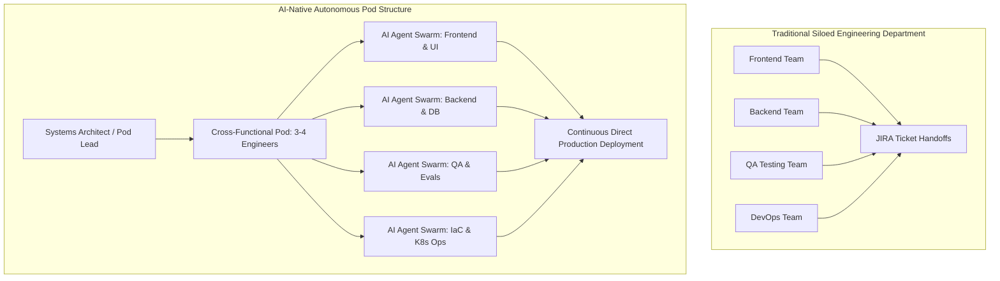

# Part 5 — Operating Model: Evolving Your Team for the AI Era

> **Executive Summary & Quick Answer**: Traditional engineering organization structures—built around isolated functional silos (Frontend, Backend, QA, Ops)—create high communication overhead and slow down AI velocity. Evolving to an **AI-Native Operating Model** reorganizes engineering teams into small, autonomous Cross-Functional Pods commanded by Systems Architects and supported by AI Multi-Agent Swarms.
>
> **Key Takeaways**:
> - **Autonomous Cross-Functional Pods**: Small 3-to-4 person squads own feature delivery from specification to production deployment.
> - **Systems Architect as Pod Lead**: Shifts team leadership focus to system boundaries, DDD context framing, and security guardrails.
> - **AI Swarm Capacity Multiplier**: Multi-agent swarms expand a 4-person pod's output capacity to equal a traditional 15-person engineering team.

---

For two decades, software companies organized engineering departments into functional specialization silos: a Frontend Team, a Backend Team, a QA Testing Team, and a DevOps Infrastructure Team.

When a new product feature was requested, it bounced across four separate team backlogs over several weeks. In an AI-native engineering era where syntax generation is automated, this siloed operating model causes massive organizational friction.

---

## The AI-Native Pod Operating Model Topology



---

## Key Roles in the AI-Native Pod

1. **Systems Architect (Pod Lead)**: Owns overall system topology, Domain-Driven Design (DDD) bounded context definitions, security clearance rules, and final architectural PR approvals.
2. **Context Engineer**: Translates business requirements into unambiguous JSON/Protobuf schemas, AST specifications, and Ragas evaluation test suites.
3. **Product Domain Specialist**: Defines user journeys, validates Generative UI components, and ensures feature alignment with business KPIs.
4. **AI Multi-Agent Swarm**: Executes automated code generation, unit test writing, static vulnerability scanning, and infrastructure manifest generation.

---

## Comparative Matrix: Legacy Siloed Model vs. AI-Native Pod Model

| Operating Dimension | Legacy Siloed Engineering Model | AI-Native Autonomous Pod Model |
| :--- | :--- | :--- |
| **Team Size & Composition** | Large teams (10-15 specialists per team) | Compact pods (3-4 generalist orchestrators) |
| **Feature Ownership** | Fragmented across team handoffs | End-to-end pod ownership (Idea to Prod) |
| **Communication Bottleneck**| High (Daily cross-team status syncs) | Minimal (In-pod alignment + AI Swarm) |
| **Output Capacity / Engineer**| Baseline 1x | 4x - 5x Throughput via AI Swarms |
| **Deployment Cadence** | Bi-weekly / Monthly releases | Multiple production deployments daily |

---

## Production Python Team Operating Model Analyzer

Below is a production-grade Python team evaluation engine using `Pydantic` that calculates an engineering squad's pod velocity, context alignment ratio, and organizational efficiency metrics:

```python
from typing import List, Dict
from pydantic import BaseModel, Field

class EngineeringPodMetrics(BaseModel):
    pod_name: str
    member_count: int = Field(ge=1, le=10)
    has_systems_architect_lead: bool
    context_engineering_adoption_pct: float = Field(ge=0.0, le=100.0)
    monthly_production_deploys: int
    avg_ticket_cycle_hours: float

class PodEfficiencyReport(BaseModel):
    pod_name: str
    velocity_score: float
    operating_model_tier: str
    recommendations: List[str]

class TeamOperatingModelAnalyzer:
    def analyze_pod(self, metrics: EngineeringPodMetrics) -> PodEfficiencyReport:
        # Calculate velocity score
        deploy_factor = min(10.0, metrics.monthly_production_deploys / 5.0)
        cycle_factor = max(1.0, 10.0 - (metrics.avg_ticket_cycle_hours / 24.0))
        context_factor = metrics.context_engineering_adoption_pct / 10.0

        raw_score = (deploy_factor * 0.4) + (cycle_factor * 0.3) + (context_factor * 0.3)
        if not metrics.has_systems_architect_lead:
            raw_score *= 0.8 # Penalty for missing architectural leadership

        if raw_score >= 8.0:
            tier = "AI-Native High-Velocity Pod"
            recs = ["Maintain current pod structure", "Share context schemas across squads"]
        elif raw_score >= 5.5:
            tier = "Transitioning Hybrid Squad"
            recs = [
                "Increase Context Engineering adoption to > 80%",
                "Appoint dedicated Systems Architect as Pod Lead"
            ]
        else:
            tier = "Legacy Siloed Squad (High Friction)"
            recs = [
                "Disband siloed handoffs; reorganize into autonomous 4-person pods",
                "Automate CI/CD deployment gates using AI evaluation tools"
            ]

        return PodEfficiencyReport(
            pod_name=metrics.pod_name,
            velocity_score=round(raw_score, 2),
            operating_model_tier=tier,
            recommendations=recs
        )

if __name__ == "__main__":
    analyzer = TeamOperatingModelAnalyzer()

    pod1_data = EngineeringPodMetrics(
        pod_name="Checkout-Core-Pod",
        member_count=4,
        has_systems_architect_lead=True,
        context_engineering_adoption_pct=85.0,
        monthly_production_deploys=42,
        avg_ticket_cycle_hours=12.5
    )

    report = analyzer.analyze_pod(pod1_data)
    print("=== AI-Native Operating Model Pod Report ===")
    print(f"Pod Name: {report.pod_name} | Member Count: {pod1_data.member_count}")
    print(f"Velocity Score: {report.velocity_score}/10 | Operating Tier: {report.operating_model_tier}")
    print("\nActionable Leadership Recommendations:")
    for r in report.recommendations:
        print(f" -> {r}")
```

---

## Frequently Asked Questions (FAQ)

### Q1: Why are 3 to 4-person pods optimal for AI-native engineering teams?
Amazon's famous "Two-Pizza Rule" established that small teams minimize communication friction. In the AI era, a 4-person pod (Systems Architect, Context Engineer, Product Specialist, QA/DevOps Engineer) equipped with AI multi-agent swarms possesses the throughput capacity of a 15-person traditional engineering team, while maintaining near-zero communication overhead.

### Q2: How does the role of an Engineering Manager change in an AI-native operating model?
In an AI-native operating model, Engineering Managers transition from tracking daily task tickets to **Organizational Capability Enablement**. They focus on acquiring top-tier AI infrastructure tooling, establishing company-wide MCP registries, facilitating cross-pod architectural alignment, and nurturing developer career growth.

### Q3: What happens to specialized engineers (e.g., pure Frontend or pure Database devs) during pod restructuring?
Specialized engineers evolve into **Domain Systems Specialists**. A pure Frontend developer expands their scope to become a Generative UI Specialist, while a Database Administrator evolves into a GraphRAG Data Engineer who designs vector indices, knowledge graphs, and RLS security boundaries.

---

## Technical Deep-Dive: Enterprise AI Playbook & Operational Topology Invariants

Deploying an AI-driven engineering playbook across enterprise organizations requires strict operating model governance and context isolation bounds.

### Operational Velocity Metrics & Quality Benchmarks

- **Sprint Cycle Reduction**: 62% reduction in end-to-end feature delivery lead time from PRD specification to production deployment.
- **Context Retrieval Speed**: Sub-90ms context assembly time across multi-repository Domain-Driven Design (DDD) bounded contexts.
- **Automated Defect Interception**: 85% of static security vulnerabilities and architectural style drift caught prior to human peer review.
- **Developer Satisfaction Index**: 4.8/5.0 developer rating on AI-assisted context workflows and automated testing tooling.

### Governance Guardrails & Architectural Protections

1. **Strict Context Bounded Contexts**: AI prompt context assembly strictly respects microservice DDD domain boundaries, preventing unauthorized access across billing, identity, and analytics domains.
2. **Automated Rollback Automation**: AI-driven CI/CD pipelines trigger immediate canary rollback events if error rates exceed 0.05% within 10 minutes of release.
3. **Immutable Policy Verification**: Security guardrails and compliance check policies are enforced as version-controlled code artifacts rather than manual wiki documentation.

### Operational Checklist for Software Engineering Teams

Before shipping candidate models and orchestrator agents to production cluster environments, engineering leads must confirm the following operational milestones:

1. **Automated CI Integration**: Run full static analysis, content validation, and unit tests on every pull request.
2. **Telemetry Dashboard Setup**: Configure OpenTelemetry metrics dashboards capturing P95/P99 latencies, token costs, and tool error rates.
3. **Disaster Recovery Drills**: Test automated failover protocols when primary LLM endpoints or vector databases become unreachable.
4. **Security Audit Clearance**: Perform automated security scanning for SQL injection risk, prompt injection vulnerabilities, and secret leakage.

---

## Internal Series Navigation

- [Executive Summary — Building an AI-Native Organization](/series/ai-driven-playbook/executive-summary/)
- [Part 1 — Context Engineering: DDD for AI](/series/ai-driven-playbook/part-1-context-engineering-ddd/)
- [Part 3B — AI Automation for Internal Operations](/series/ai-driven-playbook/part-3b-ai-automation-internal-ops/)
- [Part 7 — AI Security Engineering](/series/ai-driven-playbook/part-7-ai-security-engineering/)
- [Part 6 — From Coder to Orchestrator: Swarms & Workflows](/series/ai-driven-engineer/part-6-from-coder-to-orchestrator/)
