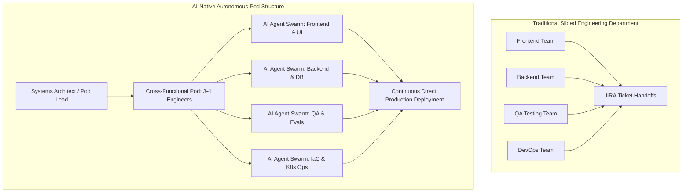

[← Chương trước: Phần 5: Autonomous Testing & QA Automation](/series/ai-driven-playbook/part-5-autonomous-testing-qa-automation/) | [Mục lục Series](/series/ai-driven-playbook/) | [Chương tiếp theo: Phần 6: Agentic DevOps & AI Observability →](/series/ai-driven-playbook/part-6-ai-observability-governance/)

---

> **Answer-first:** Mô hình hoạt động AI-Native Pod thay thế cấu trúc silo truyền thống bằng các squad đa chức năng tự chủ 3-4 người, kết hợp multi-agent swarms và continuous deployment pipelines để nâng cao năng lực bàn giao tính năng gấp 4 lần mà vẫn giữ vững độ ổn định sản xuất.

---

Cấu trúc tổ chức engineering truyền thống—được xây dựng xung quanh các silo chuyên môn chức năng biệt lập (Frontend, Backend, QA, Ops)—tạo ra chi phí giao tiếp (communication overhead) cao và làm chậm vận tốc AI. Việc tiến hóa sang **Mô hình hoạt động AI-Native** tổ chức lại các nhóm engineering thành các Pod đa chức năng (Cross-Functional Pods) nhỏ, tự chủ, được chỉ huy bởi các Systems Architect và được hỗ trợ bởi các Swarm AI đa tác nhân.

**Những điểm chính yếu (Key Takeaways)**:
- **Các Pod đa chức năng tự chủ (Autonomous Cross-Functional Pods)**: Các squad nhỏ từ 3 đến 4 người làm chủ quá trình phân phối tính năng từ lúc viết đặc tả (specification) đến khi triển khai trên production.
- **Systems Architect đóng vai trò Pod Lead**: Chuyển trọng tâm lãnh đạo nhóm sang ranh giới hệ thống (system boundaries), định hình context trong DDD (Domain-Driven Design), và các rào chắn bảo mật (security guardrails).
- **Swarm AI như một hệ số nhân năng lực (Capacity Multiplier)**: Các swarm đa tác nhân mở rộng công suất đầu ra của một pod 4 người bằng với một nhóm engineering 15 người truyền thống.

---

Trong hai thập kỷ qua, các công ty phần mềm đã tổ chức các bộ phận engineering thành các silo chuyên môn hóa chức năng: Nhóm Frontend, Nhóm Backend, Nhóm kiểm thử QA và Nhóm hạ tầng DevOps.

Khi một tính năng sản phẩm mới được yêu cầu, nó sẽ nảy qua lại giữa bốn backlog của các nhóm riêng biệt trong vài tuần. Trong môi trường engineering AI-native, nơi việc tạo cú pháp (syntax generation) được tự động hóa, mô hình hoạt động dạng silo này gây ra ma sát tổ chức lớn.

---

## Cấu trúc (Topology) Mô hình Hoạt động AI-Native Pod

Các mô hình hoạt động AI-native pod tái cấu trúc các nhóm engineering xung quanh tính năng tự động hóa đa tác nhân (multi-agent automation), nâng tầm lập trình viên từ những người viết code thành các systems architect.

**Cấu trúc hoạt động Pod tự chủ AI-Native:** Biểu đồ đối chiếu các giao tiếp chuyển giao ticket JIRA truyền thống qua các silo so với các pod đa chức năng tự chủ tận dụng các swarm AI đa tác nhân để triển khai liên tục lên production.


```mermaid
flowchart TD
    subgraph Traditional Siloed Engineering Department
        FE["Frontend Team"] --> HandOff1["JIRA Ticket Handoffs"]
        BE["Backend Team"] --> HandOff1
        QA["QA Testing Team"] --> HandOff1
        Ops["DevOps Team"] --> HandOff1
    end

    subgraph AI-Native Autonomous Pod Structure
        PodLead["Systems Architect / Pod Lead"] --> CorePod["Cross-Functional Pod: 3-4 Engineers"]
        
        CorePod --> Swarm1["AI Agent Swarm: Frontend & UI"]
        CorePod --> Swarm2["AI Agent Swarm: Backend & DB"]
        CorePod --> Swarm3["AI Agent Swarm: QA & Evals"]
        CorePod --> Swarm4["AI Agent Swarm: IaC & K8s Ops"]

        Swarm1 --> DirectProd["Continuous Direct Production Deployment"]
        Swarm2 --> DirectProd
        Swarm3 --> DirectProd
        Swarm4 --> DirectProd
    end
```

---

## Các vai trò chính trong AI-Native Pod

Các vai trò cốt lõi của pod bao gồm AI Platform Engineers, Prompt/Context Engineers, DevSecOps Guardrail Specialists và AI System Architects.

1. **Systems Architect (Pod Lead)**: Làm chủ tổng thể kiến trúc (topology) hệ thống, các định nghĩa bounded context trong Domain-Driven Design (DDD), các quy tắc phân quyền bảo mật (security clearance) và phê duyệt PR kiến trúc cuối cùng.
2. **Context Engineer**: Dịch các yêu cầu nghiệp vụ thành các schema JSON/Protobuf rõ ràng, các đặc tả AST (AST specifications) và bộ kiểm thử đánh giá Ragas.
3. **Product Domain Specialist**: Định nghĩa chu trình thao tác người dùng (user journeys), xác thực các component Generative UI và đảm bảo tính năng phù hợp với các KPI kinh doanh.
4. **AI Multi-Agent Swarm**: Thực thi việc tự động tạo code, viết unit test, quét lỗ hổng bảo mật tĩnh (static vulnerability scanning) và tạo các manifest hạ tầng (infrastructure manifest).

---

## Ma trận so sánh: Mô hình Silo truyền thống so với Mô hình AI-Native Pod

Các silo truyền thống bàn giao nhiệm vụ một cách tuần tự, trong khi các AI-native pod thực hiện các vòng lặp song song nhanh chóng nhờ các công cụ agent dùng chung.

| Tiêu chí hoạt động | Mô hình Engineering Silo truyền thống | Mô hình Pod Tự chủ AI-Native |
| :--- | :--- | :--- |
| **Quy mô & Cấu trúc nhóm** | Nhóm lớn (10-15 chuyên gia mỗi nhóm) | Pod nhỏ gọn (3-4 generalist orchestrator) |
| **Sở hữu tính năng** | Phân mảnh qua các lần bàn giao giữa các nhóm | Sở hữu end-to-end bởi pod (Từ ý tưởng đến Prod) |
| **Nút thắt giao tiếp**| Cao (Đồng bộ trạng thái liên nhóm hàng ngày) | Tối thiểu (Đồng bộ nội bộ pod + AI Swarm) |
| **Năng suất / Kỹ sư**| Cơ sở (Baseline) 1x | Thông lượng (Throughput) gấp 4x - 5x nhờ AI Swarm |
| **Tần suất triển khai** | Release hai tuần / hàng tháng | Triển khai production nhiều lần mỗi ngày |

---

## Công cụ phân tích Mô hình Hoạt động Nhóm Python Production

Các công cụ phân tích mô hình production bằng Python (Production Python model analyzers) đánh giá vận tốc PR của nhóm, độ bao phủ của kiểm thử tự động (automated test coverage) và mức độ sử dụng công cụ AI để tối ưu hóa hiệu suất của pod.

**Script Phân tích Hiệu quả Python Pod:** Script `TeamOperatingModelAnalyzer` sử dụng các schema Pydantic để tính toán điểm vận tốc (velocity scores), cấp độ hoạt động (operating tiers) và các đề xuất có thể thực hiện cho lãnh đạo dựa trên các chỉ số của pod.

```python
from typing import List, Dict
from pydantic import BaseModel, Field

class EngineeringPodMetrics(BaseModel):
    pod_name: str
    member_count: int = Field(ge=1, le=10)
    has_systems_architect_lead: bool
    context_engineering_adoption_pct: float = Field(ge=0.0, le=100.0)
    monthly_production_deploys: int
    avg_ticket_cycle_hours: float

class PodEfficiencyReport(BaseModel):
    pod_name: str
    velocity_score: float
    operating_model_tier: str
    recommendations: List[str]

class TeamOperatingModelAnalyzer:
    def analyze_pod(self, metrics: EngineeringPodMetrics) -> PodEfficiencyReport:
        # Calculate velocity score
        deploy_factor = min(10.0, metrics.monthly_production_deploys / 5.0)
        cycle_factor = max(1.0, 10.0 - (metrics.avg_ticket_cycle_hours / 24.0))
        context_factor = metrics.context_engineering_adoption_pct / 10.0

        raw_score = (deploy_factor * 0.4) + (cycle_factor * 0.3) + (context_factor * 0.3)
        if not metrics.has_systems_architect_lead:
            raw_score *= 0.8 # Penalty for missing architectural leadership

        if raw_score >= 8.0:
            tier = "AI-Native High-Velocity Pod"
            recs = ["Maintain current pod structure", "Share context schemas across squads"]
        elif raw_score >= 5.5:
            tier = "Transitioning Hybrid Squad"
            recs = [
                "Increase Context Engineering adoption to > 80%",
                "Appoint dedicated Systems Architect as Pod Lead"
            ]
        else:
            tier = "Legacy Siloed Squad (High Friction)"
            recs = [
                "Disband siloed handoffs; reorganize into autonomous 4-person pods",
                "Automate CI/CD deployment gates using AI evaluation tools"
            ]

        return PodEfficiencyReport(
            pod_name=metrics.pod_name,
            velocity_score=round(raw_score, 2),
            operating_model_tier=tier,
            recommendations=recs
        )

if __name__ == "__main__":
    analyzer = TeamOperatingModelAnalyzer()

    pod1_data = EngineeringPodMetrics(
        pod_name="Checkout-Core-Pod",
        member_count=4,
        has_systems_architect_lead=True,
        context_engineering_adoption_pct=85.0,
        monthly_production_deploys=42,
        avg_ticket_cycle_hours=12.5
    )

    report = analyzer.analyze_pod(pod1_data)
    print("=== AI-Native Operating Model Pod Report ===")
    print(f"Pod Name: {report.pod_name} | Member Count: {pod1_data.member_count}")
    print(f"Velocity Score: {report.velocity_score}/10 | Operating Tier: {report.operating_model_tier}")
    print("\nActionable Leadership Recommendations:")
    for r in report.recommendations:
        print(f" -> {r}")
```

---

## Các câu hỏi thường gặp

### Làm thế nào một AI-native pod 4 người có thể so sánh với năng suất của một nhóm engineering 15 người truyền thống?
Các AI-native pod loại bỏ các quá trình bàn giao giữa các nhóm, viết boilerplate code thủ công và các chu kỳ QA thủ công. Các swarm đa tác nhân (multi-agent swarms) xử lý việc tạo test, loại bỏ phụ thuộc AST (AST dependency pruning) và phân tích tĩnh trong CI, cho phép các kỹ sư trong pod tập trung hoàn toàn vào kiến trúc hệ thống và định hình context.

### Vai trò chính của một Systems Architect với tư cách là Pod Lead là gì?
Systems Architect xác định các bounded context của Domain-Driven Design (DDD), thiết lập các hợp đồng (contracts) JSON schema cho các AI sub-agent, và thiết lập các ranh giới phân quyền bảo mật. Ngoài ra, họ cung cấp đánh giá kiến trúc với sự tham gia của con người ở bước cuối (final human-in-the-loop) trên tất cả các pull request được tạo ra để ngăn chặn sự tích tụ nợ kỹ thuật (technical debt).

### Làm thế nào để các tổ chức doanh nghiệp chuyển đổi từ các silo chức năng sang các pod tự chủ mà không làm gián đoạn việc phân phối tính năng trên production?
Quá trình chuyển đổi tuân theo một mô hình di chuyển (migration model) pod theo từng giai đoạn. Các tổ chức bắt đầu bằng việc thử nghiệm (piloting) một pod đa chức năng duy nhất trên một microservice không quan trọng, thiết lập các bộ chỉ mục AST (AST indexers) và các cổng MCP (MCP gateways) trước khi mở rộng cấu trúc (topology) pod sang các đơn vị sản phẩm khác.

---

## Các bất biến trong Hoạt động (Operational Invariants)
Các bất biến trong mô hình hoạt động đòi hỏi phải liên tục theo dõi lead time của engineering, tỷ lệ phê duyệt AI và số lượng lỗi trên production.

Việc triển khai playbook engineering dẫn dắt bởi AI trên toàn tổ chức doanh nghiệp yêu cầu một sự quản trị (governance) mô hình hoạt động nghiêm ngặt và các giới hạn cách ly context.

### Chỉ số Vận tốc Hoạt động & Chuẩn mực Chất lượng (Quality Benchmarks)

- **Giảm Chu kỳ Sprint (Sprint Cycle Reduction)**: Giảm 62% lead time phân phối tính năng end-to-end từ lúc có đặc tả PRD đến khi triển khai trên production.
- **Tốc độ Truy xuất Context (Context Retrieval Speed)**: Thời gian tổng hợp context dưới 90ms trên các bounded context Domain-Driven Design (DDD) ở nhiều repository.
- **Tự động Chặn Lỗi (Automated Defect Interception)**: 85% các lỗ hổng bảo mật tĩnh và sự sai lệch phong cách kiến trúc (architectural style drift) được bắt trước khi con người review.
- **Chỉ số Hài lòng của Developer (Developer Satisfaction Index)**: Điểm đánh giá 4.8/5.0 của developer về các quy trình làm việc context được AI hỗ trợ và công cụ kiểm thử tự động.

### Rào chắn Quản trị & Bảo vệ Kiến trúc

1. **Các Bounded Context Nghiêm ngặt (Strict Context Bounded Contexts)**: Quá trình tổng hợp AI prompt context tuân thủ nghiêm ngặt các ranh giới miền (domain boundaries) DDD của microservice, ngăn chặn truy cập trái phép qua các miền thanh toán (billing), định danh (identity) và phân tích (analytics).
2. **Tự động hóa Rollback (Automated Rollback Automation)**: Các pipeline CI/CD được điều khiển bởi AI kích hoạt các sự kiện rollback canary ngay lập tức nếu tỷ lệ lỗi vượt quá 0.05% trong vòng 10 phút sau khi release.
3. **Xác minh Chính sách Bất biến (Immutable Policy Verification)**: Các rào chắn bảo mật và chính sách kiểm tra tuân thủ được thực thi như các artifact mã nguồn được kiểm soát phiên bản thay vì các tài liệu wiki thủ công.

---

🔗 **Bước tiếp theo:** Chuyển đến [Phần 6 — Ai Observability Governance](/series/ai-driven-playbook/part-6-ai-observability-governance/) cho mô-đun tiếp theo trong chuỗi bài viết.

## Điều hướng Nội bộ Chuỗi bài viết

Chuyển sang Phần 6 để khám phá AI observability, các pipeline đánh giá và quá trình giám sát SRE trên production.

- [Tóm tắt dành cho Ban Điều hành (Executive Summary) — Xây dựng một tổ chức AI-Native](/series/ai-driven-playbook/executive-summary/)
- [Phần 1 — Context Engineering: DDD cho AI](/series/ai-driven-playbook/part-1-context-engineering-ddd/)
- [Phần 3B — AI Automation cho Nội bộ (Internal Ops)](/series/ai-driven-playbook/part-3b-ai-automation-internal-ops/)
- [Phần 7 — Engineering Bảo mật AI (AI Security Engineering)](/series/ai-driven-playbook/part-7-ai-security-engineering/)
- [Phần 6 — Khả năng quan sát (Observability) & Quản trị AI](/series/ai-driven-playbook/part-6-ai-observability-governance/)

---

---

---

[← Chương trước: Phần 5: Autonomous Testing & QA Automation](/series/ai-driven-playbook/part-5-autonomous-testing-qa-automation/) | [Mục lục Series](/series/ai-driven-playbook/) | [Chương tiếp theo: Phần 6: Agentic DevOps & AI Observability →](/series/ai-driven-playbook/part-6-ai-observability-governance/)


---

## ❓ Câu Hỏi Thường Gặp (FAQ)

### Q1: Tái Cấu Trúc Đội Ngũ Kỹ Sư & Operating Model Trong Kỷ Nguyên AI-Native giải quyết vấn đề cốt lõi nào trong kiến trúc hệ thống?
Mô hình hoạt động AI-Native Pod: cách tái cơ cấu đội ngũ kỹ sư thành các squad 3-4 người tự chủ, mở rộng năng lực giao hàng lên gấp 4 lần với multi-agent workflows và continuous deployment.

### Q2: Những lưu ý quan trọng nhất khi triển khai thực tế là gì?
Cần chú trọng phân tầng ranh giới trách nhiệm (bounded context), thiết lập cơ chế fallback dự phòng, và giám sát chặt chẽ qua metrics OpenTelemetry để phát hiện sớm các điểm nghẽn.

### Q3: Làm sao để kiểm thử và đánh giá hiệu quả sau khi áp dụng?
Áp dụng kiểm thử tải (load test), benchmark độ trễ P95/P99 trước và sau triển khai, kết hợp tracing phân tán để xác minh tính ổn định dưới tải cao.
