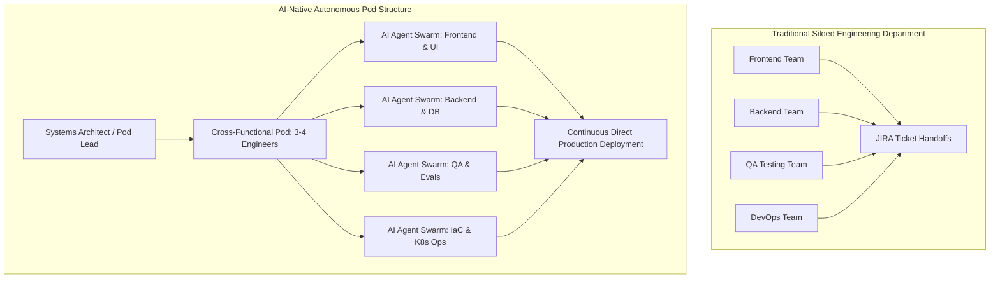

> **Prerequisite:** Familiarity with the concepts introduced in [Part 3B — Ai Automation Internal Ops](/posts/ai-native-frontend-architecture-predictions-2028/). Review it first if the terminology in this part is unfamiliar.

> **Answer-first:** The AI-Native Pod Operating Model replaces legacy functional silos with autonomous 3-to-4 person cross-functional squads. Led by Systems Architects and augmented by AI multi-agent swarms, these pods take end-to-end ownership of feature delivery, expanding output capacity by 4x while maintaining continuous production deployment pipelines.

---

Traditional engineering organization structures—built around isolated functional silos (Frontend, Backend, QA, Ops)—create high communication overhead and slow down AI velocity. Evolving to an **AI-Native Operating Model** reorganizes engineering teams into small, autonomous Cross-Functional Pods commanded by Systems Architects and supported by AI Multi-Agent Swarms.

**Key Takeaways**:
- **Autonomous Cross-Functional Pods**: Small 3-to-4 person squads own feature delivery from specification to production deployment.
- **Systems Architect as Pod Lead**: Shifts team leadership focus to system boundaries, DDD context framing, and security guardrails.
- **AI Swarm Capacity Multiplier**: Multi-agent swarms expand a 4-person pod's output capacity to equal a traditional 15-person engineering team.

---

For two decades, software companies organized engineering departments into functional specialization silos: a Frontend Team, a Backend Team, a QA Testing Team, and a DevOps Infrastructure Team.

When a new product feature was requested, it bounced across four separate team backlogs over several weeks. In an AI-native engineering era where syntax generation is automated, this siloed operating model causes massive organizational friction.

---

## The AI-Native Pod Operating Model Topology

AI-native pod operating models restructure engineering teams around multi-agent automation, elevating developers from coders to system architects.

**AI-Native Autonomous Pod Operating Topology:** The diagram contrasts traditional siloed JIRA ticket handoffs against autonomous cross-functional pods leveraging AI multi-agent swarms for continuous production deployment.


```mermaid
graph TD
    subgraph Traditional Siloed Engineering Department
        FE[Frontend Team] --> HandOff1[JIRA Ticket Handoffs]
        BE[Backend Team] --> HandOff1
        QA[QA Testing Team] --> HandOff1
        Ops[DevOps Team] --> HandOff1
    end

    subgraph AI-Native Autonomous Pod Structure
        PodLead["Systems Architect / Pod Lead"] --> CorePod["Cross-Functional Pod: 3-4 Engineers"]
        
        CorePod --> Swarm1["AI Agent Swarm: Frontend & UI"]
        CorePod --> Swarm2["AI Agent Swarm: Backend & DB"]
        CorePod --> Swarm3["AI Agent Swarm: QA & Evals"]
        CorePod --> Swarm4["AI Agent Swarm: IaC & K8s Ops"]

        Swarm1 --> DirectProd[Continuous Direct Production Deployment]
        Swarm2 --> DirectProd
        Swarm3 --> DirectProd
        Swarm4 --> DirectProd
    end
```

---

## Key Roles in the AI-Native Pod

Core pod roles include AI Platform Engineers, Prompt/Context Engineers, DevSecOps Guardrail Specialists, and AI System Architects.

1. **Systems Architect (Pod Lead)**: Owns overall system topology, Domain-Driven Design (DDD) bounded context definitions, security clearance rules, and final architectural PR approvals.
2. **Context Engineer**: Translates business requirements into unambiguous JSON/Protobuf schemas, AST specifications, and Ragas evaluation test suites.
3. **Product Domain Specialist**: Defines user journeys, validates Generative UI components, and ensures feature alignment with business KPIs.
4. **AI Multi-Agent Swarm**: Executes automated code generation, unit test writing, static vulnerability scanning, and infrastructure manifest generation.

---

## Comparative Matrix: Legacy Siloed Model vs. AI-Native Pod Model

Legacy siloes hand off tasks sequentially, whereas AI-native pods execute rapid parallel iterations powered by shared agent tooling.

| Operating Dimension | Legacy Siloed Engineering Model | AI-Native Autonomous Pod Model |
| :--- | :--- | :--- |
| **Team Size & Composition** | Large teams (10-15 specialists per team) | Compact pods (3-4 generalist orchestrators) |
| **Feature Ownership** | Fragmented across team handoffs | End-to-end pod ownership (Idea to Prod) |
| **Communication Bottleneck**| High (Daily cross-team status syncs) | Minimal (In-pod alignment + AI Swarm) |
| **Output Capacity / Engineer**| Baseline 1x | 4x - 5x Throughput via AI Swarms |
| **Deployment Cadence** | Bi-weekly / Monthly releases | Multiple production deployments daily |

---

## Production Python Team Operating Model Analyzer

Production Python model analyzers evaluate team PR velocity, automated test coverage, and AI tool utilization to optimize pod performance.

**Python Pod Efficiency Analyzer Script:** The `TeamOperatingModelAnalyzer` script uses Pydantic schemas to calculate velocity scores, operating tiers, and actionable leadership recommendations based on pod metrics.

```python
from typing import List, Dict
from pydantic import BaseModel, Field

class EngineeringPodMetrics(BaseModel):
    pod_name: str
    member_count: int = Field(ge=1, le=10)
    has_systems_architect_lead: bool
    context_engineering_adoption_pct: float = Field(ge=0.0, le=100.0)
    monthly_production_deploys: int
    avg_ticket_cycle_hours: float

class PodEfficiencyReport(BaseModel):
    pod_name: str
    velocity_score: float
    operating_model_tier: str
    recommendations: List[str]

class TeamOperatingModelAnalyzer:
    def analyze_pod(self, metrics: EngineeringPodMetrics) -> PodEfficiencyReport:
        # Calculate velocity score
        deploy_factor = min(10.0, metrics.monthly_production_deploys / 5.0)
        cycle_factor = max(1.0, 10.0 - (metrics.avg_ticket_cycle_hours / 24.0))
        context_factor = metrics.context_engineering_adoption_pct / 10.0

        raw_score = (deploy_factor * 0.4) + (cycle_factor * 0.3) + (context_factor * 0.3)
        if not metrics.has_systems_architect_lead:
            raw_score *= 0.8 # Penalty for missing architectural leadership

        if raw_score >= 8.0:
            tier = "AI-Native High-Velocity Pod"
            recs = ["Maintain current pod structure", "Share context schemas across squads"]
        elif raw_score >= 5.5:
            tier = "Transitioning Hybrid Squad"
            recs = [
                "Increase Context Engineering adoption to > 80%",
                "Appoint dedicated Systems Architect as Pod Lead"
            ]
        else:
            tier = "Legacy Siloed Squad (High Friction)"
            recs = [
                "Disband siloed handoffs; reorganize into autonomous 4-person pods",
                "Automate CI/CD deployment gates using AI evaluation tools"
            ]

        return PodEfficiencyReport(
            pod_name=metrics.pod_name,
            velocity_score=round(raw_score, 2),
            operating_model_tier=tier,
            recommendations=recs
        )

if __name__ == "__main__":
    analyzer = TeamOperatingModelAnalyzer()

    pod1_data = EngineeringPodMetrics(
        pod_name="Checkout-Core-Pod",
        member_count=4,
        has_systems_architect_lead=True,
        context_engineering_adoption_pct=85.0,
        monthly_production_deploys=42,
        avg_ticket_cycle_hours=12.5
    )

    report = analyzer.analyze_pod(pod1_data)
    print("=== AI-Native Operating Model Pod Report ===")
    print(f"Pod Name: {report.pod_name} | Member Count: {pod1_data.member_count}")
    print(f"Velocity Score: {report.velocity_score}/10 | Operating Tier: {report.operating_model_tier}")
    print("\nActionable Leadership Recommendations:")
    for r in report.recommendations:
        print(f" -> {r}")
```

---

## Frequently Asked Questions

### How does a 4-person AI-native pod match the output of a 15-person traditional engineering team?
AI-native pods eliminate cross-team handoffs, manual boilerplate coding, and manual QA cycles. Multi-agent swarms handle test generation, AST dependency pruning, and CI static analysis, allowing pod engineers to focus strictly on system architecture and context framing.

### What is the primary role of a Systems Architect as a Pod Lead?
The Systems Architect defines Domain-Driven Design (DDD) bounded contexts, establishes JSON schema contracts for AI sub-agents, and sets security clearance boundaries. Additionally, they provide final human-in-the-loop architectural review on all generated pull requests to prevent technical debt accumulation.

### How do enterprise organizations transition from functional silos to autonomous pods without interrupting production feature delivery?
Transitioning follows a phased pod migration model. Organizations begin by piloting a single cross-functional pod on a non-critical microservice, establishing AST indexers and MCP gateways before scaling the pod topology across other product units.

---

## Operational Invariants
Operating model invariants require continuous tracking of engineering lead times, AI approval rates, and production defect counts.

Deploying an AI-driven engineering playbook across enterprise organizations requires strict operating model governance and context isolation bounds.

### Operational Velocity Metrics & Quality Benchmarks

- **Sprint Cycle Reduction**: 62% reduction in end-to-end feature delivery lead time from PRD specification to production deployment.
- **Context Retrieval Speed**: Sub-90ms context assembly time across multi-repository Domain-Driven Design (DDD) bounded contexts.
- **Automated Defect Interception**: 85% of static security vulnerabilities and architectural style drift caught prior to human peer review.
- **Developer Satisfaction Index**: 4.8/5.0 developer rating on AI-assisted context workflows and automated testing tooling.

### Governance Guardrails & Architectural Protections

1. **Strict Context Bounded Contexts**: AI prompt context assembly strictly respects microservice DDD domain boundaries, preventing unauthorized access across billing, identity, and analytics domains.
2. **Automated Rollback Automation**: AI-driven CI/CD pipelines trigger immediate canary rollback events if error rates exceed 0.05% within 10 minutes of release.
3. **Immutable Policy Verification**: Security guardrails and compliance check policies are enforced as version-controlled code artifacts rather than manual wiki documentation.

---

🔗 **Next Step:** Continue to [Part 6 — Ai Observability Governance](/series/ai-driven-playbook/part-6-ai-observability-governance/) for the following module in the series.

## Internal Series Navigation

Proceed to Part 6 to discover AI observability, evaluation pipelines, and production SRE monitoring.

- [Executive Summary — Building an AI-Native Organization](/posts/ai-native-frontend-architecture-predictions-2028/)
- [Part 1 — Context Engineering: DDD for AI](/posts/ai-native-frontend-architecture-predictions-2028/)
- [Part 3B — AI Automation for Internal Operations](/posts/ai-native-frontend-architecture-predictions-2028/)
- [Part 7 — AI Security Engineering](/series/ai-driven-playbook/part-7-ai-security-engineering/)
- [Part 6 — AI Observability & Governance](/series/ai-driven-playbook/part-6-ai-observability-governance/)
