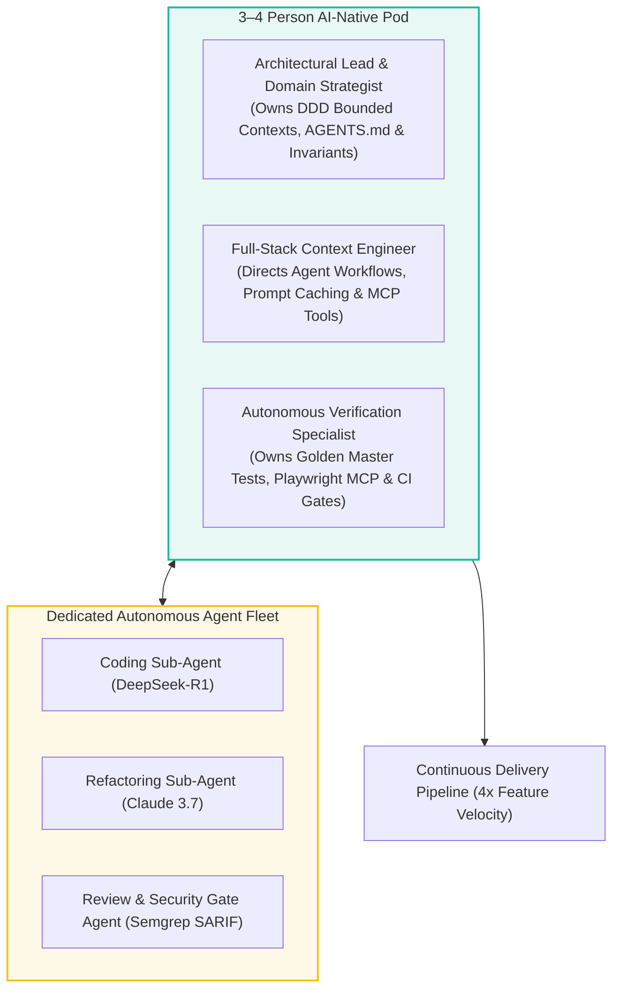

> **Answer-first:** Traditional 8–12 person Scrum squads break down in the AI era due to massive coordination overhead and communication bottlenecks. Modern engineering organizations restructure into **3–4 person AI-Native Pods**—comprising an **Architectural Lead**, a **Full-Stack Context Engineer**, and an **Autonomous Verification Specialist**—capable of out-delivering traditional squads by 4x while achieving Elite DORA performance.

---

[📖 Bản tiếng Việt (Vietnamese Edition)](https://learn.tanhdev.com/series/ai-driven-playbook/part-5-operating-model/) | [← Series Hub](/series/ai-driven-playbook/) | [Next Chapter: Part 6: AI Observability & Governance →](/series/ai-driven-playbook/part-6-ai-observability-governance/)

---

## 1. The Collapse of Traditional Scrum Squads

For two decades, the 2-pizza Scrum team (8–10 engineers, a dedicated Scrum Master, a Product Owner, and QA testers) was the undisputed gold standard of Agile software delivery.

In 2026, this model creates severe organizational friction:
1. **Communication Tax ($O(N^2)$)**: In a 10-person team, there are 45 distinct communication channels. When developers generate features at 4x speed, coordination meetings, standups, and backlog groomings consume more time than actual technical problem-solving.
2. **Review Grids & PR Congestion**: When 8 engineers produce 15 PRs daily, senior engineers become full-time review blockers, destroying team flow.
3. **The Junior Developer Paradox**: Junior engineers relying solely on AI autocomplete produce working code without comprehending underlying memory or concurrency mechanics, stalling their progression to senior engineering roles.

---

## 2. The 3–4 Person AI-Native Pod Structure

High-performing enterprises replace bloated Scrum squads with **AI-Native Pods**—tight, cross-functional units augmented by autonomous agent fleets:


```mermaid
flowchart TD
    subgraph Pod ["3–4 Person AI-Native Pod"]
        Lead["Architectural Lead & Domain Strategist<br/>(Owns DDD Bounded Contexts, AGENTS.md & Invariants)"]
        ContextEng["Full-Stack Context Engineer<br/>(Directs Agent Workflows, Prompt Caching & MCP Tools)"]
        QASpec["Autonomous Verification Specialist<br/>(Owns Golden Master Tests, Playwright MCP & CI Gates)"]
    end

    subgraph AgentFleet ["Dedicated Autonomous Agent Fleet"]
        A1["Coding Sub-Agent (DeepSeek-R1)"]
        A2["Refactoring Sub-Agent (Claude 3.7)"]
        A3["Review & Security Gate Agent (Semgrep SARIF)"]
    end

    Pod <--> AgentFleet
    Pod --> Production["Continuous Delivery Pipeline (4x Feature Velocity)"]

    style Pod fill:#e8f8f5,stroke:#1abc9c,stroke-width:2px
    style AgentFleet fill:#fef9e7,stroke:#f1c40f,stroke-width:2px
```

### Role Specialization within the Pod:
- **Architectural Lead**: Defines system invariants, curates `AGENTS.md`, and validates structural skeleton PRs.
- **Full-Stack Context Engineer**: Operates the agentic toolchain, tunes `.cursor/rules/*.mdc` files, and designs domain APIs.
- **Autonomous Verification Specialist**: Curates Golden Master snapshots, designs Playwright browser agent journeys, and audits mutation scores.

---

## 3. Resolving the Junior Developer Paradox: Socratic AI Mentorship

The greatest organizational danger of the generative AI era is creating a generation of "vibe coders" who cannot debug distributed deadlocks or optimize database indexes when AI agents fail.

To overcome the **Junior Developer Paradox**, engineering organizations enforce the **Socratic AI Prompting Wrapper**:

```markdown
# .cursor/rules/junior-mentorship.mdc
---
description: Enforces Socratic learning mode for associate engineers
globs: ["**/*"]
alwaysApply: true
---

# Socratic Engineering Mentor Protocol
- When asked for a code solution, NEVER output the full completed code block directly.
- Provide the architectural concept, identify the relevant algorithmic principle (e.g., hash collisions, two-pointer approach), and ask the junior engineer to draft the loop invariant first.
- If the junior engineer's proposal contains a bug, ask a leading question: *"What happens to your mutex lock if line 42 panics before the defer executes?"*
```

---

## 4. AI-Era DORA Metrics Benchmark

Measuring engineering velocity by "lines of code" or "PR volume" is disastrous when AI can generate 10,000 lines in seconds. Organizations must measure **DORA Outcome Metrics**:

| DORA Metric | Traditional Scrum Squad (10 Devs) | AI-Native Pod (4 Devs) | Outcome Comparison |
| :--- | :---: | :---: | :---: |
| **Deployment Frequency** | Bi-weekly Sprints (0.1/day) | Multiple Deploys Daily (4.8/day) | **48x More Frequent** |
| **Lead Time for Changes** | 12.5 Days | 4.2 Hours | **71x Faster Lead Time** |
| **Change Failure Rate (CFR)** | 14.8% | 2.1% | **85.8% Quality Improvement** |
| **Mean Time to Recovery (MTTR)** | 4.8 Hours | 14.0 Minutes | **20.5x Faster Recovery** |

---

## ❓ Frequently Asked Questions (FAQ)


Pods do not operate in isolation. They align via a centralized Architecture Decision Record (ADR) repository and consume shared internal developer platforms (LiteLLM gateways, MCP tool registries, and Golden Path templates) maintained by a dedicated Platform Engineering team.



The administrative overhead traditionally handled by Scrum Masters (ticket grooming, status tracking, burndown charting) is fully automated by autonomous project management agents connected via Jira/GitHub MCP tools. Former Scrum Masters frequently transition into Product Operations or Agile Context Coaching roles.

