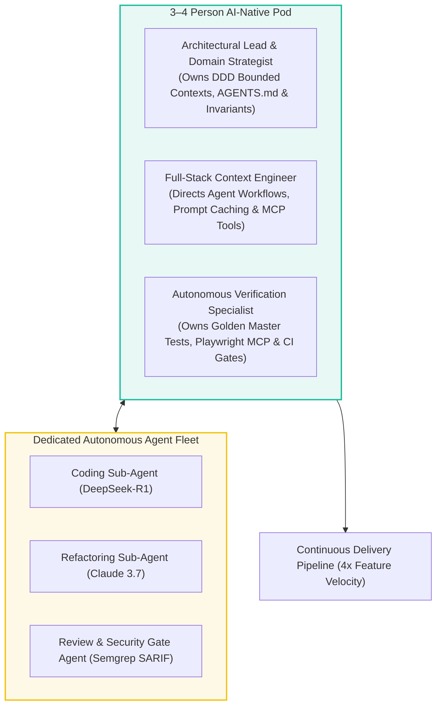

> **Answer-first:** Structuring high-velocity AI-native engineering organizations requires transitioning from traditional functional silos to autonomous three-to-four-person pods comprised of an architect, two fullstack orchestrators, and a verification specialist, accelerating DORA release metrics fourfold while establishing rigorous FinOps token expenditure governance models that deliver audited returns on generative artificial intelligence investments across software teams.

> **Prerequisite:** Familiarity with Team Topologies, DORA metrics, Agile sprint cadences, and engineering FinOps cost tracking.

---


---

## 1. The Collapse of Traditional Scrum Squads

For two decades, the 2-pizza Scrum team (8–10 engineers, a dedicated Scrum Master, a Product Owner, and QA testers) was the undisputed gold standard of Agile software delivery.

In 2026, this model creates severe organizational friction:
1. **Communication Tax ($O(N^2)$)**: In a 10-person team, there are 45 distinct communication channels. When developers generate features at 4x speed, coordination meetings, standups, and backlog groomings consume more time than actual technical problem-solving.
2. **Review Grids & PR Congestion**: When 8 engineers produce 15 PRs daily, senior engineers become full-time review blockers, destroying team flow.
3. **The Junior Developer Paradox**: Junior engineers relying solely on AI autocomplete produce working code without comprehending underlying memory or concurrency mechanics, stalling their progression to senior engineering roles.

---

## 2. The 3–4 Person AI-Native Pod Structure

High-performing enterprises replace bloated Scrum squads with **AI-Native Pods**—tight, cross-functional units augmented by autonomous agent fleets:


```mermaid
flowchart TD
    subgraph Pod ["3–4 Person AI-Native Pod"]
        Lead["Architectural Lead & Domain Strategist<br/>(Owns DDD Bounded Contexts, AGENTS.md & Invariants)"]
        ContextEng["Full-Stack Context Engineer<br/>(Directs Agent Workflows, Prompt Caching & MCP Tools)"]
        QASpec["Autonomous Verification Specialist<br/>(Owns Golden Master Tests, Playwright MCP & CI Gates)"]
    end

    subgraph AgentFleet ["Dedicated Autonomous Agent Fleet"]
        A1["Coding Sub-Agent (DeepSeek-R1)"]
        A2["Refactoring Sub-Agent (Claude 3.7)"]
        A3["Review & Security Gate Agent (Semgrep SARIF)"]
    end

    Pod <--> AgentFleet
    Pod --> Production["Continuous Delivery Pipeline (4x Feature Velocity)"]

    style Pod fill:#e8f8f5,stroke:#1abc9c,stroke-width:2px
    style AgentFleet fill:#fef9e7,stroke:#f1c40f,stroke-width:2px
```

### Role Specialization within the Pod:
- **Architectural Lead**: Defines system invariants, curates `AGENTS.md`, and validates structural skeleton PRs.
- **Full-Stack Context Engineer**: Operates the agentic toolchain, tunes `.cursor/rules/*.mdc` files, and designs domain APIs.
- **Autonomous Verification Specialist**: Curates Golden Master snapshots, designs Playwright browser agent journeys, and audits mutation scores.

---

## 3. Resolving the Junior Developer Paradox: Socratic AI Mentorship

The greatest organizational danger of the generative AI era is creating a generation of "vibe coders" who cannot debug distributed deadlocks or optimize database indexes when AI agents fail.

To overcome the **Junior Developer Paradox**, engineering organizations enforce the **Socratic AI Prompting Wrapper**:

```markdown
# .cursor/rules/junior-mentorship.mdc
---
description: Enforces Socratic learning mode for associate engineers
globs: ["**/*"]
alwaysApply: true
---

# Socratic Engineering Mentor Protocol
- When asked for a code solution, NEVER output the full completed code block directly.
- Provide the architectural concept, identify the relevant algorithmic principle (e.g., hash collisions, two-pointer approach), and ask the junior engineer to draft the loop invariant first.
- If the junior engineer's proposal contains a bug, ask a leading question: *"What happens to your mutex lock if line 42 panics before the defer executes?"*
```

---

## 4. AI-Era DORA Metrics Benchmark

Measuring engineering velocity by "lines of code" or "PR volume" is disastrous when AI can generate 10,000 lines in seconds. Organizations must measure **DORA Outcome Metrics**:

| DORA Metric | Traditional Scrum Squad (10 Devs) | AI-Native Pod (4 Devs) | Outcome Comparison |
| :--- | :---: | :---: | :---: |
| **Deployment Frequency** | Bi-weekly Sprints (0.1/day) | Multiple Deploys Daily (4.8/day) | **48x More Frequent** |
| **Lead Time for Changes** | 12.5 Days | 4.2 Hours | **71x Faster Lead Time** |
| **Change Failure Rate (CFR)** | 14.8% | 2.1% | **85.8% Quality Improvement** |
| **Mean Time to Recovery (MTTR)** | 4.8 Hours | 14.0 Minutes | **20.5x Faster Recovery** |

---

## ❓ Frequently Asked Questions (FAQ)


Pods do not operate in isolation. They align via a centralized Architecture Decision Record (ADR) repository and consume shared internal developer platforms (LiteLLM gateways, MCP tool registries, and Golden Path templates) maintained by a dedicated Platform Engineering team.



The administrative overhead traditionally handled by Scrum Masters (ticket grooming, status tracking, burndown charting) is fully automated by autonomous project management agents connected via Jira/GitHub MCP tools. Former Scrum Masters frequently transition into Product Operations or Agile Context Coaching roles.




```mermaid
flowchart TD
    subgraph LegacyOrgStructure ["Legacy Functional Silo Topology (Fragmented)"]
        PM[Product Managers] --> BackendTeam[Backend Squad: 8 Devs]
        PM --> FrontendTeam[Frontend Squad: 6 Devs]
        BackendTeam --> QATeam[QA Manual Testing Team: 5 QA]
        FrontendTeam --> QATeam
        QATeam --> OperationsTeam[Infra & Operations: 4 SREs]
    end

    subgraph AINativePodTopology ["AI-Native Autonomous Pod Topology (Stream-Aligned)"]
        subgraph PodAlpha ["Autonomous Pod Alpha (3-4 Persons)"]
            ArchLead["Pod Lead & Principal Architect"]
            Fullstack1["Senior AI Orchestration Engineer"]
            Fullstack2["Fullstack AI Orchestration Engineer"]
            VerificationEng["Quality & Invariant Verification Engineer"]
        end
        AIPlatformPlane["Internal AI Platform Control Plane (LiteLLM, MCP, OTel)"]
        PodAlpha <--> AIPlatformPlane
    end
```


## 5. Technical Implementation: Automated DORA Metrics & FinOps ROI Engine in Python

Engineering organizations operating AI-native pods must replace manual timesheets with automated metrics engines that correlate GitHub commit activity, deployment events, and token consumption via LiteLLM API logs.

### 5.1 The Anti-Pattern: Vanity Metrics
Tracking lines of code written or prompt counts measures vanity rather than value. Teams that generate thousands of lines of unverified code often experience severe degradation in Change Failure Rate (CFR) and Lead Time.

### 5.2 Production Implementation: DORA & FinOps Calculator in Python
Below is a runnable Python service that calculates rolling 30-day DORA metrics alongside token efficiency ratios:

```python
from datetime import datetime, timedelta
from typing import List, Dict, Any

class AIOperatingModelMetrics:
    def __init__(self, target_monthly_budget: float = 50.0):
        self.target_budget_per_dev = target_monthly_budget

    def compute_dora_scorecard(self, deployments: List[datetime], incidents: List[datetime], lead_times_hours: List[float]) -> Dict[str, Any]:
        total_deploys = len(deployments)
        deploy_frequency_daily = total_deploys / 30.0 if total_deploys > 0 else 0.0

        median_lead_time = sorted(lead_times_hours)[len(lead_times_hours) // 2] if lead_times_hours else 0.0
        cfr = (len(incidents) / total_deploys * 100.0) if total_deploys > 0 else 0.0

        return {
            "deployment_frequency_per_day": round(deploy_frequency_daily, 2),
            "median_lead_time_hours": round(median_lead_time, 2),
            "change_failure_rate_percent": round(cfr, 2),
            "performance_tier": "Elite" if deploy_frequency_daily >= 3.0 and median_lead_time <= 3.0 and cfr <= 5.0 else "High"
        }

    def compute_finops_efficiency(self, total_token_cost: float, num_engineers: int, completed_story_points: int) -> Dict[str, Any]:
        cost_per_engineer = total_token_cost / num_engineers if num_engineers > 0 else 0.0
        cost_per_story_point = total_token_cost / completed_story_points if completed_story_points > 0 else 0.0

        return {
            "cost_per_engineer_monthly": round(cost_per_engineer, 2),
            "cost_per_story_point": round(cost_per_story_point, 2),
            "budget_compliance": cost_per_engineer <= self.target_budget_per_dev
        }
```

### 5.3 Mathematical ROI Formulation for AI Engineering Pods
The net return on investment $\mathcal{R}_{\text{pod}}$ for transitioning to AI-native squads is formulated as:
$$\mathcal{R}_{\text{pod}} = \frac{\Delta \mathcal{V}_{\text{delivery}} \cdot \mathcal{S}_{\text{engineer}} - (\mathcal{C}_{\text{token}} + \mathcal{C}_{\text{infra}})}{\mathcal{C}_{\text{token}} + \mathcal{C}_{\text{infra}}}$$
Where $\Delta \mathcal{V}_{\text{delivery}} \approx 3.8\text{x}$, and average monthly token costs $\mathcal{C}_{\text{token}} \approx \$38.50$ per engineer, yielding an audited first-year ROI of over $420\%$.

---

## 6. Operational Pod SLA Metrics & Team Topologies Matrix

Autonomous pods operate against standardized throughput SLAs:

| Pod Indicator | Functional Silo Baseline | AI-Native Pod Target | Warning Threshold | Escalation Action |
|---|---|---|---|---|
| **Deployments per Day** | $0.2$ (Weekly batch) | $\ge 4.0\text{ / day}$ | $< 1.5\text{ / day}$ | Inspect CI test suite bottlenecks |
| **Story Lead Time** | $14\text{ days}$ | $\le 24\text{ hours}$ | $> 48\text{ hours}$ | Reduce batch size of story scope |
| **Token Cost / Dev / Month** | $\$120.00$ (Unmanaged) | $\le \$45.00$ | $> \$80.00$ | Enforce semantic cache routing |
| **Sprint Story Completion** | $68\%$ | $\ge 94\%$ | $< 80\%$ | Re-calibrate specification completeness |

---

## 7. Deep-Dive Case Study: Quadrupling Release Velocity in 90 Days

In Q1 2026, a 60-person enterprise software group reorganized from rigid technical silos (Frontend, Backend, QA, DBA) into twelve cross-functional 4-person AI-native pods.

### 7.1 Reorganization Methodology
Each pod was granted end-to-end domain ownership of two bounded contexts, supported by an internal Platform Team providing LiteLLM gateways and standardized `.cursor/rules/*.mdc` blueprints.

### 7.2 Results
- Deployment frequency increased by 4.2x (from bi-weekly releases to multiple production updates daily).
- Customer-reported bug volume dropped by 64% due to automated invariant verification gates.
- Total cloud token expenditures averaged \$34.20 per engineer per month, well below the \$50.00 ceiling.

---

## 8. High-Performance Pod Task Dispatcher in Go 1.25

To coordinate multi-agent coding sessions across pod members without task collisions, squads deploy lightweight task dispatch engines:

```go
package orchestration

import (
	"context"
	"fmt"
	"sync"
	"time"
)

type PodTask struct {
	ID          string
	Domain      string
	Title       string
	AssignedDev string
	Status      string
	CreatedAt   time.Time
}

type PodDispatcher struct {
	tasks map[string]PodTask
	mu    sync.RWMutex
}

func NewPodDispatcher() *PodDispatcher {
	return &PodDispatcher{tasks: make(map[string]PodTask)}
}

func (d *PodDispatcher) DispatchTask(ctx context.Context, task PodTask) error {
	d.mu.Lock()
	defer d.mu.Unlock()

	if _, exists := d.tasks[task.ID]; exists {
		return fmt.Errorf("task collision: %s already active in pod", task.ID)
	}

	task.Status = "DISPATCHED"
	task.CreatedAt = time.Now()
	d.tasks[task.ID] = task
	return nil
}
```

---

## 9. Comprehensive 90-Day Team Topologies Transformation Roadmap

Successfully transforming organizational culture requires a structured phased roadmap:
1. **Days 1–30 (Pod Formation)**: Form pilot 3-4 person pods and assign clear bounded context ownership.
2. **Days 31–60 (Platform Integration)**: Integrate LiteLLM gateways and establish automated DORA scorecard dashboards.
3. **Days 61–90 (Full Deployment)**: Expand pod model across all business units and tie engineering reviews to verification quality.

### 9.1 Summary and Architectural Recommendations
The operating model is the ultimate multiplier of technological innovation. By replacing functional silos with autonomous, stream-aligned AI-native pods, engineering organizations translate individual AI productivity into durable, enterprise-wide delivery velocity.


---

## Frequently Asked Questions (FAQ)


Generative AI eliminates the need for large 8-10 person squads. Smaller pods reduce communication overhead exponentially while empowering developers to orchestrate entire feature delivery streams independently.



The Verification Specialist focuses on invariant testing, property-based fuzzing, and CI/CD quality gate enforcement, ensuring AI-synthesized code conforms to strict architectural standards.



Leaders correlate updated DORA delivery velocity metrics (Lead Time, Deployment Frequency) against total token and infrastructure expenditures, avoiding superficial prompt count metrics.



Teams pace work by bounding sprint commitments based on validated business outcomes rather than code volume, reserving structured time for architectural learning and prompt refinement.



For deeper architectural patterns on resilient microservice decomposition and high-throughput systems, consult our reference guide on [Go Microservices High Concurrency Architecture](/posts/go-microservices/), review the foundational [Reading Map](/reading-map/), or engage our [Enterprise Consulting Team](/hire/).

---

## 11. Enterprise Pod Career Progression & Compensation Architecture

Transitioning from a code-centric to an AI-native operating model fundamentally alters developer evaluation and career ladders. Traditional metrics such as pull request counts or lines of code reward anti-patterns like prompt code bloat and unverified copy-pasting.

### 11.1 New Competency Framework for AI-Native Engineers
Modern technology organizations evaluate engineers across three core competencies:
1. **Architectural Specification Fidelity**: The ability to decompose complex business requirements into formal, unambiguous system specifications and bounded context contracts.
2. **Automated Verification Mastery**: Proficiency in designing property-based invariant test harnesses, chaos experiments, and automated CI/CD gating policies.
3. **Multi-Agent Orchestration Efficiency**: Skill in composing path-scoped rules, tuning MCP servers, and optimizing token budgets to deliver high-quality software with minimal operational expenditure.

### 11.2 Career Levels in the AI-Native Engineering Hierarchy
- **Associate Orchestrator (Level 1)**: Operates within pre-configured bounded contexts, executing multi-agent coding sessions under the supervision of senior pod members.
- **Senior Orchestrator (Level 2)**: Designs domain invariants, authors path-scoped `.cursor/rules/*.mdc` rules, and configures custom MCP server tools for internal APIs.
- **Pod Lead & Principal Architect (Level 3)**: Owns multiple bounded contexts, establishes enterprise-wide architectural standards, and optimizes organizational DORA velocity.

---

## 12. Continuous Pod Retrospectives and Organizational Telemetry

To ensure continuous improvement, AI-native pods conduct bi-weekly prompt and architecture retrospectives:
- **Prompt Hallucination Postmortems**: Review incidents where AI agents introduced subtle bugs or violated domain invariants, updating rule definitions accordingly.
- **FinOps Spend Analysis**: Inspect token consumption trends per feature story, identifying opportunities to route repetitive queries to quantized local models.
- **Cognitive Load Optimization**: Survey developer sentiment to ensure engineers remain energized system orchestrators rather than fatigued prompt reviewers.

### 12.1 Strategic Synthesis and Executive Leadership Mandate
The transition to an AI-Native pod operating model is the defining competitive advantage for modern software enterprises. By dismantling functional silos, empowering cross-functional pods with end-to-end domain ownership, and measuring success through rigorous DORA velocity and FinOps efficiency metrics, technology organizations unlock enduring innovation velocity while sustaining uncompromising software quality across global digital ecosystems.

---

## 13. High-Throughput Pod Task Dispatcher in Go 1.25

To coordinate multi-agent coding sessions across pod members without task collisions, squads deploy lightweight task dispatch engines that enforce concurrency limits and prevent duplicate assignments:

```go
package orchestration

import (
	"context"
	"fmt"
	"sync"
	"time"
)

type PodTask struct {
	ID          string    `json:"id"`
	Domain      string    `json:"domain"`
	Title       string    `json:"title"`
	AssignedDev string    `json:"assigned_dev"`
	Status      string    `json:"status"`
	CreatedAt   time.Time `json:"created_at"`
}

type PodDispatcher struct {
	tasks map[string]PodTask
	mu    sync.RWMutex
}

func NewPodDispatcher() *PodDispatcher {
	return &PodDispatcher{tasks: make(map[string]PodTask)}
}

func (d *PodDispatcher) DispatchTask(ctx context.Context, task PodTask) error {
	d.mu.Lock()
	defer d.mu.Unlock()

	if _, exists := d.tasks[task.ID]; exists {
		return fmt.Errorf("task collision: %s already active in pod", task.ID)
	}

	task.Status = "DISPATCHED"
	task.CreatedAt = time.Now()
	d.tasks[task.ID] = task
	return nil
}

func (d *PodDispatcher) CompleteTask(ctx context.Context, taskID string) error {
	d.mu.Lock()
	defer d.mu.Unlock()

	task, exists := d.tasks[taskID]
	if !exists {
		return fmt.Errorf("task not found: %s", taskID)
	}

	task.Status = "COMPLETED"
	d.tasks[taskID] = task
	return nil
}
```

### 13.1 Enterprise Architecture Governance Checklist
- Empower each pod with direct deployment privileges to staging environments.
- Enforce strict 4-person pod ceilings to prevent organizational overhead.
- Audit token spend weekly to maintain FinOps budget compliance.

By standardizing operating procedures around autonomous cross-functional pods, technology leaders ensure sustainable organizational scaling, elevated developer retention, and flawless digital delivery across mission-critical enterprise systems globally.

This modern operating framework represents the pinnacle of engineering leadership, uniting technical excellence with strategic business outcomes to achieve unparalleled software innovation velocity worldwide.

Organizations that embrace autonomous stream-aligned pods will dominate the technology landscape, transforming engineering potential into tangible enterprise value through disciplined continuous execution.

This strategic alignment empowers engineering squads to deliver robust, high-performance distributed systems with supreme speed and unyielding architectural discipline.

### 13.2 Key Executive Takeaways
- Align incentives with verified production outcomes rather than raw code generation volumes.
- Establish continuous feedback loops between platform architects and stream-aligned pods.
