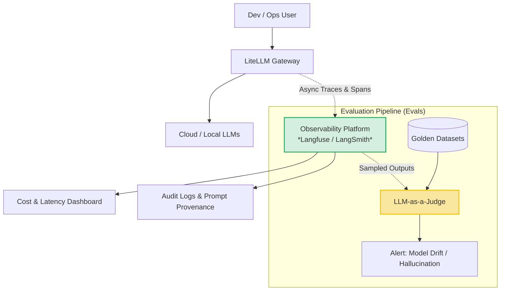
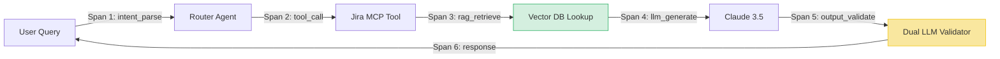
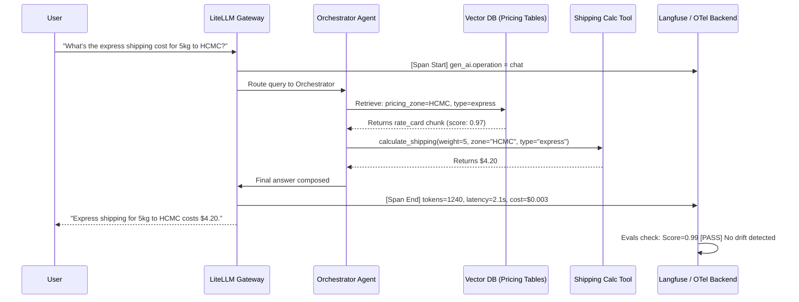

Many engineers in the current market can build an AI App in a weekend. But those who know how to **operate an AI system in production (AI Platform Operations)** can be counted on one hand.

The biggest difference between a "Demo" and an "Enterprise Platform" lives in one word: **Observability**.

## 1. The Blind Spots of AI in Production

When a traditional web app crashes (e.g., lost database connection), the system throws a 500 error code. An SRE (Site Reliability Engineer) looks at the logs and knows exactly how to fix it.

But when AI fails, it **does not throw an error**. The LLM will "confidently" produce a buggy code snippet, or a completely wrong (Hallucinated) answer—delivered in a supremely professional tone. Without a monitoring system, you are driving on a freeway blindfolded.

> **[Production Failure Case Study]: Silent Model Drift**
> An internal RAG system at a bank, used to assist credit advisors, operated flawlessly for the first 2 months. In month three, the Cloud LLM provider silently updated the model's weights to optimize costs.
> Instantly, the RAG system's accuracy plummeted from 95% to 70%. Bank employees began advising hundreds of customers with incorrect interest rates. The company was completely unaware until customers threatened legal action—because *no output quality monitoring system (Evals) had ever been established*.
> 📊 **Impact Metrics:** Lost trust with 400+ customers; the Legal team had to intervene to settle interest rate risk disputes.
> 📈 **Before/After (Post Observability & Evals):**
> - **Before:** Mean Time To Detect (MTTD) for failures was **3 weeks** (discovered only after customer complaints).
> - **After:** MTTD dropped to **< 5 minutes**. The Evals Pipeline immediately blocks any new model configuration if the Quality Score drops below 0.90 on the Golden Dataset.

---

## 2. AI Observability Architecture (The SRE Mindset)

To prevent the disaster above, the AI Gateway (LiteLLM) we established in [Part 2](/series/ai-driven-playbook/part-2-ai-platform-layer/) must be connected to a dedicated Telemetry system (such as Langfuse, LangSmith, or DataDog LLM Observability).



---

## 3. Core Metrics to Monitor

The Platform Engineering team must track these 4 vital metrics on the Dashboard:

1. **Token Cost Monitoring:** Real-time cost charts broken down by department, user, and model. Immediate Red Alert if the Marketing team unexpectedly burns $50/hour.
2. **Prompt Tracing:** When AI gives a wrong answer, the SRE must be able to see *exactly* what the input Prompt chain was, and which RAG documents were stuffed into the Context Window.
3. **AI Latency Monitoring:** Track response latency. If the `claude-3.5-sonnet` model suddenly takes 15 seconds to produce the first token (Time-to-First-Token), the Gateway must automatically **Fallback** to another model and log the event.
4. **Human Override Flows:** The rate at which users click the `Dislike` (Thumbs down) button or manually override (edit) an AI answer. A rising override rate is a leading indicator of system degradation.

**Simulated Monitoring Dashboard (Example from Langfuse/LangSmith):**
| Trace ID | User / Team | Model | Tokens | Latency | TTFT | Cost | Status / Quality Score |
| :--- | :--- | :--- | :--- | :--- | :--- | :--- | :--- |
| `trc_8x9a` | `dev-backend` | `claude-3.5-sonnet` | 14,200 | 12.4s | 800ms | $0.04 | ✅ Success (Score: 0.98) |
| `trc_2b4c` | `marketing` | `gpt-4o` | 3,100 | 2.1s | 400ms | $0.01 | ⚠️ Overridden (User edited) |
| `trc_9f1d` | `sys-agent` | `local-llama3` | 8,500 | 4.5s | 1200ms | $0.00 | 🛑 Hallucination Detected |


---

## 4. The Evaluation Pipeline (Evals): The Heart of Scaling AI

In traditional Software Engineering: *Don't deploy code without Unit Tests.*
In AI Engineering: *Don't deploy a Prompt without running it through an Evals Pipeline.*

Prompts are Code. Every time a Tech Lead changes a single line in `.cursorrules` (Part 1), how do you know whether the system got better or worse? The solution is establishing **Evals (Automated Evaluation)**:

### 4.1. Golden Datasets
Build a file containing approximately 100 questions alongside their perfect, authoritative answers (written by a Senior Domain Expert). This is called a *Golden Dataset*.

### 4.2. Regression Testing for Prompts
Every time a Prompt configuration or VectorDB (RAG) structure is modified, the CI/CD pipeline automatically feeds all 100 Golden Dataset questions to the AI. Then, a powerful model (LLM-as-a-Judge) scores the outputs to check whether the new answers have drifted from the "Golden" baseline.

### 4.3. Retrieval Quality Metrics
Measure **Precision** (Did the RAG fetch the correct documents?) and **Recall** (Did the RAG miss any critical documents?). Low Precision means the system is injecting too much Noise into the Context Window.

> 💰 **Cost Numbers:** Running the Evals pipeline costs approximately $10 per configuration commit. But it protects the company from "Model Drift" disasters costing thousands of dollars and destroying end-user trust.

---

## 5. Advanced Observability: OpenTelemetry GenAI Semantic Conventions

Most teams stop at custom logging. In 2024, **OpenTelemetry (OTel)** introduced the `gen_ai` semantic conventions—the industry standard for vendor-neutral LLM telemetry. Adopting OTel means your traces work identically whether you switch from Langfuse to Datadog or Grafana tomorrow.

**Key `gen_ai` attributes every trace should capture:**

| Attribute | Example Value | Why it matters |
| :--- | :--- | :--- |
| `gen_ai.operation.name` | `chat` | Distinguishes chat vs embedding calls |
| `gen_ai.provider.name` | `anthropic` | Cost breakdown by provider |
| `gen_ai.request.model` | `claude-3-5-sonnet-20241022` | Exact version for drift detection |
| `gen_ai.request.temperature` | `0.2` | Tracks output variability |
| `gen_ai.usage.input_tokens` | `14200` | Cost attribution per team |
| `gen_ai.usage.output_tokens` | `820` | Billing accuracy |

**Auto-instrumentation snippet (Python + OpenLIT):**
```python
import openlit

# One-line setup — automatically captures all LLM calls via OTel
openlit.init(
    otlp_endpoint="http://langfuse-internal:4318",  # Routes to your Observability backend
    application_name="billing-ai-agent",
    environment="production",
)

# From this point, all OpenAI / Anthropic / LiteLLM calls are traced automatically
# with gen_ai.* attributes attached — no further code changes required.
```

### 5.1. Agentic Workflow Observability: Tracing "Thought Chains"

Single LLM calls are easy to trace. **Agentic loops are not.** When Agent A calls Tool B which triggers Agent C, the trace must stitch across service boundaries.



Each numbered span is a child span in a single **trace tree**. When production breaks at Step 4, you click directly into Span 4 to see exactly which RAG chunks were injected and what the model received—not a wall of unstructured logs.

---

## 6. End-to-End Integration Scenario: The "Shipping Cost Agent" System

To make these concepts concrete, here is a complete observability integration scenario for a multi-service AI Agent system.

**Scenario:** An internal agent answers customer queries about shipping costs, using RAG (internal price tables) + a Calculation Tool.



**Monitoring outcome:** Any deviation in the rate_card retrieval score (RAG Precision) or calculation Tool latency immediately surfaces as an anomaly on the dashboard—before any customer is given a wrong price.

---

## 🛠 Practical Exercise: Instrument Your First LLM Call with OTel

1. **Install OpenLIT** in your Python project: `pip install openlit`.
2. **Add 2 lines** at the top of your main application file (see snippet above), pointing to a local Langfuse or Jaeger instance.
3. **Make 10 diverse LLM calls** (mix of chat, RAG, and tool calls).
4. **Open Langfuse UI** and inspect the trace tree. Can you identify: (a) which call had the highest token cost? (b) which RAG retrieval returned the lowest relevance score?

---

## 📚 External Resources & Tooling

- **Standard:** [OpenTelemetry GenAI Semantic Conventions](https://opentelemetry.io/docs/specs/semconv/gen-ai/) — The official specification; bookmark this before any instrumentation work.
- **Auto-instrumentation:** [OpenLIT](https://github.com/openlit/openlit) — 1-line OTel setup for all major LLM providers.
- **Observability Platforms:** [Langfuse](https://langfuse.com/) (OSS, self-hostable), [LangSmith](https://www.langchain.com/langsmith) (LangChain ecosystem), [Arize Phoenix](https://phoenix.arize.com/) (strong on Evals).
- **Further Reading:** [a16z: Emerging Architectures for LLM Applications](https://a16z.com/emerging-architectures-for-llm-applications/) — Where Observability fits in the modern AI stack.

---

## Conclusion

Running AI in production is a sustained battle. **AI Observability** gives you eyes (Dashboards), while the **Evals Pipeline** gives you a scale (Metrics) to measure quality. Without both, your organization will forever be running Proof-of-Concepts, never graduating to production-grade systems.

However, no matter how well you monitor the system, if your security perimeter is weak, attackers can "hypnotize" your internal AI to extract your entire customer database.

It is time to wrap the entire platform in a suit of armor: **[Part 7 — AI Security Engineering: Ironclad Defense for New Attack Surfaces](/series/ai-driven-playbook/part-7-ai-security-engineering/)**.
