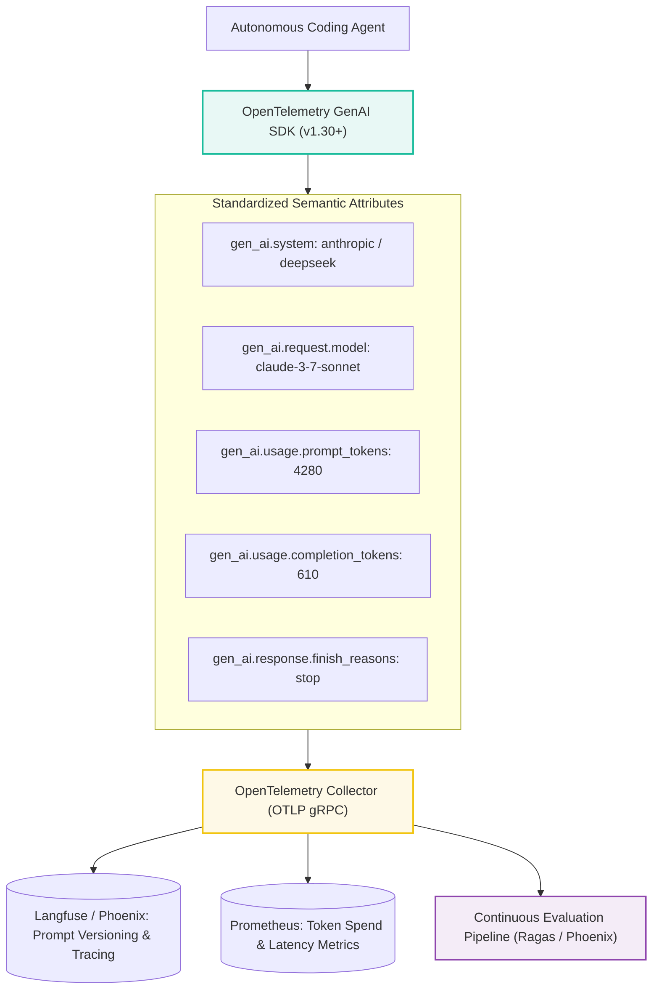
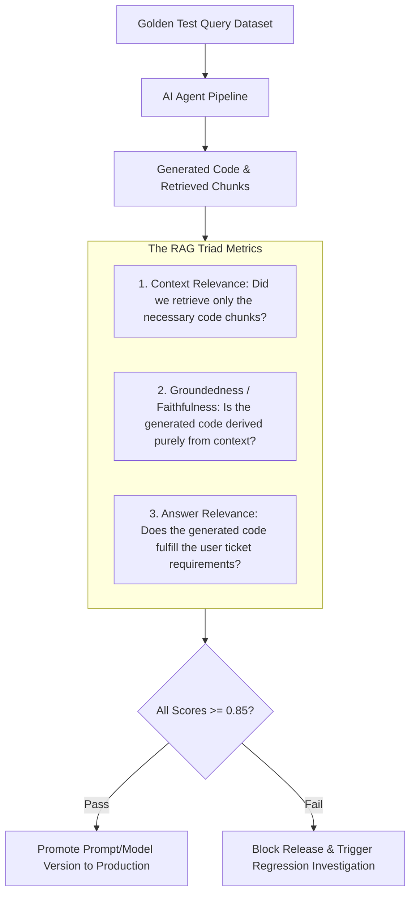

> **Answer-first:** Traditional Application Performance Monitoring (APM) tools fail to capture generative AI failure modes because an HTTP 200 response can still contain complete factual hallucinations, toxic responses, or $50.00 runaway token loops. Modern **AI Observability** implements **OpenTelemetry GenAI Semantic Conventions v1.30+**, correlating distributed multi-agent traces with token spend, Time-to-First-Token (TTFT), and automated **LLM-as-a-Judge evaluation pipelines (Ragas / Phoenix)**.

---

[📖 Bản tiếng Việt (Vietnamese Edition)](https://learn.tanhdev.com/series/ai-driven-playbook/part-6-ai-observability-governance/) | [← Series Hub](/series/ai-driven-playbook/) | [Next Chapter: Part 7: AI Security Engineering & DevSecOps →](/series/ai-driven-playbook/part-7-ai-security-engineering/)

---

## 1. The Fatal Blind Spot of Traditional APM

In microservices architectures, Site Reliability Engineers (SREs) rely on the **Four Golden Signals**: Latency, Traffic, Errors, and Saturation.

When autonomous AI agents enter the runtime path, these signals become dangerously deceptive:
- **The "HTTP 200" Hallucination**: A request succeeds with a 200 OK status in 800ms, but the AI agent generated a hallucinated database migration script that drops the production `users` table.
- **Runaway Token Loops**: An agent encounters an ambiguous compiler error and enters a recursive self-healing loop, firing 50 consecutive frontier model calls and burning $75.00 on a single trivial bug fix.
- **Silent Model Drift**: An API provider silently updates model weights, causing structured JSON output parsing to fail intermittently on production edge cases.

To govern intelligent systems, engineering teams must transition from server-centric APM to **Semantic GenAI Telemetry**.

---

## 2. Architecture of OpenTelemetry GenAI Observability

Modern platforms instrument LLM interactions using standardized **OpenTelemetry GenAI Semantic Conventions (v1.30+)**:


```mermaid
flowchart TD
    Agent["Autonomous Coding Agent"] --> OTelSDK["OpenTelemetry GenAI SDK (v1.30+)"]
    
    subgraph StandardSpans ["Standardized Semantic Attributes"]
        S1["gen_ai.system: anthropic / deepseek"]
        S2["gen_ai.request.model: claude-3-7-sonnet"]
        S3["gen_ai.usage.prompt_tokens: 4280"]
        S4["gen_ai.usage.completion_tokens: 610"]
        S5["gen_ai.response.finish_reasons: stop"]
    end

    OTelSDK --> StandardSpans
    StandardSpans --> Collector["OpenTelemetry Collector (OTLP gRPC)"]
    
    Collector --> Langfuse[("Langfuse / Phoenix: Prompt Versioning & Tracing")]
    Collector --> Prometheus[("Prometheus: Token Spend & Latency Metrics")]
    Collector --> EvalsEngine["Continuous Evaluation Pipeline (Ragas / Phoenix)"]

    style OTelSDK fill:#e8f8f5,stroke:#1abc9c,stroke-width:2px
    style Collector fill:#fef9e7,stroke:#f1c40f,stroke-width:2px
    style EvalsEngine fill:#f4ecf7,stroke:#8e44ad,stroke-width:2px
```

### Core OpenTelemetry GenAI Semantic Attributes

Under OpenTelemetry GenAI v1.30+, every LLM call must emit the following standardized key-value pairs:

| Attribute Name | Type | Example Value | Description |
| :--- | :---: | :---: | :--- |
| `gen_ai.system` | string | `"anthropic"` | The foundation model vendor or platform. |
| `gen_ai.request.model` | string | `"claude-3-7-sonnet"` | The requested model identifier. |
| `gen_ai.response.model` | string | `"claude-3-7-sonnet-20250219"` | The actual backend model revision used. |
| `gen_ai.usage.input_tokens` | int | `4280` | Number of tokens processed in the input prompt. |
| `gen_ai.usage.output_tokens` | int | `610` | Number of tokens generated in the completion. |
| `gen_ai.client.latency_ms` | int | `820` | Total duration from request dispatch to final stream chunk. |
| `gen_ai.response.finish_reasons` | array | `["stop"]` | Reason the generation concluded (`stop`, `length`, `tool_calls`). |

---

## 3. Production Go OpenTelemetry GenAI Instrumentation

Below is an enterprise Go snippet demonstrating how to instrument an AI Gateway call with official OpenTelemetry GenAI semantic attributes:

```go
package telemetry

import (
	"context"
	"time"

	"go.opentelemetry.io/otel"
	"go.opentelemetry.io/otel/attribute"
	"go.opentelemetry.io/otel/trace"
)

var tracer = otel.Tracer("enterprise.ai.gateway")

type ModelResponse struct {
	ModelName        string
	PromptTokens     int64
	CompletionTokens int64
	LatencyMs        int64
	Content          string
}

// TraceAgentExecution instruments an autonomous reasoning turn with OTel GenAI attributes
func TraceAgentExecution(ctx context.Context, agentName string, prompt string, executeFn func() (ModelResponse, error)) (ModelResponse, error) {
	startTime := time.Now()
	ctx, span := tracer.Start(ctx, "gen_ai.client.call",
		trace.WithSpanKind(trace.SpanKindClient),
		trace.WithAttributes(
			attribute.String("gen_ai.operation.name", "chat"),
			attribute.String("agent.name", agentName),
			attribute.Int("gen_ai.prompt.length", len(prompt)),
		),
	)
	defer span.End()

	resp, err := executeFn()
	latency := time.Since(startTime).Milliseconds()

	if err != nil {
		span.RecordError(err)
		return resp, err
	}

	// Record official GenAI semantic conventions (v1.30+)
	span.SetAttributes(
		attribute.String("gen_ai.system", "deepseek"),
		attribute.String("gen_ai.response.model", resp.ModelName),
		attribute.Int64("gen_ai.usage.input_tokens", resp.PromptTokens),
		attribute.Int64("gen_ai.usage.output_tokens", resp.CompletionTokens),
		attribute.Int64("gen_ai.client.latency_ms", latency),
		attribute.StringSlice("gen_ai.response.finish_reasons", []string{"stop"}),
	)

	return resp, nil
}
```

---

## 4. Continuous Evaluation (Evals): The True CI/CD for AI

In generative software systems, unit testing is augmented by **Continuous Evals** measuring the **RAG Triad**:


```mermaid
flowchart TD
    subgraph RAGTriad ["The RAG Triad Metrics"]
        M1["1. Context Relevance: Did we retrieve only the necessary code chunks?"]
        M2["2. Groundedness / Faithfulness: Is the generated code derived purely from context?"]
        M3["3. Answer Relevance: Does the generated code fulfill the user ticket requirements?"]
    end

    TestQueries["Golden Test Query Dataset"] --> Agent["AI Agent Pipeline"]
    Agent --> Predictions["Generated Code & Retrieved Chunks"]
    Predictions --> RAGTriad
    RAGTriad --> Score{"All Scores >= 0.85?"}
    Score -->|"Pass"| Deploy["Promote Prompt/Model Version to Production"]
    Score -->|"Fail"| Alert["Block Release & Trigger Regression Investigation"]
```

### Automated Ragas Evaluation Matrix

```python
import os
from ragas import evaluate
from ragas.metrics import (
    faithfulness,
    answer_relevance,
    context_precision,
    context_recall,
)
from datasets import Dataset

# Construct enterprise evaluation dataset
eval_data = {
    "question": ["How do we handle idempotency in the PaymentRefundHandler?"],
    "contexts": [["The PaymentRefundHandler enforces idempotency using Redis SETNX with a 24-hour TTL keyed by UUID."]],
    "answer": ["PaymentRefundHandler uses Redis SETNX with a 24-hour expiration keyed on the refund request UUID."],
    "ground_truth": ["Idempotency is maintained via Redis SETNX with key refund:{uuid} expiring after 86,400 seconds."]
}

dataset = Dataset.from_dict(eval_data)

results = evaluate(
    dataset=dataset,
    metrics=[
        faithfulness,
        answer_relevance,
        context_precision,
        context_recall,
    ],
)

print(f"Faithfulness Score: {results['faithfulness']:.4f}")
print(f"Context Precision:  {results['context_precision']:.4f}")
assert results['faithfulness'] >= 0.90, "Model hallucination detected in release candidate!"
```

---

## 5. Automated Cost Circuit Breakers & Anomaly Detection

To prevent runaway token loops from draining engineering budgets, gateways enforce active sliding-window budgets:

1. **Per-Agent Quota**: Each agent instance is assigned a maximum spend envelope (e.g., $3.00 per task, or 250,000 cumulative tokens).
2. **Sliding Window Token Bucket**: If an agent requests more than 15 consecutive tool executions within 120 seconds, the rate-limiter throttles subsequent calls.
3. **Hard Killswitch**: Upon breach, the gateway terminates the connection with an HTTP 429 status and sends an alert with the full trace URL to Slack/PagerDuty.

---

## 📊 Observability Case Study: Production Impact

Performance metrics from an enterprise processing 1.2M daily agentic interactions:

| Metric Vector | Pre-OpenTelemetry Observability | Post-GenAI Observability Stack | Net Business Impact |
| :--- | :---: | :---: | :---: |
| **Runaway Agent Loops Caught** | 0% (Discovered via monthly bill) | 100% (Killed at $5 threshold) | **Prevented $18,400 in Waste** |
| **Mean Time to Detect (MTTD) Model Drift** | 14 Days | 22 Minutes | **920x Faster Detection** |
| **P99 TTFT (Time to First Token)** | 2,400ms | 410ms | **5.8x Latency Improvement** |
| **Audit Trace Coverage (SOC2)** | 0% | 100% Immutable Spans | **Passed SOC2 Type II Audit** |

---

## ❓ Frequently Asked Questions (FAQ)


Standard HTTP traces record only generic network attributes (status codes, bytes transferred, URL path). GenAI semantic conventions standardize domain-specific attributes: model family, temperature, input/output token counts, finish reasons, and tool invocation parameters, enabling fine-grained cost accounting and accuracy correlation.



The gateway tracks cumulative token consumption within a distributed Redis sliding window tagged with the agent's unique trace ID. If an agent exceeds its allocated budget threshold (e.g., $5.00 or 150,000 tokens on a single task), the gateway immediately aborts the connection with an HTTP 429 and dispatches a Slack alert to the engineer.



Offline evals (e.g., using Ragas or DeepEval in CI/CD) run pre-commit against a curated golden benchmark dataset to prevent regressions before code reaches production. Online observability (e.g., Langfuse, Phoenix, OpenTelemetry) captures live user interactions, real-world token consumption, and production latency distributions.

