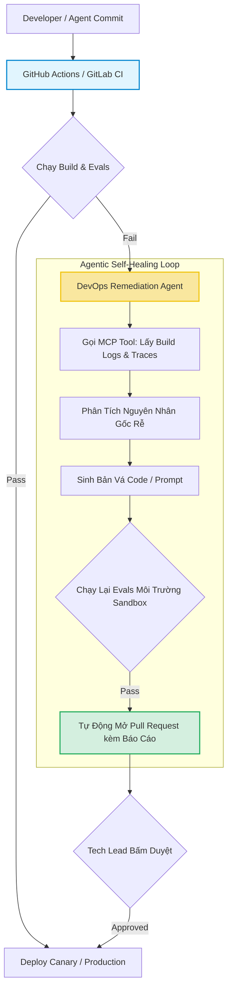
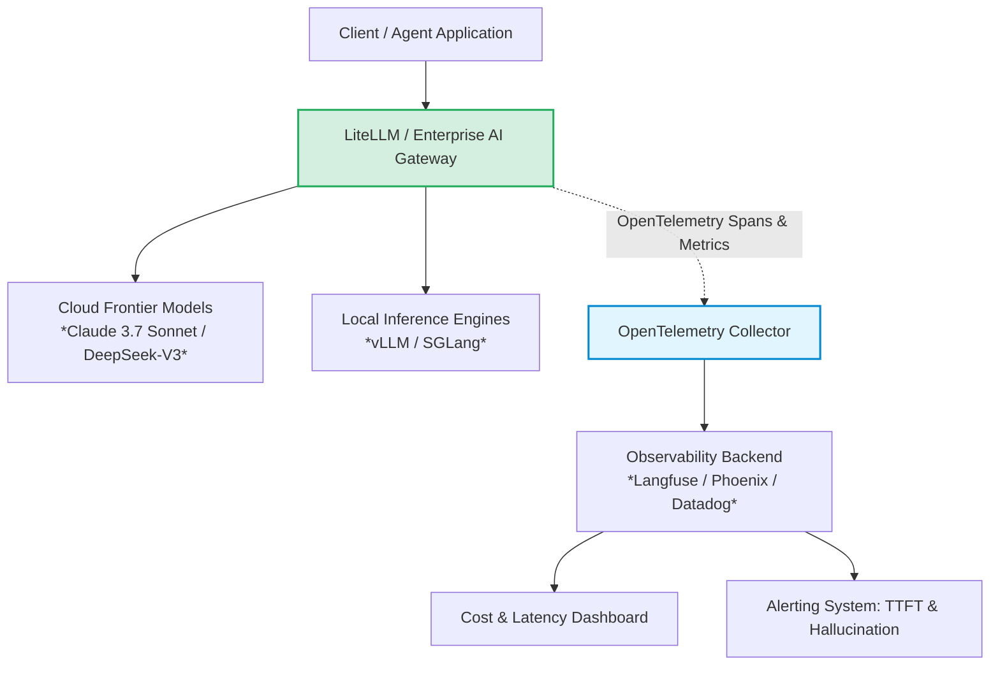

[← Chương trước: Phần 5: AI-Native Pod Operating Model](/series/ai-driven-playbook/part-5-operating-model/) | [Mục lục Series](/series/ai-driven-playbook/) | [Chương tiếp theo: Phần 7: AI Security Engineering & Governance →](/series/ai-driven-playbook/part-7-ai-security-engineering/)

---

> **Answer-first:** Xóa bỏ điểm mù vận hành CI/CD bằng cách tích hợp Agentic DevOps tự phục hồi lỗi, chuẩn MCP Deployment Tools và OpenTelemetry GenAI Semantic Conventions để theo dõi sát sao token budget, độ trễ suy luận LLM và độ chính xác phản hồi trên môi trường Production.

---

Trong giai đoạn đầu của môi trường Generative AI, nhiều tổ chức có thể xây dựng một ứng dụng AI (AI App) chỉ trong một ngày cuối tuần nhờ các khung phần mềm có sẵn. Tuy nhiên, khi bước sang năm 2026, khoảng cách giữa một bản thử nghiệm (Demo) và một hệ thống **Enterprise AI Platform** nằm ở khả năng vận hành tự động (Agentic DevOps) và khả năng quan sát toàn diện (GenAI Observability & Evals).

Khi ứng dụng web truyền thống gặp lỗi (như đứt kết nối Database hay đụng trần bộ nhớ), hệ thống SRE lập tức bắn về mã lỗi 500 kèm Stack Trace rõ ràng. Ngược lại, một ứng dụng AI-Native hoặc AI Agent khi gặp lỗi sẽ **không throw exception**. Mô hình ngôn ngữ lớn (LLM) vẫn trả về kết quả với thái độ vô cùng tự tin nhưng chứa mã nguồn có lỗi bảo mật hoặc trích xuất thông tin sai lệch (Hallucination). Nếu không xây dựng quy định kiểm định và giám sát chuyên biệt, doanh nghiệp đang vận hành hệ thống phần mềm trong một "điểm mù" nguy hiểm.

---

## 1. Lỗ Hổng Tử Huyệt Của CI/CD Truyền Thống & Sự Trỗi Dậy Của Agentic DevOps

Các đường ống CI/CD truyền thống (như Jenkins, GitHub Actions hay GitLab CI) được thiết kế dựa trên logic **tất định (Deterministic Checks)**: biên dịch code (Compile), chạy Unit Test, quét Linting và đóng gói Docker Image. 

Tuy nhiên, trong một SDLC do AI hỗ trợ (AI-Assisted & Agentic SDLC), phần lớn mã nguồn và cấu hình được sinh ra theo cơ chế **xác suất (Probabilistic Execution)**. Một pipeline CI/CD thông thường không thể tự phát hiện ra Prompt bị trôi lệch ngữ nghĩa (Prompt Drift) hay Vector DB bị suy thoái chất lượng truy xuất (Retrieval Degradation).

> **[Enterprise Failure Case Study]: Thảm họa suy thoái thầm lặng (Model Drift & Broken Pipeline)**
> Một tập đoàn bán lẻ đa quốc gia triển khai hệ thống AI Agent hỗ trợ phân tích kho hàng và tự động tạo đơn nhập hàng. Hệ thống chạy ổn định trong 2 tháng. Đến tháng thứ 3, provider LLM Cloud ngầm cập nhật trọng số (weights) mô hình nhằm tối ưu hóa chi phí phục vụ.
> 
> Lập tức, độ chính xác (Accuracy) trong việc giải mã JSON Schema của Agent sụt giảm từ 96% xuống 68%. Đường ống CI/CD truyền thống vẫn xanh (Pass) vì mã nguồn Python không thay đổi, nhưng trên Production, Agent liên tục sinh ra cấu hình sai khiến hàng ngàn đơn hàng bị treo.
> 
> 📊 **Hậu quả (Impact Metrics):** 1,200 đơn nhập hàng bị hoãn, phát sinh $45,000 chi phí lưu kho ngoài dự kiến và mất 4 ngày làm việc của đội ngũ Ops để khắc phục thủ công.
> 
> 📈 **Chỉ số Trước / Sau khi áp dụng Agentic DevOps & Evals:**
> - **Thời gian phát hiện lỗi (MTTD):** Giảm từ **3 tuần** (chỉ biết khi khách phàn nàn) xuống **< 3 phút** nhờ OpenTelemetry GenAI Spans.
> - **Thời gian phục hồi (MTTR):** Giảm từ **18 giờ** xuống **12 phút** nhờ luồng CI/CD Tự khắc phục (Self-Healing Pipeline).

---

## 2. Kiến Trúc Agentic DevOps & Self-Healing CI/CD Pipeline

Để khắc phục điểm yếu của CI/CD truyền thống, kiến trúc **Agentic DevOps** năm 2026 đưa các AI Agents trực tiếp tham gia vào vòng lặp kiểm định và tự khắc phục lỗi (Self-Healing). 

Khi một bước kiểm thử trong CI/CD thất bại (như Integration Test rớt hoặc Evals Score rớt dưới ngưỡng chỉ định), đường ống không chỉ dừng lại và báo mail cho lập trình viên. Thay vào đó, **DevOps Agent** sẽ kích hoạt luồng xử lý:

1. **Root Cause Analysis (RCA):** Thu thập toàn bộ Build Logs, OpenTelemetry Traces và Git Diff gần nhất để phân tích nguyên nhân gốc rễ.
2. **Speculative Fix Generation:** Tự động mở một branch phụ (`fix/agentic-remediation-xyz`), sinh ra đoạn code hoặc cấu hình Prompt sửa đổi nhằm khắc phục lỗi.
3. **Sandbox Validation:** Chạy lại toàn bộ bộ kiểm thử trong môi trường cô lập.
4. **Automated Pull Request:** Nếu bản vá vượt qua 100% rào chắn Evals, Agent sẽ tạo Pull Request gắn kèm báo cáo phân tích chi tiết cho Tech Lead bấm duyệt (Human-in-the-Loop).


```mermaid
flowchart TD
    Commit["Developer / Agent Commit"] --> Pipeline["GitHub Actions / GitLab CI"]
    Pipeline --> Test{"Chạy Build & Evals"}
    
    Test -->|Pass| Deploy["Deploy Canary / Production"]
    Test -->|Fail| AgenticRemediation["DevOps Remediation Agent"]
    
    subgraph "Agentic Self-Healing Loop"
        AgenticRemediation --> MCPFetch["Gọi MCP Tool: Lấy Build Logs & Traces"]
        MCPFetch --> RCA["Phân Tích Nguyên Nhân Gốc Rễ"]
        RCA --> GenFix["Sinh Bản Vá Code / Prompt"]
        GenFix --> ReTest{"Chạy Lại Evals Môi Trường Sandbox"}
        ReTest -->|Pass| CreatePR["Tự Động Mở Pull Request kèm Báo Cáo"]
    end
    
    CreatePR --> HITL{"Tech Lead Bấm Duyệt"}
    HITL -->|Approved| Deploy

    style AgenticRemediation fill:#f9e79f,stroke:#f1c40f,stroke-width:2px
    style CreatePR fill:#d4efdf,stroke:#27ae60,stroke-width:2px
    style Pipeline fill:#e1f5fe,stroke:#0288d1,stroke-width:2px
```

### Ví dụ Cấu hình GitHub Actions tích hợp Agentic Evals & Remediation Gate:

```yaml
name: Agentic DevOps CI/CD & Evals Gate

on:
  push:
    branches: [ main, develop ]
  pull_request:
    branches: [ main ]

jobs:
  ai-evals-and-deploy:
    runs-on: ubuntu-latest
    steps:
      - name: Checkout Source Code
        uses: actions/checkout@v4

      - name: Setup Node.js & Python Environment
        uses: actions/setup-python@v5
        with:
          python-version: '3.12'

      - name: Run Deterministic Unit & Integration Tests
        run: |
          pip install -r requirements.txt
          pytest tests/unit tests/integration

      - name: Run GenAI Evals Pipeline (Golden Dataset)
        env:
          OPENAI_API_KEY: ${{ secrets.OPENAI_API_KEY }}
          LANGFUSE_PUBLIC_KEY: ${{ secrets.LANGFUSE_PUBLIC_KEY }}
          LANGFUSE_SECRET_KEY: ${{ secrets.LANGFUSE_SECRET_KEY }}
        run: |
          python -m evals.run_golden_tests --threshold 0.85 --output evals-report.json

      - name: Agentic Self-Healing on Failure
        if: failure()
        env:
          GITHUB_TOKEN: ${{ secrets.GITHUB_TOKEN }}
          ANTHROPIC_API_KEY: ${{ secrets.ANTHROPIC_API_KEY }}
        run: |
          python -m devops_agent.remediate --report evals-report.json --logs build.log
```

---

## 3. Chuẩn Giao Thức Control Plane: MCP Deployment Tools Trong Production

Một trong những bước ngoặt kỹ thuật lớn nhất năm 2026 là việc chuẩn hóa giao tiếp hạ tầng thông qua **Model Context Protocol (MCP 1.x)**. 

Thay vì cho phép AI Agent trực tiếp chạy các câu lệnh Bash nguy hiểm (`kubectl apply` hay `helm upgrade`) với quyền admin trên máy Host, kiến trúc sư triển khai các **MCP Deployment Servers** chuyên biệt. Với giao thức cốt lõi Stateless Protocol Core (cập nhật 7/2026), MCP hoạt động như một lớp Control Plane bảo vệ an toàn, không rò rỉ phiên làm việc (session leakage), định nghĩa rõ ràng danh sách công cụ (Tools) mà Agent được phép gọi:

- **Kubernetes MCP Server:** Expose các hành vi an toàn như `get_cluster_health`, `get_pod_logs`, `trigger_canary_rollout`.
- **ArgoCD MCP Server:** Cho phép Agent kiểm tra trạng thái đồng bộ GitOps và kích hoạt `sync_application`.
- **Cloudflare / Edge MCP Server:** Hỗ trợ điều phối các luồng Worker deployment và quản lý DNS/Cache.

```json
{
  "mcpServers": {
    "kubernetes-ops": {
      "command": "k8s-mcp-server",
      "args": ["--kubeconfig", "/etc/kubernetes/readonly-config.yaml"],
      "env": {
        "ALLOWED_NAMESPACES": "staging,production-canary",
        "ENABLE_DESTRUCTIVE_ACTIONS": "false"
      }
    },
    "argocd-control": {
      "command": "argocd-mcp-bridge",
      "args": ["--server", "argocd.internal.net", "--auth-token", "${ARGOCD_TOKEN}"]
    }
  }
}
```

Nhờ việc đóng gói qua MCP, AI Agent có thể truy vấn trạng thái Cluster, kiểm tra tỷ lệ Pod rớt và khởi động triển khai dạng Canary Release theo chuẩn mã hóa an toàn mà không làm lộ SSH Key hay Master Token của hạ tầng.

---

## 4. OpenTelemetry GenAI Observability: Tư Duy SRE Cho AI Platform

Để điều khiển toàn bộ nền tảng AI Platform (đã xây dựng tại [Phần 2: Modern AI Platform Infrastructure](/series/ai-driven-playbook/part-2-modern-ai-engineering-stack/)), đội ngũ SRE không thể chỉ đo lường CPU và Memory. Bạn bắt buộc phải áp dụng **OpenTelemetry GenAI Semantic Conventions** để đo lường các thuộc tính chuyên biệt của LLM.


```mermaid
flowchart TD
    ClientApp["Client / Agent Application"] --> Gateway["LiteLLM / Enterprise AI Gateway"]
    Gateway --> CloudLLM["Cloud Frontier Models<br>*Claude 3.7 Sonnet / DeepSeek-V3*"]
    Gateway --> LocalLLM["Local Inference Engines<br>*vLLM / SGLang*"]
    
    Gateway -.->|OpenTelemetry Spans & Metrics| OTelCollector["OpenTelemetry Collector"]
    
    OTelCollector --> TracingBackend["Observability Backend<br>*Langfuse / Phoenix / Datadog*"]
    TracingBackend --> Dashboards["Cost & Latency Dashboard"]
    TracingBackend --> Alerting["Alerting System: TTFT & Hallucination"]

    style Gateway fill:#d4efdf,stroke:#27ae60,stroke-width:2px
    style OTelCollector fill:#e1f5fe,stroke:#0288d1,stroke-width:2px
```

### 4 Chỉ Số Sinh Tử Trên SRE Dashboard (Core GenAI Metrics)

1. **Time-to-First-Token (TTFT):** Thời gian tính từ khi Request gửi đi đến khi nhận được Token đầu tiên. Chỉ số này phản ánh trải nghiệm người dùng thực tế và độ tải của mô hình Inference. Nếu TTFT > 1,500ms, Gateway phải tự động chuyển sang luồng Fallback.
2. **Token Budget & Cost Tracking:** Biểu đồ lượng Token tiêu thụ tính theo real-time cho từng phòng ban, từng dự án và từng Agent. Tự động ngắt (Circuit Breaker) nếu một Agent rơi vào vòng lặp vô hạn gây tiêu tốn tài nguyên.
3. **Prompt Provenance & Tracing:** Khả năng truy vết chính xác chuỗi Prompt đầu vào, ngữ cảnh RAG đã nhồi vào Context Window, cùng tham số nhiệt độ (Temperature) tại thời điểm sinh kết quả.
4. **Human Override Rate (Tỷ lệ can thiệp của con người):** Tỷ lệ câu trả lời của AI bị người dùng cuối chỉnh sửa hoặc bấm nút Dislike. Tỷ lệ này tăng cao là tín hiệu sớm nhất báo hiệu mô hình đang gặp hiện tượng suy thoái (Drift).

#### Bảng Mô Phỏng Chi Tiết OpenTelemetry GenAI Traces (Ví dụ từ Langfuse / Phoenix):

| Trace ID | User / Agent | Model Target | Prompt Tokens | Completion Tokens | Latency | TTFT | Cost ($) | Evals Quality Score | Status |
| :--- | :--- | :--- | :--- | :--- | :--- | :--- | :--- | :--- | :--- |
| `trc_9a8b1` | `devops-agent` | `claude-3.7-sonnet` | 12,400 | 850 | 3.2s | 420ms | $0.041 | 0.96 (Pass) | ✅ Success |
| `trc_3c4d2` | `qa-bot` | `deepseek-r1-local` | 8,200 | 1,200 | 1.8s | 180ms | $0.000 | 0.91 (Pass) | ✅ Success |
| `trc_7e8f3` | `code-assistant` | `gpt-4.5-preview` | 24,100 | 3,100 | 14.5s | 1,450ms | $0.185 | 0.62 (Fail) | ⚠️ Low Precision |
| `trc_1a2b4` | `internal-docs` | `vllm-qwen2.5-coder` | 4,500 | 410 | 0.9s | 95ms | $0.000 | 0.45 (Alert) | 🛑 Hallucination |

---

## 5. Evaluation Pipeline (Evals): Trái Tim Của Việc Scale AI

Trong Kỹ nghệ phần mềm truyền thống: **Không deploy code nếu chưa qua Unit Test**.
Trong Kỹ nghệ AI năm 2026: **Không deploy Prompt hay Agent Config nếu chưa đi qua Evals Pipeline**.

Prompt và Context Rules (`.cursorrules`, `AGENTS.md`) chính là Code. Mỗi khi Tech Lead chỉnh sửa một quy tắc trong hệ thống, làm sao để đảm bảo chất lượng hệ thống tốt lên chứ không tệ đi? Giải pháp là xây dựng **Automated Evals Pipeline**:

### 5.1. Golden Datasets (Tập Dữ Liệu Vàng)
Tổ chức cần xây dựng và duy trì một file dữ liệu chuẩn hóa gồm 100-500 tình huống kiểm thử (Test Cases) do các chuyên gia Senior thiết lập. Mỗi case chứa:
- **Input Prompt:** Câu hỏi hoặc ngữ cảnh đầu vào.
- **Expected Retrieval Context:** Danh sách các đoạn văn bản/file mã nguồn chuẩn mà RAG bắt buộc phải trích xuất.
- **Ground Truth Answer:** Câu trả lời chuẩn mực làm thước đo.

### 5.2. LLM-as-a-Judge Scoring Methodology
Mỗi khi có thay đổi trong cấu hình, CI/CD pipeline sẽ chạy lại tập Golden Dataset và đưa kết quả cho một mô hình chấm điểm độc lập (**LLM-as-a-Judge** như Claude 3.7 Sonnet hay GPT-4.5) để phân tích theo 3 tiêu chí chính:

1. **Context Precision (Độ chính xác ngữ cảnh):** Tỷ lệ tài liệu RAG lấy về thực sự liên quan đến câu hỏi. Tránh nhồi "rác" vào Context Window.
2. **Faithfulness (Độ trung thực):** Câu trả lời của AI có hoàn toàn dựa trên dữ liệu RAG được cung cấp hay tự bịa ra thông tin bên ngoài?
3. **Answer Relevance (Độ liên quan câu trả lời):** Câu trả lời có giải quyết đúng trọng tâm yêu cầu của người dùng không?

```python
# Code snippet: Mô phỏng Evals Pipeline kiểm tra Faithfulness và Context Precision
from langfuse import Langfuse
import numpy as np

def run_eval_suite(golden_dataset, target_agent, judge_llm):
    scores = []
    for item in golden_dataset:
        # 1. Agent sinh phản hồi
        response = target_agent.query(item["prompt"])
        
        # 2. Judge LLM đánh giá Faithfulness
        judge_prompt = f"""
        Bạn là Chuyên gia Kiểm định AI. Hãy đánh giá độ trung thực (Faithfulness) của phản hồi dưới đây dựa trên Ngữ cảnh được cung cấp.
        Ngữ cảnh: {response.context}
        Phản hồi: {response.answer}
        Chỉ trả về duy nhất một số thực từ 0.0 đến 1.0.
        """
        score = float(judge_llm.generate(judge_prompt).strip())
        scores.append(score)
    
    mean_score = np.mean(scores)
    print(f"Overall Faithfulness Score: {mean_score:.4f}")
    if mean_score < 0.85:
        raise ValueError(f"Evals Failed: Score {mean_score:.4f} lower than threshold 0.85!")
    return mean_score
```

---

## Tổng Kết & Ranh Giới Chuyển Tiếp

Vận hành hệ thống AI trong môi trường Enterprise năm 2026 đòi hỏi sự kết hợp chặt chẽ giữa **Agentic DevOps** (tự động hóa khắc phục lỗi), **MCP Deployment Control Plane** (giao tiếp hạ tầng an toàn), và **GenAI Observability & Evals** (giám sát đa tầng).

Nếu không có hệ thống quan sát và đánh giá tự động, mọi nỗ lực mở rộng quy mô AI của doanh nghiệp chỉ dừng lại ở các thử nghiệm thiếu an toàn. 

Tuy nhiên, khi hạ tầng của bạn đã hoạt động trơn tru và có khả năng tự khắc phục lỗi, câu hỏi lớn tiếp theo đặt ra là: **Làm sao để bảo vệ hệ thống trước các cuộc tấn công tinh vi nhắm vào mô hình AI và kiểm soát chi phí tiêu thụ Token khi lượng người dùng tăng vọt?**

Hãy cùng khám phá câu trả lời trong bài viết tiếp theo: **[Phần 7 — AI Security Engineering, Governance & Cost Control: Áo Giáp Thép Cho Bề Mặt Tấn Công Mới](/series/ai-driven-playbook/part-7-ai-security-engineering/)**.

---

### 🔗 Đọc Thêm Các Chuyên Đề Chuyên Sâu Liên Quan:

- **[Series: MCP Engineering In Production — Phần 6: Observability](/series/mcp-engineering-in-production/part-6-observability/)** — Xây dựng hạ tầng giám sát chuyên sâu cho các Model Context Protocol Server bằng Go.
- **[Series: AI Code Review & Vibe Coding — Phần 6: Governance & Observability](/series/ai-code-review-vibe-coding/part-6-governance-observability-career/)** — Quy trình quản trị dòng code do AI sinh ra và theo dõi chỉ số chất lượng mã nguồn.
- **[Series: Agentic System Architecture — Phần 4: AgentOps](/series/agentic-system-architecture/part-4-agentops/)** — Thiết kế hệ thống vận hành AgentOps chuyên nghiệp cho kiến trúc Multi-Agent.
- **Bài viết thực chiến:** [Tự Động Hóa CI/CD Với ArgoCD & Kubernetes 2026](/posts/argo-cd-updates-2026/) | [Triển Khai Agentic AI Swarm Với OpenClaw & LiteLLM](/posts/deploying-autonomous-ai-swarm-openclaw-litellm/) | [GitOps At Scale Cho Microservices Kubernetes](/posts/gitops-at-scale-kubernetes-argocd-microservices/)

---

---

---

[← Chương trước: Phần 5: AI-Native Pod Operating Model](/series/ai-driven-playbook/part-5-operating-model/) | [Mục lục Series](/series/ai-driven-playbook/) | [Chương tiếp theo: Phần 7: AI Security Engineering & Governance →](/series/ai-driven-playbook/part-7-ai-security-engineering/)


---

## ❓ Câu Hỏi Thường Gặp (FAQ)

### Q1: Phần 6 — Agentic DevOps, MCP Deployment & AI Observability: Xóa Bỏ 'Điểm Mù' Vận Hành CI/CD 2026 giải quyết vấn đề cốt lõi nào trong kiến trúc hệ thống?
Hướng dẫn xây dựng tư duy SRE thế hệ mới năm 2026: kết hợp Agentic DevOps tự khắc phục lỗi CI/CD, chuẩn MCP Deployment Tools và OpenTelemetry GenAI Observability để loại bỏ điểm mù trên Production.

### Q2: Những lưu ý quan trọng nhất khi triển khai thực tế là gì?
Cần chú trọng phân tầng ranh giới trách nhiệm (bounded context), thiết lập cơ chế fallback dự phòng, và giám sát chặt chẽ qua metrics OpenTelemetry để phát hiện sớm các điểm nghẽn.

### Q3: Làm sao để kiểm thử và đánh giá hiệu quả sau khi áp dụng?
Áp dụng kiểm thử tải (load test), benchmark độ trễ P95/P99 trước và sau triển khai, kết hợp tracing phân tán để xác minh tính ổn định dưới tải cao.
