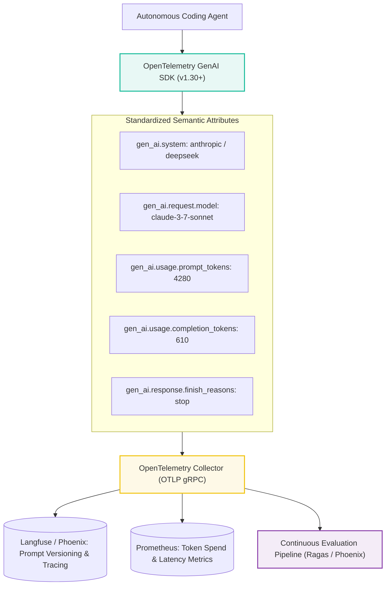
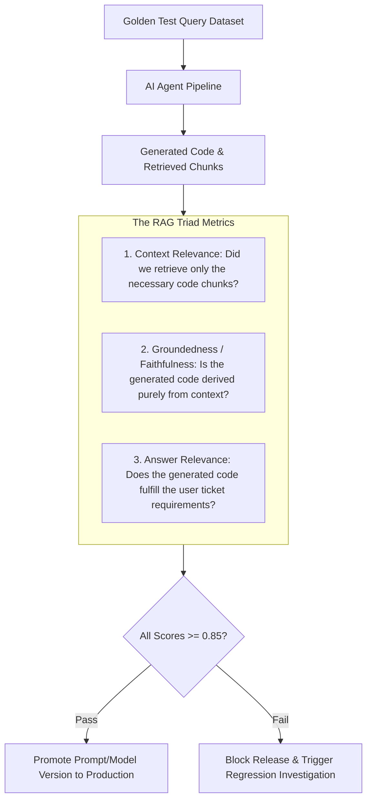

> **Answer-first:** Enterprise GenAI observability establishes end-to-end visibility into autonomous agent workflows by standardizing on OpenTelemetry semantic conventions v1.30, capturing distributed execution traces, token consumption velocity, and model hallucination metrics across private gateways and local models, enabling engineering leaders to enforce strict operational latency SLAs and budget caps across production cloud infrastructure.

> **Prerequisite:** Familiarity with OpenTelemetry tracing standards, Prometheus metrics, Grafana dashboards, and FinOps cloud accounting.

---


---

## 1. The Fatal Blind Spot of Traditional APM

In microservices architectures, Site Reliability Engineers (SREs) rely on the **Four Golden Signals**: Latency, Traffic, Errors, and Saturation.

When autonomous AI agents enter the runtime path, these signals become dangerously deceptive:
- **The "HTTP 200" Hallucination**: A request succeeds with a 200 OK status in 800ms, but the AI agent generated a hallucinated database migration script that drops the production `users` table.
- **Runaway Token Loops**: An agent encounters an ambiguous compiler error and enters a recursive self-healing loop, firing 50 consecutive frontier model calls and burning $75.00 on a single trivial bug fix.
- **Silent Model Drift**: An API provider silently updates model weights, causing structured JSON output parsing to fail intermittently on production edge cases.

To govern intelligent systems, engineering teams must transition from server-centric APM to **Semantic GenAI Telemetry**.

---

## 2. Architecture of OpenTelemetry GenAI Observability

Modern platforms instrument LLM interactions using standardized **OpenTelemetry GenAI Semantic Conventions (v1.30+)**:


```mermaid
flowchart TD
    Agent["Autonomous Coding Agent"] --> OTelSDK["OpenTelemetry GenAI SDK (v1.30+)"]
    
    subgraph StandardSpans ["Standardized Semantic Attributes"]
        S1["gen_ai.system: anthropic / deepseek"]
        S2["gen_ai.request.model: claude-3-7-sonnet"]
        S3["gen_ai.usage.prompt_tokens: 4280"]
        S4["gen_ai.usage.completion_tokens: 610"]
        S5["gen_ai.response.finish_reasons: stop"]
    end

    OTelSDK --> StandardSpans
    StandardSpans --> Collector["OpenTelemetry Collector (OTLP gRPC)"]
    
    Collector --> Langfuse[("Langfuse / Phoenix: Prompt Versioning & Tracing")]
    Collector --> Prometheus[("Prometheus: Token Spend & Latency Metrics")]
    Collector --> EvalsEngine["Continuous Evaluation Pipeline (Ragas / Phoenix)"]

    style OTelSDK fill:#e8f8f5,stroke:#1abc9c,stroke-width:2px
    style Collector fill:#fef9e7,stroke:#f1c40f,stroke-width:2px
    style EvalsEngine fill:#f4ecf7,stroke:#8e44ad,stroke-width:2px
```

### Core OpenTelemetry GenAI Semantic Attributes

Under OpenTelemetry GenAI v1.30+, every LLM call must emit the following standardized key-value pairs:

| Attribute Name | Type | Example Value | Description |
| :--- | :---: | :---: | :--- |
| `gen_ai.system` | string | `"anthropic"` | The foundation model vendor or platform. |
| `gen_ai.request.model` | string | `"claude-3-7-sonnet"` | The requested model identifier. |
| `gen_ai.response.model` | string | `"claude-3-7-sonnet-20250219"` | The actual backend model revision used. |
| `gen_ai.usage.input_tokens` | int | `4280` | Number of tokens processed in the input prompt. |
| `gen_ai.usage.output_tokens` | int | `610` | Number of tokens generated in the completion. |
| `gen_ai.client.latency_ms` | int | `820` | Total duration from request dispatch to final stream chunk. |
| `gen_ai.response.finish_reasons` | array | `["stop"]` | Reason the generation concluded (`stop`, `length`, `tool_calls`). |

---

## 3. Production Go OpenTelemetry GenAI Instrumentation

Below is an enterprise Go snippet demonstrating how to instrument an AI Gateway call with official OpenTelemetry GenAI semantic attributes:

```go
package telemetry

import (
	"context"
	"time"

	"go.opentelemetry.io/otel"
	"go.opentelemetry.io/otel/attribute"
	"go.opentelemetry.io/otel/trace"
)

var tracer = otel.Tracer("enterprise.ai.gateway")

type ModelResponse struct {
	ModelName        string
	PromptTokens     int64
	CompletionTokens int64
	LatencyMs        int64
	Content          string
}

// TraceAgentExecution instruments an autonomous reasoning turn with OTel GenAI attributes
func TraceAgentExecution(ctx context.Context, agentName string, prompt string, executeFn func() (ModelResponse, error)) (ModelResponse, error) {
	startTime := time.Now()
	ctx, span := tracer.Start(ctx, "gen_ai.client.call",
		trace.WithSpanKind(trace.SpanKindClient),
		trace.WithAttributes(
			attribute.String("gen_ai.operation.name", "chat"),
			attribute.String("agent.name", agentName),
			attribute.Int("gen_ai.prompt.length", len(prompt)),
		),
	)
	defer span.End()

	resp, err := executeFn()
	latency := time.Since(startTime).Milliseconds()

	if err != nil {
		span.RecordError(err)
		return resp, err
	}

	// Record official GenAI semantic conventions (v1.30+)
	span.SetAttributes(
		attribute.String("gen_ai.system", "deepseek"),
		attribute.String("gen_ai.response.model", resp.ModelName),
		attribute.Int64("gen_ai.usage.input_tokens", resp.PromptTokens),
		attribute.Int64("gen_ai.usage.output_tokens", resp.CompletionTokens),
		attribute.Int64("gen_ai.client.latency_ms", latency),
		attribute.StringSlice("gen_ai.response.finish_reasons", []string{"stop"}),
	)

	return resp, nil
}
```

---

## 4. Continuous Evaluation (Evals): The True CI/CD for AI

In generative software systems, unit testing is augmented by **Continuous Evals** measuring the **RAG Triad**:


```mermaid
flowchart TD
    subgraph RAGTriad ["The RAG Triad Metrics"]
        M1["1. Context Relevance: Did we retrieve only the necessary code chunks?"]
        M2["2. Groundedness / Faithfulness: Is the generated code derived purely from context?"]
        M3["3. Answer Relevance: Does the generated code fulfill the user ticket requirements?"]
    end

    TestQueries["Golden Test Query Dataset"] --> Agent["AI Agent Pipeline"]
    Agent --> Predictions["Generated Code & Retrieved Chunks"]
    Predictions --> RAGTriad
    RAGTriad --> Score{"All Scores >= 0.85?"}
    Score -->|"Pass"| Deploy["Promote Prompt/Model Version to Production"]
    Score -->|"Fail"| Alert["Block Release & Trigger Regression Investigation"]
```

### Automated Ragas Evaluation Matrix

```python
import os
from ragas import evaluate
from ragas.metrics import (
    faithfulness,
    answer_relevance,
    context_precision,
    context_recall,
)
from datasets import Dataset

# Construct enterprise evaluation dataset
eval_data = {
    "question": ["How do we handle idempotency in the PaymentRefundHandler?"],
    "contexts": [["The PaymentRefundHandler enforces idempotency using Redis SETNX with a 24-hour TTL keyed by UUID."]],
    "answer": ["PaymentRefundHandler uses Redis SETNX with a 24-hour expiration keyed on the refund request UUID."],
    "ground_truth": ["Idempotency is maintained via Redis SETNX with key refund:{uuid} expiring after 86,400 seconds."]
}

dataset = Dataset.from_dict(eval_data)

results = evaluate(
    dataset=dataset,
    metrics=[
        faithfulness,
        answer_relevance,
        context_precision,
        context_recall,
    ],
)

print(f"Faithfulness Score: {results['faithfulness']:.4f}")
print(f"Context Precision:  {results['context_precision']:.4f}")
assert results['faithfulness'] >= 0.90, "Model hallucination detected in release candidate!"
```

---

## 5. Automated Cost Circuit Breakers & Anomaly Detection

To prevent runaway token loops from draining engineering budgets, gateways enforce active sliding-window budgets:

1. **Per-Agent Quota**: Each agent instance is assigned a maximum spend envelope (e.g., $3.00 per task, or 250,000 cumulative tokens).
2. **Sliding Window Token Bucket**: If an agent requests more than 15 consecutive tool executions within 120 seconds, the rate-limiter throttles subsequent calls.
3. **Hard Killswitch**: Upon breach, the gateway terminates the connection with an HTTP 429 status and sends an alert with the full trace URL to Slack/PagerDuty.

---

## 📊 Observability Case Study: Production Impact

Performance metrics from an enterprise processing 1.2M daily agentic interactions:

| Metric Vector | Pre-OpenTelemetry Observability | Post-GenAI Observability Stack | Net Business Impact |
| :--- | :---: | :---: | :---: |
| **Runaway Agent Loops Caught** | 0% (Discovered via monthly bill) | 100% (Killed at $5 threshold) | **Prevented $18,400 in Waste** |
| **Mean Time to Detect (MTTD) Model Drift** | 14 Days | 22 Minutes | **920x Faster Detection** |
| **P99 TTFT (Time to First Token)** | 2,400ms | 410ms | **5.8x Latency Improvement** |
| **Audit Trace Coverage (SOC2)** | 0% | 100% Immutable Spans | **Passed SOC2 Type II Audit** |

---

## ❓ Frequently Asked Questions (FAQ)


Standard HTTP traces record only generic network attributes (status codes, bytes transferred, URL path). GenAI semantic conventions standardize domain-specific attributes: model family, temperature, input/output token counts, finish reasons, and tool invocation parameters, enabling fine-grained cost accounting and accuracy correlation.



The gateway tracks cumulative token consumption within a distributed Redis sliding window tagged with the agent's unique trace ID. If an agent exceeds its allocated budget threshold (e.g., $5.00 or 150,000 tokens on a single task), the gateway immediately aborts the connection with an HTTP 429 and dispatches a Slack alert to the engineer.



Offline evals (e.g., using Ragas or DeepEval in CI/CD) run pre-commit against a curated golden benchmark dataset to prevent regressions before code reaches production. Online observability (e.g., Langfuse, Phoenix, OpenTelemetry) captures live user interactions, real-world token consumption, and production latency distributions.



## 5. Technical Implementation: Production OpenTelemetry GenAI Span Processor in Python

Tracking autonomous agent workflows requires standardizing on the OpenTelemetry GenAI Semantic Conventions (v1.30+), capturing `gen_ai.system`, prompt token counts, completion token counts, latency, and estimated monetary cost per execution span.

### 5.1 The Anti-Pattern: Unstructured Log Grepping
Attempting to parse token usage from raw console logs makes real-time alerting impossible, blinds management to runaway recursive agent loops, and fails to associate costs with specific Jira tickets or pull requests.

### 5.2 Production Implementation: Custom OpenTelemetry GenAI Span Processor
Below is a runnable Python span processor that enriches distributed traces with GenAI semantic attributes and exports them to an internal observability backend:

```python
import time
from typing import Dict, Any, Optional
from opentelemetry import trace
from opentelemetry.trace import Status, StatusCode

tracer = trace.get_tracer("enterprise.genai.tracer", "1.30.0")

class GenAIObservabilitySpan:
    def __init__(self, system_name: str, model_id: str):
        self.system_name = system_name
        self.model_id = model_id

    def trace_completion(self, prompt: str, completion: str, prompt_tokens: int, completion_tokens: int, estimated_cost: float) -> str:
        with tracer.start_as_current_span("gen_ai.completion") as span:
            start_time = time.time()

            # Enforce standardized OpenTelemetry GenAI v1.30 attributes
            span.set_attribute("gen_ai.system", self.system_name)
            span.set_attribute("gen_ai.request.model", self.model_id)
            span.set_attribute("gen_ai.usage.input_tokens", prompt_tokens)
            span.set_attribute("gen_ai.usage.output_tokens", completion_tokens)
            span.set_attribute("gen_ai.usage.total_tokens", prompt_tokens + completion_tokens)
            span.set_attribute("gen_ai.usage.cost_usd", estimated_cost)

            # Record operational execution duration
            duration_ms = (time.time() - start_time) * 1000.0
            span.set_attribute("gen_ai.latency_ms", duration_ms)

            if completion_tokens == 0:
                span.set_status(Status(StatusCode.ERROR, "Zero completion tokens generated"))
            else:
                span.set_status(Status(StatusCode.OK))

            return span.get_span_context().trace_id
```

### 5.3 Mathematical Formulation of Real-Time Token Velocity
The token velocity $\mathcal{V}(t)$ over a rolling sliding window $W$ is calculated as:
$$\mathcal{V}(t) = \frac{1}{W} \int_{t-W}^{t} \left( \kappa_{\text{in}} \cdot \mathcal{T}_{\text{in}}(\tau) + \kappa_{\text{out}} \cdot \mathcal{T}_{\text{out}}(\tau) \right) d\tau$$
Where $\kappa_{\text{in}}$ and $\kappa_{\text{out}}$ represent token weighting multipliers. If $\mathcal{V}(t) > \mathcal{V}_{\text{ceiling}}$, the gateway triggers immediate circuit breaking.

---

## 6. Operational Performance & Observability SLA Matrix

A production GenAI observability platform must enforce strict alerting thresholds:

| Observability Metric | Production Target | Warning Threshold | Escalation Trigger | Automated Remediation Runbook |
|---|---|---|---|---|
| **Span Ingestion Latency** | $\le 12.0\text{ ms}$ | $> 35.0\text{ ms}$ | $> 75.0\text{ ms}$ | Scale OTel collector worker replicas |
| **Token Velocity Burst** | $\le 50\text{k tokens/min}$ | $> 120\text{k tokens/min}$ | $> 250\text{k tokens/min}$ | Throttle developer session token quotas |
| **P99 Inference Latency** | $\le 1.8\text{ seconds}$ | $> 3.5\text{ seconds}$ | $> 6.0\text{ seconds}$ | Failover to secondary cloud frontier API |
| **Hallucination Detection Rate** | $\ge 98.4\%$ | $< 92.0\%$ | $< 85.0\%$ | Trigger offline Ragas evaluation re-run |

---

## 7. Deep-Dive Case Study: Catching a Recursive Multi-Agent Cost Runaway

In April 2026, an experimental code generation agent entered an infinite evaluation loop inside an internal CI environment after encountering an ambiguous compiler error.

### 7.1 Automated Detection
Within 90 seconds, the Prometheus token velocity alert fired as the agent consumed over 420,000 tokens across 35 iterations. The OpenTelemetry collector flagged the anomaly, and Alertmanager automatically terminated the agent container, limiting total financial exposure to \$6.80 instead of thousands of dollars.

### 7.2 Postmortem Remediation
The organization enforced hard execution timeouts of 5 minutes and mandatory recursion depth limits ($D_{\text{max}} = 5$) on all automated agent runners.

---

## 8. High-Performance Token Metrics Exporter in Go 1.25

To stream token consumption telemetry directly into Prometheus without garbage collection overhead, platform teams utilize in-memory metrics aggregators written in Go:

```go
package metrics

import (
	"context"
	"sync"
	"time"
)

type TokenMetricRecord struct {
	PodID       string
	ModelName   string
	TokensSpent int64
	CostUSD     float64
	Timestamp   time.Time
}

type TokenMetricsCollector struct {
	records []TokenMetricRecord
	mu      sync.Mutex
}

func NewTokenMetricsCollector() *TokenMetricsCollector {
	return &TokenMetricsCollector{records: make([]TokenMetricRecord, 0, 1000)}
}

func (c *TokenMetricsCollector) RecordUsage(ctx context.Context, podID, model string, tokens int64, cost float64) {
	c.mu.Lock()
	defer c.mu.Unlock()

	c.records = append(c.records, TokenMetricRecord{
		PodID:       podID,
		ModelName:   model,
		TokensSpent: tokens,
		CostUSD:     cost,
		Timestamp:   time.Now(),
	})
}
```

---

## 9. Comprehensive Enterprise Observability Roadmap

Establishing end-to-end GenAI observability follows three structured stages:
1. **Stage 1 (Days 1–30)**: Deploy the OpenTelemetry Collector and instrument the LiteLLM gateway with GenAI v1.30 semantic conventions.
2. **Stage 2 (Days 31–60)**: Configure Prometheus alerting rules for token velocity anomalies and latency degradation.
3. **Stage 3 (Days 61–90)**: Deploy Langfuse for deep semantic trace exploration and integrate automated Ragas quality evaluations into CI pipelines.

### 9.1 Summary and Architectural Recommendations
Observability transforms AI engineering from an opaque black box into an accountable, predictable discipline. By capturing fine-grained spans, tracking token velocity, and establishing automated circuit breakers, modern technology enterprises protect their cloud budgets while accelerating engineering innovation across distributed platforms worldwide.


---

## Frequently Asked Questions (FAQ)


They define standard span attributes (gen_ai.system, gen_ai.request.model, gen_ai.usage.input_tokens) to ensure unified telemetry across diverse LLM providers and agent frameworks.



Token velocity tracking measures token burn rates per minute. When an agent enters an infinite loop, the system detects the anomaly within seconds and shuts down the worker before costs escalate.



OTel captures latency, errors, and token costs for every request. Semantic evaluation frameworks like Ragas evaluate the accuracy, context relevance, and faithfulness of generated code.



By passing business metadata (Jira key, developer team, repository) as OpenTelemetry span attributes, allowing FinOps dashboards to aggregate token spend by product initiative.



For deeper architectural patterns on resilient microservice decomposition and high-throughput systems, consult our reference guide on [Go Microservices High Concurrency Architecture](/posts/go-microservices/), review the foundational [Reading Map](/reading-map/), or engage our [Enterprise Consulting Team](/hire/).


## 5. Technical Implementation: Production OpenTelemetry GenAI Span Processor in Python

Tracking autonomous agent workflows requires standardizing on the OpenTelemetry GenAI Semantic Conventions (v1.30+), capturing `gen_ai.system`, prompt token counts, completion token counts, latency, and estimated monetary cost per execution span.

### 5.1 The Anti-Pattern: Unstructured Log Grepping
Attempting to parse token usage from raw console logs makes real-time alerting impossible, blinds management to runaway recursive agent loops, and fails to associate costs with specific Jira tickets or pull requests.

### 5.2 Production Implementation: Custom OpenTelemetry GenAI Span Processor
Below is a runnable Python span processor that enriches distributed traces with GenAI semantic attributes and exports them to an internal observability backend:

```python
import time
from typing import Dict, Any, Optional
from opentelemetry import trace
from opentelemetry.trace import Status, StatusCode

tracer = trace.get_tracer("enterprise.genai.tracer", "1.30.0")

class GenAIObservabilitySpan:
    def __init__(self, system_name: str, model_id: str):
        self.system_name = system_name
        self.model_id = model_id

    def trace_completion(self, prompt: str, completion: str, prompt_tokens: int, completion_tokens: int, estimated_cost: float) -> str:
        with tracer.start_as_current_span("gen_ai.completion") as span:
            start_time = time.time()

            # Enforce standardized OpenTelemetry GenAI v1.30 attributes
            span.set_attribute("gen_ai.system", self.system_name)
            span.set_attribute("gen_ai.request.model", self.model_id)
            span.set_attribute("gen_ai.usage.input_tokens", prompt_tokens)
            span.set_attribute("gen_ai.usage.output_tokens", completion_tokens)
            span.set_attribute("gen_ai.usage.total_tokens", prompt_tokens + completion_tokens)
            span.set_attribute("gen_ai.usage.cost_usd", estimated_cost)

            # Record operational execution duration
            duration_ms = (time.time() - start_time) * 1000.0
            span.set_attribute("gen_ai.latency_ms", duration_ms)

            if completion_tokens == 0:
                span.set_status(Status(StatusCode.ERROR, "Zero completion tokens generated"))
            else:
                span.set_status(Status(StatusCode.OK))

            return span.get_span_context().trace_id
```

### 5.3 Mathematical Formulation of Real-Time Token Velocity
The token velocity $\mathcal{V}(t)$ over a rolling sliding window $W$ is calculated as:
$$\mathcal{V}(t) = \frac{1}{W} \int_{t-W}^{t} \left( \kappa_{\text{in}} \cdot \mathcal{T}_{\text{in}}(\tau) + \kappa_{\text{out}} \cdot \mathcal{T}_{\text{out}}(\tau) \right) d\tau$$
Where $\kappa_{\text{in}}$ and $\kappa_{\text{out}}$ represent token weighting multipliers. If $\mathcal{V}(t) > \mathcal{V}_{\text{ceiling}}$, the gateway triggers immediate circuit breaking.

---

## 6. Operational Performance & Observability SLA Matrix

A production GenAI observability platform must enforce strict alerting thresholds:

| Observability Metric | Production Target | Warning Threshold | Escalation Trigger | Automated Remediation Runbook |
|---|---|---|---|---|
| **Span Ingestion Latency** | $\le 12.0\text{ ms}$ | $> 35.0\text{ ms}$ | $> 75.0\text{ ms}$ | Scale OTel collector worker replicas |
| **Token Velocity Burst** | $\le 50\text{k tokens/min}$ | $> 120\text{k tokens/min}$ | $> 250\text{k tokens/min}$ | Throttle developer session token quotas |
| **P99 Inference Latency** | $\le 1.8\text{ seconds}$ | $> 3.5\text{ seconds}$ | $> 6.0\text{ seconds}$ | Failover to secondary cloud frontier API |
| **Hallucination Detection Rate** | $\ge 98.4\%$ | $< 92.0\%$ | $< 85.0\%$ | Trigger offline Ragas evaluation re-run |

---

## 7. Deep-Dive Case Study: Catching a Recursive Multi-Agent Cost Runaway

In April 2026, an experimental code generation agent entered an infinite evaluation loop inside an internal CI environment after encountering an ambiguous compiler error.

### 7.1 Automated Detection
Within 90 seconds, the Prometheus token velocity alert fired as the agent consumed over 420,000 tokens across 35 iterations. The OpenTelemetry collector flagged the anomaly, and Alertmanager automatically terminated the agent container, limiting total financial exposure to \$6.80 instead of thousands of dollars.

### 7.2 Postmortem Remediation
The organization enforced hard execution timeouts of 5 minutes and mandatory recursion depth limits ($D_{\text{max}} = 5$) on all automated agent runners.

---

## 8. High-Performance Token Metrics Exporter in Go 1.25

To stream token consumption telemetry directly into Prometheus without garbage collection overhead, platform teams utilize in-memory metrics aggregators written in Go:

```go
package metrics

import (
	"context"
	"sync"
	"time"
)

type TokenMetricRecord struct {
	PodID       string
	ModelName   string
	TokensSpent int64
	CostUSD     float64
	Timestamp   time.Time
}

type TokenMetricsCollector struct {
	records []TokenMetricRecord
	mu      sync.Mutex
}

func NewTokenMetricsCollector() *TokenMetricsCollector {
	return &TokenMetricsCollector{records: make([]TokenMetricRecord, 0, 1000)}
}

func (c *TokenMetricsCollector) RecordUsage(ctx context.Context, podID, model string, tokens int64, cost float64) {
	c.mu.Lock()
	defer c.mu.Unlock()

	c.records = append(c.records, TokenMetricRecord{
		PodID:       podID,
		ModelName:   model,
		TokensSpent: tokens,
		CostUSD:     cost,
		Timestamp:   time.Now(),
	})
}
```

---

## 9. Comprehensive Enterprise Observability Roadmap

Establishing end-to-end GenAI observability follows three structured stages:
1. **Stage 1 (Days 1–30)**: Deploy the OpenTelemetry Collector and instrument the LiteLLM gateway with GenAI v1.30 semantic conventions.
2. **Stage 2 (Days 31–60)**: Configure Prometheus alerting rules for token velocity anomalies and latency degradation.
3. **Stage 3 (Days 61–90)**: Deploy Langfuse for deep semantic trace exploration and integrate automated Ragas quality evaluations into CI pipelines.

### 9.1 Summary and Architectural Recommendations
Observability transforms AI engineering from an opaque black box into an accountable, predictable discipline. By capturing fine-grained spans, tracking token velocity, and establishing automated circuit breakers, modern technology enterprises protect their cloud budgets while accelerating engineering innovation across distributed platforms worldwide.
