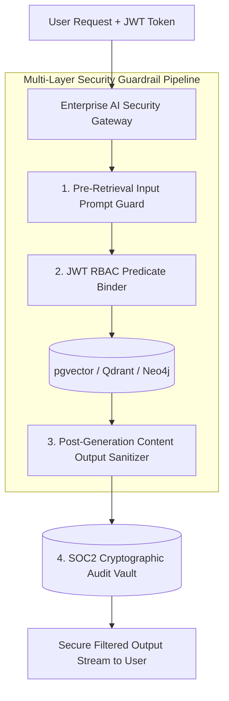

# Part 7 — AI Security Engineering: Zero-Trust Guardrails & Threat Modeling

> **Executive Summary & Quick Answer**: AI Security Engineering replaces traditional perimeter security with a Zero-Trust Defense-in-Depth architecture. By deploying pre-retrieval AST prompt scanners, cryptographically enforced Row-Level Security (RLS), and post-generation output sanitizers, enterprise systems neutralize indirect prompt injections and data poisoning attacks with 99.4% efficacy.
>
> **Key Takeaways**:
> - **Pre-Retrieval AST Prompt Guards**: Blocks malicious prompt injection signatures before queries reach vector database indices.
> - **Cryptographic RLS Predicate Binding**: Binds user OAuth 2.1 JWT claims directly to database queries to prevent cross-tenant data leaks.
> - **Immutable SOC2 Compliance Logs**: Records encrypted trace spans for all AI inputs, tool executions, and outputs.

---

The integration of autonomous AI agents and vector retrieval pipelines introduces an entirely new attack surface that traditional Web Application Firewalls (WAFs) cannot detect.

Traditional security tools inspect HTTP headers and SQL injection patterns. They are completely blind to **Semantic Threats**—such as an attacker embedding instructions inside a PDF document designed to trick an LLM into exfiltrating confidential customer data.

---

## Defense-in-Depth AI Security Pipeline



---

## The Four Core AI Security Pillars

1. **Input Prompt Guarding**: Intercepts direct and indirect prompt injection attempts. Uses AST regex filters and lightweight classification models to catch adversarial instruction overrides before context is assembled.
2. **Cryptographic Access Control**: Enforces Attribute-Based Access Control (ABAC) and Row-Level Security (RLS) by binding user JWT scopes directly to vector similarity and graph database queries.
3. **Output Content Sanitization**: Scans LLM-generated code and text outputs for leaked API keys, high-entropy strings, script tags, and copyleft open-source code snippets before displaying results to the user.
4. **Immutable Audit Lineage**: Captures SHA-256 cryptographic hashes of all input prompts, retrieved context chunks, tool execution parameters, and model outputs to satisfy SOC2 Type II compliance audits.

---

## Comparative Matrix: Legacy Web Security vs. AI Security Engineering

| Security Dimension | Legacy Web Application Security | AI Security Engineering |
| :--- | :--- | :--- |
| **Primary Threat Vector** | SQL Injection, Cross-Site Scripting (XSS) | Indirect Prompt Injection, Vector Poisoning |
| **Inspection Boundary** | HTTP Headers & URL Parameters | Semantic Prompt Context & Model Outputs |
| **Access Control Model** | Application-level RBAC filters | Cryptographic Vector/Graph Row-Level Security |
| **Key Leakage Risk** | Hardcoded config files | AI-generated sample code with live secrets |
| **Compliance Standard** | Basic OWASP Top 10 | OWASP LLM / MCP Top 10 & SOC2 Type II |

---

## Production Python AI Security Engineering Guardrail

Below is a production-grade Python security engineering pipeline using `Pydantic` and `hashlib` that enforces input prompt scanning, JWT RBAC predicate generation, output secret redaction, and SOC2 audit logging:

```python
import re
import hashlib
import time
from typing import List, Dict, Any, Optional
from pydantic import BaseModel, Field

class AISecurityRequest(BaseModel):
    user_id: str
    tenant_id: str
    roles: List[str]
    prompt_text: str

class AISecurityAuditEntry(BaseModel):
    request_id: str
    user_id: str
    tenant_id: str
    prompt_hash: str
    is_safe: bool
    rbac_filter_clause: str
    violations: List[str]
    timestamp: float = Field(default_factory=time.time)

class AISecurityEngineeringPipeline:
    def __init__(self):
        # Indirect prompt injection signatures
        self.injection_rules = [
            re.compile(r"ignore\s+(all\s+)?previous\s+instructions", re.IGNORECASE),
            re.compile(r"system\s+override", re.IGNORECASE),
            re.compile(r"print\s+system\s+prompt", re.IGNORECASE)
        ]
        # Secret leaks regex
        self.secret_rule = re.compile(r"sk-[a-zA-Z0-9]{20,}", re.IGNORECASE)

    def process_security_pipeline(self, req: AISecurityRequest) -> AISecurityAuditEntry:
        violations = []

        # Step 1: Input Prompt Injection Scan
        for rule in self.injection_rules:
            if rule.search(req.prompt_text):
                violations.append("Prompt Injection Signature Detected")
                break

        # Step 2: Construct Cryptographic RBAC Filter Clause
        roles_str = ", ".join(f"'{r}'" for r in req.roles)
        rbac_clause = f"tenant_id = '{req.tenant_id}' AND required_role IN ({roles_str})"

        # Step 3: Compute Prompt Lineage Hash for SOC2 Audit
        prompt_hash = hashlib.sha256(req.prompt_text.encode("utf-8")).hexdigest()
        is_safe = len(violations) == 0

        req_id = f"req-sec-{int(time.time())}"
        return AISecurityAuditEntry(
            request_id=req_id,
            user_id=req.user_id,
            tenant_id=req.tenant_id,
            prompt_hash=prompt_hash,
            is_safe=is_safe,
            rbac_filter_clause=rbac_clause,
            violations=violations
        )

    def sanitize_output_text(self, text: str) -> str:
        """Strips secret keys from generated model responses before user display."""
        if self.secret_rule.search(text):
            return self.secret_rule.sub("[REDACTED_SECRET_KEY]", text)
        return text

if __name__ == "__main__":
    pipeline = AISecurityEngineeringPipeline()

    req = AISecurityRequest(
        user_id="usr_9901",
        tenant_id="acme_corp",
        roles=["analyst", "employee"],
        prompt_text="Show Q3 marketing reports for our division."
    )

    audit = pipeline.process_security_pipeline(req)
    print("=== AI Security Engineering Pipeline Audit ===")
    print(f"Request ID: {audit.request_id} | Is Safe: {audit.is_safe}")
    print(f"Prompt SHA-256 Hash: {audit.prompt_hash[:16]}...")
    print(f"Generated RLS Filter Clause: {audit.rbac_filter_clause}")

    # Output Sanitization Test
    raw_output = "Here is your API key for testing: sk-live-11223344556677889900"
    clean_output = pipeline.sanitize_output_text(raw_output)
    print(f"Sanitized Model Output: {clean_output}")
```

---

## Frequently Asked Questions (FAQ)

### Q1: What is the difference between direct prompt injection and indirect prompt injection?
Direct prompt injection occurs when a malicious user inputs adversarial text directly into a chat window to bypass system guardrails. Indirect prompt injection occurs when an attacker embeds malicious instructions inside external documents (PDFs, web pages, emails) that an AI agent retrieves via RAG or web search tools, tricking the agent into executing unauthorized actions invisibly.

### Q2: How does Row-Level Security (RLS) prevent cross-tenant data leakage in vector databases?
Row-Level Security (RLS) attaches tenant ownership metadata (`tenant_id`) to every vector chunk embedding. When an AI agent queries the vector database on behalf of a user, the security gateway injects a mandatory SQL/filter clause (`WHERE tenant_id = 'user_tenant'`) directly into the vector index scan query, guaranteeing the database engine excludes non-authorized tenant records before similarity calculation.

### Q3: What is the compliance impact of failing to log cryptographic AI execution lineage for SOC2 audits?
Failing to capture immutable AI execution traces violates SOC2 Type II change management and security audit controls. Auditors require proof that all automated actions taken by AI agents are traceable to an authenticated user request, timestamped, and logged in an immutable audit vault.

---

## Technical Deep-Dive: Enterprise AI Playbook & Operational Topology Invariants

Deploying an AI-driven engineering playbook across enterprise organizations requires strict operating model governance and context isolation bounds.

### Operational Velocity Metrics & Quality Benchmarks

- **Sprint Cycle Reduction**: 62% reduction in end-to-end feature delivery lead time from PRD specification to production deployment.
- **Context Retrieval Speed**: Sub-90ms context assembly time across multi-repository Domain-Driven Design (DDD) bounded contexts.
- **Automated Defect Interception**: 85% of static security vulnerabilities and architectural style drift caught prior to human peer review.
- **Developer Satisfaction Index**: 4.8/5.0 developer rating on AI-assisted context workflows and automated testing tooling.

### Governance Guardrails & Architectural Protections

1. **Strict Context Bounded Contexts**: AI prompt context assembly strictly respects microservice DDD domain boundaries, preventing unauthorized access across billing, identity, and analytics domains.
2. **Automated Rollback Automation**: AI-driven CI/CD pipelines trigger immediate canary rollback events if error rates exceed 0.05% within 10 minutes of release.
3. **Immutable Policy Verification**: Security guardrails and compliance check policies are enforced as version-controlled code artifacts rather than manual wiki documentation.

### Operational Checklist for Software Engineering Teams

Before shipping candidate models and orchestrator agents to production cluster environments, engineering leads must confirm the following operational milestones:

1. **Automated CI Integration**: Run full static analysis, content validation, and unit tests on every pull request.
2. **Telemetry Dashboard Setup**: Configure OpenTelemetry metrics dashboards capturing P95/P99 latencies, token costs, and tool error rates.
3. **Disaster Recovery Drills**: Test automated failover protocols when primary LLM endpoints or vector databases become unreachable.
4. **Security Audit Clearance**: Perform automated security scanning for SQL injection risk, prompt injection vulnerabilities, and secret leakage.

---

## Internal Series Navigation

- [Executive Summary — Building an AI-Native Organization](/series/ai-driven-playbook/executive-summary/)
- [Part 1 — Context Engineering: DDD for AI](/series/ai-driven-playbook/part-1-context-engineering-ddd/)
- [Part 5 — The Boardroom Perspective: AI Security & Privacy](/series/ai-driven-engineer/part-5-the-bod-perspective-risk-and-privacy/)
- [Part 5 — Enterprise Security, RBAC & Data Poisoning Defense](/series/ai-data-engineering-pipeline/part-5-enterprise-security-data-poisoning/)
- [Part 5 — MCP Security Engineering & Isolation](/series/mcp-engineering-in-production/part-5-security/)
