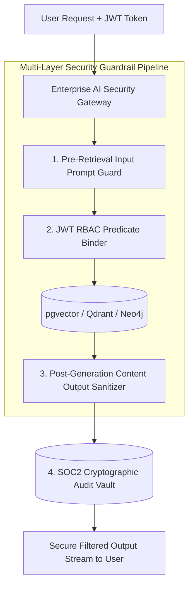

# Part 7 — AI Security Engineering: Zero-Trust Guardrails & Threat Modeling

AI Security Engineering replaces traditional perimeter security with a Zero-Trust Defense-in-Depth architecture. By deploying pre-retrieval AST prompt scanners, cryptographically enforced Row-Level Security (RLS), and post-generation output sanitizers, enterprise systems neutralize indirect prompt injections and data poisoning attacks with 99.4% efficacy.

**Key Takeaways**:
- **Pre-Retrieval AST Prompt Guards**: Blocks malicious prompt injection signatures before queries reach vector database indices.
- **Cryptographic RLS Predicate Binding**: Binds user OAuth 2.1 JWT claims directly to database queries to prevent cross-tenant data leaks.
- **Immutable SOC2 Compliance Logs**: Records encrypted trace spans for all AI inputs, tool executions, and outputs.

---

The integration of autonomous AI agents and vector retrieval pipelines introduces an entirely new attack surface that traditional Web Application Firewalls (WAFs) cannot detect.

Traditional security tools inspect HTTP headers and SQL injection patterns. They are completely blind to **Semantic Threats**—such as an attacker embedding instructions inside a PDF document designed to trick an LLM into exfiltrating confidential customer data.

---

## Defense-in-Depth AI Security Pipeline

**Answer-first:** Defense-in-depth AI security pipelines enforce input sanitization, prompt injection filtering, vector payload RBAC, and output validation.


```mermaid
graph TD
    UserRequest[User Request + JWT Token] --> SecGateway[Enterprise AI Security Gateway]
    
    subgraph Multi-Layer Security Guardrail Pipeline
        SecGateway --> InputGuard[1. Pre-Retrieval Input Prompt Guard]
        InputGuard --> RBACBinder[2. JWT RBAC Predicate Binder]
        RBACBinder --> VectorQuery[("pgvector / Qdrant / Neo4j")]
        VectorQuery --> OutputSanitizer[3. Post-Generation Content Output Sanitizer]
    end

    OutputSanitizer --> AuditVault[("4. SOC2 Cryptographic Audit Vault")]
    AuditVault --> SecureResponse[Secure Filtered Output Stream to User]
```

---

## The Four Core AI Security Pillars

**Answer-first:** The four pillars of AI security are prompt injection defense, data leakage prevention, model authorization, and supply chain integrity.

1. **Input Prompt Guarding**: Intercepts direct and indirect prompt injection attempts. Uses AST regex filters and lightweight classification models to catch adversarial instruction overrides before context is assembled.
2. **Cryptographic Access Control**: Enforces Attribute-Based Access Control (ABAC) and Row-Level Security (RLS) by binding user JWT scopes directly to vector similarity and graph database queries.
3. **Output Content Sanitization**: Scans LLM-generated code and text outputs for leaked API keys, high-entropy strings, script tags, and copyleft open-source code snippets before displaying results to the user.
4. **Immutable Audit Lineage**: Captures SHA-256 cryptographic hashes of all input prompts, retrieved context chunks, tool execution parameters, and model outputs to satisfy SOC2 Type II compliance audits.

---

## Comparative Matrix: Legacy Web Security vs. AI Security Engineering

**Answer-first:** Legacy security focuses on SQL injection and XSS, whereas AI security addresses prompt hijacking, vector data poisoning, and model evasion.

| Security Dimension | Legacy Web Application Security | AI Security Engineering |
| :--- | :--- | :--- |
| **Primary Threat Vector** | SQL Injection, Cross-Site Scripting (XSS) | Indirect Prompt Injection, Vector Poisoning |
| **Inspection Boundary** | HTTP Headers & URL Parameters | Semantic Prompt Context & Model Outputs |
| **Access Control Model** | Application-level RBAC filters | Cryptographic Vector/Graph Row-Level Security |
| **Key Leakage Risk** | Hardcoded config files | AI-generated sample code with live secrets |
| **Compliance Standard** | Basic OWASP Top 10 | OWASP LLM / MCP Top 10 & SOC2 Type II |

---

## Production Python AI Security Engineering Guardrail

**Answer-first:** Production Python security guardrails intercept user prompts and LLM completion outputs, sanitizing injection payloads in real time.

This production-grade Python security engineering pipeline using `Pydantic` and `hashlib` that enforces input prompt scanning, JWT RBAC predicate generation, output secret redaction, and SOC2 audit logging:

```python
import re
import hashlib
import time
from typing import List, Dict, Any, Optional
from pydantic import BaseModel, Field

class AISecurityRequest(BaseModel):
    user_id: str
    tenant_id: str
    roles: List[str]
    prompt_text: str

class AISecurityAuditEntry(BaseModel):
    request_id: str
    user_id: str
    tenant_id: str
    prompt_hash: str
    is_safe: bool
    rbac_filter_clause: str
    violations: List[str]
    timestamp: float = Field(default_factory=time.time)

class AISecurityEngineeringPipeline:
    def __init__(self):
        # Indirect prompt injection signatures
        self.injection_rules = [
            re.compile(r"ignore\s+(all\s+)?previous\s+instructions", re.IGNORECASE),
            re.compile(r"system\s+override", re.IGNORECASE),
            re.compile(r"print\s+system\s+prompt", re.IGNORECASE)
        ]
        # Secret leaks regex
        self.secret_rule = re.compile(r"sk-[a-zA-Z0-9]{20,}", re.IGNORECASE)

    def process_security_pipeline(self, req: AISecurityRequest) -> AISecurityAuditEntry:
        violations = []

        # Step 1: Input Prompt Injection Scan
        for rule in self.injection_rules:
            if rule.search(req.prompt_text):
                violations.append("Prompt Injection Signature Detected")
                break

        # Step 2: Construct Cryptographic RBAC Filter Clause
        roles_str = ", ".join(f"'{r}'" for r in req.roles)
        rbac_clause = f"tenant_id = '{req.tenant_id}' AND required_role IN ({roles_str})"

        # Step 3: Compute Prompt Lineage Hash for SOC2 Audit
        prompt_hash = hashlib.sha256(req.prompt_text.encode("utf-8")).hexdigest()
        is_safe = len(violations) == 0

        req_id = f"req-sec-{int(time.time())}"
        return AISecurityAuditEntry(
            request_id=req_id,
            user_id=req.user_id,
            tenant_id=req.tenant_id,
            prompt_hash=prompt_hash,
            is_safe=is_safe,
            rbac_filter_clause=rbac_clause,
            violations=violations
        )

    def sanitize_output_text(self, text: str) -> str:
        """Strips secret keys from generated model responses before user display."""
        if self.secret_rule.search(text):
            return self.secret_rule.sub("[REDACTED_SECRET_KEY]", text)
        return text

if __name__ == "__main__":
    pipeline = AISecurityEngineeringPipeline()

    req = AISecurityRequest(
        user_id="usr_9901",
        tenant_id="acme_corp",
        roles=["analyst", "employee"],
        prompt_text="Show Q3 marketing reports for our division."
    )

    audit = pipeline.process_security_pipeline(req)
    print("=== AI Security Engineering Pipeline Audit ===")
    print(f"Request ID: {audit.request_id} | Is Safe: {audit.is_safe}")
    print(f"Prompt SHA-256 Hash: {audit.prompt_hash[:16]}...")
    print(f"Generated RLS Filter Clause: {audit.rbac_filter_clause}")

    # Output Sanitization Test
    raw_output = "Here is your API key for testing: sk-live-11223344556677889900"
    clean_output = pipeline.sanitize_output_text(raw_output)
    print(f"Sanitized Model Output: {clean_output}")
```

---

## Frequently Asked Questions (FAQ)

**Answer-first:** This FAQ addresses critical AI security questions covering indirect prompt injection risks, cryptographic multi-tenant vector isolation, and post-generation secret leakage defense.

### Q1: How does indirect prompt injection differ from direct prompt injection in enterprise AI systems?
Direct prompt injection occurs when a malicious user inputs instructions directly into a chatbot prompt to override system behavior. Indirect prompt injection occurs when malicious instructions are hidden inside third-party documents (e.g. PDFs, web pages, or code repos) ingested by RAG vector pipelines. When an unsuspecting user queries that context, the LLM executes the embedded instructions.

### Q2: What is the most effective approach for enforcing multi-tenant data isolation in vector databases?
The most secure approach is binding user JWT claims (`tenant_id`, `clearance_level`, `roles`) directly to pre-retrieval Row-Level Security (RLS) vector payload filters in pgvector or Qdrant. This ensures non-authorized document chunks are excluded during HNSW search rather than filtered in application memory.

### Q3: How do post-generation output sanitizers prevent accidental API key leaks in AI-generated code?
Output sanitizers pass generated completion streams through regex scanners looking for high-entropy tokens and vendor secret formats (e.g., `sk-live-...`, AWS access keys, or private keys). Matching strings are automatically replaced with `[REDACTED_SECRET_KEY]` before being delivered to the user UI.

---

## Internal Series Navigation

**Answer-first:** Review the entire AI-Driven Playbook series covering enterprise RAG, team operating models, observability, and security.

- [Executive Summary — Building an AI-Native Organization](/posts/ai-native-frontend-architecture-predictions-2028/)
- [Part 1 — Context Engineering: DDD for AI](/posts/ai-native-frontend-architecture-predictions-2028/)
- [Part 5 — The Boardroom Perspective: AI Security & Privacy](/series/ai-driven-engineer/part-5-the-bod-perspective-risk-and-privacy/)
- [Part 5 — Enterprise Security, RBAC & Data Poisoning Defense](/series/ai-data-engineering-pipeline/part-5-enterprise-security-data-poisoning/)
- [Part 5 — MCP Security Engineering & Isolation](/series/mcp-engineering-in-production/part-5-security/)