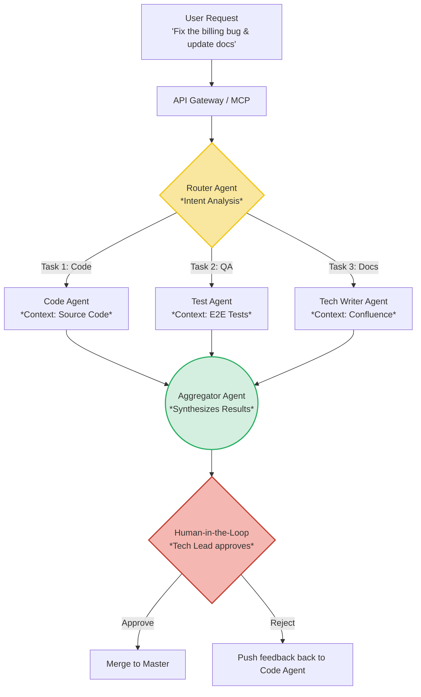

From [Part 1](/series/ai-driven-playbook/part-1-context-engineering-ddd/) through [Part 7](/series/ai-driven-playbook/part-7-ai-security-engineering/), we have systematically assembled all the puzzle pieces: *Context, Gateway, Data, CI/CD, Process, Monitoring, and Security*.

But stopping there means your organization is still merely "bolting on" AI to an aging software system. The ultimate **End-game** of this transformation is: **Rebuilding the entire company (and Backend system) with AI machines at its center.**

This is where we discuss **AI-Native System Architecture**.

## 1. The End of Synchronous Architecture (The Synchronous Anti-pattern)

In traditional Web architecture, a user clicks a button and the system calls a REST API (Synchronous), waiting a few dozen milliseconds for a result.

> **[Production Failure]: User Experience Collapses**
> When integrating AI, a single LLM call (with Tool invocations) can take 10 to 45 seconds. Under a Synchronous architecture (REST API request-response), the HTTP connection times out. The User's screen spins indefinitely (loading) and throws a 504 Gateway Timeout error.
> 📊 **Impact Metrics:** Churn rate spiked 25% due to terrible UX; thousands of sessions were broken mid-flow.
> 📈 **Before/After (Post Event-Driven Architecture):**
> - **Before:** API Timeout threshold at 30s. Maximum concurrency of 50 requests/s.
> - **After:** Streaming via Server-Sent Events (SSE) brings TTFT (Time-to-First-Token) to <800ms. Concurrency scales to 5,000+ requests/s via the Kafka Message Broker pipeline.

**Solution: Event-Driven AI Workflows (Async Orchestration).**
An AI-Native Backend must be designed around Async Orchestration. When a User sends a request, the API immediately returns a `Task_ID`. Behind the scenes, AI Agents pick up Jobs from the Message Broker (Kafka/RabbitMQ), analyze, invoke Tools, and stream progress via WebSockets (or Server-Sent Events - SSE) to the User's screen.

---

## 2. AI-Ready Microservices & Model Context Protocol (MCP)

Your existing Microservices were designed to serve UIs (Frontends). They return JSON packed with paginated data, display-color metadata, and so on.

AI Agents don't need any of that. AI requires **Semantic Density** and the ability to manipulate tools.

**The Rise of Model Context Protocol (MCP):**
Instead of writing hardcoded glue code to connect internal APIs to LLMs, Architects now deploy **MCP Servers**.
MCP provides an open communication standard. When an Agent needs to read a Jira ticket or query a Database, it communicates via MCP. This achieves **Complete Decoupling** between the Intelligence layer (LLM) and the Data layer (Tools).

**Snippet: Setting up an MCP Server in Python (FastMCP)**
```python
from mcp.server.fastmcp import FastMCP

# Initialize the internal MCP Server
mcp = FastMCP("Internal_Jira_Server")

# Expose a Tool that an AI Agent (LLM) can automatically discover and invoke
@mcp.tool()
def get_jira_ticket(ticket_id: str) -> str:
    """Fetch the detailed content of a Jira ticket by ID (e.g., PROJ-123)"""
    # Backend logic calls the internal Database/API. Agent has zero visibility into Credentials.
    return fetch_from_internal_jira(ticket_id)

if __name__ == "__main__":
    # Server runs independently; Agent connects via StdIO or SSE
    mcp.run()
```

---

## 3. Memory Architecture

An LLM is inherently *Stateless*. An excellent AI-Native system must be able to "remember" a user's context not just within the current session, but across months of interaction.

The Backend must build a dedicated **Memory Architecture**:
*   **Short-term Memory (Working Memory):** Stored in RAM (Redis). Retains the recent conversation chain and temporary variables for the currently running Task.
*   **Long-term Memory (Episodic Memory):** Stored in a VectorDB (Pinecone) or GraphDB (Neo4j). When an Agent completes a campaign, it autonomously summarizes "Lessons Learned" and "User Preferences," embedding them into Long-term Memory so future Agents can learn from past experience.

---

## 4. Multi-Agent Collaboration & Routing

In large-scale organizations, no single "Super Agent" (Monolithic Prompt) can handle everything. Divide and conquer (Decomposition).



*   **Router Agent:** Acts like a Department Head. It receives a Request, breaks it into 3 sub-tasks, and delegates them to 3 specialized Agents.
*   **Specialization:** The Code Agent only has access to GitHub; the Docs Agent only has access to Confluence. This elegantly enforces the *Least Privilege* principle from Part 7.
*   **Human-in-the-Loop (HITL):** There is always a final checkpoint where a human (Tech Lead) enters the loop to make high-stakes, directional decisions.

---

## 5. Troubleshooting: Diagnosing "Agent Deadlock"

Multi-Agent architectures are extremely powerful, but without proper control, they will destroy each other.

> 🛠️ **Troubleshooting: Multi-Agent Deadlock (Infinite Loop)**
> - **Symptom:** Agent A asks Agent B for data. Agent B doesn't understand the context and questions Agent A back. Both are locked in an infinite chat loop, burning thousands of tokens per second.
> - **Root Cause:** Agents communicate freely without structure and with no circuit-breaker mechanism (Timeout/Max turns) configured.
> - **Actionable Solution:**
>   1. **Configure `max_iterations`:** Set a hard loop limit (e.g., `max_turns = 5`). If exceeded, force throw an Exception and escalate to the User (Human-in-the-Loop).
>   2. **Structured Outputs:** Force all Agents to respond and delegate only in pure JSON format—never via open-ended conversation.

---

## SERIES CONCLUSION: The Era of the Principal Engineer

Welcome to the end of **The AI-Driven Engineer** Playbook.

Looking back at the complete picture, you can clearly see the monumental shift in the software industry:
*   We escaped the shadow of "Code Typists" through **Context Engineering (Part 1)**.
*   We seized financial and infrastructure control via the **Private AI Gateway (Part 2)**.
*   We built the most accurate data "Brain" with **Enterprise RAG (Parts 3A & 3B)**.
*   We eliminated technical debt through **Policy-as-Code (Part 4)** and a **new Operating Model (Part 5)**.
*   And finally, we operate it all in absolute safety thanks to **Observability (Part 6)** and **Security (Part 7)**.

The AI era does not destroy software engineers. It only filters out the complacent and the rigid. As the ability to write code (syntax) becomes a cheap commodity, **Systems Architecture thinking, Data Governance capabilities, and Risk Management skills** become the weapons that position your value at the Principal/Staff Engineer level.

The future belongs to those who know how to **Orchestrate the machines**. Are you ready to become one of them?
