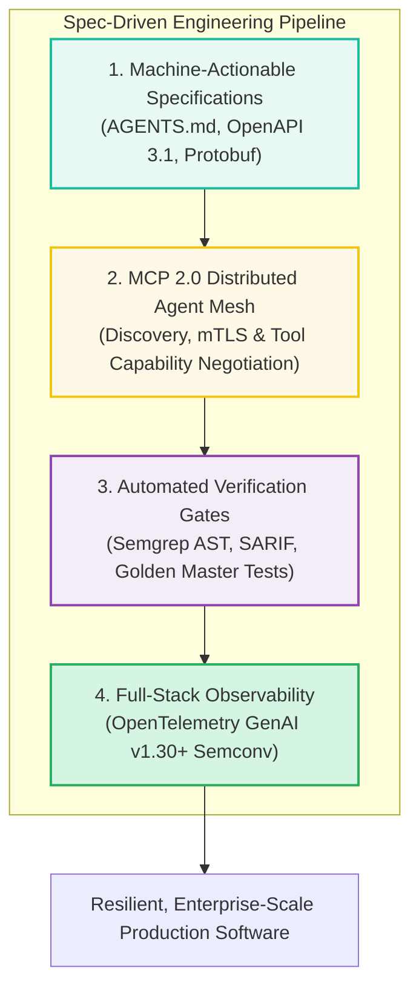
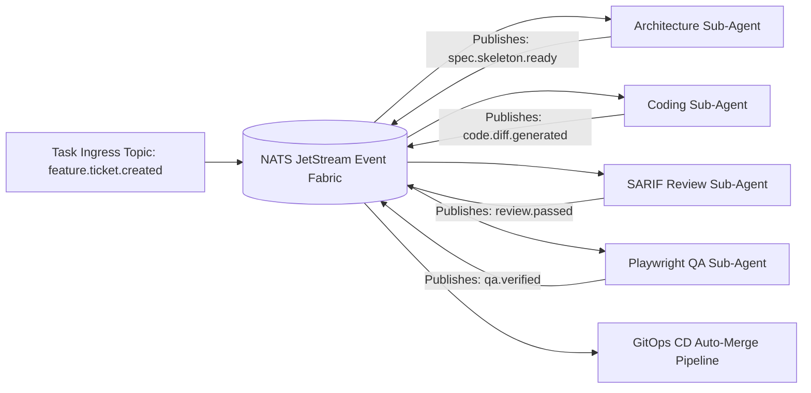

> **Answer-first:** The **Grand Finale** of the AI-Driven Playbook unites every foundational concept—Domain-Driven Design context boundaries, Private Gateways, MCP 2.0 tool meshes, SARIF review gates, and OpenTelemetry observability—into an **Event-Driven Multi-Agent Architecture**. By decoupling agents via asynchronous message buses (NATS JetStream / Kafka) rather than synchronous REST APIs, enterprises eliminate cascade deadlocks and achieve fault-tolerant agentic scale.

---

[📖 Bản tiếng Việt (Vietnamese Edition)](https://learn.tanhdev.com/series/ai-driven-playbook/part-8-ai-native-system-architecture/) | [← Series Hub](/series/ai-driven-playbook/)

---

## 1. From "Vibe Coding" to Spec-Driven Quality Engineering

As we conclude this 14-chapter journey across the **AI-Driven Playbook 2026**, the industry stands at a clear fork in the road:

On one path lies **"Vibe Coding"**—developers blindly accepting unverified LLM autocompletions, copy-pasting monolithic prompts, and accumulating unmaintainable architectural debt that will paralyze organizations within 18 months.

On the other path lies **Spec-Driven Quality Engineering**—architects curating machine-actionable domain models, structuring invariant contracts, and orchestrating specialized agent swarms operating behind rigorous, automated verification gates:


```mermaid
flowchart TD
    subgraph SpecDriven ["Spec-Driven Engineering Pipeline"]
        Spec["1. Machine-Actionable Specifications<br/>(AGENTS.md, OpenAPI 3.1, Protobuf)"]
        Mesh["2. MCP 2.0 Distributed Agent Mesh<br/>(Discovery, mTLS & Tool Capability Negotiation)"]
        Gate["3. Automated Verification Gates<br/>(Semgrep AST, SARIF, Golden Master Tests)"]
        Telemetry["4. Full-Stack Observability<br/>(OpenTelemetry GenAI v1.30+ Semconv)"]
    end

    Spec --> Mesh --> Gate --> Telemetry
    Telemetry --> Output["Resilient, Enterprise-Scale Production Software"]

    style Spec fill:#e8f8f5,stroke:#1abc9c,stroke-width:2px
    style Mesh fill:#fef9e7,stroke:#f1c40f,stroke-width:2px
    style Gate fill:#f4ecf7,stroke:#8e44ad,stroke-width:2px
    style Telemetry fill:#d5f5e3,stroke:#27ae60,stroke-width:2px
```

---

## 2. The Synchronous REST Anti-Pattern in Multi-Agent Systems

A critical architectural pitfall in multi-agent design is chaining agents together using synchronous HTTP/REST calls (`Agent A -> HTTP POST -> Agent B -> HTTP POST -> Agent C`).

In production, synchronous agent chains suffer from catastrophic failure modes:
1. **Compounding Latency**: If each reasoning turn takes 3–5 seconds, a 5-agent synchronous chain experiences a 25-second P99 latency, causing upstream client timeouts.
2. **Circular Deadlocks**: If Agent A requires output from Agent B, while Agent B invokes an MCP tool owned by Agent A, both threads freeze permanently.
3. **Cascading Failures**: A single rate-limit error or token exhaustion event on Agent C collapses the entire synchronous call tree.

### The Solution: Event-Driven Asynchronous Agent Mesh

Enterprise systems decouple agent swarms via an **Event-Driven Choreography Architecture (NATS JetStream / Kafka)**:


```mermaid
flowchart LR
    Ingress["Task Ingress Topic: feature.ticket.created"] --> Bus[("NATS JetStream Event Fabric")]
    
    Bus --> AgentArch["Architecture Sub-Agent"]
    AgentArch -->|"Publishes: spec.skeleton.ready"| Bus
    
    Bus --> AgentCode["Coding Sub-Agent"]
    AgentCode -->|"Publishes: code.diff.generated"| Bus
    
    Bus --> AgentReview["SARIF Review Sub-Agent"]
    AgentReview -->|"Publishes: review.passed"| Bus
    
    Bus --> AgentQA["Playwright QA Sub-Agent"]
    AgentQA -->|"Publishes: qa.verified"| Bus
    
    Bus --> Deploy["GitOps CD Auto-Merge Pipeline"]
```

---

## 3. Production Event-Driven Go Agent Dispatcher

Below is a reference implementation demonstrating an asynchronous agent worker consuming tasks from a NATS JetStream subject and publishing verified outputs:

```go
package agentmesh

import (
	"context"
	"encoding/json"
	"fmt"

	"github.com/nats-io/nats.go"
	"github.com/nats-io/nats.go/jetstream"
)

type AgentTaskEvent struct {
	TaskID      string `json:"task_id"`
	TicketID    string `json:"ticket_id"`
	SpecPayload string `json:"spec_payload"`
}

type AgentResultEvent struct {
	TaskID    string `json:"task_id"`
	Status    string `json:"status"`
	CodeDiff  string `json:"code_diff"`
	PassedSAR bool   `json:"passed_sar"`
}

func StartAgentWorker(ctx context.Context, js jetstream.JetStream, consumerName string) error {
	cons, err := js.CreateOrUpdateConsumer(ctx, "AGENT_TASKS", jetstream.ConsumerConfig{
		Durable:   consumerName,
		AckPolicy: jetstream.AckExplicitPolicy,
	})
	if err != nil {
		return fmt.Errorf("failed to create consumer: %w", err)
	}

	iter, err := cons.Messages()
	if err != nil {
		return fmt.Errorf("failed to get messages iterator: %w", err)
	}

	go func() {
		for {
			msg, err := iter.Next()
			if err != nil {
				return
			}

			var task AgentTaskEvent
			if err := json.Unmarshal(msg.Data(), &task); err != nil {
				msg.Term() // Terminate poison pill message
				continue
			}

			// Execute autonomous reasoning loop
			result := processTaskWithReasoning(task)

			// Publish verified output to downstream topic
			resultData, _ := json.Marshal(result)
			js.Publish(ctx, "agent.results.completed", resultData)
			msg.Ack()
		}
	}()

	return nil
}

func processTaskWithReasoning(t AgentTaskEvent) AgentResultEvent {
	// Integrates with LiteLLM Gateway & MCP 2.0 tool endpoints
	return AgentResultEvent{
		TaskID:    t.TaskID,
		Status:    "SUCCESS",
		CodeDiff:  "// Verified production implementation",
		PassedSAR: true,
	}
}
```

---

## 4. The 2026 Engineering Transformation Matrix

The holistic evolution of software organizations completing the AI-Driven Playbook transformation:

| Engineering Dimension | Legacy 2024 Engineering Organization | AI-Native 2026 Engineering Organization |
| :--- | :---: | :---: |
| **Primary Unit of Production** | Individual human syntax typing | Multi-agent autonomous swarms & verified context |
| **Architecture Boundary Defense** | Verbal agreement in PR meetings | Machine-actionable `AGENTS.md` & OPA Rego policies |
| **Tool Calling & Integration** | Custom bespoke REST wrappers | Universal Model Context Protocol (MCP 2.0) |
| **Code Review Mechanism** | Manual line-by-line review bottleneck | Multi-agent LLM-as-a-Judge emitting SARIF in CI |
| **Testing Strategy** | Brittle CSS/XPath scripted E2E suites | Multimodal vision agents & mutation testing |
| **Observability & SRE** | Basic HTTP status codes & APM | OpenTelemetry GenAI (v1.30+) semantic conventions |
| **Team Topology** | 10-person siloed Scrum squads | 3–4 person high-velocity AI-Native Pods |
| **Delivery Velocity** | Bi-weekly release cycles | Continuous deployment (Multiple production releases/day) |

---

## 🏁 Final Conclusion: The Future Belongs to the Architects

Generative AI does not replace software engineers. It replaces engineers who only know how to type syntax with engineers who understand how to **architect systems, define invariant contracts, and govern autonomous intelligence.**

By deploying the eight technical pillars detailed across this Playbook, your engineering organization achieves the ultimate competitive moat: **building bulletproof, high-performance distributed systems at the speed of thought.**

---

## ❓ Frequently Asked Questions (FAQ)


Start with Pillar 1 and Pillar 2: (1) Deploy an internal LiteLLM AI Gateway with Redis Semantic Caching to control costs and establish visibility, and (2) Implement Domain-Driven Design Context Engineering by creating standardized `AGENTS.md` and `.cursor/rules/*.mdc` files across your highest-velocity repositories.



By utilizing directed acyclic graph (DAG) topic routing in NATS JetStream and attaching unique trace IDs with hop counters, message brokers drop or dead-letter any task that exceeds its maximum execution hop threshold, preventing infinite recursive agent invocations.



Shift your focus upstream into system design, contract specification, domain boundaries, security invariants, and continuous evaluation harness development. The ability to verify, test, and orchestrate autonomous systems is orders of magnitude more valuable than manual line-by-line coding.

