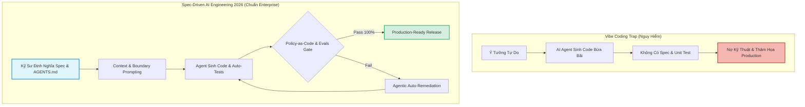
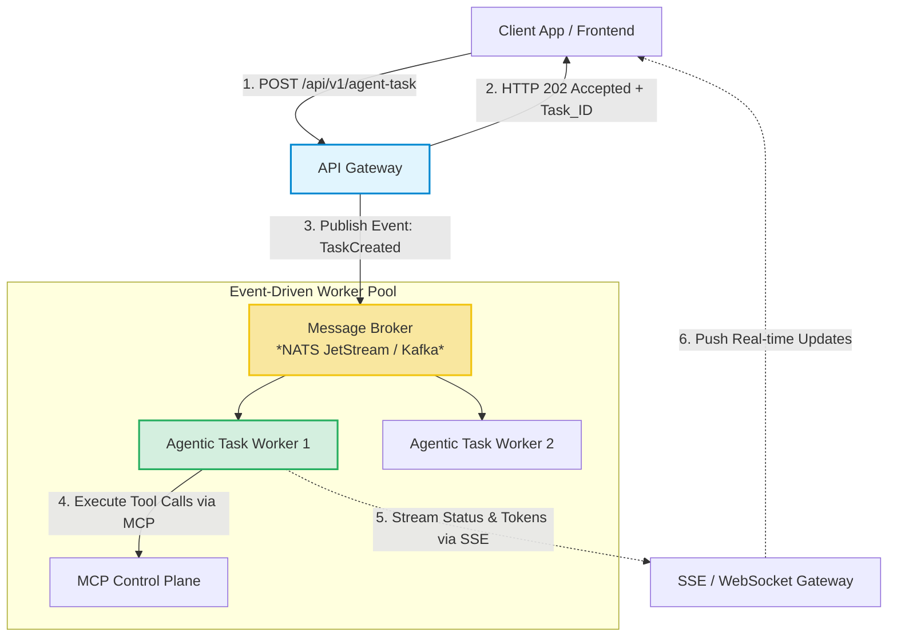
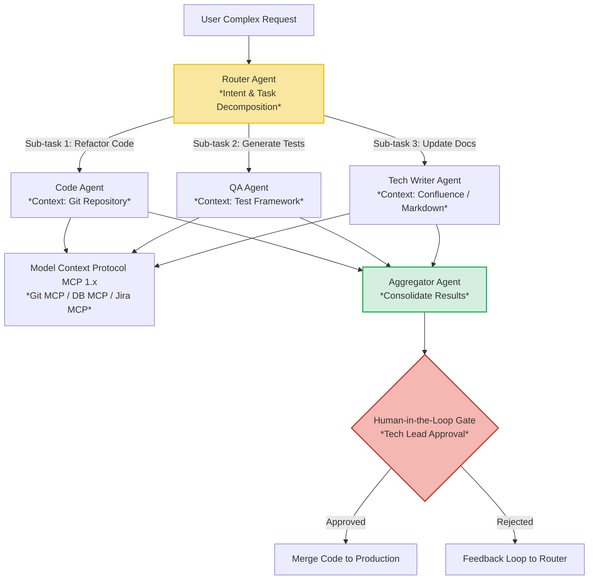

[← Chương trước: Phần 7: AI Security Engineering & Governance](/series/ai-driven-playbook/part-7-ai-security-engineering/) | [Mục lục Series](/series/ai-driven-playbook/)

---

> **Answer-first:** Đích đến của chuyển đổi AI-Native 2026 là tái cấu trúc hạ tầng phần mềm từ Synchronous sang Event-Driven Multi-Agent, kết hợp phương pháp Vibe Coding với Spec-Driven AI Engineering và văn hóa kiểm định chất lượng nghiêm ngặt nhằm duy trì lợi thế cạnh tranh dài hạn.

---

Từ [Phần 1: Context Engineering Cho AI-First SDLC](/series/ai-driven-playbook/part-1-context-engineering-ddd/) đến [Phần 7: AI Security Engineering & Cost Control](/series/ai-driven-playbook/part-7-ai-security-engineering/), chúng ta đã từng bước lắp ráp các mảnh ghép kỹ thuật quan trọng: *Ngữ cảnh, Gateway, Hạ tầng RAG, Agentic CI/CD, Operating Model, Observability và Security*.

Tuy nhiên, nếu chỉ dừng lại ở việc "gắn thêm" (add-on) các plugin AI vào một tổ chức và kiến trúc hạ tầng cũ kỹ, doanh nghiệp vẫn chưa thể tối ưu hóa tối đa năng lực cạnh tranh. Đích đến cuối cùng của quá trình chuyển đổi năm 2026 là: **Quy hoạch lại toàn bộ công ty và hệ thống hạ tầng xoay quanh mô hình AI-Native, đồng thời xây dựng một văn hóa kỹ thuật mới dựa trên Vibe Coding kết hợp Spec-Driven AI Engineering.**

---

## 1. Sự Tiến Hóa Văn Hóa: Từ 'Vibe Coding' Đến Spec-Driven & Quality Engineering

Năm 2026 chứng kiến sự bùng nổ của khái niệm **"Vibe Coding"** — mô hình nơi lập trình viên mô tả ý tưởng bằng ngôn ngữ tự nhiên và để các AI Agents (như Cursor, Windsurf hay Devin) tự động viết toàn bộ mã nguồn.

Tuy nhiên, trong môi trường Enterprise Production, **Vibe Coding thuần túy là một cái bẫy chết người**. Nếu thiếu sự dẫn dắt của các đặc tả kỹ thuật nghiêm ngặt (Specifications) và hệ thống kiểm tra chất lượng (Quality Engineering), Vibe Coding sẽ biến kho mã nguồn thành một "nối mớ bùi nhùi" (Spaghetti Code) chứa đầy nợ kỹ thuật và lỗi ẩn.


```mermaid
flowchart TD
    subgraph "Vibe Coding Trap (Nguy Hiểm)"
        Idea1["Ý Tưởng Tự Do"] --> AI1["AI Agent Sinh Code Bừa Bãi"]
        AI1 --> NoSpec["Không Có Spec & Unit Test"]
        NoSpec --> ProductionBug["Nợ Kỹ Thuật & Thảm Họa Production"]
    end
    
    subgraph "Spec-Driven AI Engineering 2026 (Chuẩn Enterprise)"
        Spec["Kỹ Sư Định Nghĩa Spec & AGENTS.md"] --> PromptEng["Context & Boundary Prompting"]
        PromptEng --> AgentGen["Agent Sinh Code & Auto-Tests"]
        AgentGen --> Gate{"Policy-as-Code & Evals Gate"}
        Gate -->|Pass 100%| Merge["Production-Ready Release"]
        Gate -->|Fail| SelfFix["Agentic Auto-Remediation"]
        SelfFix --> AgentGen
    end

    style ProductionBug fill:#f5b7b1,stroke:#c0392b,stroke-width:2px
    style Merge fill:#d4efdf,stroke:#27ae60,stroke-width:2px
    style Spec fill:#e1f5fe,stroke:#0288d1,stroke-width:2px
```

### Công Thức Văn Hóa Kỹ Thuật 2026: Vibe Coding + Spec-Driven Quality Engineering
Tổ chức thành công năm 2026 xây dựng văn hóa dựa trên 3 trụ cột:
1. **Spec-Driven AI Engineering:** Trước khi cho AI sinh ra bất kỳ dòng code nào, kỹ sư (vai trò Orchestrator) phải định nghĩa rõ ràng file hợp đồng giao diện, tài liệu kiến trúc (ADR) và ranh giới ngữ cảnh (`AGENTS.md`, `.cursorrules`). AI không tự đoán ý định của con người; AI thực thi dựa trên Spec.
2. **Rigorous Quality Engineering (Kỹ nghệ chất lượng nghiêm ngặt):** AI sinh code phải đi kèm với việc AI sinh ra bộ kiểm thử (Unit, Integration, E2E Tests). Mã nguồn chỉ được coi là hoàn tất (Definition of Done) khi tỷ lệ bao phủ kiểm thử (Test Coverage) đạt chuẩn và vượt qua rào chắn Static Analysis.
3. **Agentic Code Review:** Sử dụng các Multi-Agent Review Pipelines để tự động thẩm định mã nguồn theo các tiêu chí Security, Performance và Design Patterns trước khi con người bấm duyệt.

---

## 2. Dấu Chấm Hết Của Kiến Trúc Đồng Bộ (Synchronous REST API Anti-pattern)

Trong kiến trúc Web truyền thống, ứng dụng gọi REST API theo cơ chế đồng bộ (Synchronous Request-Response): Client gửi request, chờ vài chục mili-giây và nhận về JSON payload.

Tuy nhiên, trong một hệ thống AI-Native, một thao tác xử lý của AI Agent (bao gồm việc đọc dữ liệu, lập luận chuỗi tư duy Chain-of-Thought và gọi công cụ Tool Calling) có thể kéo dài từ **5 đến 60 giây**. Nếu tiếp tục duy trì kiến trúc REST đồng bộ, HTTP Connection sẽ lập tức bị Timeout, giao diện người dùng bị đứt gãy và trải nghiệm người dùng hoàn toàn sụp đổ.

> **[Production Failure Case Study]: Trải nghiệm người dùng sụp đổ do REST Timeout**
> Một công ty Fintech tích hợp AI Assistant vào ứng dụng tư vấn đầu tư. Hệ thống sử dụng REST API đồng bộ. Khi thị trường biến động mạnh, số lượng user truy vấn tăng gấp 5 lần. Các LLM call bị nghẽn làm thời gian phản hồi tăng lên 35 giây.
> 
> Hàng ngàn kết nối HTTP bị ngắt giữa chừng (504 Gateway Timeout). Khách hàng không nhận được kết quả nhưng tài khoản vẫn bị trừ Token Fee.
> 
> 📊 **Hậu quả (Impact Metrics):** Tỷ lệ người dùng rời bỏ ứng dụng (Churn Rate) tăng 28%, nhận 500+ ticket phàn nàn trong 24 giờ.
> 
> 📈 **Chỉ số Trước / Sau khi chuyển sang Event-Driven AI Architecture:**
> - **Time-to-First-Token (TTFT):** Giảm từ 35 giây (chờ cả response) xuống **< 450ms** nhờ luồng Server-Sent Events (SSE) streaming token real-time.
> - **Khả năng chịu tải (Concurrency):** Tăng từ 80 requests/s lên **6,500+ requests/s** nhờ Message Broker (NATS JetStream / Kafka).

### Giải Pháp: Event-Driven AI Workflows (Luồng Sự Kiện Dị Bộ)
Hạ tầng Backend AI-Native được quy hoạch theo kiến trúc **Async Event-Driven Orchestration**:
- Khi Client gửi yêu cầu, API Gateway nhận request và trả về ngay lập tức mã `Task_ID` kèm HTTP 202 Accepted.
- Yêu cầu được đẩy vào Message Broker (Kafka / NATS JetStream).
- Các AI Worker Agents lấy Job từ Queue, cặm cụi thực thi logic, gọi MCP Tools, và stream kết quả real-time về cho Client thông qua giao thức **Server-Sent Events (SSE)** hoặc **WebSockets**.


```mermaid
flowchart TD
    Client["Client App / Frontend"] -->|1. POST /api/v1/agent-task| Gateway["API Gateway"]
    Gateway -->|2. HTTP 202 Accepted + Task_ID| Client
    
    Gateway -->|3. Publish Event: TaskCreated| NATS["Message Broker<br>*NATS JetStream / Kafka*"]
    
    subgraph "Event-Driven Worker Pool"
        NATS --> Worker1["Agentic Task Worker 1"]
        NATS --> Worker2["Agentic Task Worker 2"]
        
        Worker1 -->|4. Execute Tool Calls via MCP| MCPServer["MCP Control Plane"]
    end
    
    Worker1 -.->|5. Stream Status & Tokens via SSE| SSEGateway["SSE / WebSocket Gateway"]
    SSEGateway -.->|6. Push Real-time Updates| Client

    style Gateway fill:#e1f5fe,stroke:#0288d1,stroke-width:2px
    style NATS fill:#f9e79f,stroke:#f1c40f,stroke-width:2px
    style Worker1 fill:#d4efdf,stroke:#27ae60,stroke-width:2px
```

---

## 3. Kiến Trúc Multi-Agent Collaboration & MCP Control Plane

Trong các ứng dụng doanh nghiệp phức tạp, không một "Monolithic Prompt" hay một "Siêu Agent" đơn lẻ nào có thể giải quyết tốt mọi công việc. Mô hình tối ưu năm 2026 áp dụng nguyên lý **Phân Rã Trách Nhiệm (Decomposition)** thành một mạng lưới **Multi-Agent Collaboration**:


```mermaid
flowchart TD
    UserRequest["User Complex Request"] --> RouterAgent["Router Agent<br>*Intent & Task Decomposition*"]
    
    RouterAgent -->|Sub-task 1: Refactor Code| CodeAgent["Code Agent<br>*Context: Git Repository*"]
    RouterAgent -->|Sub-task 2: Generate Tests| QAAgent["QA Agent<br>*Context: Test Framework*"]
    RouterAgent -->|Sub-task 3: Update Docs| DocsAgent["Tech Writer Agent<br>*Context: Confluence / Markdown*"]
    
    CodeAgent --> MCPServers["Model Context Protocol MCP 1.x<br>*Git MCP / DB MCP / Jira MCP*"]
    QAAgent --> MCPServers
    DocsAgent --> MCPServers
    
    CodeAgent --> Aggregator["Aggregator Agent<br>*Consolidate Results*"]
    QAAgent --> Aggregator
    DocsAgent --> Aggregator
    
    Aggregator --> HITLGate{"Human-in-the-Loop Gate<br>*Tech Lead Approval*"}
    HITLGate -->|Approved| GitCommit["Merge Code to Production"]
    HITLGate -->|Rejected| FeedbackLoop["Feedback Loop to Router"]

    style RouterAgent fill:#f9e79f,stroke:#f1c40f,stroke-width:2px
    style Aggregator fill:#d4efdf,stroke:#27ae60,stroke-width:2px
    style HITLGate fill:#f5b7b1,stroke:#c0392b,stroke-width:2px
```

### Các Thành Phần Tối Thượng Trong Kiến Trúc Multi-Agent 2026

1. **Router Agent (Trưởng phòng điều phối):** Tiếp nhận yêu cầu ban đầu, phân tích mục tiêu và chia nhỏ thành các tác vụ độc lập.
2. **Domain-Specific Agents (Agent chuyên biệt):** Mỗi Agent chỉ sở hữu ngữ cảnh và công cụ tối thiểu cần thiết để hoàn thành nhiệm vụ (Nguyên tắc *Least Privilege* ở Bài 7).
3. **MCP Control Plane (Chuẩn giao thức MCP 1.x):** Tách bạch hoàn toàn giữa Trí tuệ (LLM) và Công cụ (Tools). Agents giao tiếp với cơ sở dữ liệu, kho mã nguồn và hệ thống hạ tầng thông qua chuẩn MCP mã hóa an toàn với bản nâng cấp Stateless Protocol Core vào tháng 7/2026.
4. **Aggregator Agent (Agent tổng hợp):** Thu thập toàn bộ kết quả từ các Sub-agents, kiểm tra tính đồng nhất và tổng hợp thành báo cáo cuối cùng.
5. **Human-in-the-Loop (HITL Approval Gate):** Điểm chốt chặn sinh tử nơi con người kiểm định kết quả và bấm nút duyệt trước khi tác động làm thay đổi trạng thái Production.

---

## 4. Kiến Trúc Bộ Nhớ (Memory Architecture) & Phòng Chống Deadlock

LLM về bản chất là **Stateless (Không lưu trạng thái)**. Để hệ thống AI-Native hoạt động thông minh qua thời gian, hạ tầng Backend bắt buộc phải tích hợp một **Memory Architecture** hai tầng:

- **Short-Term Memory (Working Memory - Redis):** Lưu trữ luồng hội thoại hiện tại, các biến trạng thái tạm thời và dấu vết lịch sử Tool Calling của phiên làm việc.
- **Long-Term Memory (Episodic Memory - Vector DB / GraphRAG):** Khi một Agent hoàn tất chiến dịch, hệ thống tự động tóm tắt bài học kinh nghiệm ("Những sai lầm đã gặp", "Sở thích cấu hình của Team") và nhúng (Embed) vào GraphRAG/Vector DB. Các Agent khác có thể truy xuất tri thức này trong tương lai.

### 🛠️ Troubleshooting: Khắc Phục Lỗi Multi-Agent Deadlock (Vòng Lặp Vô Hạn)
Trong kiến trúc Multi-Agent, một sự cố phổ biến là **Agent Deadlock** (Agent A chờ dữ liệu từ Agent B, Agent B không hiểu context lại hỏi ngược lại Agent A, tạo thành vòng lặp vô tận tiêu tốn hàng ngàn USD tiền token).

**Giải pháp khắc phục triệt để:**
1. **Cấu hình `max_iterations` cứng:** Mọi luồng Agentic Loop bắt buộc phải cài đặt ngưỡng ngắt cứng (ví dụ: `max_turns = 6`). Nếu vượt quá, hệ thống tự động ngắt (Circuit Breaker), throw Exception và đẩy luồng về cho con người xử lý.
2. **Structured JSON Output Enforcement:** Ép buộc các Agent chỉ giao tiếp và phân công công việc bằng JSON Schema nghiêm ngặt thay vì hội thoại văn bản mở.

```python
# Code snippet: Khởi tạo Multi-Agent Runner với Max Iterations & Structured Output
from pydantic import BaseModel, Field
from typing import List, Optional

class AgentTaskDelegate(BaseModel):
    target_agent: str = Field(description="Tên Agent nhận việc: 'code_agent', 'qa_agent', 'docs_agent'")
    task_instructions: str = Field(description="Mô tả chi tiết nhiệm vụ cần thực thi")
    expected_output_format: str = Field(description="Định dạng kết quả đầu ra mong muốn")

def run_multi_agent_loop(router_input: str, max_turns: int = 5):
    turns = 0
    context_history = []
    
    while turns < max_turns:
        turns += 1
        print(f"--- Running Multi-Agent Iteration {turns}/{max_turns} ---")
        
        # 1. Gọi Router Agent với Structured Output
        response = call_router_agent(router_input, history=context_history)
        
        if response.is_complete:
            print("Task completed successfully!")
            return response.final_result
            
        # Check circuit breaker limit
        if turns >= max_turns:
            raise TimeoutError(f"Multi-Agent Deadlock Detected! Reached max_turns={max_turns}. Escalating to Human-in-the-Loop.")
            
        # 2. Phân công cho Sub-agent
        sub_result = execute_sub_agent(response.delegation)
        context_history.append(sub_result)
```

---

## 5. Ma Trận Đo Lường Chuyển Đổi Kỹ Thuật (Engineering Metrics 2026)

Để đánh giá sự thành công của quá trình chuyển đổi sang **AI-Driven Engineering Organization**, Tech Lead và CTO cần theo dõi ma trận chỉ số hiệu năng thế hệ mới:

| Nhóm Chỉ Số | Tên Chỉ Số | Công Thức / Bản Chất | Mục Tiêu 2026 |
| :--- | :--- | :--- | :--- |
| **Productivity** | **PR Cycle Time** | Thời gian từ khi mở PR đến khi Merge vào Production. | Giảm 60-70% (từ 2 ngày xuống < 4 giờ). |
| **Quality** | **Defect Escape Rate** | Tỷ lệ lỗi lọt lưới lên Production trên tổng số Release. | Giảm < 1.5% nhờ Evals Gate & Policy-as-Code. |
| **Test Coverage** | **Auto-Generated Test Ratio** | Tỷ lệ Unit/Integration Tests do AI sinh ra & được Verify Pass. | > 80% tổng số bộ kiểm thử mã nguồn. |
| **Security** | **AI Secret Leak Count** | Số lượng PII / Credentials bị vô tình gửi lên Cloud AI. | **0 tuyệt đối** (nhờ TruffleHog Proxy). |
| **Cost Efficiency**| **Token Efficiency Ratio** | Tỷ lệ Token xử lý thành công trên tổng chi phí chi trả. | Tăng 4x nhờ vLLM / SGLang Local Routing. |

---

## TỔNG KẾT SERIES: Môi Trường Của Kỹ Sư Lõi (The AI Orchestrator)

Chúc mừng bạn đã hoàn thành trọn vẹn cuốn **Sổ Tay Thực Chiến: The AI-Driven Engineer Playbook (2026 Edition)**!

Nhìn lại toàn bộ tiến trình 8 bài viết, chúng ta đã cùng nhau làm chủ một lộ trình chuyển đổi kỹ thuật toàn diện:
1. **[Phần 1: Paradigm Shift & Context Engineering](/series/ai-driven-playbook/part-1-paradigm-shift-ai-first-sdlc/)** — Trị dứt điểm ảo giác bằng Context Loading Hierarchy, chuẩn `AGENTS.md` và `.cursor/rules/*.mdc` phân rã theo DDD.
2. **[Phần 2: Modern AI Engineering Stack](/series/ai-driven-playbook/part-2-modern-ai-engineering-stack/)** — Xây dựng AI Gateway (LiteLLM), tích hợp MCP 1.x Control Plane và hạ tầng Local LLM.
3. **[Phần 3A: Context Engineering & Cursor Rules](/series/ai-driven-playbook/part-3a-context-engineering-cursor-rules/)** — Kỹ nghệ ngữ cảnh, MCP & Context Protocol Rules.
4. **[Phần 3B: AI Code Review & Quality Gates](/series/ai-driven-playbook/part-3b-ai-code-review-quality-gates/)** — AI Code Review, Quality Gates & Continuous Inspection.
5. **[Phần 4: AI-Assisted Refactoring Legacy Code](/series/ai-driven-playbook/part-4-ai-assisted-refactoring-legacy-code/)** — AI-Assisted Refactoring & Legacy Code Modernization.
6. **[Phần 5: Autonomous Testing & QA Automation](/series/ai-driven-playbook/part-5-autonomous-testing-qa-automation/)** — Autonomous Testing & Agentic QA Automation.
7. **[Phần 6: Agentic DevOps & GenAI Observability](/series/ai-driven-playbook/part-6-ai-observability-governance/)** — Xóa bỏ điểm mù vận hành với OpenTelemetry GenAI, MCP Deployment Tools và Evals Pipeline.
8. **[Phần 7: AI Security Engineering & Cost Control](/series/ai-driven-playbook/part-7-ai-security-engineering/)** — Bảo vệ bề mặt tấn công OWASP LLM 2026, LLM Firewalls và điều phối chi phí với vLLM/SGLang local fallback.
9. **Phần 8: Grand Finale (Bài viết này)** — Quy hoạch kiến trúc AI-Native Event-Driven Multi-Agent và xây dựng văn hóa Spec-Driven Quality Engineering.

Môi trường AI năm 2026 không tiêu diệt lập trình viên. Nó chỉ đào thải những ai dừng lại ở tư duy "Thợ gõ code" đơn thuần. Khi kỹ năng viết cú pháp (Syntax) trở thành hàng hóa phổ thông, **Tư duy Kiến trúc Hệ thống (System Architecture), Năng lực Quy hoạch Dữ liệu & Ngữ cảnh (Context Engineering), và Kỹ năng Quản trị Rủi ro (Security & Governance)** chính là thứ vũ khí định vị giá trị cao nhất của một Kỹ sư Lõi (Principal / Staff Engineer).

Tương lai thuộc về những người biết cách **Chỉ Huy Các Cỗ Máy Trí Tuệ (AI Orchestrators)**. Bạn đã sẵn sàng dẫn dắt tổ chức của mình bước vào giai đoạn mới?

---

### 🔗 Đọc Thêm Các Chuyên Đề Chuyên Sâu Liên Quan:

- **[Series: The AI-Driven Engineer — Nền Tảng Tư Duy](/series/ai-driven-engineer/)** — Series tiền đề về tư duy chuyển đổi từ Coder sang System Orchestrator.
- **[Series: Agentic System Architecture](/series/agentic-system-architecture/)** — Thiết kế chi tiết kiến trúc Multi-Agent, Memory Management và Evals.
- **[Series: MCP Engineering In Production](/series/mcp-engineering-in-production/)** — Triển khai Model Context Protocol Servers chuẩn enterprise với Golang.
- **[Series: AI Code Review & Vibe Coding](/series/ai-code-review-vibe-coding/)** — Quy trình review code AI và kiểm định an toàn mã nguồn.
- **Bài viết thực chiến:** [Triển Khai Autonomous AI Swarm Với OpenClaw & LiteLLM](/posts/deploying-autonomous-ai-swarm-openclaw-litellm/) | [Generative UI Với MCP & Modern AI Frontend](/posts/generative-ui-with-mcp-ai-native-frontend/) | [Kiến Trúc Event-Driven Microservices Go NATS JetStream](/posts/building-high-throughput-event-driven-microservices-go-nats-jetstream-cqrs/)

---

---

---

[← Chương trước: Phần 7: AI Security Engineering & Governance](/series/ai-driven-playbook/part-7-ai-security-engineering/) | [Mục lục Series](/series/ai-driven-playbook/)


---

## ❓ Câu Hỏi Thường Gặp (FAQ)

### Q1: Phần 8 — Grand Finale: Kiến Trúc AI-Native & Xây Dựng Văn Hóa AI Engineering 2026 giải quyết vấn đề cốt lõi nào trong kiến trúc hệ thống?
Tổng quan kiến trúc: Tái cấu trúc nền tảng phần mềm từ Synchronous sang Event-Driven Multi-Agent, kết hợp Vibe Coding với Spec-Driven AI Engineering và Quality Engineering nghiêm ngặt.

### Q2: Những lưu ý quan trọng nhất khi triển khai thực tế là gì?
Cần chú trọng phân tầng ranh giới trách nhiệm (bounded context), thiết lập cơ chế fallback dự phòng, và giám sát chặt chẽ qua metrics OpenTelemetry để phát hiện sớm các điểm nghẽn.

### Q3: Làm sao để kiểm thử và đánh giá hiệu quả sau khi áp dụng?
Áp dụng kiểm thử tải (load test), benchmark độ trễ P95/P99 trước và sau triển khai, kết hợp tracing phân tán để xác minh tính ổn định dưới tải cao.
