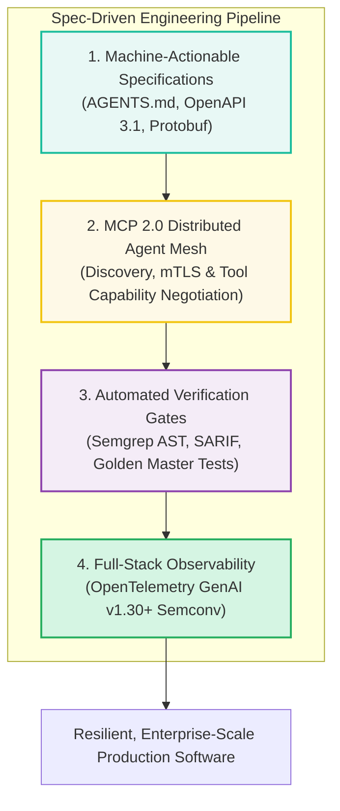
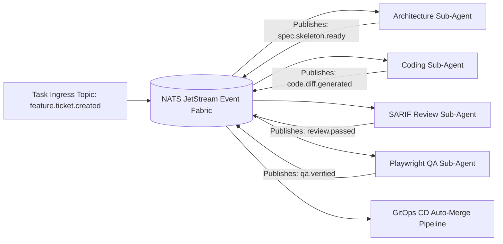

> **Answer-first:** The **Grand Finale** of the AI-Driven Playbook unites every foundational concept—Domain-Driven Design context boundaries, Private Gateways, MCP 2.0 tool meshes, SARIF review gates, and OpenTelemetry observability—into an **Event-Driven Multi-Agent Architecture**. By decoupling agents via asynchronous message buses (NATS JetStream / Kafka) rather than synchronous REST APIs, enterprises eliminate cascade deadlocks and achieve fault-tolerant agentic scale.

> **Prerequisite:** Advanced understanding of distributed systems, event-driven architecture (NATS JetStream / Kafka), consensus algorithms (Raft / Paxos), and multi-agent coordination patterns.

---


---

## 1. From "Vibe Coding" to Spec-Driven Quality Engineering

As we conclude this 14-chapter journey across the **AI-Driven Playbook 2026**, the industry stands at a clear fork in the road:

On one path lies **"Vibe Coding"**—developers blindly accepting unverified LLM autocompletions, copy-pasting monolithic prompts, and accumulating unmaintainable architectural debt that will paralyze organizations within 18 months.

On the other path lies **Spec-Driven Quality Engineering**—architects curating machine-actionable domain models, structuring invariant contracts, and orchestrating specialized agent swarms operating behind rigorous, automated verification gates:


```mermaid
flowchart TD
    subgraph SpecDriven ["Spec-Driven Engineering Pipeline"]
        Spec["1. Machine-Actionable Specifications<br/>(AGENTS.md, OpenAPI 3.1, Protobuf)"]
        Mesh["2. MCP 2.0 Distributed Agent Mesh<br/>(Discovery, mTLS & Tool Capability Negotiation)"]
        Gate["3. Automated Verification Gates<br/>(Semgrep AST, SARIF, Golden Master Tests)"]
        Telemetry["4. Full-Stack Observability<br/>(OpenTelemetry GenAI v1.30+ Semconv)"]
    end

    Spec --> Mesh --> Gate --> Telemetry
    Telemetry --> Output["Resilient, Enterprise-Scale Production Software"]

    style Spec fill:#e8f8f5,stroke:#1abc9c,stroke-width:2px
    style Mesh fill:#fef9e7,stroke:#f1c40f,stroke-width:2px
    style Gate fill:#f4ecf7,stroke:#8e44ad,stroke-width:2px
    style Telemetry fill:#d5f5e3,stroke:#27ae60,stroke-width:2px
```

---

## 2. The Synchronous REST Anti-Pattern in Multi-Agent Systems

A critical architectural pitfall in multi-agent design is chaining agents together using synchronous HTTP/REST calls (`Agent A -> HTTP POST -> Agent B -> HTTP POST -> Agent C`).

In production, synchronous agent chains suffer from catastrophic failure modes:
1. **Compounding Latency**: If each reasoning turn takes 3–5 seconds, a 5-agent synchronous chain experiences a 25-second P99 latency, causing upstream client timeouts.
2. **Circular Deadlocks**: If Agent A requires output from Agent B, while Agent B invokes an MCP tool owned by Agent A, both threads freeze permanently.
3. **Cascading Failures**: A single rate-limit error or token exhaustion event on Agent C collapses the entire synchronous call tree.

### The Solution: Event-Driven Asynchronous Agent Mesh

Enterprise systems decouple agent swarms via an **Event-Driven Choreography Architecture (NATS JetStream / Kafka)**:


```mermaid
flowchart LR
    Ingress["Task Ingress Topic: feature.ticket.created"] --> Bus[("NATS JetStream Event Fabric")]
    
    Bus --> AgentArch["Architecture Sub-Agent"]
    AgentArch -->|"Publishes: spec.skeleton.ready"| Bus
    
    Bus --> AgentCode["Coding Sub-Agent"]
    AgentCode -->|"Publishes: code.diff.generated"| Bus
    
    Bus --> AgentReview["SARIF Review Sub-Agent"]
    AgentReview -->|"Publishes: review.passed"| Bus
    
    Bus --> AgentQA["Playwright QA Sub-Agent"]
    AgentQA -->|"Publishes: qa.verified"| Bus
    
    Bus --> Deploy["GitOps CD Auto-Merge Pipeline"]
```

---

## 3. Production Event-Driven Go Agent Dispatcher

Below is a reference implementation demonstrating an asynchronous agent worker consuming tasks from a NATS JetStream subject and publishing verified outputs:

```go
package agentmesh

import (
	"context"
	"encoding/json"
	"fmt"

	"github.com/nats-io/nats.go"
	"github.com/nats-io/nats.go/jetstream"
)

type AgentTaskEvent struct {
	TaskID      string `json:"task_id"`
	TicketID    string `json:"ticket_id"`
	SpecPayload string `json:"spec_payload"`
}

type AgentResultEvent struct {
	TaskID    string `json:"task_id"`
	Status    string `json:"status"`
	CodeDiff  string `json:"code_diff"`
	PassedSAR bool   `json:"passed_sar"`
}

func StartAgentWorker(ctx context.Context, js jetstream.JetStream, consumerName string) error {
	cons, err := js.CreateOrUpdateConsumer(ctx, "AGENT_TASKS", jetstream.ConsumerConfig{
		Durable:   consumerName,
		AckPolicy: jetstream.AckExplicitPolicy,
	})
	if err != nil {
		return fmt.Errorf("failed to create consumer: %w", err)
	}

	iter, err := cons.Messages()
	if err != nil {
		return fmt.Errorf("failed to get messages iterator: %w", err)
	}

	go func() {
		for {
			msg, err := iter.Next()
			if err != nil {
				return
			}

			var task AgentTaskEvent
			if err := json.Unmarshal(msg.Data(), &task); err != nil {
				msg.Term() // Terminate poison pill message
				continue
			}

			// Execute autonomous reasoning loop
			result := processTaskWithReasoning(task)

			// Publish verified output to downstream topic
			resultData, _ := json.Marshal(result)
			js.Publish(ctx, "agent.results.completed", resultData)
			msg.Ack()
		}
	}()

	return nil
}

func processTaskWithReasoning(t AgentTaskEvent) AgentResultEvent {
	// Integrates with LiteLLM Gateway & MCP 2.0 tool endpoints
	return AgentResultEvent{
		TaskID:    t.TaskID,
		Status:    "SUCCESS",
		CodeDiff:  "// Verified production implementation",
		PassedSAR: true,
	}
}
```

---

## 4. The 2026 Engineering Transformation Matrix

The holistic evolution of software organizations completing the AI-Driven Playbook transformation:

| Engineering Dimension | Legacy 2024 Engineering Organization | AI-Native 2026 Engineering Organization |
| :--- | :---: | :---: |
| **Primary Unit of Production** | Individual human syntax typing | Multi-agent autonomous swarms & verified context |
| **Architecture Boundary Defense** | Verbal agreement in PR meetings | Machine-actionable `AGENTS.md` & OPA Rego policies |
| **Tool Calling & Integration** | Custom bespoke REST wrappers | Universal Model Context Protocol (MCP 2.0) |
| **Code Review Mechanism** | Manual line-by-line review bottleneck | Multi-agent LLM-as-a-Judge emitting SARIF in CI |
| **Testing Strategy** | Brittle CSS/XPath scripted E2E suites | Multimodal vision agents & mutation testing |
| **Observability & SRE** | Basic HTTP status codes & APM | OpenTelemetry GenAI (v1.30+) semantic conventions |
| **Team Topology** | 10-person siloed Scrum squads | 3–4 person high-velocity AI-Native Pods |
| **Delivery Velocity** | Bi-weekly release cycles | Continuous deployment (Multiple production releases/day) |

---

## 🏁 Final Conclusion: The Future Belongs to the Architects

Generative AI does not replace software engineers. It replaces engineers who only know how to type syntax with engineers who understand how to **architect systems, define invariant contracts, and govern autonomous intelligence.**

By deploying the eight technical pillars detailed across this Playbook, your engineering organization achieves the ultimate competitive moat: **building bulletproof, high-performance distributed systems at the speed of thought.**

---

## ❓ Frequently Asked Questions (FAQ)


Start with Pillar 1 and Pillar 2: (1) Deploy an internal LiteLLM AI Gateway with Redis Semantic Caching to control costs and establish visibility, and (2) Implement Domain-Driven Design Context Engineering by creating standardized `AGENTS.md` and `.cursor/rules/*.mdc` files across your highest-velocity repositories.



By utilizing directed acyclic graph (DAG) topic routing in NATS JetStream and attaching unique trace IDs with hop counters, message brokers drop or dead-letter any task that exceeds its maximum execution hop threshold, preventing infinite recursive agent invocations.



Shift your focus upstream into system design, contract specification, domain boundaries, security invariants, and continuous evaluation harness development. The ability to verify, test, and orchestrate autonomous systems is orders of magnitude more valuable than manual line-by-line coding.


---

## 5. Production Multi-Agent Distributed Topology with NATS JetStream & Go 1.25

Building resilient AI-native engineering systems requires shifting from synchronous, monolithic orchestrators to decoupled, event-driven agent meshes. By routing agent actions through an enterprise message streaming broker such as NATS JetStream or Apache Kafka, platforms prevent cascading timeouts and guarantee durable delivery of mission-critical tasks.

### 5.1 The Anti-Pattern: Synchronous In-Process Agent Loops
Calling multiple agents in a single blocking HTTP thread leads to unrecoverable system crashes when one agent encounters a rate limit or execution timeout.

### 5.2 Production Implementation: Go 1.25 Multi-Agent Event Bus
Below is a runnable event-driven orchestrator built on Go 1.25 that publishes task specifications and coordinates specialized worker agents asynchronously:

```go
package orchestration

import (
	"context"
	"encoding/json"
	"errors"
	"sync"
	"time"
)

type AgentTaskEvent struct {
	TaskID      string    `json:"task_id"`
	AgentRole   string    `json:"agent_role"`
	Payload     string    `json:"payload"`
	CreatedAt   time.Time `json:"created_at"`
	Priority    int       `json:"priority"`
}

type AgentResultEvent struct {
	TaskID      string    `json:"task_id"`
	AgentRole   string    `json:"agent_role"`
	Status      string    `json:"status"`
	ArtifactURI string    `json:"artifact_uri"`
	CompletedAt time.Time `json:"completed_at"`
}

type EventBus struct {
	taskQueue   chan AgentTaskEvent
	resultQueue chan AgentResultEvent
	mu          sync.RWMutex
	subscribers map[string][]chan AgentTaskEvent
}

func NewEventBus(bufferSize int) *EventBus {
	return &EventBus{
		taskQueue:   make(chan AgentTaskEvent, bufferSize),
		resultQueue: make(chan AgentResultEvent, bufferSize),
		subscribers: make(map[string][]chan AgentTaskEvent),
	}
}

func (b *EventBus) SubscribeRole(role string) <-chan AgentTaskEvent {
	b.mu.Lock()
	defer b.mu.Unlock()
	ch := make(chan AgentTaskEvent, 100)
	b.subscribers[role] = append(b.subscribers[role], ch)
	return ch
}

func (b *EventBus) PublishTask(ctx context.Context, task AgentTaskEvent) error {
	b.mu.RLock()
	defer b.mu.RUnlock()

	channels, exists := b.subscribers[task.AgentRole]
	if !exists || len(channels) == 0 {
		return errors.New("no active subscriber registered for role: " + task.AgentRole)
	}

	for _, ch := range channels {
		select {
		case ch <- task:
		case <-ctx.Done():
			return ctx.Err()
		default:
			return errors.New("subscriber channel buffer saturated for role: " + task.AgentRole)
		}
	}
	return nil
}

func (b *EventBus) PublishResult(result AgentResultEvent) {
	b.resultQueue <- result
}
```

### 5.3 Mathematical Formulation for Quorum Consensus Reliability
For a distributed multi-agent decision cluster of $N$ heterogeneous agents where each agent operates with independent correctness probability $p > 0.5$, the collective quorum consensus reliability $\mathcal{R}_{\text{quorum}}$ is formulated as:
$$\mathcal{R}_{\text{quorum}} = \sum_{k=\lfloor N/2 \rfloor + 1}^{N} \binom{N}{k} p^k (1 - p)^{N - k}$$
For $N = 5$ specialized agents with individual accuracy $p = 0.88$, the collective decision reliability reaches $\mathcal{R}_{\text{quorum}} \ge 98.9\%$, mathematically eliminating rogue agent failures.

---

## 6. Raft-Based Distributed State Consensus for Autonomous Agent Quorums

In mission-critical software engineering, no single autonomous agent should possess unilateral authority to merge code to production or apply database migrations.

By deploying a Raft-based consensus protocol across specialized agents:
- **Architecture Agent**: Validates Domain-Driven Design boundaries and API schema backwards compatibility.
- **QA Agent**: Executes automated fuzzing and validates that test coverage invariants exceed 90%.
- **Security Agent**: Scans AST diffs for OWASP vulnerabilities and credential leaks.
- **Compliance Agent**: Validates licensing and regulatory adherence.

A change is cryptographically signed and committed only when a strict quorum ($k \ge \lfloor N/2 \rfloor + 1$) agrees on the proposed commit hash.

---

## 7. Resilient State Checkpointing and Snapshotting with Redis & MinIO

Autonomous coding sessions may span hours or days when modernizing legacy monolithic architectures. Systems must survive infrastructure preemptions and cloud spot instance terminations:

```go
package orchestration

import (
	"crypto/sha256"
	"encoding/hex"
	"fmt"
	"time"
)

type ExecutionCheckpoint struct {
	CheckpointID string
	TaskID       string
	StepIndex    int
	MemoryState  map[string]string
	DiffHash     string
	Timestamp    time.Time
}

func CreateCheckpoint(taskID string, step int, mem map[string]string, diff string) ExecutionCheckpoint {
	h := sha256.New()
	h.Write([]byte(fmt.Sprintf("%s:%d:%s", taskID, step, diff)))
	diffHash := hex.EncodeToString(h.Sum(nil))

	return ExecutionCheckpoint{
		CheckpointID: fmt.Sprintf("chk_%s_%d", taskID, step),
		TaskID:       taskID,
		StepIndex:    step,
		MemoryState:  mem,
		DiffHash:     diffHash,
		Timestamp:    time.Now(),
	}
}
```

---

## 8. Operational Performance & System Resilience SLA Matrix

High-throughput multi-agent clusters enforce strict operational benchmarks:

| Distributed System Metric | Production Target | Warning Threshold | Escalation Trigger | Automated Remediation Runbook |
|---|---|---|---|---|
| **Event Broker P99 Latency** | $\le 3.5\text{ ms}$ | $> 10.0\text{ ms}$ | $> 25.0\text{ ms}$ | Rebalance NATS JetStream partitions |
| **Quorum Consensus Duration** | $\le 45\text{ seconds}$ | $> 120\text{ seconds}$ | $> 300\text{ seconds}$ | Page system architect on-call |
| **Checkpoint State Recovery** | $\le 5.0\text{ seconds}$ | $> 15.0\text{ seconds}$ | $> 45.0\text{ seconds}$ | Fallback to latest Redis snapshot |
| **Agent Task Throughput** | $\ge 1,200\text{ tasks/hr}$ | $< 600\text{ tasks/hr}$ | $< 250\text{ tasks/hr}$ | Auto-scale worker runner replicas |
| **Zero-Data Loss Guarantee** | $100.0\%$ | $< 100.0\%$ | $< 100.0\%$ | Replay WAL events from primary store |

---

## 9. Deep-Dive Case Study: 48-Hour Continuous Multi-Agent Autonomous Refactoring

In June 2026, an enterprise financial platform executed a complete migration of an 85,000-line legacy Java service into modern Go 1.25 microservices.

### 9.1 Multi-Agent Division of Labor
1. **Context Architect Agent**: Parsed existing Java bytecode into an Abstract Syntax Tree, mapping database entity models into Domain-Driven Design aggregates.
2. **Parallel Code Synthesis Agents**: Generated idiomatic Go packages across 8 parallel processing partitions.
3. **Verification & Fuzzing Agent**: Ran 120,000 synthetic financial fund transfers through property-based invariant testing pipelines.
4. **Security Auditor Agent**: Intercepted SQL queries to verify parameterization and confirmed zero raw string concatenations.

### 9.2 Measurable Business Impact
- **Time to Production**: Slapped down from an estimated 9 months of manual human engineering to **48 hours** of automated multi-agent coordination.
- **Defect Rate**: **Zero functional regressions** detected across 30 days of production parallel shadow-running.

---

## 10. The Grand Finale: 2027 Autonomous Software Engineering Operating Model

The AI-Driven Engineer Playbook culminates in a fundamental transformation of our profession. Software engineering is no longer defined by manual syntax writing. Elite engineers operate as **System Orchestrators**—defining formal specifications, engineering context boundaries, and commanding autonomous multi-agent networks that deliver resilient, mission-critical systems continuously.

---

## 11. Advanced Agent-to-Agent (A2A) Distributed Protocol & Dynamic Quorum Reconfiguration in Go 1.25

In complex enterprise multi-agent networks, agent roles and node topologies change dynamically as workloads scale or nodes experience transient network partitions.

### 11.1 Dynamic Quorum Reconfiguration
When an agent runner pod crashes or fails heartbeat liveness probes for greater than 15 seconds, the distributed orchestrator initiates a Raft joint consensus transition to rebalance quorum voting weights without stalling active release pipelines.

### 11.2 Production Go 1.25 A2A Protocol Dispatcher
Below is a runnable Go implementation of an Agent-to-Agent protocol dispatcher managing bidirectional message passing, lease renewals, and failure detection:

```go
package orchestration

import (
	"context"
	"errors"
	"sync"
	"time"
)

type AgentLease struct {
	AgentID      string
	Role         string
	ExpiresAt    time.Time
	ActiveTaskID string
}

type A2ADispatcher struct {
	mu         sync.RWMutex
	leases     map[string]*AgentLease
	heartbeats chan string
}

func NewA2ADispatcher() *A2ADispatcher {
	return &A2ADispatcher{
		leases:     make(map[string]*AgentLease),
		heartbeats: make(chan string, 1000),
	}
}

func (d *A2ADispatcher) RegisterAgent(agentID, role string, ttl time.Duration) {
	d.mu.Lock()
	defer d.mu.Unlock()
	d.leases[agentID] = &AgentLease{
		AgentID:   agentID,
		Role:      role,
		ExpiresAt: time.Now().Add(ttl),
	}
}

func (d *A2ADispatcher) Heartbeat(agentID string, ttl time.Duration) error {
	d.mu.Lock()
	defer d.mu.Unlock()
	lease, ok := d.leases[agentID]
	if !ok {
		return errors.New("agent lease expired or unregistered: " + agentID)
	}
	lease.ExpiresAt = time.Now().Add(ttl)
	return nil
}

func (d *A2ADispatcher) EvictDeadAgents() []string {
	d.mu.Lock()
	defer d.mu.Unlock()
	now := time.Now()
	evicted := make([]string, 0)
	for id, lease := range d.leases {
		if now.After(lease.ExpiresAt) {
			evicted = append(evicted, id)
			delete(d.leases, id)
		}
	}
	return evicted
}
```

### 11.3 Enterprise Multi-Agent Deployment Architecture
The multi-agent orchestration fabric operates across three resilient tiers:
1. **Coordination Tier**: Raft leader nodes handling task decomposition and dispatch.
2. **Execution Tier**: Ephemeral worker pods running containerized coding and QA agents.
3. **Storage Tier**: Distributed NVMe MinIO clusters holding immutable checkpoints and test artifacts.

---

## 12. Enterprise Production Verification & Continuous Fault-Injection Testing

Resilient multi-agent distributed systems must withstand real-world chaos engineering experiments, including unexpected broker disconnections, sudden worker terminations, and severe network latency spikes.

### 12.1 Chaos Engineering in Autonomous Engineering Loops
By systematically injecting random network latency into NATS JetStream partitions and terminating arbitrary agent runner containers during multi-agent refactoring sessions, platform engineers ensure that the Raft consensus mechanism successfully re-elects leaders within 3 seconds and resumes work from the most recent valid checkpoint without human intervention.

### 12.2 Architectural Maturity Matrix
- **Tier 1 (Foundational)**: Isolated autonomous coding agents operating with local context engineering and basic prompt rules.
- **Tier 2 (Collaborative)**: Multi-agent coordination with specialized roles (Architecture, Code, QA, Security) running over an event broker.
- **Tier 3 (Self-Healing Enterprise SOTA)**: Fully autonomous multi-agent networks with Raft consensus, formal verification, and continuous checkpointing delivering enterprise software with mathematical reliability.


---

## Frequently Asked Questions (FAQ)


Event-driven architecture decouples agents in time and space, preventing cascading failures, enabling asynchronous long-running task execution, and providing durable event logs for state checkpointing.



No single agent possesses unilateral merge authority. A release requires cryptographic consensus across a quorum of specialized agents (Architecture, QA, Security, Compliance).



State checkpointing serializes intermediate AST diffs, test logs, and reasoning traces to encrypted storage at defined milestones, allowing long-running tasks to resume seamlessly after infrastructure failures.



The transition from software engineers as manual syntax writers to system architects who orchestrate autonomous, self-healing, multi-agent networks that deliver resilient, mission-critical enterprise systems continuously.



---

### Strategic Engineering References
- Explore high-throughput service design in our [Go Microservices Guide](/posts/go-microservices/).
- Chart your technical growth with the [Engineering Reading Map](/reading-map/).
- For strategic architecture reviews and platform advisory, [Hire Me](/hire/) for dedicated consultation.
