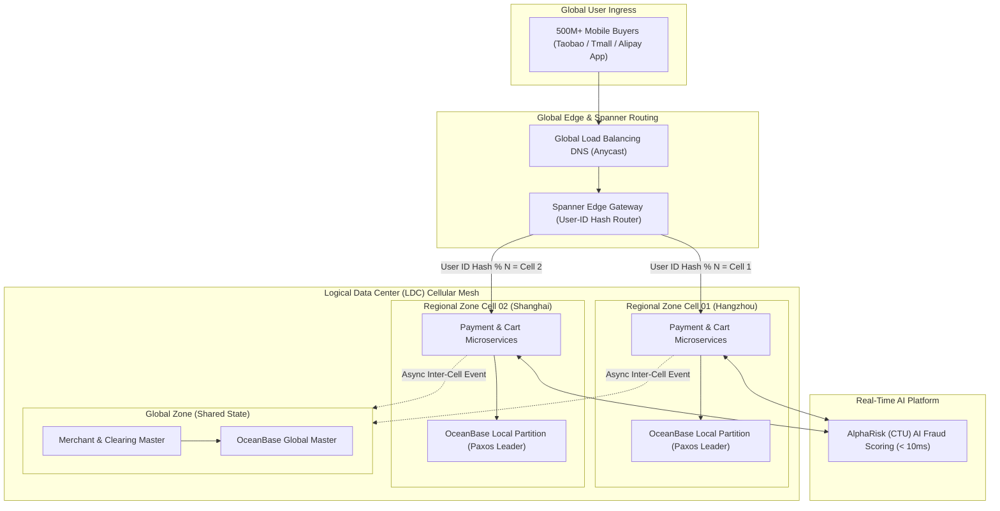
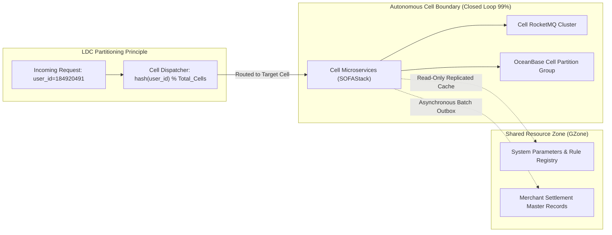

> **Multi-Language Edition:** This series is also available in Vietnamese at [Alipay Double 11: Siêu Hệ Thống Thanh Toán & OceanBase (learn.tanhdev.com)](https://learn.tanhdev.com/series/alipay-double-11/).

---

> **Answer-First:** The Alipay Double 11 architecture represents the global pinnacle of high-throughput financial computing, sustaining peak loads exceeding **583,000 transactions per second (TPS)** and **61 million database queries per second**. To eliminate distributed lock contention and physical data center scaling ceilings, Alipay engineered five core innovations: **Logical Data Center (LDC) cellular unitization**, **OceanBase distributed NewSQL with Multi-Paxos consensus (RPO=0, RTO < 3s)**, **SOFAStack middle-platform middleware with binary Bolt RPC**, **Full-Link Stress Testing (FLST)** directly in production, and **AlphaRisk sub-10ms real-time AI fraud detection**.

---

## 1. Executive Overview: Planetary Scale Benchmarks

The Alibaba Double 11 Global Shopping Festival evolved from a modest promotional experiment in 2009 into the largest e-commerce and financial transaction event on Earth:

```
Alipay Double 11 Peak Scale Evolution:
┌──────┬─────────────────┬─────────────────┬────────────────────────────────┐
│ Year │ Peak Orders/s   │ Peak Pay TPS    │ Architectural Milestone        │
├──────┼─────────────────┼─────────────────┼────────────────────────────────┤
│ 2009 │ 200             │ ~200            │ Monolithic Java, Oracle DB     │
│ 2012 │ 20,000          │ 10,000          │ Sharded MySQL, IOPS Exhaustion │
│ 2014 │ 80,000          │ 38,500          │ LDC Unitization Debut + FLST   │
│ 2017 │ 325,000         │ 256,000         │ OceanBase 1.0 Full Takeover    │
│ 2019 │ 544,000         │ 544,000         │ OceanBase TPC-C World Record   │
│ 2026 │ 583,000+        │ 583,000+        │ AI-Native AlphaRisk & Mesh     │
└──────┴─────────────────┴─────────────────┴────────────────────────────────┘
```

The core architectural dilemma in planetary finance is: **How can a system process over half a million ACID financial transactions every single second across geographically separated data centers without falling victim to the speed-of-light network latency penalty?**

---

## 2. End-to-End Planetary System Architecture

Alipay achieves linear horizontal scalability by decoupling global routing from independent, autonomous processing cells:



---

## 3. The Logic Data Center (LDC) Cellular Unitization Model

Traditional distributed architectures hit a hard physical wall when a database or microservice must coordinate transactions across multiple data centers. The round-trip time (RTT) between Hangzhou and Shanghai (~5ms) or Shenzhen (~25ms) makes synchronous cross-region Two-Phase Commit (2PC) impossibly slow for 500,000 TPS.

Alipay solved this by inventing **Cellular Unitization (LDC)**:



### LDC Zone Classifications:
1. **RZone (Regional Zone):** The basic autonomous unit. Each RZone contains a complete slice of the application stack, message broker, and database partition for a specific subset of users (e.g., users with hash `00–19`). **Over 99% of payment requests execute strictly within the local RZone with zero cross-datacenter network hops.**
2. **GZone (Global Zone):** Houses shared global business resources that cannot easily be sharded by user ID, such as merchant master accounts, system configuration registries, and centralized clearing endpoints.
3. **CZone (City Zone):** Read-only caching cells distributed in major metropolitan regions to serve high-frequency read queries (e.g., product details, promotional banners) directly from local memory.

---

## 4. Complete Series Table of Contents

Navigate through our comprehensive technical analysis of the Alipay Double 11 engineering stack:

- [**Chapter 1: Executive Summary**](/series/alipay-double-11/executive-summary/) (Weight: 1)  
  *Planetary-scale payment architecture summary: 583,000 TPS, 61M QPS, and the zero-loss financial blueprint.*

- [**Chapter 2: Phase 1 — Historical Timeline & Scaling Milestones**](/series/alipay-double-11/phase-1-timeline/) (Weight: 2)  
  *The technical evolution from 2009 monolithic bottlenecks to the 2026 AI-native payment cloud.*

- [**Chapter 3: Phase 2 — LDC Cellular Architecture & OceanBase Consensus**](/series/alipay-double-11/phase-2-architecture/) (Weight: 3)  
  *Deep architectural analysis of Logic Data Centers, cell unitization, and OceanBase Multi-Paxos quorum.*

- [**Chapter 4: Phase 3 — Operational Engineering & Full-Link Stress Testing**](/series/alipay-double-11/phase-3-operations/) (Weight: 4)  
  *How Alipay rehearses 500,000+ TPS directly in production using shadowed data pipelines and automated load shedding.*

- [**Chapter 5: Phase 4A — Middle Platform, SOFAStack & CTU AI Risk Engine**](/series/alipay-double-11/phase-4-technology/) (Weight: 5)  
  *Reinventing middleware: SOFAStack, real-time risk control with AlphaRisk, and sub-10ms decisioning.*

- [**Chapter 6: Phase 4B — High-Performance Internals: Bolt RPC, RocketMQ & Storage**](/series/alipay-double-11/phase-4-deep-dive/) (Weight: 6)  
  *Binary Bolt protocol multiplexing, RocketMQ 2PC transactional messaging, and OceanBase LSM-Tree compaction.*

- [**Chapter 7: Phase 5 — Architectural Synthesis & Hardened Lessons**](/series/alipay-double-11/phase-5-synthesis/) (Weight: 7)  
  *Key takeaways, failure modes, design trade-offs, and principles for high-concurrency enterprise architecture.*

- [**Chapter 8: Modern Tech Comparison — Alipay vs Modern Cloud-Native**](/series/alipay-double-11/modern-tech-comparison/) (Weight: 8)  
  *Direct comparative matrix: SOFAStack vs Kubernetes / Envoy / TiDB / Kafka / eBPF.*

---

## Frequently Asked Questions


LDC eliminates cross-datacenter latency through strict user-centric traffic unitization:
- By hashing the `user_id` at the edge gateway (Spanner), all requests for a specific user are routed to a dedicated RZone cell containing their microservices, cache, and database partitions.
- Because a user's balance query, risk evaluation, and ledger debit all occur within the same local data center, 99% of write transactions complete with zero cross-city network hops.
- Cross-cell communication is strictly restricted to asynchronous message queues (RocketMQ) for non-critical post-payment events like merchant settlement and promotional point grants.



Traditional database architectures failed under Double 11 requirements for three fundamental reasons:
1. <strong>Hardware Cost & Write Scaling:</strong> Oracle RAC shared-storage created an insurmountable I/O bottleneck at 100,000 TPS, and vertical hardware scaling costs were astronomical.
2. <strong>Replica Lag & Consistency Risk:</strong> MySQL semi-synchronous replication suffered seconds of lag during write surges, risking split-brain data corruption during master failover.
3. <strong>Distributed ACID via Multi-Paxos:</strong> OceanBase combines an in-memory LSM-Tree write engine (MemTable) with Paxos quorum consensus across five data centers, delivering strictly linearizable ACID consistency, sub-3s autonomous failover, and zero data loss ($RPO=0$).



Alipay tests live production systems using cryptographic data isolation and shadow pipelines:
- <strong>Shadow Data Tagging:</strong> Synthetic stress test requests carry an immutable context header (`traffic_type=shadow`) injected at the entry gateway and propagated across all RPC, MQ, and database layers.
- <strong>Isolated Shadow Storage:</strong> Database writes carrying the shadow tag are transparently diverted into shadow tables or partitioned storage engines without polluting real accounting ledgers.
- <strong>External Mocking:</strong> Calls to external banking networks (e.g., China UnionPay, commercial banks) are intercepted by edge mock gateways returning simulated sub-millisecond bank settlement responses.


---

[Next Chapter: Executive Summary — Planetary-Scale Payment Architecture](/series/alipay-double-11/executive-summary/)
