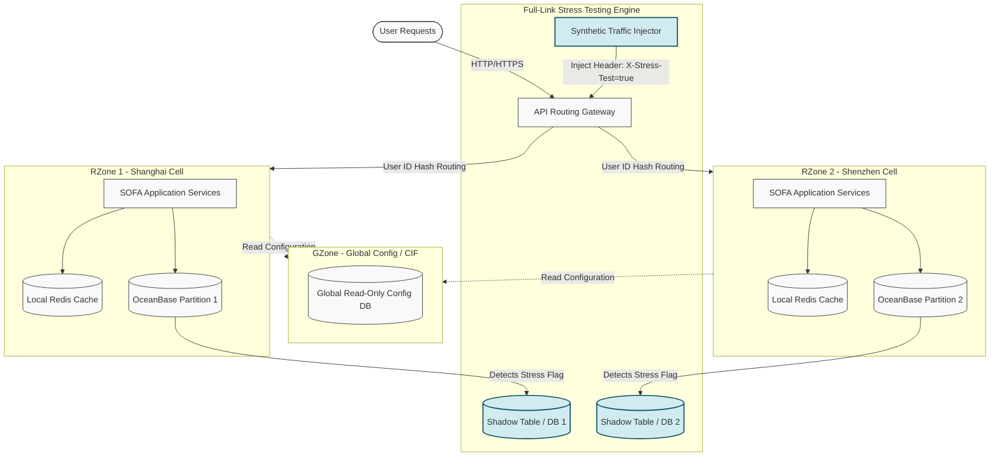

[← Series hub]()
[Next →]()

> **Prerequisite:** General understanding of global financial systems scale, high-throughput payment architectures, and transaction reliability.

**From 50M CNY to 544K TPS: Lessons in Building Planet-Scale Systems**

## TL;DR

Between the inaugural event in 2009 and the peak milestone of 2019, Alipay scaled its transactional capacity by an astronomical **~5,440x**, culminating in a peak throughput of **544,000 transactions per second (TPS)** (and subsequently reaching over 583,000 TPS). Crucially, this scaling was not achieved by sacrificing safety; the system maintained strict **financial-grade reliability (99.99% availability)** and a target of **zero data loss (Recovery Point Objective, RPO = 0)**. 

To achieve this level of performance at planet-scale, Alipay had to pioneer new approaches in three critical dimensions:
1. **Design to Split (Logical Data Center - LDC Unitization)**: Shifting from a monolithic or traditionally clustered database model to self-contained execution units (cells).
2. **Make Confidence Deterministic (Full-Link Stress Testing)**: Moving away from statistical extrapolation and simulation to executing synthetic peak loads directly on production environments.
3. **Automate Operations End-to-End**: Building self-healing, self-regulating infrastructure that handles capacity allocation, real-time risk control, and service degradation without manual human intervention.

---

## The Story: From Crisis to Record

### 2009–2011: The Heuristic Era
In 2009, Double 11 was conceived as a promotional campaign on Taobao Mall (Tmall). The transactional volume, though unprecedented for the site, was small by modern standards—peaking at approximately 100 TPS. The engineering response was reactive, characterized by vertical database scaling, connection pool tuning, and code-level optimization. However, as year-on-year growth exceeded 200%, the limits of vertical scaling quickly became apparent.

### 2012: The Breaking Point (The Hard Ceilings)
By 2012, Alipay’s centralized Oracle database cluster hit physical limits. The database was plagued by lock contention, and connection pools were exhausted under the bursty load of buyers hitting "Pay" at exactly midnight. Furthermore, the physical data centers in Hangzhou were constrained by power grid capacity and cooling requirements; it was literally impossible to add more physical servers to the existing facilities. The engineers faced an existential threat: if the database could not scale, the business could not grow.

### 2013: The LDC Reset
In early 2013, the leadership set an "impossible" target: design a system capable of handling **20,000 payment TPS** for the upcoming Double 11, with less than nine months to design, build, and deploy. The solution was the **Logical Data Center (LDC)** architecture. The system was decomposed into independent "RZones" (Regional Zones or Units), each responsible for a subset of the user base (e.g., partitioned by user ID). This unitization transformed the system from a single scaling point into a horizontally scalable system.

### 2019: Planet-Scale Triumph
By 2019, the architecture had matured to support a record **544,000 payment TPS** (with overall message-level QPS exceeding 61 million). The entire operational readiness process had transitioned from high-stress "war rooms" filled with hundreds of engineers manually executing shell scripts, to automated dashboards and scheduled automated drill procedures.

---

## The 3 Pillars of Alipay's Scale Architecture

The overall system architecture of Alipay's Double 11 solution can be visualized in the following system design diagram, illustrating how traffic flows from users, gets routed to unit cells, utilizes partitioned databases, and is tested via synthetic stress injection.

### Pillar 1: LDC Unitization (Cell Architecture)
Centralized monolithic databases have a structural ceiling. The LDC (Logical Data Center) architecture solves this by breaking the application and database tiers into self-contained deployment units:
- **RZone (Regional Zone)**: The active processing units. An RZone owns a subset of the user base and handles all of their transaction flows (routing, application server calls, local cache, and database writes) locally. There is no cross-RZone communication on the critical write path.
- **GZone (Global Zone)**: Holds global read-only data, such as merchant registries, system configurations, and centralized Customer Information Files (CIF). GZone data is replicated to RZones asynchronously to avoid cross-unit database calls.
- **CZone (City Zone)**: Holds hot common data that must be shared within a metropolitan network (e.g., user profiles read frequently across multiple RZones) to minimize latency while keeping consistency.

### Pillar 2: Automated Full-Link Stress Testing
Simulating peak load in a staging environment is fundamentally flawed; staging environments cannot replicate the network topologies, background loads, and hardware idiosyncrasies of production. Alipay’s breakthrough was **Full-Link Stress Testing (FLST)** conducted directly in production:
- **Traffic Injection**: A cluster of load generators injects synthetic payment requests directly into the API gateway during off-peak hours (e.g., 2:00 AM).
- **Flag Propagation**: Every synthetic request is marked with a specific HTTP header (`X-Stress-Test: true`). This flag is automatically propagated across thread pools, RPC boundaries (SOFA RPC), and message queues (RocketMQ).
- **Data Isolation (Shadow DB)**: When a database driver or middleware intercepts a request with the stress-test flag, it reroutes the read/write query to a designated "shadow table" or "shadow database" (e.g., `db_shadow`). This guarantees that synthetic load does not pollute real financial ledgers or mess up accounting records.

### Pillar 3: Financial-Grade Distributed Database (OceanBase)
Before 2013, scaling relational databases meant sharding MySQL or Oracle manually, which introduced massive complexity in managing distributed transactions and maintaining consistency. Alipay replaced these legacy databases with **OceanBase**, a distributed relational database built from scratch:
- **Paxos Consensus**: OceanBase uses the Multi-Paxos protocol to replicate transaction logs across five data centers in three regions (3-site-5-datacenter). If a primary node fails, a new leader is elected in seconds, ensuring RTO < 30 seconds and RPO = 0.
- **LSM-Tree Storage Engine**: Traditional databases use B+ Trees, which lead to high write amplification and random disk I/O under heavy load. OceanBase uses a Log-Structured Merge-tree (LSM-tree) where all writes are buffered in memory (MemTable) and written sequentially to disk (SSTable) during a scheduled background freeze/compaction process, eliminating disk bottlenecks at midnight.

---

## Detailed Performance and Growth Metrics

The following metrics represent the actual and estimated growth logs compiled across the decade of Double 11 optimization:

| Year | Peak Transaction Throughput (TPS) | Primary Database Engine | Primary Stress Validation Method |
|------|-----------------------------------|-------------------------|----------------------------------|
| 2009 | ~100                              | Centralized Oracle DB   | Manual vertical resource scaling |
| 2010 | ~500                              | Centralized Oracle DB   | Single-component script testing  |
| 2011 | ~1,000                            | Sharded Oracle DB       | Isolated sandbox cluster testing |
| 2012 | ~2,000 (Crisis Year)              | Sharded Oracle DB       | Staging environment simulation   |
| 2013 | 20,000                            | First LDC / MySQL Shards| Manual multi-component scripts   |
| 2014 | 80,000                            | MySQL Shards + OceanBase| First automated FLST in prod     |
| 2015 | 140,000                           | OceanBase v1.0          | Continuous FLST + Auto-injection |
| 2016 | 200,000                           | OceanBase v1.0          | FLST + Automated Failover Drills |
| 2017 | 256,000                           | OceanBase v1.4          | FLST + Multi-site DR Drills      |
| 2018 | 400,000                           | OceanBase v2.0          | Elastic Cloud-Bursting FLST      |
| 2019 | 544,000                           | OceanBase v2.2          | Autonomous Intelligent Operations|

---

## Stack Comparison: Alipay Middleware vs. Modern Cloud-Native

To modern software architects, the custom middleware developed by Alipay can be mapped directly to modern, open-source CNCF projects:

| Alipay Custom Stack | Modern CNCF / Open-Source Equivalent | Core Architectural Function |
|---------------------|---------------------------------------|-----------------------------|
| **SOFA RPC**        | **gRPC / protobuf**                   | Contract-first, high-throughput RPC with trace context propagation. |
| **SOFA Boot**       | **Spring Boot / Go Micro**            | Structured framework wrapping services with standardized health endpoints. |
| **RocketMQ**        | **Apache Kafka / Apache Pulsar**      | Decoupled messaging plane with partition sharding and reliable DLQ. |
| **SOFA Mesh**       | **Istio / Linkerd**                  | Sidecar proxy managing service-to-service routing, timeouts, and mTLS. |
| **OceanBase**       | **CockroachDB / TiDB / Vitess**       | Distributed SQL database with Paxos-based replication and LSM storage. |
| **FLST Engine**     | **K6 / Locust + Custom Middleware**   | Synthetic load generation combined with context-aware DB routing. |

---

## Actionable Takeaways for Modern Architects

If you are tasked with scaling a high-throughput transaction system today, you do not need to replicate Alipay's internal codebase. Instead, you should implement their architectural patterns:

1. **Partition State at the Edge**: Don't try to build a faster database cluster. Instead, route requests to self-contained application and storage units (cells) as close to the ingress as possible.
2. **Conduct Production Load Drills**: If you haven't run a load test on your production environment using shadow databases, you do not know if your system will survive a peak event.
3. **Establish Hard Degrade Paths**: Define explicit, automated toggles that disable non-critical features (like recommended items, activity logs, and email notifications) when the core database latency increases past a specific millisecond threshold.
4. **Design for Write Buffering**: Use LSM-tree database structures or message queues to convert random disk write spikes into sequential logs or buffered streams.

---

Need help implementing high-scale architectures? Feel free to [Get in touch](/hire/) or [Hire me](/hire/) to review your system design and codebase.

🔗 **Next Step:** [Phase 1: Timeline and Scale Evolution]()
