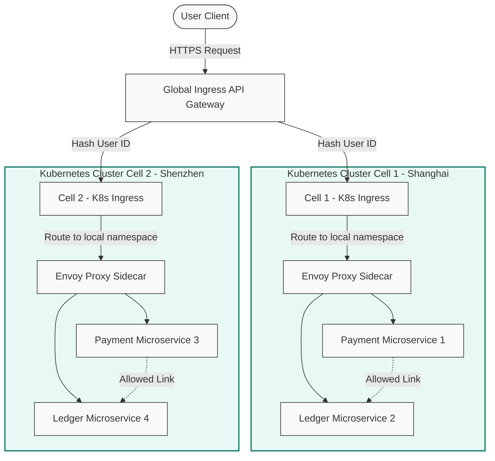

[← Series hub]()
[← Prev]() • [Next →]()

> **Prerequisite:** [Phase 4: Deep Dive (Technology Internals)]()

This page maps the architectural concepts and custom middleware developed for the Double 11 event to modern, open-source cloud-native equivalents. The goal is to provide a blueprint for software architects today to implement the same reliability and throughput patterns using standard CNCF (Cloud Native Computing Foundation) tools.

---

## 1) LDC Unitization vs. Kubernetes Multi-Cluster (Cells)

In Alipay’s LDC architecture, the system is sharded into self-contained "RZones" that process user transaction requests locally. 

In a modern cloud-native stack, this pattern is represented by **Cell-Based Architecture** deployed across **Kubernetes Multi-Cluster** environments:
- **Tenancy and Routing**: A global ingress controller (such as Envoy Gateway, Cloudflare Workers, or Kong) acts as the LDC Unit Router. It hashes the user ID from incoming cookies or request headers using algorithms like **Ketama consistent hashing** or **MurmurHash3** and routes the connection to a specific Kubernetes cluster (cell) in a designated region. Envoy's dynamic routing tables are synchronized in real-time via the Route Discovery Service (RDS) and Endpoint Discovery Service (EDS) to bypass unhealthy clusters automatically.
- **Service Isolation**: The cell contains the entire service dependency tree. Using standard Kubernetes service mesh setups, communication is strictly bounded within the cluster's namespaces. Cross-cluster calls are prevented at the network policy tier using mutual TLS (mTLS) identities.

Below is a system design diagram illustrating how a modern API Gateway and Service Mesh topology routes traffic to multiple Kubernetes cluster cells, matching Alipay's LDC cell architecture:



---

## 2) OceanBase vs. Modern Distributed Databases

OceanBase was engineered as a distributed SQL database to handle ACID transactions at high volume. Today, software architects can select from several open-source and managed distributed database engines:

### Side-by-Side Architectural Mapping:

| Architectural Metric | OceanBase | CockroachDB | TiDB (PingCAP) | Vitess |
|----------------------|-----------|-------------|----------------|--------|
| **Replication Protocol** | Multi-Paxos | Raft Consensus | Raft Consensus | Semi-Synchronous (MySQL-based) |
| **Storage Engine Architecture** | LSM-Tree (Append-only write optimization) | LSM-Tree (Pebbles storage engine) | LSM-Tree (TiKV based on RocksDB) | B+ Tree (InnoDB storage engines sharded manually) |
| **HTAP Support** | Yes (Hybrid Transactional/Analytical) | Yes (Vectorized execution engines) | Yes (TiFlash columnar engine integrations) | No (Pure transactional sharding) |
| **Primary Use Cases** | Large-scale banking ledgers, extreme write rates. | Geo-distributed consistency, multi-region compliance. | MySQL compatibility, mixed analytical/transactional workloads. | Scale existing MySQL applications without modifying SQL syntax. |

### Selecting the Right Database:
- If your system requires **geo-distribution and ease of operation**, **CockroachDB** provides a polished PostgreSQL-compatible engine with automated range sharding.
- If you are migrating a **large MySQL application** and need high horizontal write scale, **TiDB** is a strong fit.
- If you want to keep **standard MySQL instances** but scale them horizontally through proxy routing, **Vitess** (the engine used by YouTube) is the preferred choice. Vitess implements `vtgate` proxies and `vttablet` agents to manage routing and execute scatter-gather query execution patterns across shard tables, abstracting the complexity of manual partitions away from the application code.

---

## 3) Message Queues: RocketMQ vs. Kafka vs. Pulsar

At peak scale, the message broker's storage engine determines how it behaves under load.
- **RocketMQ Architecture**: RocketMQ writes all incoming messages to a centralized **CommitLog** sequentially, and background threads generate indexes in **ConsumeQueue** files. This sequential-write structure means that disk I/O remains stable even when millions of topics are written to concurrently.
- **Kafka Storage**: Kafka creates a separate partition directory on disk for each topic partition. While excellent for high-throughput streaming, writing to thousands of partitions concurrently turns sequential I/O into random disk seeks, causing disk saturation.
- **Pulsar Separation**: Pulsar separates compute (Brokers) from storage (Bookies running Apache BookKeeper). It is highly elastic but has a higher operational complexity.
- **Takeaway**: If your system has a small number of topics with massive throughput, Kafka is ideal. If you require millions of distinct, highly isolated transactional queues (e.g., one per user order stream), RocketMQ or Pulsar is the better fit.

---

## 4) SOFA RPC vs. gRPC

Alipay's Bolt-based SOFA RPC is equivalent to **gRPC** utilizing HTTP/2:
- **Contract-First Design**: SOFA RPC defines interfaces in Java; gRPC uses **Protocol Buffers (protobuf)** to define APIs in a language-agnostic IDL, generating client and server stubs automatically in Go, Java, Rust, and Node.js.
- **Trace Context Propagation**: While SOFA RPC relies on custom headers in the Bolt protocol, gRPC uses **HTTP/2 Metadata Headers**. Libraries like OpenTelemetry automatically inject and extract trace contexts (such as W3C Traceparent headers) across HTTP/2 metadata boundaries, enabling distributed tracing out-of-the-box.

---

## 5) Go Concurrent Multi-Cell Aggregator (Go Snippet)

When building cell-based architectures, sometimes the system must aggregate data from multiple cells concurrently (for example, generating a unified transaction history report for an executive dashboard).

Below is a Go implementation of a concurrent query aggregator. It demonstrates how to query multiple cell endpoints concurrently, enforce timeouts using contexts, cancel in-flight requests, and handle partial failures:

```go
package main

import (
	"context"
	"encoding/json"
	"fmt"
	"net/http"
	"net/http/httptest"
	"sync"
	"time"
)

// CellResponse holds the query results from a specific regional cell
type CellResponse struct {
	CellID       string `json:"cell_id"`
	TransactionCount int    `json:"tx_count"`
	TotalVolume  float64 `json:"total_volume"`
	Error        string `json:"error,omitempty"`
}

// ConcurrentAggregator queries multiple cell endpoints concurrently
type ConcurrentAggregator struct {
	endpoints map[string]string
	client    *http.Client
}

func NewConcurrentAggregator(endpoints map[string]string) *ConcurrentAggregator {
	return &ConcurrentAggregator{
		endpoints: endpoints,
		client:    &http.Client{Timeout: 500 * time.Millisecond},
	}
}

// AggregateCellData queries all endpoints and returns consolidated metrics
func (ca *ConcurrentAggregator) AggregateCellData(ctx context.Context) ([]CellResponse, error) {
	// 1. Establish a bounded context timeout for the aggregate run
	timeoutCtx, cancel := context.WithTimeout(ctx, 300*time.Millisecond)
	defer cancel()

	results := make([]CellResponse, len(ca.endpoints))
	var wg sync.WaitGroup
	var idx int

	for cellID, url := range ca.endpoints {
		wg.Add(1)
		go func(i int, id string, endpointURL string) {
			defer wg.Done()
			
			res := CellResponse{CellID: id}
			req, err := http.NewRequestWithContext(timeoutCtx, "GET", endpointURL, nil)
			if err != nil {
				res.Error = err.Error()
				results[i] = res
				return
			}

			resp, err := ca.client.Do(req)
			if err != nil {
				res.Error = err.Error()
				results[i] = res
				return
			}
			defer resp.Body.Close()

			if resp.StatusCode != http.StatusOK {
				res.Error = fmt.Sprintf("invalid status code: %d", resp.StatusCode)
				results[i] = res
				return
			}

			if err := json.NewDecoder(resp.Body).Decode(&res); err != nil {
				res.Error = err.Error()
				results[i] = res
				return
			}

			results[i] = res
		}(idx, cellID, url)
		idx++
	}

	// Wait for either all goroutines to finish or the timeout context to expire
	ch := make(chan struct{})
	go func() {
		wg.Wait()
		close(ch)
	}()

	select {
	case <-timeoutCtx.Done():
		return results, fmt.Errorf("aggregation run hit timeout constraint: %w", timeoutCtx.Err())
	case <-ch:
		return results, nil
	}
}

func main() {
	// Setup mock cell endpoints
	cell1Server := httptest.NewServer(http.HandlerFunc(func(w http.ResponseWriter, r *http.Request) {
		w.WriteHeader(http.StatusOK)
		w.Write([]byte(`{"cell_id": "RZone1", "tx_count": 142000, "total_volume": 4200000.50}`))
	}))
	defer cell1Server.Close()

	cell2Server := httptest.NewServer(http.HandlerFunc(func(w http.ResponseWriter, r *http.Request) {
		// Simulate network latency in cell 2
		time.Sleep(100 * time.Millisecond)
		w.WriteHeader(http.StatusOK)
		w.Write([]byte(`{"cell_id": "RZone2", "tx_count": 98000, "total_volume": 2150000.20}`))
	}))
	defer cell2Server.Close()

	endpoints := map[string]string{
		"RZone1": cell1Server.URL,
		"RZone2": cell2Server.URL,
	}

	aggregator := NewConcurrentAggregator(endpoints)
	fmt.Println("Running multi-cell concurrent aggregation...")
	results, err := aggregator.AggregateCellData(context.Background())
	if err != nil {
		fmt.Printf("Warning: aggregation completed with errors: %v\n", err)
	}

	for _, res := range results {
		if res.Error != "" {
			fmt.Printf("Cell %s Failed: %s\n", res.CellID, res.Error)
		} else {
			fmt.Printf("Cell %s: Transactions = %d, Volume = $%.2f\n", res.CellID, res.TransactionCount, res.TotalVolume)
		}
	}
}
```

---

## 6) Decision Framework: Build vs. Adopt

If your system is not operating at peak scales of hundreds of thousands of TPS, you should avoid writing custom database protocols, RPC drivers, or messaging platforms from scratch. Building custom infrastructure increases your maintenance burden and diverts engineering focus away from business logic.

Instead, apply this **Adopt vs. Build Decision Matrix**:

| Architectural Pattern | Build Custom (Alipay Style) | Adopt Open-Source (Modern Style) |
|-----------------------|------------------------------|-----------------------------------|
| **Cell Routing** | Custom Java filter gateways. | Envoy Proxy + OpenTelemetry headers. |
| **Distributed Database**| Custom C++ core (OceanBase). | CockroachDB / TiDB / Vitess on SSDs. |
| **Service Communication**| Custom Bolt TCP protocol. | gRPC / protobuf with HTTP/2 multiplexing. |
| **Load Injection** | Custom FLST control server. | k6 / Locust load generation clusters. |
| **Messaging Buffer** | Custom RocketMQ brokers. | Apache Kafka / Pulsar with Raft consensus. |

---

## Key Takeaways

1. **Leverage standard CNCF Tools**: Modern open-source solutions have matured to support the design patterns developed by Alipay. Use gRPC, Envoy, and Kubernetes to achieve cell-based scalability.
2. **Prioritize Declarative Configurations**: Avoid hardcoding routing rules inside your application code. Use service mesh definitions and gateway routing configurations to manage cells.
3. **Use Context Control in Aggregators**: When querying sharded storage or multiple cells, always protect your threads using bounded context timeouts and concurrent map protections in your Go aggregators.

---

Need help implementing high-scale architectures? Feel free to [Get in touch](/hire/) or [Hire me](/hire/) to review your system design and codebase.

🔗 **Next Step:** [Phase 5: Synthesis and Lessons Learned]()
