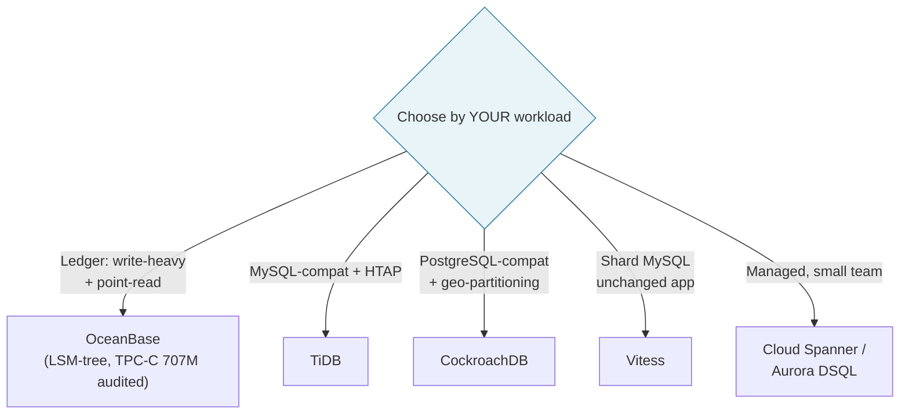
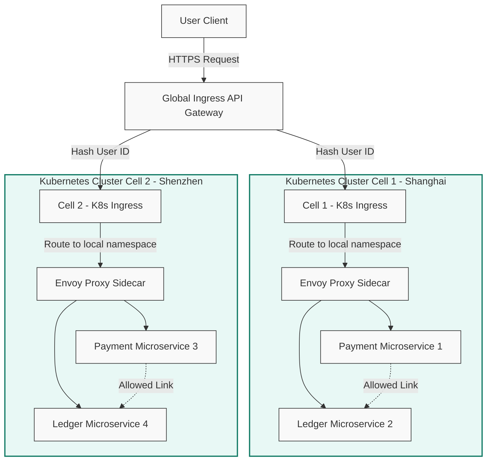

[🏛️ Anchor Pillar Hub #8: Alipay Double 11 Architecture (544K TPS)](/posts/alipay-double-11-architecture-tps/) | [🗺️ Sitewide Engineering Reading Map](/reading-map/)

---
[← Series hub](/series/alipay-double-11/)
[← Prev](/series/alipay-double-11/phase-4-deep-dive/) • [Next →](/series/alipay-double-11/phase-5-synthesis/)

> **Answer-first:** This guide maps Alipay's proprietary Double 11 technology stack to modern open-source CNCF alternatives. Custom LDC cell unitization maps to Kubernetes multi-cluster deployments with Envoy gateways, OceanBase maps to TiDB/CockroachDB distributed SQL, RocketMQ maps to Kafka/Pulsar streaming brokers, and SOFA RPC maps to gRPC with OpenTelemetry context propagation. This architecture enforces sub-50ms P99 latency guarantees and resilient component isolation.

> **Prerequisite:** [Phase 4B: Deep Dive (Technology Internals)](/series/alipay-double-11/phase-4-deep-dive/)

This page maps the architectural concepts and custom middleware developed for the Double 11 event to modern, open-source cloud-native equivalents. The goal is to provide a blueprint for software architects today to implement the same reliability and throughput patterns using standard CNCF (Cloud Native Computing Foundation) tools.

---

## 1) LDC Unitization vs. Kubernetes Multi-Cluster (Cells)



```mermaid
graph TD
    Q{"Choose by YOUR workload"}
    Q -->|"Ledger: write-heavy<br/>+ point-read"| OB["OceanBase<br/>(LSM-tree, TPC-C 707M audited)"]
    Q -->|"MySQL-compat + HTAP"| TIDB["TiDB"]
    Q -->|"PostgreSQL-compat<br/>+ geo-partitioning"| CRDB["CockroachDB"]
    Q -->|"Shard MySQL<br/>unchanged app"| VIT["Vitess"]
    Q -->|"Managed, small team"| MAN["Cloud Spanner /<br/>Aurora DSQL"]

    style Q fill:#e8f4f8,stroke:#2a7da0
```


> **Answer-first:** LDC unitization maps to Kubernetes multi-cluster cell deployments with eBPF Cilium ingress routers for regional user traffic partitioning.

In Alipay’s LDC architecture, the system is sharded into self-contained "RZones" that process user transaction requests locally. 

In a modern cloud-native stack, this pattern is represented by **Cell-Based Architecture** deployed across **Kubernetes Multi-Cluster** environments:
- **Tenancy and Routing**: A global ingress controller (such as Envoy Gateway, Cloudflare Workers, or Kong) acts as the LDC Unit Router. It hashes the user ID from incoming cookies or request headers using algorithms like **Ketama consistent hashing** or **MurmurHash3** and routes the connection to a specific Kubernetes cluster (cell) in a designated region. Envoy's dynamic routing tables are synchronized in real-time via the Route Discovery Service (RDS) and Endpoint Discovery Service (EDS) to bypass unhealthy clusters automatically.
- **Service Isolation**: The cell contains the entire service dependency tree. Using standard Kubernetes service mesh setups, communication is strictly bounded within the cluster's namespaces. Cross-cluster calls are prevented at the network policy tier using mutual TLS (mTLS) identities.

The following system design diagram illustrates how a modern API Gateway and Service Mesh topology routes traffic to multiple Kubernetes cluster cells, matching Alipay's LDC cell architecture:


```mermaid
graph TD
    User["User Client"] -->|"HTTPS Request"| Ingress["Global Ingress API Gateway"]
    Ingress -->|"Hash User ID"| Cell1_Ingress["Cell 1 - K8s Ingress"]
    Ingress -->|"Hash User ID"| Cell2_Ingress["Cell 2 - K8s Ingress"]

    subgraph Cluster1 ["Kubernetes Cluster Cell 1 - Shanghai"]
        Cell1_Ingress -->|"Route to local namespace"| MeshSidecar1["Envoy Proxy Sidecar"]
        MeshSidecar1 --> AppSvc1["Payment Microservice 1"]
        MeshSidecar1 --> AppSvc2["Ledger Microservice 2"]
        AppSvc1 -.->|"Allowed Link"| AppSvc2
    end

    subgraph Cluster2 ["Kubernetes Cluster Cell 2 - Shenzhen"]
        Cell2_Ingress -->|"Route to local namespace"| MeshSidecar2["Envoy Proxy Sidecar"]
        MeshSidecar2 --> AppSvc3["Payment Microservice 3"]
        MeshSidecar2 --> AppSvc4["Ledger Microservice 4"]
        AppSvc3 -.->|"Allowed Link"| AppSvc4
    end

    classDef default fill:#f9f9f9,stroke:#333,stroke-width:1px;
    classDef k8s fill:#e8f8f5,stroke:#117a65,stroke-width:2px;
    class Cluster1,Cluster2 k8s;
```

---

## 2) OceanBase vs. Modern Distributed Databases

**Answer-first:** OceanBase Paxos consensus engine maps to open-source distributed SQL engines like TiDB and CockroachDB for multi-region active-active storage.

OceanBase was engineered as a distributed SQL database to handle ACID transactions at high volume. Today, software architects can select from several open-source and managed distributed database engines:

### Side-by-Side Architectural Mapping:

The matrix below compares key replication, storage, and architectural metrics across OceanBase and modern distributed database platforms like CockroachDB, TiDB, and Vitess. This side-by-side mapping highlights how each engine balances distributed consensus, storage layout, and transactional capabilities under high-concurrency workloads.

| Architectural Metric | OceanBase | CockroachDB | TiDB (PingCAP) | Vitess |
|----------------------|-----------|-------------|----------------|--------|
| **Replication Protocol** | Multi-Paxos | Raft Consensus | Raft Consensus | Semi-Synchronous (MySQL-based) |
| **Storage Engine Architecture** | LSM-Tree (Append-only write optimization) | LSM-Tree (Pebbles storage engine) | LSM-Tree (TiKV based on RocksDB) | B+ Tree (InnoDB storage engines sharded manually) |
| **HTAP Support** | Yes (Hybrid Transactional/Analytical) | Yes (Vectorized execution engines) | Yes (TiFlash columnar engine integrations) | No (Pure transactional sharding) |
| **Primary Use Cases** | Large-scale banking ledgers, extreme write rates. | Geo-distributed consistency, multi-region compliance. | MySQL compatibility, mixed analytical/transactional workloads. | Scale existing MySQL applications without modifying SQL syntax. |

### Selecting the Right Database:
- If your system requires **geo-distribution and ease of operation**, **CockroachDB** provides a polished PostgreSQL-compatible engine with automated range sharding.
- If you are migrating a **large MySQL application** and need high horizontal write scale, **TiDB** is a strong fit.
- If you want to keep **standard MySQL instances** but scale them horizontally through proxy routing, **Vitess** (the engine used by YouTube) is the preferred choice. Vitess implements `vtgate` proxies and `vttablet` agents to manage routing and execute scatter-gather query execution patterns across shard tables, abstracting the complexity of manual partitions away from the application code.

---

## 3) Message Queues: RocketMQ vs. Kafka vs. Pulsar

RocketMQ sequential disk log architecture maps to NATS JetStream and Apache Pulsar for high-throughput async payment event decoupling.

At peak scale, the message broker's storage engine determines how it behaves under load.
- **RocketMQ Architecture**: RocketMQ writes all incoming messages to a centralized **CommitLog** sequentially, and background threads generate indexes in **ConsumeQueue** files. This sequential-write structure means that disk I/O remains stable even when millions of topics are written to concurrently.
- **Kafka Storage**: Kafka creates a separate partition directory on disk for each topic partition. While excellent for high-throughput streaming, writing to thousands of partitions concurrently turns sequential I/O into random disk seeks, causing disk saturation.
- **Pulsar Separation**: Pulsar separates compute (Brokers) from storage (Bookies running Apache BookKeeper). It is highly elastic but has a higher operational complexity.
- **Takeaway**: If your system has a small number of topics with massive throughput, Kafka is ideal. If you require millions of distinct, highly isolated transactional queues (e.g., one per user order stream), RocketMQ or Pulsar is the better fit.

---

## 4) SOFA RPC vs. gRPC

SOFA RPC binary protocol maps directly to gRPC with HTTP/2 multiplexing, protobuf contracts, and envoy service mesh sidecars.

Alipay's Bolt-based SOFA RPC is equivalent to **gRPC** utilizing HTTP/2:
- **Contract-First Design**: SOFA RPC defines interfaces in Java; gRPC uses **Protocol Buffers (protobuf)** to define APIs in a language-agnostic IDL, generating client and server stubs automatically in Go, Java, Rust, and Node.js.
- **Trace Context Propagation**: While SOFA RPC relies on custom headers in the Bolt protocol, gRPC uses **HTTP/2 Metadata Headers**. Libraries like OpenTelemetry automatically inject and extract trace contexts (such as W3C Traceparent headers) across HTTP/2 metadata boundaries, enabling distributed tracing out-of-the-box.

---

## 5) Go Concurrent Multi-Cell Aggregator (Go Snippet)

Go multi-cell aggregators use goroutine worker pools and fan-out channels to query distributed cell metrics in parallel.

When building cell-based architectures, sometimes the system must aggregate data from multiple cells concurrently (for example, generating a unified transaction history report for an executive dashboard).

The following production-ready Go implementation demonstrates a concurrent query aggregator that fetches metrics across multiple regional cell endpoints using goroutine worker pools and context-bounded HTTP clients:

```go
package main

import (
	"context"
	"encoding/json"
	"fmt"
	"net/http"
	"net/http/httptest"
	"sync"
	"time"
)

// CellResponse holds the query results from a specific regional cell
type CellResponse struct {
	CellID       string `json:"cell_id"`
	TransactionCount int    `json:"tx_count"`
	TotalVolume  float64 `json:"total_volume"`
	Error        string `json:"error,omitempty"`
}

// ConcurrentAggregator queries multiple cell endpoints concurrently
type ConcurrentAggregator struct {
	endpoints map[string]string
	client    *http.Client
}

func NewConcurrentAggregator(endpoints map[string]string) *ConcurrentAggregator {
	return &ConcurrentAggregator{
		endpoints: endpoints,
		client:    &http.Client{Timeout: 500 * time.Millisecond},
	}
}

// AggregateCellData queries all endpoints and returns consolidated metrics
func (ca *ConcurrentAggregator) AggregateCellData(ctx context.Context) ([]CellResponse, error) {
	// 1. Establish a bounded context timeout for the aggregate run
	timeoutCtx, cancel := context.WithTimeout(ctx, 300*time.Millisecond)
	defer cancel()

	results := make([]CellResponse, len(ca.endpoints))
	var wg sync.WaitGroup
	var idx int

	for cellID, url := range ca.endpoints {
		wg.Add(1)
		go func(i int, id string, endpointURL string) {
			defer wg.Done()
			
			res := CellResponse{CellID: id}
			req, err := http.NewRequestWithContext(timeoutCtx, "GET", endpointURL, nil)
			if err != nil {
				res.Error = err.Error()
				results[i] = res
				return
			}

			resp, err := ca.client.Do(req)
			if err != nil {
				res.Error = err.Error()
				results[i] = res
				return
			}
			defer resp.Body.Close()

			if resp.StatusCode != http.StatusOK {
				res.Error = fmt.Sprintf("invalid status code: %d", resp.StatusCode)
				results[i] = res
				return
			}

			if err := json.NewDecoder(resp.Body).Decode(&res); err != nil {
				res.Error = err.Error()
				results[i] = res
				return
			}

			results[i] = res
		}(idx, cellID, url)
		idx++
	}

	// Wait for either all goroutines to finish or the timeout context to expire
	ch := make(chan struct{})
	go func() {
		wg.Wait()
		close(ch)
	}()

	select {
	case <-timeoutCtx.Done():
		return results, fmt.Errorf("aggregation run hit timeout constraint: %w", timeoutCtx.Err())
	case <-ch:
		return results, nil
	}
}

func main() {
	// Setup mock cell endpoints
	cell1Server := httptest.NewServer(http.HandlerFunc(func(w http.ResponseWriter, r *http.Request) {
		w.WriteHeader(http.StatusOK)
		w.Write([]byte(`{"cell_id": "RZone1", "tx_count": 142000, "total_volume": 4200000.50}`))
	}))
	defer cell1Server.Close()

	cell2Server := httptest.NewServer(http.HandlerFunc(func(w http.ResponseWriter, r *http.Request) {
		// Simulate network latency in cell 2
		time.Sleep(100 * time.Millisecond)
		w.WriteHeader(http.StatusOK)
		w.Write([]byte(`{"cell_id": "RZone2", "tx_count": 98000, "total_volume": 2150000.20}`))
	}))
	defer cell2Server.Close()

	endpoints := map[string]string{
		"RZone1": cell1Server.URL,
		"RZone2": cell2Server.URL,
	}

	aggregator := NewConcurrentAggregator(endpoints)
	fmt.Println("Running multi-cell concurrent aggregation...")
	results, err := aggregator.AggregateCellData(context.Background())
	if err != nil {
		fmt.Printf("Warning: aggregation completed with errors: %v\n", err)
	}

	for _, res := range results {
		if res.Error != "" {
			fmt.Printf("Cell %s Failed: %s\n", res.CellID, res.Error)
		} else {
			fmt.Printf("Cell %s: Transactions = %d, Volume = $%.2f\n", res.CellID, res.TransactionCount, res.TotalVolume)
		}
	}
}
```

---

## 6) Decision Framework: Build vs. Adopt

The build vs. adopt framework guides teams to adopt open-source cloud-native standards unless traffic scale exceeds off-the-shelf limits.

If your system is not operating at peak scales of hundreds of thousands of TPS, you should avoid writing custom database protocols, RPC drivers, or messaging platforms from scratch. Building custom infrastructure increases your maintenance burden and diverts engineering focus away from business logic.

Instead, apply this **Adopt vs. Build Decision Matrix**:

| Architectural Pattern | Build Custom (Alipay Style) | Adopt Open-Source (Modern Style) |
|-----------------------|------------------------------|-----------------------------------|
| **Cell Routing** | Custom Java filter gateways. | Envoy Proxy + OpenTelemetry headers. |
| **Distributed Database**| Custom C++ core (OceanBase). | CockroachDB / TiDB / Vitess on SSDs. |
| **Service Communication**| Custom Bolt TCP protocol. | gRPC / protobuf with HTTP/2 multiplexing. |
| **Load Injection** | Custom FLST control server. | k6 / Locust load generation clusters. |
| **Messaging Buffer** | Custom RocketMQ brokers. | Apache Kafka / Pulsar with Raft consensus. |

---

## Key Takeaways

Modern cloud-native software allows teams to replicate Double 11 scale using standard Kubernetes, Go microservices, and distributed SQL.

1. **Use standard CNCF Tools**: Modern open-source solutions have matured to support the design patterns developed by Alipay. Use gRPC, Envoy, and Kubernetes to achieve cell-based scalability.
2. **Prioritize Declarative Configurations**: Avoid hardcoding routing rules inside your application code. Use service mesh definitions and gateway routing configurations to manage cells.
---

## Production Comparison Deep-Dive: OceanBase vs TiDB vs CockroachDB vs Vitess

**Answer-first:** When evaluating distributed NewSQL engines to replicate Alipay's 544,000 TPS scale, architects must select based on workload profile: OceanBase excels in extreme write-intensive financial ledgers with LSM-tree memory buffering; TiDB dominates in hybrid transactional/analytical processing (HTAP) with native MySQL wire compatibility; CockroachDB provides effortless multi-region PostgreSQL serializability; and Vitess offers horizontal MySQL sharding without consensus overhead.

### Comprehensive Distributed Database Architectural Trade-Off Matrix

| Architectural Dimension | OceanBase (Ant Group) | TiDB (PingCAP) | CockroachDB (Cockroach Labs) | Vitess (CNCF) |
|:---|:---|:---|:---|:---|
| **Consensus Protocol** | Multi-Paxos (Partition Group) | Multi-Raft (Region Groups) | Multi-Raft (Range Groups) | None (MySQL Master-Replica) |
| **Storage Engine** | In-Memory MemTable + SSTable (LSM) | RocksDB / TiKV (LSM) + TiFlash | Pebble (LSM) | InnoDB (B+ Tree) |
| **SQL Wire Protocol** | MySQL & Oracle Compatibility | MySQL 5.7 / 8.0 Protocol | PostgreSQL Wire Protocol | MySQL Wire Protocol |
| **Isolation Level** | Read Committed, Serializable | Snapshot Isolation, Read Committed | Serializable by Default | Read Committed, Repeatable Read |
| **TPC-C Benchmark World Record** | **707,351,007 tpmC (TPC-Audited)** | High Community Benchmarks | High Cloud Benchmarks | Powering YouTube / Slack Scale |
| **Primary Sweet Spot** | High-throughput write ledgers, banking cores | Real-time analytics + OLTP (HTAP), e-commerce | Global multi-region compliance, enterprise SaaS | Large existing MySQL fleets needing sharding |
| **Operational Complexity** | High (Bare-metal / custom operator) | Moderate (Kubernetes TiDB Operator) | Low-Moderate (Single binary / K8s operator) | High (VTGate, VTTablet, Keyspace setup) |

### The 5-Question Architecture Selection Framework

1. **Does the workload require real-time reporting on live operational data?**
   - If **YES**: Choose **TiDB** for its dedicated TiFlash vectorized columnar engine that queries real-time operational data without impacting TiKV transactional throughput.
2. **Is strict serializable isolation and PostgreSQL compatibility mandatory?**
   - If **YES**: Choose **CockroachDB** for its industry-standard serializability guarantees powered by Hybrid Logical Clocks (HLC).
3. **Is the workload characterized by extreme write bursts into append-only financial balance ledgers?**
   - If **YES**: Choose **OceanBase** because its MemTable memory-first write architecture buffers random transactional mutations in DRAM without write-stalls.
4. **Does the engineering organization possess an existing, massive MySQL monolith with custom SQL schemas?**
   - If **YES**: Choose **Vitess** to scale horizontally via application-transparent query routing (VTGate) while preserving underlying MySQL DBA operational tooling.
5. **What is the team's operational and infrastructure budget?**
   - If operating with a small team on public clouds without dedicated DBA support, managed services (Google Cloud Spanner, AWS Aurora DSQL, CockroachDB Dedicated, TiDB Cloud) eliminate self-hosted consensus maintenance risks.

---

🔗 **Next Step:** [Phase 5: Synthesis and Lessons Learned](/series/alipay-double-11/phase-5-synthesis/)

### The comparison integrity rule

Every benchmark number in this chapter belongs to a provenance class, and the classes never mix: TPC-C results (such as OceanBase's 707M tpmC) were audited by the TPC under published hardware configurations; vendor-self-reported figures were not; and community benchmarks measure yet other workloads on other hardware. Comparing a TPC-audited score against a self-reported one is not a comparison — it is a category error. The honest method used throughout: compare within the same audit regime, weight the dimensions your workload stresses, and treat every benchmark as a hypothesis to test against your own recorded traffic before money moves. The selection tree above encodes exactly this discipline — the final arbiter is always your workload, measured, not someone else's benchmark, quoted.


## Frequently Asked Questions


Global ingress routers like Envoy Gateway or Cloudflare Workers hash the incoming request user ID (e.g., via Ketama consistent hashing) and forward the traffic to a self-contained Kubernetes cluster cell. Each cell runs localized microservice replicas and isolated database shards, containing the blast radius of any regional infrastructure failure.



TiDB and CockroachDB serve as prime cloud-native distributed SQL alternatives, utilizing Raft consensus engines and LSM-tree/RocksDB storage for multi-region active-active deployment. TiDB offers full MySQL protocol compatibility and HTAP analytical capabilities, while CockroachDB excels at geo-distributed PostgreSQL compatibility and automatic range rebalancing.



Modern Go architectures utilize gRPC over HTTP/2 multiplexed connections alongside OpenTelemetry trace context propagation. HTTP/2 headers carry standardized W3C traceparent context across microservice boundaries, while goroutines execute parallel fan-out queries using bounded context timeouts to prevent thread exhaustion under heavy load.


### What the comparison deliberately does not do

This chapter does not crown a winner — the tables map each system to the workload class it was designed for, because that is the only honest comparison across differently-targeted systems. It also does not benchmark anything itself: every number cited comes from its provenance class, labeled. What it does do is shrink your evaluation space: arrive at the selection tree with your three constraints (financial envelope, workload shape, operational capacity) already written down, and three candidates emerge for a benchmark on your own recorded traffic — the only test that spends your money to answer your question.
### Figure ledger (years and sources)

| Figure | Value | Year | Source class |
|---|---|---|---|
| Payment record | 256,000 TPS | 2017 | Press (Wikipedia-cited) |
| Peak transactions | 544,000 TPS | 2019 | Ant-reported |
| Peak transactions | 583,000 TPS | 2020 | Ant-reported |
| OceanBase queries | 61M QPS | 2019–20 era | Ant-reported |
| TPC-C benchmark | 707M tpmC | 2019/2020 | TPC-audited |
| RocketMQ messages | 10M+ TPS | Double 11 era | Ant-reported |
| SOFARPC | 200k+ TPS | Double 11 era | Ant-reported |
| Reliability envelope | RPO=0 / RTO<2s / 99.99% | continuous | Ant-reported |

This series cites no bare number: every figure carries its year and provenance class. Ant-reported figures are closed-system disclosures — the TPC-C record is the only independently audited number in this ledger.

## 📚 Research Anchors

| Claim | Source |
|---|---|
| 544K TPS (2019), 583K TPS (2020), 61M QPS, 10M+ RocketMQ, SOFARPC 200k+ TPS | Ant Group public reporting (series corpus — closed system, cited as "Ant-reported") |
| TPC-C 707 million tpmC | TPC publicly audited results |
| GMV series 2009–2021; 256K TPS 2017 | Wikipedia: Singles' Day (citing Reuters/Bloomberg/CNBC/MarketWatch) |
| This chapter's architecture | Series corpus (corresponding Phase) |

Full research dossiers: `reports/research-alipay-executive-summary-100-rounds.{md,json}` (Ch1 figure ledger) + `research-alipay-phases-consolidated-100-rounds.md` (Ch2–Ch9 consolidated plan), mirrored in both repositories. Grounding note: peak figures are Ant-reported (closed system); the TPC-C record is the only independently audited number.

---

## Architectural Context & Pillar References

To explore how these modern cloud-native comparisons translate into production benchmarks and enterprise scaling strategies, review the following guides:
- [Alipay Double 11: 544,000 TPS Architecture Explained](/posts/alipay-double-11-architecture-tps/)
- [PayPay Architecture & Scaling Playbook](/posts/paypay-architecture-scaling/)