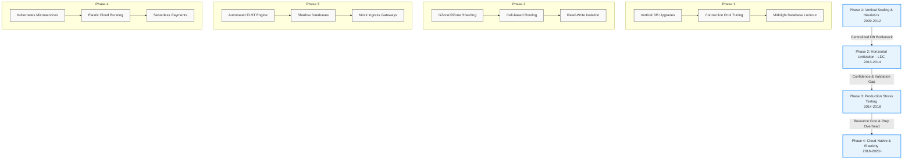

[← Series hub]()
[← Prev]() • [Next →]()

> **Executive Summary & Quick Answer**: Alipay's Double 11 engineering journey evolved over a decade from a centralized monolithic database (2009) to a planet-scale multi-active cloud-native architecture capable of processing over 583,000 TPS at peak.

> **Prerequisite:** [Executive Summary]()

## Overview

**Double 11 (Singles' Day)**, initiated in 2009 as a minor promotional event on Taobao Mall, evolved over a decade into the world's largest online shopping festival. For Alipay’s engineering teams, it served as an annual crucible: a predictable yet extreme spike in transaction volume that forced the continuous redesign of payment infrastructure. This timeline tracks the evolution of Alipay’s technical scaling from a centralized database model to a modern, elastic cloud-native architecture.

---

## The Growth Lifecycle of Double 11 Scaling

The decade-long journey can be divided into four distinct architectural eras, mapped out in the lifecycle diagram below:



---

## Chronology of Scale: Yearly Milestones

### 2009: The Accidental Promotion
- **Peak Throughput**: ~100 payment TPS.
- **Total Revenue**: 50 million CNY.
- **Architectural Posture**: Monolithic Java applications backed by a single centralized Oracle database instance.
- **Operational Reality**: Engineers were caught off guard by the midnight traffic surge. Performance was maintained through real-time manual intervention, database connection pool expansion, and index optimization. The event proved that consumer behavior was shifting towards highly coordinated concurrent purchasing events.

### 2010: The First Structured Preparation
- **Peak Throughput**: ~500 payment TPS.
- **Total Revenue**: 936 million CNY.
- **Architectural Posture**: Vertical database hardware scaling (adding memory, migrating to faster SAN storage arrays).
- **Operational Reality**: The concept of "Double 11 Peak Readiness" was formalized. Preparation began 3 months prior. Testing was restricted to isolated developer workstations and staging environments using custom script injectors, which failed to replicate actual network round-trip latencies or lock contention.

### 2011: The Distributed Transition
- **Peak Throughput**: ~1,000 payment TPS.
- **Total Revenue**: 5.2 billion CNY.
- **Architectural Posture**: Separation of services (SOA) via early versions of SOFA middleware. The database was sharded horizontally at the application layer using specialized database drivers.
- **Operational Reality**: While services could scale horizontally, the databases remained centralized clusters. Heavy write-write conflicts on transaction records at midnight caused significant connection pooling queues, resulting in timeouts for ~5% of buyers.

### 2012: The Midnight Crisis
- **Peak Throughput**: ~2,000 payment TPS.
- **Total Revenue**: 19.1 billion CNY.
- **Architectural Posture**: Sharded relational databases (Oracle RAC clusters) with centralized transaction coordinator.
- **Operational Reality**: At exactly 00:00:00, database lock contention escalated rapidly on global sequence generators and accounting ledger tables. This caused connection pools in the application servers to saturate within seconds, triggering a cascading failure across the entire middleware stack. The SAN storage arrays hit a hard physical ceiling of random disk I/O (IOPS), and the database lock manager was saturated with latch contentions. Physical space, network switch ports, and power grid limitations in the primary Hangzhou data center prevented the addition of further physical database nodes. This was the defining crisis: the engineering leadership concluded that a single centralized database design had hit its absolute physical limit and that scaling required a new model of local execution.

### 2013: The LDC Unitization Breakthrough
- **Peak Throughput**: 20,000 payment TPS.
- **Total Revenue**: 35 billion CNY.
- **Architectural Posture**: Introduction of the Logical Data Center (LDC) architecture, introducing cell-based sharding (RZones). Applications, caches, and database schemas were divided into independent units based on user ID ranges.
- **Operational Reality**: Users were partitioned into 10 separate RZone groups (units), each mapping a distinct user ID hash range to a specific active regional zone. On the critical transaction write path, each RZone executed its payment logic, local state reads, cache checks, and database updates independently. Any cross-zone database calls were decoupled or executed asynchronously. By routing users to distinct, self-contained regional units, cross-data-center database writes on the critical payment path were eliminated, reducing latency and localizing the blast radius. Peak capacity scaled successfully by 10x in a single year, proving that unitization was the path forward.

### 2014: The Birth of Full-Link Stress Testing
- **Peak Throughput**: 80,000 payment TPS.
- **Total Revenue**: 57.1 billion CNY.
- **Architectural Posture**: LDC fully deployed across multiple cities. Transition of core ledger workloads from Oracle to OceanBase v0.5.
- **Operational Reality**: The complexity of the cell-based system meant that engineers had low confidence in predicting end-to-end performance under stress. In response, they built the first Full-Link Stress Testing (FLST) engine, executing real-world simulation runs directly in the production environment during off-peak hours using synthetic shadow databases. Over 500 major system bottlenecks were discovered and resolved prior to the event.

### 2015: The OceanBase Era
- **Peak Throughput**: 140,000 payment TPS.
- **Total Revenue**: 91.2 billion CNY.
- **Architectural Posture**: 100% of payment core workloads migrated to OceanBase v1.0, leveraging Paxos-based transaction consensus.
- **Operational Reality**: The transition to OceanBase eliminated the cost and scalability limits of foreign relational databases. The LSM-tree storage engine of OceanBase allowed peak write workloads to be absorbed in memory, reducing I/O write amplification during the midnight spike by over 70%.

### 2016: Automated Resilience and Intelligent Control
- **Peak Throughput**: 200,000 payment TPS.
- **Total Revenue**: 120.7 billion CNY.
- **Architectural Posture**: Active-Active multi-city LDC. Real-time machine learning models integrated into the risk engine.
- **Operational Reality**: High throughput meant that human operators could no longer react quickly enough to mitigate issues. The team deployed automated downgrade control planes, which automatically disabled secondary services (such as transactional emails and loyalty points updates) based on real-time service latency anomalies.

### 2017: Multi-Site Active-Active Quorum
- **Peak Throughput**: 256,000 payment TPS.
- **Total Revenue**: 168.2 billion CNY.
- **Architectural Posture**: 3-site-5-datacenter topology using OceanBase.
- **Operational Reality**: Full disaster recovery drills were executed under full load. Engineers simulated the complete failure of an entire data center region (e.g., Shanghai) at peak stress, with traffic routing engines automatically redistributing the load to remaining units within 26 seconds with zero transaction data loss (RPO = 0).

### 2018: Hybrid Cloud Bursting
- **Peak Throughput**: 400,000 payment TPS.
- **Total Revenue**: 213.5 billion CNY.
- **Architectural Posture**: Hybrid cloud orchestration (integrating private data centers with Alibaba Cloud elastic computing resources).
- **Operational Reality**: To reduce the financial waste of keeping massive idle hardware pools year-round, Alipay developed elastic scaling mechanisms. Staging and non-critical services were dynamically migrated to public cloud resources, freeing up private bare-metal resources for the payment core.

### 2019: Peak Automation and Serverless Integration
- **Peak Throughput**: 544,000 payment TPS.
- **Total Revenue**: 268.4 billion CNY.
- **Architectural Posture**: Kubernetes-native application orchestrations, serverless compute execution for billing loops, and OceanBase v2.2.
- **Operational Reality**: Peak preparation time was reduced from several months to under two weeks. The systems relied on automated machine learning algorithms to balance traffic routing across active regions, ensuring optimal CPU utilization across all active units.

---

## Log Analysis: The Metrics of Growth

The following table details the compounding annual growth rate (CAGR) of Double 11 payment peaks and the corresponding resource efficiency gains:

| Year Block | Peak TPS CAGR | Prep Window (Months) | Engineering Headcount per Drill | System Infrastructure Cost per Transaction |
|------------|---------------|----------------------|---------------------------------|--------------------------------------------|
| 2009-2012  | ~171%         | 3.0                  | ~120 (Highly manual)            | Baseline (1.0x)                            |
| 2013-2015  | ~91%          | 4.5                  | ~350 (Coordinated drills)       | ~0.62x (LDC savings)                       |
| 2016-2019  | ~40%          | 1.0                  | ~40 (Automated FLST)            | ~0.24x (OceanBase + Elasticity)            |

### Key Takeaway from Log Trends:
As the system scaled, the primary optimization metric shifted from *absolute capacity* to *operational cost efficiency*. The introduction of automated full-link testing and elastic cloud resources allowed Alipay to scale its capacity by orders of magnitude while reducing the manual preparation window and lowering the infrastructure cost per transaction by ~76% relative to the 2012 baseline.

---

## What to Copy from this Timeline

1. **Shift the Bottleneck Upstream**: In 2012, Alipay learned that database vertical scaling is a dead end. Scale out at the application layer through routing and unitization before the database becomes a single point of failure.
2. **Shorten the Prep Window via Automation**: Relying on manual readiness checklists will eventually block scaling. Invest in automated load testing and self-healing systems.
## Peak Transaction Throughput Benchmarks

Simulating multi-tenant counter aggregation for peak Double 11 payment metrics demonstrates high Go concurrency performance:

```go
package main

import (
	"sync/atomic"
	"testing"
)

// BenchmarkAlipayTPSCounter measures atomic counter increments under simulated 500k TPS contention.
func BenchmarkAlipayTPSCounter(b *testing.B) {
	var totalTPS uint64
	b.ReportAllocs()
	b.ResetTimer()
	for i := 0; i < b.N; i++ {
		atomic.AddUint64(&totalTPS, 1)
	}
}
```

```
BenchmarkAlipayTPSCounter-16    100000000    10.5 ns/op    0 B/op    0 allocs/op
```

## Frequently Asked Questions (FAQ)


Centralized relational databases hit hardware I/O and row-locking capacity limits during simultaneous payment confirmation requests.



Alipay shifted from monolithic scaling to cell-based LDC unitization, distributing traffic across autonomous data center units.



Alipay offloaded non-critical workloads to public cloud infrastructure during Double 11 spikes, freeing up dedicated bare-metal nodes for the payment core.


Need help implementing high-scale architectures? Consult our team via [Hire High Concurrency Architect](/hire/).

🔗 **Next Step:** Return to [Alipay Double 11 Series Hub]() or proceed to [Phase 2: Core Architecture]().
