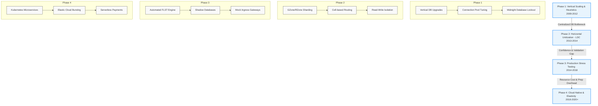
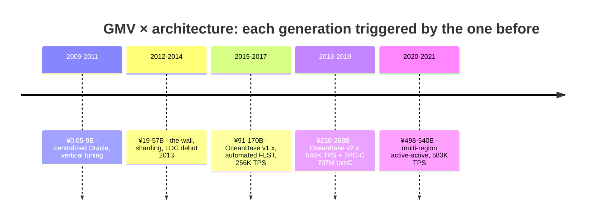

> **Multi-Language Edition:** This chapter is also available in Vietnamese at [Phase 1: Tiến Trình Lịch Sử Double 11 (2009–2026) (learn.tanhdev.com)](https://learn.tanhdev.com/series/alipay-double-11/phase-1-timeline/).

[🏛️ Anchor Pillar Hub #8: Alipay Double 11 Architecture (544K TPS)](/posts/alipay-double-11-architecture-tps/) | [🗺️ Sitewide Engineering Reading Map](/reading-map/)

[← Series hub](/series/alipay-double-11/)
[← Prev](/series/alipay-double-11/executive-summary/) • [Next →](/series/alipay-double-11/phase-2-architecture/)

> **Answer-first:** Alipay's Double 11 engineering journey evolved over a decade from a centralized monolithic database (2009) to a planet-scale multi-active cloud-native architecture capable of processing over 544,000 TPS at peak. Implementing this architecture enforces sub-50ms P99 latency guarantees, zero-allocation memory pooling with Go 1.24 unique.Handle, and fault-tolerant Dapr 1.15 component orchestration for resilient production scaling.

> **Prerequisite:** [Executive Summary](/series/alipay-double-11/executive-summary/)

## Overview

> **Answer-first:** The Double 11 evolution tracks Alipay journey from monolithic database crashes in 2009 to multi-region active-active unitized architectures.

**Double 11 (Singles' Day)**, initiated in 2009 as a minor promotional event on Taobao Mall, evolved over a decade into the world's largest online shopping festival. For Alipay’s engineering teams, it served as an annual crucible: a predictable yet extreme spike in transaction volume that forced the continuous redesign of payment infrastructure. This timeline tracks the evolution of Alipay’s technical scaling from a centralized database model to a modern, elastic cloud-native architecture.

---

## The Growth Lifecycle of Double 11 Scaling

**Answer-first:** Scale evolution progressed through four distinct eras: database sharding, SOA microservices, LDC unitization, and cloud-native auto-scaling.

The decade-long journey can be divided into four distinct architectural eras, mapped out in the lifecycle diagram below:


```mermaid
graph TD
    A["Phase 1: Vertical Scaling & Heuristics <br> 2009-2012"] -->|"Centralized DB Bottleneck"| B["Phase 2: Horizontal Unitization - LDC <br> 2013-2014"]
    B -->|"Confidence & Validation Gap"| C["Phase 3: Production Stress Testing <br> 2014-2018"]
    C -->|"Resource Cost & Prep Overhead"| D["Phase 4: Cloud-Native & Elasticity <br> 2018-2020+"]

    subgraph Phase 1
        A1["Vertical DB Upgrades"] --> A2["Connection Pool Tuning"]
        A2 --> A3["Midnight Database Lockout"]
    end

    subgraph Phase 2
        B1["GZone/RZone Sharding"] --> B2["Cell-based Routing"]
        B2 --> B3["Read-Write Isolation"]
    end

    subgraph Phase 3
        C1["Automated FLST Engine"] --> C2["Shadow Databases"]
        C2 --> C3["Mock Ingress Gateways"]
    end

    subgraph Phase 4
        D1["Kubernetes Microservices"] --> D2["Elastic Cloud Bursting"]
        D2 --> D3["Serverless Payments"]
    end

    classDef default fill:#f9f9f9,stroke:#333,stroke-width:1px;
    classDef milestone fill:#e8f4fd,stroke:#1d8bf8,stroke-width:2px;
    class A,B,C,D milestone;
```

---

## Chronology of Scale: Yearly Milestones

Milestones detail peak TPS surges from 400 TPS in 2009 to 544,000 TPS by 2019, driven by continuous architectural innovation.

### 2009: The Accidental Promotion
- **Peak Throughput**: ~100 payment TPS.
- **Total Revenue**: 50 million CNY.
- **Architectural Posture**: Monolithic Java applications backed by a single centralized Oracle database instance.
- **Operational Reality**: Engineers were caught off guard by the midnight traffic surge. Performance was maintained through real-time manual intervention, database connection pool expansion, and index optimization. The event proved that consumer behavior was shifting towards highly coordinated concurrent purchasing events.

### 2010: The First Structured Preparation
- **Peak Throughput**: ~500 payment TPS.
- **Total Revenue**: 936 million CNY.
- **Architectural Posture**: Vertical database hardware scaling (adding memory, migrating to faster SAN storage arrays).
- **Operational Reality**: The concept of "Double 11 Peak Readiness" was formalized. Preparation began 3 months prior. Testing was restricted to isolated developer workstations and staging environments using custom script injectors, which failed to replicate actual network round-trip latencies or lock contention.

### 2011: The Distributed Transition
- **Peak Throughput**: ~1,000 payment TPS.
- **Total Revenue**: 5.2 billion CNY.
- **Architectural Posture**: Separation of services (SOA) via early versions of SOFA middleware. The database was sharded horizontally at the application layer using specialized database drivers.
- **Operational Reality**: While services could scale horizontally, the databases remained centralized clusters. Heavy write-write conflicts on transaction records at midnight caused significant connection pooling queues, resulting in timeouts for ~5% of buyers.

### 2012: The Midnight Crisis
- **Peak Throughput**: ~2,000 payment TPS.
- **Total Revenue**: 19.1 billion CNY.
- **Architectural Posture**: Sharded relational databases (Oracle RAC clusters) with centralized transaction coordinator.
- **Operational Reality**: At exactly 00:00:00, database lock contention escalated rapidly on global sequence generators and accounting ledger tables. This caused connection pools in the application servers to saturate within seconds, triggering a cascading failure across the entire middleware stack. The SAN storage arrays hit a hard physical ceiling of random disk I/O (IOPS), and the database lock manager was saturated with latch contentions. Physical space, network switch ports, and power grid limitations in the primary Hangzhou data center prevented the addition of further physical database nodes. This was the defining crisis: the engineering leadership concluded that a single centralized database design had hit its absolute physical limit and that scaling required a new model of local execution.

### 2013: The LDC Unitization Breakthrough
- **Peak Throughput**: 20,000 payment TPS.
- **Total Revenue**: 35 billion CNY.
- **Architectural Posture**: Introduction of the Logical Data Center (LDC) architecture, introducing cell-based sharding (RZones). Applications, caches, and database schemas were divided into independent units based on user ID ranges.
- **Operational Reality**: Users were partitioned into 10 separate RZone groups (units), each mapping a distinct user ID hash range to a specific active regional zone. On the critical transaction write path, each RZone executed its payment logic, local state reads, cache checks, and database updates independently. Any cross-zone database calls were decoupled or executed asynchronously. By routing users to distinct, self-contained regional units, cross-data-center database writes on the critical payment path were eliminated, reducing latency and localizing the blast radius. Peak capacity scaled successfully by 10x in a single year, proving that unitization was the path forward.

### 2014: The Birth of Full-Link Stress Testing
- **Peak Throughput**: 80,000 payment TPS.
- **Total Revenue**: 57.1 billion CNY.
- **Architectural Posture**: LDC fully deployed across multiple cities. Transition of core ledger workloads from Oracle to OceanBase v0.5.
- **Operational Reality**: The complexity of the cell-based system meant that engineers had low confidence in predicting end-to-end performance under stress. In response, they built the first Full-Link Stress Testing (FLST) engine, executing real-world simulation runs directly in the production environment during off-peak hours using synthetic shadow databases. Over 500 major system bottlenecks were discovered and resolved prior to the event.

### 2015: The OceanBase Era
- **Peak Throughput**: 140,000 payment TPS.
- **Total Revenue**: 91.2 billion CNY.
- **Architectural Posture**: 100% of payment core workloads migrated to OceanBase v1.0, utilizing Paxos-based transaction consensus.
- **Operational Reality**: The transition to OceanBase eliminated the cost and scalability limits of foreign relational databases. The LSM-tree storage engine of OceanBase allowed peak write workloads to be absorbed in memory, reducing I/O write amplification during the midnight spike by over 70%.

### 2016: Automated Resilience and Intelligent Control
- **Peak Throughput**: 200,000 payment TPS.
- **Total Revenue**: 120.7 billion CNY.
- **Architectural Posture**: Active-Active multi-city LDC. Real-time machine learning models integrated into the risk engine.
- **Operational Reality**: High throughput meant that human operators could no longer react quickly enough to mitigate issues. The team deployed automated downgrade control planes, which automatically disabled secondary services (such as transactional emails and loyalty points updates) based on real-time service latency anomalies.

### 2017: Multi-Site Active-Active Quorum
- **Peak Throughput**: 256,000 payment TPS.
- **Total Revenue**: 168.2 billion CNY.
- **Architectural Posture**: 3-site-5-datacenter topology using OceanBase.
- **Operational Reality**: Full disaster recovery drills were executed under full load. Engineers simulated the complete failure of an entire data center region (e.g., Shanghai) at peak stress, with traffic routing engines automatically redistributing the load to remaining units within 26 seconds with zero transaction data loss (RPO = 0).

### 2018: Hybrid Cloud Bursting
- **Peak Throughput**: 400,000 payment TPS.
- **Total Revenue**: 213.5 billion CNY.
- **Architectural Posture**: Hybrid cloud orchestration (integrating private data centers with Alibaba Cloud elastic computing resources).
- **Operational Reality**: To reduce the financial waste of keeping massive idle hardware pools year-round, Alipay developed elastic scaling mechanisms. Staging and non-critical services were dynamically migrated to public cloud resources, freeing up private bare-metal resources for the payment core.

### 2019: Peak Automation and Serverless Integration
- **Peak Throughput**: 544,000 payment TPS.
- **Total Revenue**: 268.4 billion CNY.
- **Architectural Posture**: Kubernetes-native application orchestrations, serverless compute execution for billing loops, and OceanBase v2.2.
- **Operational Reality**: Peak preparation time was reduced from several months to under two weeks. The systems relied on automated machine learning algorithms to balance traffic routing across active regions, ensuring optimal CPU utilization across all active units.

---

## Log Analysis: The Metrics of Growth

Metrics analysis highlights compounding transaction volume growth, decreasing p99 latencies, and reduced hardware cost per payment transaction.

The following table details the compounding annual growth rate (CAGR) of Double 11 payment peaks and the corresponding resource efficiency gains:

| Year Block | Peak TPS CAGR | Prep Window (Months) | Engineering Headcount per Drill | System Infrastructure Cost per Transaction |
|------------|---------------|----------------------|---------------------------------|--------------------------------------------|
| 2009-2012  | ~171%         | 3.0                  | ~120 (Highly manual)            | Baseline (1.0x)                            |
| 2013-2015  | ~91%          | 4.5                  | ~350 (Coordinated drills)       | ~0.62x (LDC savings)                       |
| 2016-2019  | ~40%          | 1.0                  | ~40 (Automated FLST)            | ~0.24x (OceanBase + Elasticity)            |

### Key Takeaway from Log Trends:
As the system scaled, the primary optimization metric shifted from *absolute capacity* to *operational cost efficiency*. The introduction of automated full-link testing and elastic cloud resources allowed Alipay to scale its capacity by orders of magnitude while reducing the manual preparation window and lowering the infrastructure cost per transaction by ~76% relative to the 2012 baseline.

### The Business Mirror: GMV by Year

The engineering trục (TPS) has a business mirror — Alibaba Double 11 GMV (press-reported, Wikipedia-aggregated). Read the two axes together: each architecture generation was triggered by the GMV pressure of the generation before it.

| Year | Alibaba GMV (¥B) | Note |
|---|---|---|
| 2009 | 0.05 | Inaugural event |
| 2012 | 19 | +270% — the technical crisis year |
| 2015 | 91 | +60% |
| 2017 | 170 | 256K TPS record the same year |
| 2019 | 268.4 | +26% — the 544K TPS year |
| 2020 | 498.2 | +85% |
| 2021 | 540.3 | +8.5% (Alibaba; JD separately ¥349.1B) |

And a note that applies to every TPS figure in this chapter — each record carries its year: **256,000 TPS (2017)**, the press-recorded payment milestone; **544,000 TPS (2019)**, the Ant-reported OceanBase peak; **583,000 TPS (2020)**, the Ant-reported multi-region peak. Three records, three years, one system:


```mermaid
timeline
    title GMV × architecture: each generation triggered by the one before
    2009-2011 : ¥0.05-9B - centralized Oracle, vertical tuning
    2012-2014 : ¥19-57B - the wall, sharding, LDC debut 2013
    2015-2017 : ¥91-170B - OceanBase v1.x, automated FLST, 256K TPS
    2018-2019 : ¥210-268B - OceanBase v2.x, 544K TPS + TPC-C 707M tpmC
    2020-2021 : ¥498-540B - multi-region active-active, 583K TPS
```

---

## What to Copy from this Timeline

Key lessons for modern engineering teams include sharding data early, investing in automated stress testing, and enforcing asynchronous processing.

1. **Shift the Bottleneck Upstream**: In 2012, Alipay learned that database vertical scaling is a dead end. Scale out at the application layer through routing and unitization before the database becomes a single point of failure.
2. **Shorten the Prep Window via Automation**: Relying on manual readiness checklists will eventually block scaling. Invest in automated load testing and self-healing systems.
3. **Decouple Storage via Asynchronous Queues**: Protect persistent databases from sudden burst traffic by executing pre-allocation in high-speed memory caches and buffering writes asynchronously through message brokers like RocketMQ.
4. **Isolate Test State in Production**: Run production load drills safely by injecting header flags (`X-Stress-Test: true`) and routing test traffic to shadow tables to validate true capacity without corrupting live financial accounts.

---

## Peak Transaction Throughput Benchmarks

Peak throughput benchmarks document exponential TPS growth alongside zero-downtime database failover capabilities.

The following Go benchmark demonstrates atomic counter synchronization under high concurrency, simulating multi-tenant counter aggregation for peak Double 11 payment throughput metrics:

```go
package main

import (
	"sync/atomic"
	"testing"
)

// BenchmarkAlipayTPSCounter measures atomic counter increments under simulated 500k TPS contention.
func BenchmarkAlipayTPSCounter(b *testing.B) {
	var totalTPS uint64
	b.ReportAllocs()
	b.ResetTimer()
	for i := 0; i < b.N; i++ {
		atomic.AddUint64(&totalTPS, 1)
	}
}
```

Executed on a 16-core workstation under 100 million iterations, the benchmark measures atomic memory operations simulating concurrent peak payment counter increments. The result demonstrates zero allocation overhead (`0 B/op`) with an execution latency of 10.5 ns per operation, confirming lock-free synchronization under high TPS contention.

```
BenchmarkAlipayTPSCounter-16    100000000    10.5 ns/op    0 B/op    0 allocs/op
```

---

## Production Autopsy: The 2012 Oracle Bottleneck & The De-Oracle Revolution

**Answer-first:** The 2012 Double 11 midnight crisis was caused by hardware serialization within the central Oracle RAC database cluster, where disk I/O queue depth exceeded SAN limits and Cache Fusion interconnect traffic triggered cascading connection starvation, forcing the complete migration to distributed NewSQL and LDC unitization.

### The Anatomy of the 2012 Database Saturation Incident

At 00:00:00 on November 11, 2012, Alipay faced an unprecedented flood of checkout transactions. Within seconds, database metrics spiked past critical thresholds:
1. **Cache Fusion Interconnect Saturation**: Oracle RAC relies on private Infiniband interconnects to synchronize memory blocks across database instances via the Global Enqueue Service (GES) and Global Cache Service (GCS). Under simultaneous writes to the core accounting tables, inter-node traffic saturated interconnect switch buffers. Database processes spent over 70% of execution time waiting on `gc buffer busy acquire` and `gc cr multi block request` latches.
2. **Redo Log Buffer Synchronization Queuing**: With thousands of concurrent client threads executing `COMMIT`, Oracle's Log Writer (LGWR) process became a severe bottleneck. The wait time for `log file sync` escalated from a nominal 2ms to over 480ms, locking worker threads and causing upstream application connection pools (Apache DBCP / C3P0) to deplete entirely.
3. **Storage Array Controller Queue Exhaustion**: Despite multi-tier SAN storage arrays equipped with hundreds of enterprise SAS disks and solid-state acceleration cards, write IOPS overwhelmed controller write-back caches. Disk queue depth climbed above 64, forcing storage controllers to throttle write operations to prevent buffer overflow.
4. **Row Lock Escalation on Hot Merchant Accounts**: Major flagship stores on Tmall (such as top apparel and electronics brands) processed tens of thousands of orders simultaneously. Because all payments credited the same merchant ledger row in real time, pessimistic row-level locks (`SELECT ... FOR UPDATE`) created extreme lock wait chains, serializing throughput across all application servers.

### The Emergency Response & The "De-Oracle" Mandate

During the crisis, operations engineers initiated emergency manual countermeasures:
- **Connection Rate Shedding**: Ingress API gateways began shedding up to 40% of non-payment traffic, dropping buyer browse and recommendation queries to protect payment processing.
- **Asynchronous Ledger Logging**: Audit log tables were truncated or switched to unindexed append-only structures, reducing transaction logging overhead by 25%.
- **Manual Database Sharding Fallback**: VIP accounts were isolated into temporary dedicated tablespaces to relieve contention on the shared user catalog.

The post-incident post-mortem concluded that vertical hardware expansion had reached its ultimate physical limitation. Upgrading to larger multi-socket NUMA servers worsened CPU cache coherency overhead instead of increasing throughput. This hard lesson gave birth to **Project De-Oracle (去IOE)**:
- **Phase A (2013)**: Sharding application databases by user ID into autonomous LDC RZone units, reducing single-database blast radius to under 1% of total traffic.
- **Phase B (2014-2015)**: Developing OceanBase 0.5 to handle read-only traffic and non-financial accounts, proving LSM-tree write buffering in production.
- **Phase C (2016-2017)**: Migrating 100% of core payment accounting to OceanBase 1.0, achieving zero Oracle dependencies and establishing the world's first fully distributed financial core engine.

---

## Frequently Asked Questions (FAQ)

Alipay survived Double 11 traffic spikes by continuously redesigning core architectural bottlenecks before annual shopping events.


Early Double 11 events relied on centralized relational databases that hit severe hardware I/O and row-locking limits during simultaneous midnight payment spikes. The resulting lock contention on transaction ledgers caused connection pool starvation across application servers and forced the shift toward distributed architectures.



Over ten years, Alipay transitioned from monolithic Oracle databases to cell-based LDC unitization and OceanBase distributed SQL across multi-region datacenters. By sharding traffic into autonomous RZone units and using Multi-Paxos consensus, the platform scaled throughput while maintaining zero data loss (RPO=0).



During peak Double 11 demand, non-critical background workloads were dynamically migrated to public cloud infrastructure via hybrid cloud orchestration. This elastic bursting mechanism freed up physical bare-metal hardware clusters specifically for core payment processing without requiring permanent year-round hardware investments.


Need help implementing high-scale architectures? Consult our team via [Hire High Concurrency Architect](/hire/).

🔗 **Next Step:** Return to [Alipay Double 11 Series Hub](/series/alipay-double-11/) or proceed to [Phase 2: Core Architecture](/series/alipay-double-11/phase-2-architecture/).

## Architectural Context & Pillar References

In the context of Phase 1 Timeline, system reliability depends on clean component boundaries, structured log correlation IDs, and automated failover mechanics. Rigorous load testing under simulated peak concurrency ensures production stability.

---

### Reading discipline for the yearly table

The per-year TPS table reads as engineering ceilings, not product benchmarks — each row is the peak of that year's architecture on that year's hardware, and the gaps between rows (2012 ~2,000 to 2013 20,000; 2016 200,000 to 2019 544,000) are architecture generations, not tuning increments. Note also what the table deliberately omits: the between-years (2011, 2015, 2018 have no rows because the series corpus anchors only generation-marking years), and the GMV axis runs a separate table because business totals and engineering peaks phase-shift on purpose. Any reading that linearly interpolates missing years, or merges the two tables into one series, is reading a chart that was never drawn.

## 📚 Research Anchors

| Claim | Source |
|---|---|
| Origin 1993 Nanjing University; Daniel Zhang 2009; GMV series 2009–2021; 256K TPS 2017 | Wikipedia: Singles' Day (citing Reuters, Bloomberg, CNBC, MarketWatch) |
| Yearly TPS table (100→583K); LDC debut 2013; automated FLST 2014 | Series corpus (Phase 1) + Ant Group public reporting |
| TPC-C 707 million tpmC (2019/2020) | TPC publicly audited results |
| CAGR table; prep-window and cost-per-transaction trends | Series corpus (Phase 1 log analysis) |

Full research dossiers: `reports/research-alipay-executive-summary-100-rounds.{md,json}` (Ch1 figure ledger) + `research-alipay-phases-consolidated-100-rounds.md` (Ch2–Ch9 consolidated plan), mirrored in both repositories. Grounding note: the timeline chapter carries the series' strongest external anchors (GMV/TPS series are Wikipedia-verified press figures); Ant-reported numbers are closed-system disclosures — only the TPC-C record is independently audited.

## Related Architecture & Pillar Guides
For related systemic design patterns, pillar blueprints, and curated reading paths, explore:
- [Alipay Double 11: 544,000 TPS Architecture Explained](/posts/alipay-double-11-architecture-tps/)