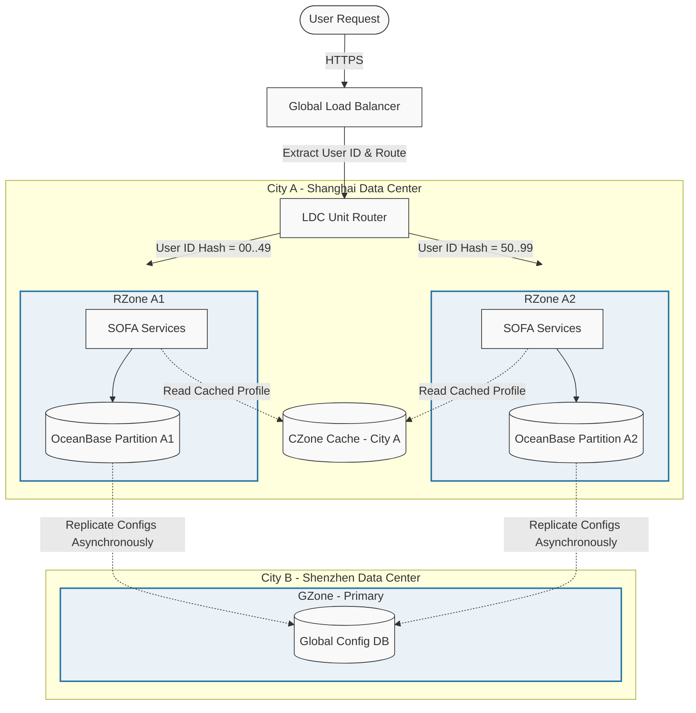

[← Series hub]()
[← Prev]() • [Next →]()

> **Prerequisite:** Before reading this part, please ensure you have read the previous article in this series: [Phase 1: Timeline and Scale Evolution]().

This phase focuses on the **architectural blueprint** that enables planetary scaling while preserving absolute transactional correctness and operational control. The core design philosophy is: *scale through containment, not coordination.*

---

## 2.1 LDC and Unitization (Cell Architecture)

### The Core Idea: Unitization

In traditional distributed architectures, application servers are stateless, but they talk to a single centralized database cluster. As traffic grows, this centralized database becomes a bottleneck. You can split the application layer infinitely, but the database eventually runs out of CPU cores, memory, or disk bandwidth.

The **Logical Data Center (LDC)** architecture solves this by breaking the application and storage tiers into independent, self-contained units (cells) called **RZones**.
- **Self-contained in services**: Each unit runs the entire application service stack needed to complete a payment transaction.
- **Partitioned in data**: The database is sharded such that each unit owns a unique subset of the data (e.g., partitioned by user ID ranges).
- **Localized in execution**: A request is routed to the unit owning the user's data. All reads and writes on the critical transaction path are executed within that single unit. There are no cross-unit database transactions.

### LDC Zone Topology

The LDC model divides data and services into three distinct zones:
1. **RZone (Regional Zone / Unit)**: The active processing zones. These are sharded by user ID. If user `12345` is assigned to RZone 1, all of their balance changes, transaction history, and order processing are executed inside RZone 1.
2. **GZone (Global Zone)**: Holds global read-heavy data that cannot be sharded easily (e.g., merchant registries, currency exchange rates). GZones use master-slave replication to distribute read-only copies to all RZones, eliminating remote reads.
3. **CZone (City Zone)**: A shared hot cache layer located in the same city as the active RZones. Used to share metadata that is updated frequently but does not require instant read-after-write consistency (e.g., user login states).

The overall zone topology and request routing flow is illustrated below:



---

## 2.2 LDC Unit Router Implementation (Go Snippet)

Below is a simplified Go implementation of the LDC cell routing logic, illustrating user ID hashing, cell mapping tables, failover states, and trace context injection.

```go
package main

import (
	"context"
	"crypto/md5"
	"encoding/binary"
	"errors"
	"fmt"
	"sync"
)

// Cell represents an LDC Regional Zone unit
type Cell struct {
	ID       string
	City     string
	Active   bool
	Endpoint string
}

// UnitRouter manages the routing tables and cell mapping
type UnitRouter struct {
	mu           sync.RWMutex
	cells        map[string]*Cell
	hashRingSize uint32
}

func NewUnitRouter() *UnitRouter {
	return &UnitRouter{
		cells:        make(map[string]*Cell),
		hashRingSize: 100, // Partition users into 100 bucket ranges
	}
}

func (ur *UnitRouter) AddCell(cell *Cell) {
	ur.mu.Lock()
	defer ur.mu.Unlock()
	ur.cells[cell.ID] = cell
}

func (ur *UnitRouter) SetCellStatus(cellID string, active bool) {
	ur.mu.Lock()
	defer ur.mu.Unlock()
	if cell, exists := ur.cells[cellID]; exists {
		cell.Active = active
	}
}

// RouteRequest calculates the target Cell based on user ID MD5 hash
func (ur *UnitRouter) RouteRequest(ctx context.Context, userID string) (*Cell, error) {
	ur.mu.RLock()
	defer ur.mu.RUnlock()

	if len(ur.cells) == 0 {
		return nil, errors.New("no cells available in the LDC routing table")
	}

	// 1. Hash the user ID
	hasher := md5.New()
	hasher.Write([]byte(userID))
	hashBytes := hasher.Sum(nil)
	
	// Convert first 4 bytes to uint32
	val := binary.BigEndian.Uint32(hashBytes[0:4])
	bucket := val % ur.hashRingSize

	// 2. Map bucket to Cell ID (Conceptual layout: 0-49 -> RZone1, 50-99 -> RZone2)
	var targetCellID string
	if bucket < 50 {
		targetCellID = "RZone1"
	} else {
		targetCellID = "RZone2"
	}

	targetCell, exists := ur.cells[targetCellID]
	if !exists {
		return nil, fmt.Errorf("mapped cell ID %s not found in routing table", targetCellID)
	}

	// 3. Handle Failover routing if the cell is degraded
	if !targetCell.Active {
		// Fallback to secondary active cell in case of disaster
		for _, altCell := range ur.cells {
			if altCell.ID != targetCellID && altCell.Active {
				return altCell, nil // Routed with failover policy
			}
		}
		return nil, fmt.Errorf("primary cell %s is INACTIVE and no active fallback cell is available", targetCellID)
	}

	return targetCell, nil
}

func main() {
	router := NewUnitRouter()
	router.AddCell(&Cell{ID: "RZone1", City: "Shanghai", Active: true, Endpoint: "sh-cell-1.internal"})
	router.AddCell(&Cell{ID: "RZone2", City: "Shenzhen", Active: true, Endpoint: "sz-cell-2.internal"})

	// Simulated requests
	users := []string{"usr_9921", "usr_0023", "usr_7761"}
	for _, user := range users {
		cell, err := router.RouteRequest(context.Background(), user)
		if err != nil {
			fmt.Printf("Error routing user %s: %v\n", user, err)
			continue
		}
		fmt.Printf("User %s routed to cell %s in %s (Endpoint: %s)\n", user, cell.ID, cell.City, cell.Endpoint)
	}
}
```

---

## 2.3 Database Layer: OceanBase

Traditional sharded databases struggle with cross-shard operations and master-slave replication lag. Under Double 11 peak load, replication lag can lead to "double spend" or incorrect balances if a database failover occurs. Alipay solved this by deploying **OceanBase**, which utilizes the following design features:

### 1. Paxos-Based Consensus Replication
Instead of asynchronous master-slave replication, OceanBase replicates transaction logs (CLogs) using the Multi-Paxos consensus protocol. A transaction is only committed when a quorum of nodes (e.g., 3 out of 5 nodes in a 3-site-5-datacenter configuration) acknowledges receipt of the commit log. This guarantees:
- **Zero data loss**: RPO = 0. Even if a data center burns down, the remaining nodes hold a consistent state.
- **Automated recovery**: RTO < 30 seconds. The Paxos group elects a new leader automatically without administrator intervention.

### 2. LSM-Tree Storage Engine
Traditional databases use B+ Trees, which require random updates to data blocks on disk. At midnight, the sheer write load would saturate the storage disk arrays. OceanBase uses a Log-Structured Merge-tree (LSM-tree):
- **MemTable**: All active insert, update, and delete transactions are written to an in-memory buffer (MemTable) and sequentially appended to the Commit Log on SSDs.
- **SSTable**: During off-peak periods, the MemTable is frozen and merged sequentially with the static disk storage (SSTable) in a process called "compaction". This eliminates random disk I/O under peak transaction load.

---

## 2.4 Messaging and Asynchronous Boundaries (RocketMQ)

Not all operations must be synchronous. For example, while checking balance and securing inventory must be synchronous on the critical path, updating reward points, sending push notifications, and updating sales dashboards can be deferred.

Alipay uses **RocketMQ** to decouple these systems:
- **Peak Buffering**: RocketMQ acts as a buffer, accepting millions of events per second and allowing downstream consumers to process them at their own pace without crashing.
- **Transactional Messaging**: To ensure that the database state and message state remain consistent, RocketMQ supports transactional messages. A message is only sent to consumers if the local database transaction commits successfully.
- **Idempotency Guarantees**: Downstream consumers enforce strict idempotency checks using transaction IDs, preventing double-processing of payment events.

---

## 2.5 Reliability Patterns Comparison

To understand the resilience of the unitized LDC architecture, we can review the following recovery matrix:

| Failure Mode | Direct Impact | LDC Containment/Recovery Strategy |
|--------------|---------------|-----------------------------------|
| **Single Application Node Failure** | Loss of capacity inside a cell. | SOFA middleware removes the node from service discovery; traffic redistributes within the cell. |
| **Local Database Disk Failure** | OceanBase partition leader offline. | Paxos consensus elects a follower replica in another rack within 500ms; transaction resumes. |
| **Complete Data Center Outage** | Whole RZone goes offline. | LDC Unit Router modifies routing tables; user requests are directed to fallback cells in another city. |
| **Replication Link Jitter** | Network latency spike between regions. | Paxos consensus only requires a local city quorum (e.g., 3 out of 5), avoiding cross-city latency blocks. |

---

## Key Takeaways

1. **Unitization is the scaling unlock**: it turns vertical ceilings into horizontal growth.
2. **The database must be designed for peak correctness**: correctness and durability are part of the product.
3. **Messaging is a reliability primitive**: it’s not only “async,” it’s peak control.
4. **Architecture only works when operations are deterministic**: that’s Phase 3.

---

## References & Further Reading

- [Alipay Logical Data Center (LDC) Architecture](https://www.alibabacloud.com/blog/how-alipay-supports-double-11-with-logical-data-center-architecture_594892)
- [OceanBase: Handling Double 11 Peak Traffic](https://en.oceanbase.com/)
