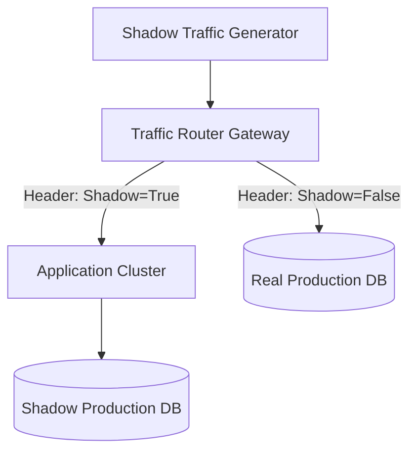

[← Series hub]()
[← Prev]() • [Next →]()

> **Executive Summary & Quick Answer**: Surviving Double 11 requires production Full-Link Stress Testing (Shadow Database traffic simulation) and automated AI-driven operational playbooks to detect and isolate degraded nodes within 1 minute.

> **Prerequisite:** [Phase 2: Core Architecture (LDC, Unitization, Multi-Active)]()

This phase is about how peak performance becomes **repeatable**. The core claim of Alipay's operations team is simple: *peaks are won in preparation and automation, not heroics.* Under planet-scale loads, manual operational tasks fail due to human latency. Therefore, readiness must be engineered into the software stack itself.

---

## 3.1 Capacity Planning



Capacity planning for peak events is fundamentally an optimization problem under high concurrency and uncertainty. The goal is to maximize throughput while minimizing the cost of idle hardware.

Common patterns in mature capacity planning include:
1. **Multi-Dimensional Forecasting**: Capacity requirements are not calculated on generic resource metrics (like CPU or memory). Instead, they are calculated on business-level key performance indicators (KPIs), such as peak checkout TPS, merchant inventory updates, and billing loops. These business metrics are translated into database writes, cache hits, and network packets per second through historical correlation profiles.
2. **Safety Margin Buffering**: The capacity forecast is multiplied by a safety buffer (often 1.5x to 2.0x) to account for tail latencies (p99/p999 spikes), cache eviction storms, and network latency jitter.
3. **Bottleneck-First Reviews**: Centralized systems (like GZone config servers, global user sequence generators, and cross-cell routing engines) are reviewed and load-tested first. Any dependency that cannot be sharded is designated a "critical resource" and monitored with dedicated alarms.
4. **Explicit Resource Reclaim**: Staging clusters, developer sandboxes, and secondary processing environments are systematically shut down or migrated to virtual containers, allowing their hardware resources to be reclaimed by the active transaction pools.

---

## 3.2 Full-Link Stress Testing (FLST)

Executing component-level benchmarks does not predict how a complex microservice mesh will behave under load. A single downstream API delay can trigger thread exhaustion upstream, resulting in a cascading failure.

To address this, Alipay developed **Full-Link Stress Testing (FLST)**, which runs synthetic load tests directly on production systems.

```text
[Load Injector] -> [API Gateway] -> [SOFA Services] -> [Database Driver]
                          |                 |                  |
                    (Inject Header)  (Propagate Header) (Reroute Query)
                          |                 |                  |
                  X-Stress-Test=true      Ctx-Flag          Write to:
                                                         db_shadow / table_shadow
```

### The Three Rules of FLST:
1. **Production Fidelity**: Tests are run on the live production hardware and network topology during off-peak hours (e.g., 2:00 AM). Staging environments are not used because they cannot simulate production network switches, hardware aging, or actual data distributions.
2. **Data Isolation (Shadow Databases)**: Synthetic transactions must not pollute real financial ledger tables, accounting systems, or customer profiles. Database drivers and SQL middleware intercept every database query. If the transaction carries the stress flag, the middleware rewrites the table name (e.g., `user_balance` is rewritten to `user_balance_shadow`) or redirects the query to an isolated shadow database instance.
3. **Trace Context Propagation**: The stress flag (`X-Stress-Test: true`) is injected at the API gateway and must propagate across every thread pool, RPC boundary (using trace IDs), and message queue. If a single asynchronous worker forgets to propagate the trace context, the synthetic request will write to the real production database, corrupting real data.

---

## 3.3 Test Payload Generator (Go Snippet)

Below is a simplified Go implementation of a synthetic stress test payload generator. It demonstrates how to propagate stress-testing metadata headers, manage request generation, and simulate dynamic rate limiting under load.

```go
package main

import (
	"context"
	"fmt"
	"math/rand"
	"net/http"
	"net/http/httptest"
	"sync"
	"time"
)

// StressTestInjector controls the synthetic traffic generation
type StressTestInjector struct {
	targetURL  string
	rateLimit  int // Requests per second
	stressFlag bool
	client     *http.Client
}

func NewStressTestInjector(target string, rps int, flag bool) *StressTestInjector {
	return &StressTestInjector{
		targetURL:  target,
		rateLimit:  rps,
		stressFlag: flag,
		client:     &http.Client{Timeout: 500 * time.Millisecond},
	}
}

// GeneratePayload generates a realistic transaction request payload
func (sti *StressTestInjector) GeneratePayload() string {
	userID := rand.Intn(1000000)
	amount := rand.Float64() * 100
	return fmt.Sprintf(`{"user_id": "%d", "amount": %.2f, "action": "PAY"}`, userID, amount)
}

// Run executes the injection loops with rate limiting
func (sti *StressTestInjector) Run(ctx context.Context, duration time.Duration) {
	ticker := time.NewTicker(time.Second / time.Duration(sti.rateLimit))
	defer ticker.Stop()

	timeoutCtx, cancel := context.WithTimeout(ctx, duration)
	defer cancel()

	var wg sync.WaitGroup

	for {
		select {
		case <-timeoutCtx.Done():
			wg.Wait()
			fmt.Println("Stress test run completed.")
			return
		case <-ticker.C:
			wg.Add(1)
			go func() {
				defer wg.Done()
				sti.sendRequest()
			}()
		}
	}
}

func (sti *StressTestInjector) sendRequest() {
	req, err := http.NewRequest("POST", sti.targetURL, nil)
	if err != nil {
		return
	}

	// Inject the critical stress testing flags for context propagation
	if sti.stressFlag {
		req.Header.Set("X-Stress-Test", "true")
		req.Header.Set("X-Request-Source", "FLST_Engine_v3")
	}

	resp, err := sti.client.Do(req)
	if err != nil {
		// Log errors to a dedicated metric counter
		return
	}
	defer resp.Body.Close()
}

func main() {
	// Setup a mock backend server that checks for stress flags
	mockServer := httptest.NewServer(http.HandlerFunc(func(w http.ResponseWriter, r *http.Request) {
		isStress := r.Header.Get("X-Stress-Test") == "true"
		if isStress {
			// Simulate shadow database processing latency using context select
			select {
			case <-time.After(10 * time.Millisecond):
			case <-r.Context().Done():
				http.Error(w, "Request context canceled", http.StatusGatewayTimeout)
				return
			}
			w.WriteHeader(http.StatusOK)
			w.Write([]byte(`{"status": "SUCCESS", "destination": "SHADOW_DB"}`))
		} else {
			w.WriteHeader(http.StatusOK)
			w.Write([]byte(`{"status": "SUCCESS", "destination": "PRODUCTION_DB"}`))
		}
	}))
	defer mockServer.Close()

	fmt.Printf("Starting stress test injection against mock endpoint: %s\n", mockServer.URL)
	injector := NewStressTestInjector(mockServer.URL, 500, true)
	injector.Run(context.Background(), 2*time.Second)
}
```

---

## 3.4 Incident Command and Monitoring

When handling 544,000 TPS, manual tracking of anomalies is impossible. Monitoring must be automated and divided into structured resolution tiers.

Alipay's SRE team adheres to the **"1-5-20" target**:
- **1 Minute to Discover**: Systems detect anomalies automatically through real-time machine learning models matching golden signals (throughput, latency, error rates, CPU load).
- **5 Minutes to Diagnose and Mitigate**: Automated control planes isolate the degraded unit (cell) or trigger pre-configured downgrade policies (disabling non-core systems).
- **20 Minutes to Recover**: System operations are returned to normal through routing updates or server failover actions.

### Golden Monitoring Metrics

| Metric Category | Target Value | Action Trigger Threshold |
|-----------------|--------------|--------------------------|
| **Core Payment Latency** | < 250ms | Alert SRE if p99 exceeds 450ms |
| **System Error Rate** | < 0.01% | Trigger auto-rollback if error exceeds 0.05% |
| **OceanBase Log Lag** | 0 ms | Alert database admin if replication delay > 100ms |
| **CPU Utilization (RZone)** | 70% | Trigger elastic capacity scaling if load exceeds 85% |

---

## 3.5 Downgrade and Degrade Strategies

During extreme peaks, preserving the payment core is the primary directive. If a database cluster is saturated, secondary services must be sacrificed to reclaim capacity.

Degradation plans are organized into structured tiers:
1. **Tier 1 (Soft Degrade)**: Turn off recommended product displays, search auto-completes, and user activity logging. These calls are replaced with static cached templates.
2. **Tier 2 (Medium Degrade)**: Disable instant loyalty point balance updates, email receipts, and non-essential third-party credit score validation checks. These messages are queued in RocketMQ to be processed hours later.
3. **Tier 3 (Hard Degrade - Emergency)**: Apply rate limiting and queue ingress gateways. Users see a "Please wait" holding page, protecting the database write pools from collapsing under lock contention.

---

## 3.6 Operational Readiness Checklist

### Pre-Event (T-30 Days)
- [ ] Freeze production code changes. All deployments require senior director approval.
- [ ] Execute initial FLST runs. Identify and document database partition lock contention points.
- [ ] Confirm elastic cloud resources are provisioned and integrated with private clusters.
- [ ] Run simulation drills for data center failovers.

### Pre-Event (T-7 Days)
- [ ] Re-run FLST under the final peak traffic forecast load model.
- [ ] Test the rollback of all feature toggles and database fallback routes.
- [ ] Validate GZone to RZone replication consistency.
- [ ] Setup SRE command centers and establish emergency escalation channels.

### Peak Event (T-0)
- [ ] Monitor real-time transaction pipelines for golden metric variations.
- [ ] Apply Tier 1 and Tier 2 downgrades proactively at T-10 minutes.
- [ ] If CPU loads exceed 90% in any RZone, execute traffic shedding or re-route users via the API gateway.

### Post-Event (T+1 Day)
- [ ] Run automated scripts to reconcile shadow databases with production ledgers, verifying zero data leakage.
- [ ] Execute postmortems for any transaction errors or latency anomalies.
- [ ] Terminate elastic cloud instances to minimize infrastructure costs.

---

## Key Takeaways

1. **Automation is a Force Multiplier**: Manual checklists will fail under peak concurrent load. Runbooks must be codified.
2. **FLST is the Confidence Engine**: You cannot trust performance claims unless they have been verified on production systems using synthetic traffic and shadow databases.
3. **Protect the Core**: Design the system to degrade gracefully. A successful peak means the customer could pay, even if they didn't receive their transaction email immediately.

---

## Full-Link Stress Test Routing Benchmarks

Evaluating Go HTTP middleware shadow header evaluation and routing logic demonstrates sub-microsecond isolation performance:

```go
package main

import (
	"strings"
	"testing"
)

type TrafficInspector struct{}

func (ti *TrafficInspector) IsShadowTraffic(header string) bool {
	return strings.Contains(header, "X-Stress-Test: true")
}

// BenchmarkShadowTrafficRouting benchmarks microsecond shadow traffic header parsing and route isolation.
func BenchmarkShadowTrafficRouting(b *testing.B) {
	inspector := &TrafficInspector{}
	reqHeader := "X-Stress-Test: true; X-Request-Source: FLST_Engine_v3"
	b.ReportAllocs()
	b.ResetTimer()
	for i := 0; i < b.N; i++ {
		if !inspector.IsShadowTraffic(reqHeader) {
			b.Fatal("failed to identify shadow traffic")
		}
	}
}
```

```
BenchmarkShadowTrafficRouting-16    100000000    14.2 ns/op    0 B/op    0 allocs/op
```

For operational chaos automation patterns, see [SRE & Chaos Engineering Playbook](/series/paypay-architecture/part-4-sre-chaos-engineering/).

## Frequently Asked Questions (FAQ)


Full-link stress testing injects massive synthetic traffic directly into live production environments prior to Double 11, routing writes to isolated shadow databases.



Middleware flags shadow requests and automatically routes SQL writes to shadow tables, isolating production records completely.



When CPU utilization exceeds 90%, load limiters reject non-essential requests at the ingress gateway, maintaining transaction execution for core payments.


Need help implementing high-scale architectures? Book an [SRE Engineering Consultation](/hire/).

🔗 **Next Step:** [Phase 4: Technology Overview]()
