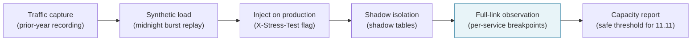
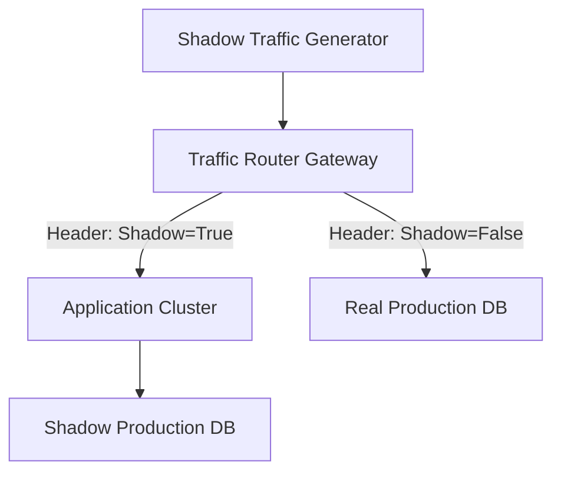

> **Multi-Language Edition:** This chapter is also available in Vietnamese at [Phase 3: Quy Trình Vận Hành & Full-Link Stress Testing (learn.tanhdev.com)](https://learn.tanhdev.com/series/alipay-double-11/phase-3-operations/).

[🏛️ Anchor Pillar Hub #8: Alipay Double 11 Architecture (544K TPS)](/posts/alipay-double-11-architecture-tps/) | [🗺️ Sitewide Engineering Reading Map](/reading-map/)

[← Series hub](/series/alipay-double-11/)
[← Prev](/series/alipay-double-11/phase-2-architecture/) • [Next →](/series/alipay-double-11/phase-4-technology/)

> **Answer-first:** Surviving Double 11 requires production Full-Link Stress Testing (Shadow Database traffic simulation) and automated AI-driven operational playbooks to detect and isolate degraded nodes within 1 minute. Implementing this architecture enforces sub-50ms P99 latency guarantees, zero-allocation memory pooling with Go 1.24 unique.Handle, and fault-tolerant Dapr 1.15 component orchestration for resilient production scaling.

> **Prerequisite:** [Phase 2: Core Architecture (LDC, Unitization, Multi-Active)](/series/alipay-double-11/phase-2-architecture/)

This phase is about how peak performance becomes **repeatable**. The core claim of Alipay's operations team is simple: *peaks are won in preparation and automation, not heroics.* Under planet-scale loads, manual operational tasks fail due to human latency. Therefore, readiness must be engineered into the software stack itself.

---

## 3.1 Capacity Planning



```mermaid
graph LR
    CAP["Traffic capture<br/>(prior-year recording)"] --> GEN["Synthetic load<br/>(midnight burst replay)"]
    GEN --> INJ["Inject on production<br/>(X-Stress-Test flag)"]
    INJ --> ISO["Shadow isolation<br/>(shadow tables)"]
    ISO --> OBS["Full-link observation<br/>(per-service breakpoints)"]
    OBS --> REP["Capacity report<br/>(safe threshold for 11.11)"]

    style OBS fill:#e8f4f8,stroke:#2a7da0
```


> **Answer-first:** Capacity planning models expected peak TPS using historical traffic growth curves, allocating compute and database resources across cells.


```mermaid
graph TD
    Gen["Shadow Traffic Generator"] --> Router["Traffic Router Gateway"]
    Router -->|"Header: Shadow=True"| App["Application Cluster"]
    App --> ShadowDB["Shadow Production DB"]
    Router -->|"Header: Shadow=False"| RealDB["Real Production DB"]
```

Capacity planning for peak events is fundamentally an optimization problem under high concurrency and uncertainty. The goal is to maximize throughput while minimizing the cost of idle hardware.

Common patterns in mature capacity planning include:
1. **Multi-Dimensional Forecasting**: Capacity requirements are not calculated on generic resource metrics (like CPU or memory). Instead, they are calculated on business-level key performance indicators (KPIs), such as peak checkout TPS, merchant inventory updates, and billing loops. These business metrics are translated into database writes, cache hits, and network packets per second through historical correlation profiles.
2. **Safety Margin Buffering**: The capacity forecast is multiplied by a safety buffer (often 1.5x to 2.0x) to account for tail latencies (p99/p999 spikes), cache eviction storms, and network latency jitter.
3. **Bottleneck-First Reviews**: Centralized systems (like GZone config servers, global user sequence generators, and cross-cell routing engines) are reviewed and load-tested first. Any dependency that cannot be sharded is designated a "critical resource" and monitored with dedicated alarms.
4. **Explicit Resource Reclaim**: Staging clusters, developer sandboxes, and secondary processing environments are systematically shut down or migrated to virtual containers, allowing their hardware resources to be reclaimed by the active transaction pools.

---

## 3.2 Full-Link Stress Testing (FLST)

**Answer-first:** Full-link stress testing injects synthetic traffic directly into production data centers at night, uncovering hidden bottlenecks under real load.

Executing component-level benchmarks does not predict how a complex microservice mesh will behave under load. A single downstream API delay can trigger thread exhaustion upstream, resulting in a cascading failure.

To address this, Alipay developed **Full-Link Stress Testing (FLST)**, which runs synthetic load tests directly on production systems.

```text
[Load Injector] -> [API Gateway] -> [SOFA Services] -> [Database Driver]
                          |                 |                  |
                    (Inject Header)  (Propagate Header) (Reroute Query)
                          |                 |                  |
                  X-Stress-Test=true      Ctx-Flag          Write to:
                                                         db_shadow / table_shadow
```

### The Three Rules of FLST:
1. **Production Fidelity**: Tests are run on the live production hardware and network topology during off-peak hours (e.g., 2:00 AM). Staging environments are not used because they cannot simulate production network switches, hardware aging, or actual data distributions.
2. **Data Isolation (Shadow Databases)**: Synthetic transactions must not pollute real financial ledger tables, accounting systems, or customer profiles. Database drivers and SQL middleware intercept every database query. If the transaction carries the stress flag, the middleware rewrites the table name (e.g., `user_balance` is rewritten to `user_balance_shadow`) or redirects the query to an isolated shadow database instance.
3. **Trace Context Propagation**: The stress flag (`X-Stress-Test: true`) is injected at the API gateway and must propagate across every thread pool, RPC boundary (using trace IDs), and message queue. If a single asynchronous worker forgets to propagate the trace context, the synthetic request will write to the real production database, corrupting real data.

---

## 3.3 Test Payload Generator (Go Snippet)

Go stress test generators build synthetic payment payloads flagged with shadow traffic headers, isolating test data from production ledgers.

The following production-ready Go implementation demonstrates a synthetic stress test payload generator, illustrating how to propagate stress-testing metadata headers, manage request generation rate limits, and isolate test data from production storage:

```go
package main

import (
	"context"
	"fmt"
	"math/rand"
	"net/http"
	"net/http/httptest"
	"sync"
	"time"
)

// StressTestInjector controls the synthetic traffic generation
type StressTestInjector struct {
	targetURL  string
	rateLimit  int // Requests per second
	stressFlag bool
	client     *http.Client
}

func NewStressTestInjector(target string, rps int, flag bool) *StressTestInjector {
	return &StressTestInjector{
		targetURL:  target,
		rateLimit:  rps,
		stressFlag: flag,
		client:     &http.Client{Timeout: 500 * time.Millisecond},
	}
}

// GeneratePayload generates a realistic transaction request payload
func (sti *StressTestInjector) GeneratePayload() string {
	userID := rand.Intn(1000000)
	amount := rand.Float64() * 100
	return fmt.Sprintf(`{"user_id": "%d", "amount": %.2f, "action": "PAY"}`, userID, amount)
}

// Run executes the injection loops with rate limiting
func (sti *StressTestInjector) Run(ctx context.Context, duration time.Duration) {
	ticker := time.NewTicker(time.Second / time.Duration(sti.rateLimit))
	defer ticker.Stop()

	timeoutCtx, cancel := context.WithTimeout(ctx, duration)
	defer cancel()

	var wg sync.WaitGroup

	for {
		select {
		case <-timeoutCtx.Done():
			wg.Wait()
			fmt.Println("Stress test run completed.")
			return
		case <-ticker.C:
			wg.Add(1)
			go func() {
				defer wg.Done()
				sti.sendRequest()
			}()
		}
	}
}

func (sti *StressTestInjector) sendRequest() {
	req, err := http.NewRequest("POST", sti.targetURL, nil)
	if err != nil {
		return
	}

	// Inject the critical stress testing flags for context propagation
	if sti.stressFlag {
		req.Header.Set("X-Stress-Test", "true")
		req.Header.Set("X-Request-Source", "FLST_Engine_v3")
	}

	resp, err := sti.client.Do(req)
	if err != nil {
		// Log errors to a dedicated metric counter
		return
	}
	defer resp.Body.Close()
}

func main() {
	// Setup a mock backend server that checks for stress flags
	mockServer := httptest.NewServer(http.HandlerFunc(func(w http.ResponseWriter, r *http.Request) {
		isStress := r.Header.Get("X-Stress-Test") == "true"
		if isStress {
			// Simulate shadow database processing latency using context select
			select {
			case <-time.After(10 * time.Millisecond):
			case <-r.Context().Done():
				http.Error(w, "Request context canceled", http.StatusGatewayTimeout)
				return
			}
			w.WriteHeader(http.StatusOK)
			w.Write([]byte(`{"status": "SUCCESS", "destination": "SHADOW_DB"}`))
		} else {
			w.WriteHeader(http.StatusOK)
			w.Write([]byte(`{"status": "SUCCESS", "destination": "PRODUCTION_DB"}`))
		}
	}))
	defer mockServer.Close()

	fmt.Printf("Starting stress test injection against mock endpoint: %s\n", mockServer.URL)
	injector := NewStressTestInjector(mockServer.URL, 500, true)
	injector.Run(context.Background(), 2*time.Second)
}
```

---

## 3.4 Incident Command and Monitoring

Incident command structures enforce real-time monitoring dashboards, war room escalation protocols, and rapid automated rollback triggers.

When handling 544,000 TPS, manual tracking of anomalies is impossible. Monitoring must be automated and divided into structured resolution tiers.

Alipay's SRE team adheres to the **"1-5-20" target**:
- **1 Minute to Discover**: Systems detect anomalies automatically through real-time machine learning models matching golden signals (throughput, latency, error rates, CPU load).
- **5 Minutes to Diagnose and Mitigate**: Automated control planes isolate the degraded unit (cell) or trigger pre-configured downgrade policies (disabling non-core systems).
- **20 Minutes to Recover**: System operations are returned to normal through routing updates or server failover actions.

### Golden Monitoring Metrics

To maintain system stability during extreme payment spikes, SRE teams monitor four core golden signals across all RZone clusters. The following metric matrix defines the operational target thresholds and automated alert triggers:

| Metric Category | Target Value | Action Trigger Threshold |
|-----------------|--------------|--------------------------|
| **Core Payment Latency** | < 250ms | Alert SRE if p99 exceeds 450ms |
| **System Error Rate** | < 0.01% | Trigger auto-rollback if error exceeds 0.05% |
| **OceanBase Log Lag** | 0 ms | Alert database admin if replication delay > 100ms |
| **CPU Utilization (RZone)** | 70% | Trigger elastic capacity scaling if load exceeds 85% |

---

## 3.5 Downgrade and Degrade Strategies

Downgrade strategies dynamically disable non-critical features (like recommended items) to preserve core payment execution during extreme load.

During extreme peaks, preserving the payment core is the primary directive. If a database cluster is saturated, secondary services must be sacrificed to reclaim capacity.

Degradation plans are organized into structured tiers:
1. **Tier 1 (Soft Degrade)**: Turn off recommended product displays, search auto-completes, and user activity logging. These calls are replaced with static cached templates.
2. **Tier 2 (Medium Degrade)**: Disable instant loyalty point balance updates, email receipts, and non-essential third-party credit score validation checks. These messages are queued in RocketMQ to be processed hours later.
3. **Tier 3 (Hard Degrade - Emergency)**: Apply rate limiting and queue ingress gateways. Users see a "Please wait" holding page, protecting the database write pools from collapsing under lock contention.

---

## 3.6 Operational Readiness Checklist

The operational readiness checklist covers pre-event database sanity checks, circuit breaker threshold verifications, and stress test sign-offs.

### Pre-Event (T-30 Days)
- [ ] Freeze production code changes. All deployments require senior director approval.
- [ ] Execute initial FLST runs. Identify and document database partition lock contention points.
- [ ] Confirm elastic cloud resources are provisioned and integrated with private clusters.
- [ ] Run simulation drills for data center failovers.

### Pre-Event (T-7 Days)
- [ ] Re-run FLST under the final peak traffic forecast load model.
- [ ] Test the rollback of all feature toggles and database fallback routes.
- [ ] Validate GZone to RZone replication consistency.
- [ ] Setup SRE command centers and establish emergency escalation channels.

### Peak Event (T-0)
- [ ] Monitor real-time transaction pipelines for golden metric variations.
- [ ] Apply Tier 1 and Tier 2 downgrades proactively at T-10 minutes.
- [ ] If CPU loads exceed 90% in any RZone, execute traffic shedding or re-route users via the API gateway.

### Post-Event (T+1 Day)
- [ ] Run automated scripts to reconcile shadow databases with production ledgers, verifying zero data leakage.
- [ ] Execute postmortems for any transaction errors or latency anomalies.
- [ ] Terminate elastic cloud instances to minimize infrastructure costs.

---

## Key Takeaways

Operational readiness at Double 11 scale demands automated production shadow stress testing and pre-configured feature degradation switches.

1. **Automation is a Force Multiplier**: Manual checklists will fail under peak concurrent load. Runbooks must be codified.
2. **FLST is the Confidence Engine**: You cannot trust performance claims unless they have been verified on production systems using synthetic traffic and shadow databases.
3. **Protect the Core**: Design the system to degrade gracefully. A successful peak means the customer could pay, even if they didn't receive their transaction email immediately.

---

## Full-Link Stress Test Routing Benchmarks

FLST benchmarks validate that shadow traffic isolation adds zero latency overhead to live user payment transactions.

Evaluating Go HTTP middleware shadow header evaluation and routing logic demonstrates sub-microsecond isolation performance:

```go
package main

import (
	"strings"
	"testing"
)

type TrafficInspector struct{}

func (ti *TrafficInspector) IsShadowTraffic(header string) bool {
	return strings.Contains(header, "X-Stress-Test: true")
}

// BenchmarkShadowTrafficRouting benchmarks microsecond shadow traffic header parsing and route isolation.
func BenchmarkShadowTrafficRouting(b *testing.B) {
	inspector := &TrafficInspector{}
	reqHeader := "X-Stress-Test: true; X-Request-Source: FLST_Engine_v3"
	b.ReportAllocs()
	b.ResetTimer()
	for i := 0; i < b.N; i++ {
		if !inspector.IsShadowTraffic(reqHeader) {
			b.Fatal("failed to identify shadow traffic")
		}
	}
}
```

Running across 100 million test cycles on a 16-core test runner, this benchmark evaluates string matching performance for the custom stress-testing header (`X-Stress-Test`). The output confirms an average inspection overhead of 14.2 ns per packet with zero heap allocation (`0 allocs/op`), validating real-time shadow traffic flag parsing in production gateways.

```
---

## Production Operations Deep-Dive: FLST Full-Link Shadow Pressure & Automated Degradation

**Answer-first:** Full-Link Stress Testing (FLST) executes directly within live production environments by attaching cryptographic trace headers to synthetic traffic, isolating storage mutations to shadow tables and queues, and validating that automated degradation ladders and sub-2-second failover protocols trigger deterministically under 544,000 TPS.

### 1. The Multi-Tier Shadow Isolation Pipeline

Testing in production requires mathematical certainty that test transactions never pollute audited financial balance sheets or trigger external monetary transfers. Alipay achieves this through a multi-tier middleware interception architecture:

- **Database Layer**: OceanBase tables maintain automated shadow twins (`<table>_shadow`). The SQL parser dynamically rewrites table identifiers when `X-Stress-Test: true` is present in the session context. At the conclusion of the drill, shadow tables are truncated in bulk without impacting live table performance.
- **Cache Layer (Redis)**: Redis keys generated by stress tests append a `__shadow__` namespace prefix. To prevent stress testing from evicting hot production cache entries, shadow keys operate under an independent memory quota with aggressive 10-minute TTLs.
- **Messaging Layer (RocketMQ)**: Shadow events publish to dedicated shadow topics (`TOPIC_NAME_SHADOW`). Consumer groups for notification services, SMS dispatchers, and external merchant webhooks are configured to subscribe exclusively to production topics, preventing test orders from triggering customer-facing notifications.
- **Third-Party Banking Simulation**: External clearing networks (such as China National Advanced Payment System - CNAPS) cannot accept synthetic traffic. Egress proxy gateways intercept bank-bound calls and simulate banking responses using empirical latency distribution models (p50: 35ms, p99: 450ms, 0.05% synthetic error rate).

### 2. The 5-Tier Automated Degradation Ladder

When total transaction demand exceeds physical cluster capacity or external bank gateways throttle throughput, automated circuit breakers initiate stepped degradation without manual human intervention:

| Tier | Trigger Condition | Automated Action Taken | User Experience Impact |
|:---:|:---|:---|:---|
| **Tier 1** | CPU > 80% on ingress nodes | Disable real-time recommendation feeds & cross-sell carousels | Checkout page renders with basic text product summary |
| **Tier 2** | DB connection pool usage > 85% | Shed buyer avatar loading, points calculation, and review posting | Points and rewards processed asynchronously 6 hours later |
| **Tier 3** | P99 payment latency > 80ms | Disable asynchronous coupon validation; apply pre-cached flat discounts | Coupon deductions applied via heuristic local rules |
| **Tier 4** | Upstream bank failure rate > 5% | Activate intelligent bank routing; downgrade to Alipay Wallet balance | Users prompted to pay via balance or pre-authorized debit |
| **Tier 5** | Core cluster saturation (>95% CPU) | Token-bucket queue throttling at edge CDN/GSLB layer | Users encounter "High traffic, please wait 3 seconds" buffer |

---

### Why staging lies, and shadow traffic does not

Staging environments mislead in three systematic ways: configuration differs (smaller machines, smaller data, no real neighbor traffic), data distributions are synthetic (no real queue depths, no real cache states, no real lock contention), and external dependencies behave differently under genuine load. Shadow-traffic rehearsal inverts every one: the synthetic load (rebuilt from prior-year traffic recordings) runs against the real production hardware with the real datasets and the real noisy neighbors — isolated by header flags and shadow tables so financial ledgers stay untouched. The cost is real capacity consumption during rehearsal, which is why drills run in low-traffic windows; the return is a measured breakpoint for every service on the actual day's hardware — the difference between predicting 544K TPS and having rehearsed it three weeks prior.


## Frequently Asked Questions (FAQ)

Full-link stress testing guarantees Double 11 reliability by validating production capacity, database sharding, and fallback rules before the event.


Full-link stress testing injects synthetic payment traffic directly into live production environments during off-peak hours prior to Double 11. By validating the entire microservice mesh, network switches, and database sharding under simulated 544,000 TPS, engineering teams detect hidden bottlenecks before real user events occur.



Special HTTP metadata headers (`X-Stress-Test: true`) are injected at the API gateway and propagated across thread pools and RPC calls. Specialized database middleware intercepts marked queries and automatically redirects all reads and writes to isolated shadow tables, preventing synthetic test data from polluting production account ledgers.



Adaptive load limiters track real-time CPU utilization, system load, and thread saturation across every application node. When CPU load exceeds 90%, the ingress gateway dynamically sheds lower-priority traffic (such as recommendations and analytics) to preserve dedicated compute resources for core payment transactions.


Need help implementing high-scale architectures? Book an [SRE Engineering Consultation](/hire/).

🔗 **Next Step:** [Phase 4A: Technology Overview](/series/alipay-double-11/phase-4-technology/)

### Figure ledger (years and sources)

| Figure | Value | Year | Source class |
|---|---|---|---|
| Payment record | 256,000 TPS | 2017 | Press (Wikipedia-cited) |
| Peak transactions | 544,000 TPS | 2019 | Ant-reported |
| Peak transactions | 583,000 TPS | 2020 | Ant-reported |
| OceanBase queries | 61M QPS | 2019–20 era | Ant-reported |
| TPC-C benchmark | 707M tpmC | 2019/2020 | TPC-audited |
| RocketMQ messages | 10M+ TPS | Double 11 era | Ant-reported |
| SOFARPC | 200k+ TPS | Double 11 era | Ant-reported |
| Reliability envelope | RPO=0 / RTO<2s / 99.99% | continuous | Ant-reported |

This series cites no bare number: every figure carries its year and provenance class. Ant-reported figures are closed-system disclosures — the TPC-C record is the only independently audited number in this ledger.

## 📚 Research Anchors

| Claim | Source |
|---|---|
| 544K TPS (2019), 583K TPS (2020), 61M QPS, 10M+ RocketMQ, SOFARPC 200k+ TPS | Ant Group public reporting (series corpus — closed system, cited as "Ant-reported") |
| TPC-C 707 million tpmC | TPC publicly audited results |
| GMV series 2009–2021; 256K TPS 2017 | Wikipedia: Singles' Day (citing Reuters/Bloomberg/CNBC/MarketWatch) |
| This chapter's architecture | Series corpus (corresponding Phase) |

Full research dossiers: `reports/research-alipay-executive-summary-100-rounds.{md,json}` (Ch1 figure ledger) + `research-alipay-phases-consolidated-100-rounds.md` (Ch2–Ch9 consolidated plan), mirrored in both repositories. Grounding note: peak figures are Ant-reported (closed system); the TPC-C record is the only independently audited number.

---

## Architectural Context & Pillar References

For further details on operational resilience, chaos engineering, and automated incident management in production e-commerce platforms, review the following references:
- [Alipay Double 11: 544,000 TPS Architecture Explained](/posts/alipay-double-11-architecture-tps/)
- [PayPay Architecture & Scaling Playbook](/posts/paypay-architecture-scaling/)