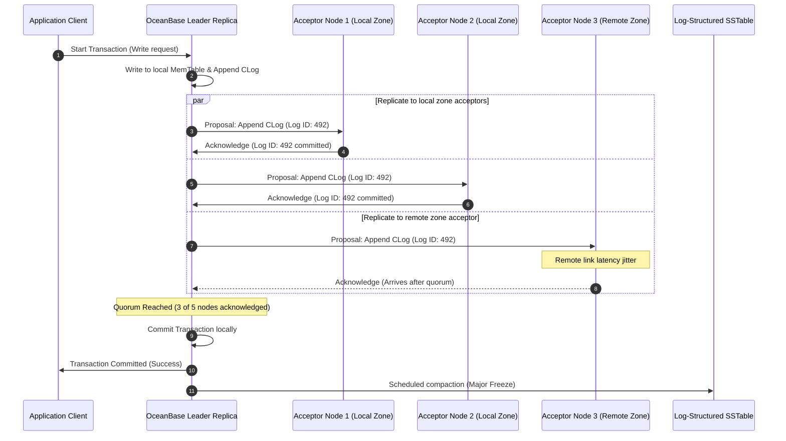

[← Series hub]()
[← Prev]() • [Next →]()

> **Prerequisite:** Before reading this part, please ensure you have read the previous article in this series: [Phase 4: Technology Overview]().

This document is a deep-dive companion to Phase 4. It focuses on the **internal mechanics** that define the hard limits of peak performance systems: RPC protocol layouts, consensus log replication pipelines, storage engine compaction configurations, and distributed transactions.

---

## 4.D1 SOFA RPC and Bolt Protocol Internals

At planet scale, RPC is not merely a method call over the network; it is a critical traffic governance plane. Alipay utilizes **SOFA RPC**, which sits on top of the custom **Bolt** protocol.

### 1. Bolt Protocol Layout and Multiplexing
The Bolt protocol is a multiplexed, connection-sharing wire protocol optimized for low latency and high concurrency. Unlike standard HTTP/1.1 connections which block on a single request-response loop (head-of-line blocking), Bolt allows thousands of requests to be sent concurrently over a single TCP connection. Each request is assigned a unique 32-bit packet ID, allowing responses to be read asynchronously as they complete.
- **Serialization Choices and Microsecond Benchmarks**: SOFA RPC supports multiple serialization protocols. By default, it uses **Hessian 2** for its balance of cross-language support and ease of development. However, for high-throughput, latency-critical payment core services, it dynamically switches to **Protobuf**. Internal benchmarks showed that Hessian 2 serialization takes ~45 microseconds per payload and produces a 420-byte footprint, whereas Protobuf executes in ~8 microseconds and produces a 180-byte footprint. At 544,000 TPS, this difference saves significant CPU cycles and megabytes of network bandwidth.
- **Metadata Context Propagation**: Every Bolt packet carries a "Class Name" and a map of custom headers. This map is used to propagate transaction trace contexts, routing hints (such as user ID hashes), and operational flags (such as the `X-Stress-Test` FLST flag) across RPC boundaries without polluting the method signatures.

### 2. Service Governance and Load Balancing
SOFA RPC clients cache local registries of available service provider endpoints. Load balancing is executed client-side:
- **Consistent Hashing**: Used for stateful routing to guarantee that requests for the same user ID land on the same application container, maximizing local CPU cache hits.
- **Dynamic Weighting**: The load balancer monitors response latency and error rates for each target node. If a container exhibits p99 latency spikes, the client dynamically reduces its routing weight, preventing "slow node" cascades.

---

## 4.D2 Messaging at Peak Scale (RocketMQ Decoupling)

During Double 11, RocketMQ operates as the system's pressure valve, decoupling the synchronous payment path from downstream accounting, credit scoring, and notification systems.

### 1. Transactional Message Flow
To ensure that a message is only delivered to consumers if the local database transaction successfully commits, RocketMQ utilizes a two-phase transaction execution protocol:
1. **Half Message**: The producer sends a "half message" containing the payment details to the broker. This message is stored in a special system queue and is not visible to consumers.
2. **Local Transaction**: The producer executes its local database transaction (e.g., deducting user balance in OceanBase).
3. **Commit/Rollback**: Based on the transaction result, the producer sends a commit or rollback command to the broker. If committed, the broker marks the message as active and exposes it to consumers.
4. **Consistency Quorum Check**: If the commit message is lost due to network jitter, the RocketMQ broker periodically queries the producer's local transaction state to reconcile the status.

### 2. Consumer Queue Rebalancing and Backpressure
Downstream consumer groups are scaled horizontally. To prevent consumer partitions from starving or stalling, RocketMQ uses a partition-rebalance algorithm based on user ID hashing. If a consumer node fails or is throttled under load, the broker redistributes partitions within 5 seconds.
To prevent duplicate processing during rebalancing (at-least-once delivery guarantees), consumers record every processed message ID in a local OceanBase table within the same ACID transaction block as the business write. If a duplicate message arrives, the database unique constraint aborts the transaction.

---

## 4.D3 Storage Engine Mechanics (OceanBase LSM-Tree)

Traditional databases use B+ Trees, which require random updates to data blocks on disk. Under heavy peak write loads, B+ Trees lead to high write amplification and random disk I/O bottlenecks. OceanBase solves this through its Log-Structured Merge-tree (LSM-tree) storage architecture.

### 1. LSM-Tree Storage Engine Lifecycles
- **Active MemTable**: All writes are buffered in memory.
- **Commit Log (CLog)**: A write is concurrently written to the sequential, append-only commit log on disk for durability.
- **Minor Freeze**: When the MemTable reaches a size threshold, it is frozen, and its contents are written to disk as a minor SSTable file.
- **Major Freeze (Compaction)**: During scheduled off-peak periods, the minor SSTable files are merged with the baseline static SSTable file, eliminating redundant updates and reclaiming space.

### 2. MVCC and Garbage Collection
OceanBase relies on Multi-Version Concurrency Control (MVCC) for non-blocking reads. However, at midnight on Double 11, millions of updates per second generate massive amounts of old row versions. SREs configure the garbage collection (GC) thread pools to run continuously. If a transaction runs too long (e.g., > 10 seconds), the GC mechanism cannot reclaim memory, leading to MemTable exhaustion. SREs therefore enforce strict client timeouts to prevent long-running queries from starving memory pools.

Below is an illustrative configuration block in SQL/Config format, showing how SREs tune OceanBase to manage the freeze and compaction memory thresholds during peak events:

```sql
-- OceanBase Storage Engine Tuning Configurations for Peak Loads

-- Set the memory limit threshold for triggering a Minor Freeze (Percentage of MemTable size)
ALTER SYSTEM SET freeze_trigger_percentage = 70;

-- Configure the maximum number of concurrent threads dedicated to compaction and merges
ALTER SYSTEM SET major_compact_thread_count = 16;

-- Enable writing commit logs (CLogs) using direct I/O to bypass OS cache buffers
ALTER SYSTEM SET enable_direct_io = 'True';

-- Adjust the maximum write speed buffer to prevent compaction I/O from starving read queries
ALTER SYSTEM SET compaction_write_rate_limit = 200000000; -- Limit compaction writes to 200MB/s

-- Configure the number of historical MemTable versions retained for MVCC read consistency
ALTER SYSTEM SET max_kept_memtable_version_count = 5;
```

---

## 4.D4 Distributed Transactions: Paxos Quorum Internals

In OceanBase, every table partition (shard) is managed by a replica group. Replicas utilize a Paxos consensus group to execute writes and manage failovers.

### Paxos Log Replication Lifecycle
The step-by-step transaction consensus loop is illustrated in the sequence flowchart below:



### 1. Two-Phase Commit (2PC) Optimizations
While local mutations in a partition use Paxos, transaction blocks touching multiple partitions (e.g., debiting user balance and crediting merchant ledger in different RZones) require a Two-Phase Commit (2PC) protocol layered on top of Paxos:
- **Phase 1 (Prepare)**: The coordinator sends prepare requests to all partition leaders. Each leader records the prepare log via its Paxos group.
- **Phase 2 (Commit)**: Once all partitions report readiness, the coordinator logs the commit status, and instructions are sent to all partitions to write the final transaction log.
- **Optimization**: To prevent blockages, OceanBase utilizes "Coordinator Failover" mechanisms. Since the coordinator status is itself a Paxos group, if the active coordinator server crashes, a standby coordinator takes over within 2 seconds, reads the Paxos-replicated state, and completes Phase 2 without aborting the transaction.

---

## Key Takeaways

1. **Multiplex Connections to Avoid Head-of-Line Blocking**: Use binary protocols (like Bolt or gRPC HTTP/2) to share connections, minimizing socket and thread allocation overhead under heavy concurrent request spikes.
2. **Buffer Disk Writes in Memory**: Never write directly to relational database disks on the critical path. Use LSM-tree storage models to queue updates in memory and append logs sequentially to disk.
3. **Decouple Quorum from Remote Locations**: Design Paxos groups so that a quorum can be reached using local, low-latency nodes, avoiding cross-region network latency penalties on writes.
