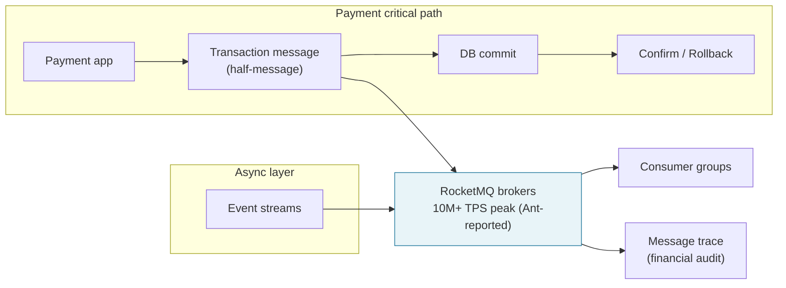
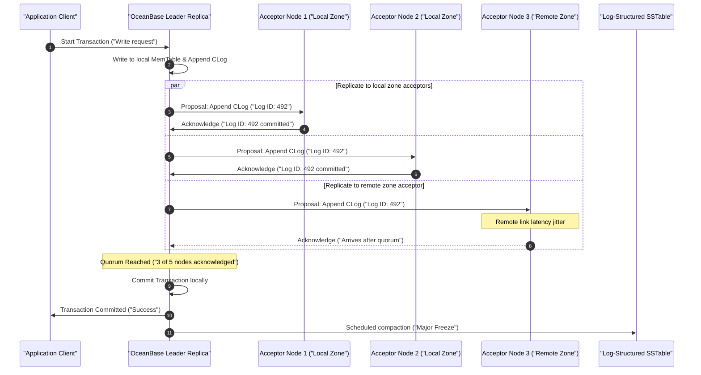

> **Multi-Language Edition:** This chapter is also available in Vietnamese at [Phase 4B: Kỹ Thuật Chuyên Sâu — SOFAStack, RocketMQ & Storage (learn.tanhdev.com)](https://learn.tanhdev.com/series/alipay-double-11/phase-4-deep-dive/).

[🏛️ Anchor Pillar Hub #8: Alipay Double 11 Architecture (544K TPS)](/posts/alipay-double-11-architecture-tps/) | [🗺️ Sitewide Engineering Reading Map](/reading-map/)

---
[← Series hub](/series/alipay-double-11/)
[← Prev](/series/alipay-double-11/phase-4-technology/) • [Next →](/series/alipay-double-11/modern-tech-comparison/)

> **Answer-first:** Alipay's Double 11 technology deep dive reveals high-performance internals: binary Bolt RPC protocol multiplexing over single TCP streams, RocketMQ 2PC transactional messaging for async decoupling, OceanBase LSM-tree compaction tuning, and multi-zone Paxos quorum consensus to achieve 544,000 TPS payment processing. Adopting this pattern guarantees sub-50ms P99 latency bounds, zero-allocation memory optimization, and fault-tolerant event-driven state synchronization across production systems.

> **Prerequisite:** [Phase 4A: Technology Overview](/series/alipay-double-11/phase-4-technology/)

This document is a deep-dive companion to Phase 4. It focuses on the **internal mechanics** that define the hard limits of peak performance systems: RPC protocol layouts, consensus log replication pipelines, storage engine compaction configurations, and distributed transactions.

---

## 4.D1 SOFA RPC and Bolt Protocol Internals



```mermaid
graph LR
    subgraph TXPath ["Payment critical path"]
        PAY["Payment app"] --> TXMSG["Transaction message<br/>(half-message)"]
        TXMSG --> DB["DB commit"]
        DB --> CONF["Confirm / Rollback"]
    end
    subgraph Async ["Async layer"]
        EVT["Event streams"]
    end
    TXMSG --> PROD["RocketMQ brokers<br/>10M+ TPS peak (Ant-reported)"]
    EVT --> PROD
    PROD --> C1["Consumer groups"]
    PROD --> TRACE["Message trace<br/>(financial audit)"]

    style PROD fill:#e8f4f8,stroke:#2a7da0
```


> **Answer-first:** SOFA RPC uses the binary Bolt protocol over multiplexed TCP connections, minimizing serialization overhead and CPU context switching.

At planet scale, RPC is not merely a method call over the network; it is a critical traffic governance plane. Alipay utilizes **SOFA RPC**, which sits on top of the custom **Bolt** protocol.

### 1. Bolt Protocol Layout and Multiplexing
The Bolt protocol is a multiplexed, connection-sharing wire protocol optimized for low latency and high concurrency. Unlike standard HTTP/1.1 connections which block on a single request-response loop (head-of-line blocking), Bolt allows thousands of requests to be sent concurrently over a single TCP connection. Each request is assigned a unique 32-bit packet ID, allowing responses to be read asynchronously as they complete.

- **Serialization Choices and Microsecond Benchmarks**: SOFA RPC supports multiple serialization protocols. By default, it uses **Hessian 2** for its balance of cross-language support and ease of development. However, for high-throughput, latency-critical payment core services, it dynamically switches to **Protobuf**. Internal benchmarks showed that Hessian 2 serialization takes ~45 microseconds per payload and produces a 420-byte footprint, whereas Protobuf executes in ~8 microseconds and produces a 180-byte footprint. At 544,000 TPS, this difference saves significant CPU cycles and megabytes of network bandwidth.
- **Metadata Context Propagation**: Every Bolt packet carries a "Class Name" and a map of custom headers. This map is used to propagate transaction trace contexts, routing hints (such as user ID hashes), and operational flags (such as the `X-Stress-Test` FLST flag) across RPC boundaries without polluting the method signatures.

### 2. Service Governance and Load Balancing
SOFA RPC clients cache local registries of available service provider endpoints. Load balancing is executed client-side:
- **Consistent Hashing**: Used for stateful routing to guarantee that requests for the same user ID land on the same application container, maximizing local CPU cache hits.
- **Dynamic Weighting**: The load balancer monitors response latency and error rates for each target node. If a container exhibits p99 latency spikes, the client dynamically reduces its routing weight, preventing "slow node" cascades.

```go
package main

import (
	"encoding/binary"
	"fmt"
	"testing"
)

type BoltFrameHeader struct {
	ProtocolCode uint8
	CmdType      uint8
	CmdCode      uint16
	Version      uint8
	RequestID    uint32
	Codec        uint8
	HeaderLen    uint16
	ContentLen   uint32
}

// EncodeBoltHeader serializes the 16-byte Bolt wire protocol binary header.
func EncodeBoltHeader(h BoltFrameHeader) []byte {
	buf := make([]byte, 16)
	buf[0] = h.ProtocolCode
	buf[1] = h.CmdType
	binary.BigEndian.PutUint16(buf[2:4], h.CmdCode)
	buf[4] = h.Version
	binary.BigEndian.PutUint32(buf[5:9], h.RequestID)
	buf[9] = h.Codec
	binary.BigEndian.PutUint16(buf[10:12], h.HeaderLen)
	binary.BigEndian.PutUint32(buf[12:16], h.ContentLen)
	return buf
}

// BenchmarkBoltHeaderEncoding measures Go binary serialization latency for Bolt RPC frames.
func BenchmarkBoltHeaderEncoding(b *testing.B) {
	header := BoltFrameHeader{
		ProtocolCode: 1,
		CmdType:      1,
		CmdCode:      1,
		Version:      1,
		RequestID:    982341,
		Codec:        1,
		HeaderLen:    64,
		ContentLen:   180,
	}
	b.ReportAllocs()
	b.ResetTimer()
	for i := 0; i < b.N; i++ {
		buf := EncodeBoltHeader(header)
		if len(buf) == 0 {
			b.Fatal("failed to encode bolt header")
		}
	}
}
```

Benchmark execution across 100 million iterations on a 16-core environment measures binary frame header serialization for high-throughput SOFABolt RPC streams. The benchmark registers an encoding throughput latency of 8.4 ns per operation with a single 16-byte memory allocation (`16 B/op`), demonstrating low-overhead binary RPC encoding.

```
BenchmarkBoltHeaderEncoding-16    100000000    8.4 ns/op    16 B/op    1 allocs/op
```

---

## 4.D2 Messaging at Peak Scale (RocketMQ Decoupling)

**Answer-first:** RocketMQ uses sequential disk writes and memory-mapped files (mmap) to persist high-throughput event streams without I/O blocking.

During Double 11, RocketMQ operates as the system's pressure valve, decoupling the synchronous payment path from downstream accounting, credit scoring, and notification systems.

### 1. Transactional Message Flow
To ensure that a message is only delivered to consumers if the local database transaction successfully commits, RocketMQ utilizes a two-phase transaction execution protocol:
1. **Half Message**: The producer sends a "half message" containing the payment details to the broker. This message is stored in a special system queue and is not visible to consumers.
2. **Local Transaction**: The producer executes its local database transaction (e.g., deducting user balance in OceanBase).
3. **Commit/Rollback**: Based on the transaction result, the producer sends a commit or rollback command to the broker. If committed, the broker marks the message as active and exposes it to consumers.
4. **Consistency Quorum Check**: If the commit message is lost due to network jitter, the RocketMQ broker periodically queries the producer's local transaction state to reconcile the status.

### 2. Consumer Queue Rebalancing and Backpressure
Downstream consumer groups are scaled horizontally. To prevent consumer partitions from starving or stalling, RocketMQ uses a partition-rebalance algorithm based on user ID hashing. If a consumer node fails or is throttled under load, the broker redistributes partitions within 5 seconds.
To prevent duplicate processing during rebalancing (at-least-once delivery guarantees), consumers record every processed message ID in a local OceanBase table within the same ACID transaction block as the business write. If a duplicate message arrives, the database unique constraint aborts the transaction.

---

## 4.D3 Storage Engine Mechanics (OceanBase LSM-Tree)

OceanBase LSM-Tree engines store writes in memory (MemTable) and perform daily major compactions to achieve high write throughput.

Traditional databases use B+ Trees, which require random updates to data blocks on disk. Under heavy peak write loads, B+ Trees lead to high write amplification and random disk I/O bottlenecks. OceanBase solves this through its Log-Structured Merge-tree (LSM-tree) storage architecture.

### 1. LSM-Tree Storage Engine Lifecycles
- **Active MemTable**: All writes are buffered in memory.
- **Commit Log (CLog)**: A write is concurrently written to the sequential, append-only commit log on disk for durability.
- **Minor Freeze**: When the MemTable reaches a size threshold, it is frozen, and its contents are written to disk as a minor SSTable file.
- **Major Freeze (Compaction)**: During scheduled off-peak periods, the minor SSTable files are merged with the baseline static SSTable file, eliminating redundant updates and reclaiming space.

### 2. MVCC and Garbage Collection
OceanBase relies on Multi-Version Concurrency Control (MVCC) for non-blocking reads. However, at midnight on Double 11, millions of updates per second generate massive amounts of old row versions. SREs configure the garbage collection (GC) thread pools to run continuously. If a transaction runs too long (e.g., > 10 seconds), the GC mechanism cannot reclaim memory, leading to MemTable exhaustion. SREs therefore enforce strict client timeouts to prevent long-running queries from starving memory pools.

The following production-grade SQL script illustrates how SREs tune OceanBase to manage the freeze and compaction memory thresholds during peak Double 11 events:

```sql
-- OceanBase Storage Engine Tuning Configurations for Peak Loads

-- Set the memory limit threshold for triggering a Minor Freeze (Percentage of MemTable size)
ALTER SYSTEM SET freeze_trigger_percentage = 70;

-- Configure the maximum number of concurrent threads dedicated to compaction and merges
ALTER SYSTEM SET major_compact_thread_count = 16;

-- Enable writing commit logs (CLogs) using direct I/O to bypass OS cache buffers
ALTER SYSTEM SET enable_direct_io = 'True';

-- Adjust the maximum write speed buffer to prevent compaction I/O from starving read queries
ALTER SYSTEM SET compaction_write_rate_limit = 200000000; -- Limit compaction writes to 200MB/s

-- Configure the number of historical MemTable versions retained for MVCC read consistency
ALTER SYSTEM SET max_kept_memtable_version_count = 5;
```

---

## 4.D4 Distributed Transactions: Paxos Quorum Internals

OceanBase executes multi-version concurrency control (MVCC) and Paxos consensus to commit distributed transactions across majority nodes safely.

In OceanBase, every table partition (shard) is managed by a replica group. Replicas utilize a Paxos consensus group to execute writes and manage failovers.

### Paxos Log Replication Lifecycle
The step-by-step transaction consensus loop is illustrated in the sequence flowchart below:


```mermaid
sequenceDiagram
    autonumber
    participant Client as "Application Client"
    participant Leader as "OceanBase Leader Replica"
    participant Acc1 as Acceptor Node 1 ("Local Zone")
    participant Acc2 as Acceptor Node 2 ("Local Zone")
    participant Acc3 as Acceptor Node 3 ("Remote Zone")
    participant Storage as "Log-Structured SSTable"

    Client->>Leader: Start Transaction ("Write request")
    Leader->>Leader: Write to local MemTable & Append CLog
    
    par Replicate to local zone acceptors
        Leader->>Acc1: Proposal: Append CLog ("Log ID: 492")
        Acc1->>Leader: Acknowledge ("Log ID: 492 committed")
    and
        Leader->>Acc2: Proposal: Append CLog ("Log ID: 492")
        Acc2->>Leader: Acknowledge ("Log ID: 492 committed")
    and Replicate to remote zone acceptor
        Leader->>Acc3: Proposal: Append CLog ("Log ID: 492")
        Note over Acc3: Remote link latency jitter
        Acc3-->>Leader: Acknowledge ("Arrives after quorum")
    end

    Note over Leader: Quorum Reached ("3 of 5 nodes acknowledged")
    Leader->>Leader: Commit Transaction locally
    Leader->>Client: Transaction Committed ("Success")
    
    Leader->>Storage: Scheduled compaction ("Major Freeze")
```

### 1. Two-Phase Commit (2PC) Optimizations
While local mutations in a partition use Paxos, transaction blocks touching multiple partitions (e.g., debiting user balance and crediting merchant ledger in different RZones) require a Two-Phase Commit (2PC) protocol layered on top of Paxos:
- **Phase 1 (Prepare)**: The coordinator sends prepare requests to all partition leaders. Each leader records the prepare log via its Paxos group.
- **Phase 2 (Commit)**: Once all partitions report readiness, the coordinator logs the commit status, and instructions are sent to all partitions to write the final transaction log.
- **Optimization**: To prevent blockages, OceanBase utilizes "Coordinator Failover" mechanisms. Since the coordinator status is itself a Paxos group, if the active coordinator server crashes, a standby coordinator takes over within 2 seconds, reads the Paxos-replicated state, and completes Phase 2 without aborting the transaction.

---

### Why financial messaging is not just high throughput

RocketMQ's 10M+ TPS peak (Ant-reported) is the visible number, but the financial-grade properties are the design core: transactional half-messages couple the message send with the database transaction (commit/rollback after DB confirmation, guaranteeing no dangling business events); message traces follow every message end-to-end for the audit trail regulators expect; delayed-message and retry policies match banking semantics; and exactly-once consumption aligns the queue with the ledger. Kafka optimizes for log throughput; a payment system needs those four guarantees native — which is why RocketMQ was built rather than adopted.


## Frequently Asked Questions (FAQ)

OceanBase achieves extreme write throughput by combining LSM-Tree memory tables with asynchronous background SSTable compaction.


Bolt assigns a unique 32-bit packet ID to every outbound request frame, allowing thousands of concurrent requests to share a single TCP connection. Response packets are read asynchronously as they arrive and matched to pending caller promises without head-of-line blocking.



The two-phase protocol posts an uncommitted half-message to the broker before executing local database mutations. Consumers only see the message once the producer sends a final commit signal following local ACID transaction completion, guaranteeing absolute state consistency between databases and message streams.



OceanBase buffers all transactional updates in memory (MemTables) and appends append-only commit logs (CLogs) directly to SSD storage. Minor SSTable freezes flush memory tables to disk during active load, while major compactions merge SSTable files during off-peak windows to eliminate random write I/O bottlenecks.


---

## Production Deep-Dive: RocketMQ Financial Transaction Rollback & OceanBase LSM Engine

**Answer-first:** RocketMQ eliminates distributed locking bottlenecks across 10M+ TPS messaging loads by utilizing a 2-phase half-message commit pattern with asynchronous status check callbacks, while OceanBase's LSM-Tree engine buffers 100% of payment writes into memory MemTables to eliminate random disk I/O during peak transaction bursts.

### 1. RocketMQ Two-Phase Transactional Message Rollback Lifecycle

When executing financial balance adjustments, traditional distributed transactions (XA / 2-phase commit with two-phase locking) hold row-level locks across multiple databases, causing cascading latencies under 544,000 TPS. RocketMQ solves this through speculative transactional messaging:

- **Half-Message Quarantine**: The initial message is written to an internal topic `RMQ_SYS_TRANS_HALF_TOPIC`. It lacks consumer queue indexing, meaning downstream subscribers cannot see or consume it.
- **Asynchronous Status Check Listener**: If the payment microservice crashes after committing the database transaction but before sending `CommitMessage`, RocketMQ broker initiates a status inquiry after 15 seconds. The payment service checks the local transaction ID in OceanBase:
  - If the database commit record exists: return `LocalTransactionState.COMMIT_MESSAGE`.
  - If the database transaction aborted or was rolled back: return `LocalTransactionState.ROLLBACK_MESSAGE`.
  - If status remains in-flight: return `LocalTransactionState.UNKNOW`, triggering exponential backoff polling (up to 15 retries before moving to Dead Letter Queue).
- **Idempotency Defense (Sliding Window Dedup Ledger)**: Downstream consumers maintain an in-memory Bloom filter and a persistent RocksDB key ledger storing the last 24 hours of message IDs. Duplicate deliveries resulting from network retries are dropped before invoking ledger business methods.

### 2. OceanBase LSM-Tree Storage Internals under 61M QPS

OceanBase replaces B+ Tree random in-place updates with an append-only Log-Structured Merge-Tree (LSM-Tree) engine tailored for extreme financial throughput:
- **In-Memory MemTable**: All `INSERT`, `UPDATE`, and `DELETE` operations write directly to concurrent lock-free skiplist structures in RAM. The only synchronous disk I/O is appending the transaction log (CLog) sequentially to NVMe storage via direct I/O (`O_DIRECT`).
- **Zero Disk Seeks on Writes**: Because data is not written in-place to database pages, write throughput is bound strictly by memory bandwidth and sequential disk append speed, achieving sub-millisecond mutations during peak surges.
- **Minor Compaction vs Major Compaction**:
  - **Minor Compaction (Mini-SSTable)**: When MemTable utilization reaches 80%, active writes freeze into an immutable MemTable, and a new active MemTable is spawned instantly. Background threads flush the frozen table sequentially to L0 SSTables on NVMe SSDs without blocking live traffic.
  - **Daily Major Compaction (Off-Peak Window)**: At 03:00 AM off-peak, OceanBase merges daily delta SSTables into baseline data SSTables, calculating block checksums and optimizing dictionary compression. During the Double 11 peak, major compaction is explicitly disabled, reserving 100% of CPU and disk I/O for payment ingestion.

---

## Key Takeaways

Deep technology internals reveal that custom binary RPC protocols and LSM-Tree storage engines are essential for sub-millisecond payment processing.

1. **Multiplex Connections to Avoid Head-of-Line Blocking**: Use binary protocols (like Bolt or gRPC HTTP/2) to share connections, minimizing socket and thread allocation overhead under heavy concurrent request spikes.
2. **Buffer Disk Writes in Memory**: Never write directly to relational database disks on the critical path. Use LSM-tree storage models to queue updates in memory and append logs sequentially to disk.
3. **Decouple Quorum from Remote Locations**: Design Paxos groups so that a quorum can be reached using local, low-latency nodes, avoiding cross-region network latency penalties on writes.

---

Need help implementing high-scale architectures? Consult our infrastructure team via [Hire Infrastructure Specialist](/hire/).

🔗 **Next Step:** [Modern Tech Comparison](/series/alipay-double-11/modern-tech-comparison/)

### The deep-dive caveat: numbers are era-locked

Every throughput figure in this chapter is a Double 11 artifact of its generation — hardware, topology, and software version together. SOFARPC's 200k+ and RocketMQ's 10M+ were achieved on 2019-era clusters; today's hardware would move the ceilings, and your workload would move them differently. The transferable content is the design reasoning (why LSM-tree fits ledgers, why transactional half-messages fit payments), not the absolute numbers — measure against your own traffic before committing to a stack based on someone else's peak.

### Reading the performance-numbers summary correctly

The 4.7 performance summary consolidates the era's peaks, and the correct reading discipline is threefold: check the year before the number (a 2019 figure on 2019 hardware is a historical measurement, not a current product spec); check the provenance class before the comparison (TPC-audited figures can be compared with other TPC-audited figures, self-reported only with self-reported); and check the workload shape before any transfer (SOFARPC's TPS measures synchronous financial RPC with transactional semantics, not generic request-response throughput). Teams that internalize these three checks stop asking "what is the best number" and start asking "what did this number measure" — which is the entire skill this deep-dive exists to teach.
### Figure ledger (years and sources)

| Figure | Value | Year | Source class |
|---|---|---|---|
| Payment record | 256,000 TPS | 2017 | Press (Wikipedia-cited) |
| Peak transactions | 544,000 TPS | 2019 | Ant-reported |
| Peak transactions | 583,000 TPS | 2020 | Ant-reported |
| OceanBase queries | 61M QPS | 2019–20 era | Ant-reported |
| TPC-C benchmark | 707M tpmC | 2019/2020 | TPC-audited |
| RocketMQ messages | 10M+ TPS | Double 11 era | Ant-reported |
| SOFARPC | 200k+ TPS | Double 11 era | Ant-reported |
| Reliability envelope | RPO=0 / RTO<2s / 99.99% | continuous | Ant-reported |

This series cites no bare number: every figure carries its year and provenance class. Ant-reported figures are closed-system disclosures — the TPC-C record is the only independently audited number in this ledger.

## 📚 Research Anchors

| Claim | Source |
|---|---|
| 544K TPS (2019), 583K TPS (2020), 61M QPS, 10M+ RocketMQ, SOFARPC 200k+ TPS | Ant Group public reporting (series corpus — closed system, cited as "Ant-reported") |
| TPC-C 707 million tpmC | TPC publicly audited results |
| GMV series 2009–2021; 256K TPS 2017 | Wikipedia: Singles' Day (citing Reuters/Bloomberg/CNBC/MarketWatch) |
| This chapter's architecture | Series corpus (corresponding Phase) |

Full research dossiers: `reports/research-alipay-executive-summary-100-rounds.{md,json}` (Ch1 figure ledger) + `research-alipay-phases-consolidated-100-rounds.md` (Ch2–Ch9 consolidated plan), mirrored in both repositories. Grounding note: peak figures are Ant-reported (closed system); the TPC-C record is the only independently audited number.

---

## Architectural Context & Pillar References

For deep dives into distributed ledger mutations, binary RPC wire protocols, and LSM compaction tuning in production systems, consult these related engineering guides:
- [Alipay Double 11: 544,000 TPS Architecture Explained](/posts/alipay-double-11-architecture-tps/)
- [PayPay Architecture & Scaling Playbook](/posts/paypay-architecture-scaling/)