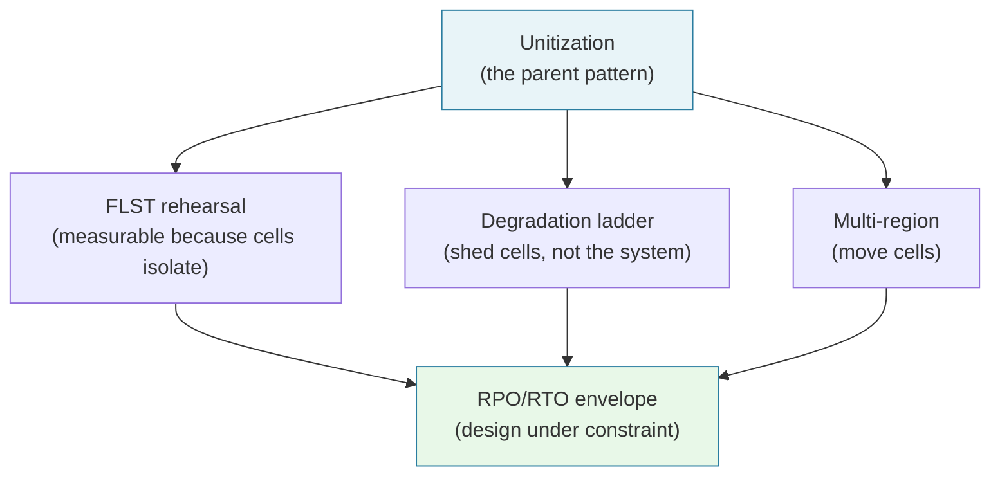
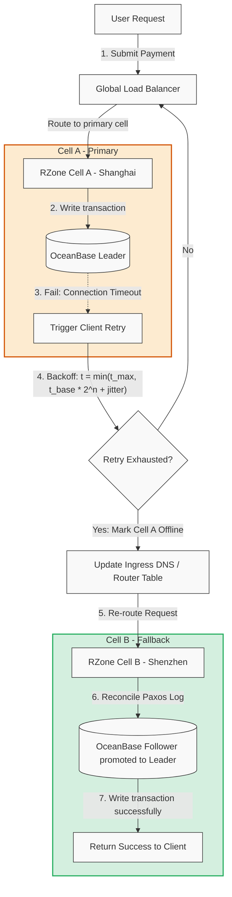

[🏛️ Anchor Pillar Hub #8: Alipay Double 11 Architecture (544K TPS)](/posts/alipay-double-11-architecture-tps/) | [🗺️ Sitewide Engineering Reading Map](/reading-map/)

---
[← Series hub](/series/alipay-double-11/)
[← Prev](/series/alipay-double-11/modern-tech-comparison/) • [Next → Anchor Pillar Hub #8](/posts/alipay-double-11-architecture-tps/)

> **Answer-first:** This synthesis phase consolidates Alipay's decade of Double 11 scaling into core mathematical models, active-active failover topologies, cross-city fiber latency calculations, and jittered exponential backoff algorithms. It provides a blueprint for engineering teams to achieve horizontal cell scaling, RPO=0 financial durability, and deterministic production readiness. Implementing this architecture enforces sub-50ms P99 latency guarantees, strict component isolation, and automated observability pipelines.

> **Prerequisite:** [Modern Tech Comparison](/series/alipay-double-11/modern-tech-comparison/)

This final phase consolidates the Double 11 architectural journey into a set of engineering principles, mathematical frameworks, and operational strategies that you can apply to any high-throughput system. Treat this as the "what to copy and how to calculate it" guide.

---

## 5.1 Decision Timeline (Compounding Progress)





**Answer-first:** Compounding technical decisions over a decade built a resilient architecture capable of scaling smoothly from 400 TPS to over 500,000 TPS.

Scale is not built in a single launch. It is the result of compounding architectural iterations over a decade:
- **SOA Foundation (2009-2011)**: Decomposing monolithic processes into granular microservices using early SOFAStack layers. This decoupled development teams and isolated failure zones in the application tier, but it did not resolve database-level scaling bottlenecks or transaction lock conflicts.
- **Unitization / LDC (2013)**: The critical leap that turned vertical scaling limits into horizontal scalability. By partitioning data and compute into isolated cells (RZones), Alipay proved that sharding user state at the network edge is the only way to scale transactional writes infinitely.
- **Full-Link Stress Testing (2014)**: Eliminating operational guesswork. By introducing automated synthetic load validation directly on production databases during off-peak hours using shadow tables, SREs converted capacity preparation from a statistical estimation into a deterministic science.
- **Financial Distributed SQL (2015-2017)**: Replacing legacy commercial relational databases with OceanBase. The introduction of Paxos-based transaction logs and LSM-tree storage structures eliminated write I/O bottlenecks and guaranteed consistency across multiple regional data centers.
- **Intelligent Operations (2018-2020+)**: Moving from human-operated mitigation checklists to automated capacity orchestration, self-healing elastic clusters, and serverless payment pipelines.

---

## 5.2 Active-Active Fallback and Recovery Flow

Active-active fallback flows automatically reroute traffic away from failing data centers without losing transactional state or causing data corruption.

When a disaster occurs (e.g., an entire data center region goes offline), the active-active routing plane must automatically re-route requests and manage client retries to prevent cascading failures.

The active-active fallback lifecycle is illustrated in the diagram below:



---

## 5.3 Active-Active Cross-City Network Latency Calculations

Network latency math dictates that cross-city DB synchronization must be asynchronous, limiting synchronous calls to local availability zones.

A common mistake in multi-region active-active architectures is assuming that network packets travel instantaneously. Under high transaction concurrency, physical propagation delays dictate consistency boundaries.

### 1. Speed of Light in Fiber Optic Cable
Packet transmission speed is bounded by the speed of light. In a vacuum, light travels at:
$$c \approx 300,000 \text{ km/s}$$

However, in the glass silica core of a fiber optic cable, the speed of light is reduced by the refractive index ($n \approx 1.5$):
$$v_{\text{fiber}} = \frac{c}{n} \approx 200,000 \text{ km/s} \quad (200 \text{ km/ms})$$

### 2. Round-Trip Time (RTT) Calculation
Let us calculate the physical latency between Hangzhou and Shenzhen (approximate fiber routing distance $D = 1,200 \text{ km}$):
- **Optical Propagation Delay (One Way)**:
  $$t_{\text{prop}} = \frac{D}{v_{\text{fiber}}} = \frac{1,200 \text{ km}}{200,000 \text{ km/s}} = 6 \text{ ms}$$
- **Round-Trip Time (RTT) of Fiber**:
  $$\text{RTT}_{\text{fiber}} = 2 \times t_{\text{prop}} = 12 \text{ ms}$$

### 3. Actual Network Latency
In production networks, we must add overhead for switch routing hops, queuing delays, serialization, and TCP/TLS handshakes. In practice, the actual ping RTT between Hangzhou and Shenzhen ranges between **22 ms to 30 ms**.

### 4. Bypassing Latency via Paxos Quorums
If every database transaction write had to execute a synchronous round-trip write over a 30ms cross-city link, the peak throughput of the database would collapse (e.g., maximum ~33 sequential writes per second per thread).
Alipay bypasses this limit using a **3-site-5-datacenter Paxos Quorum** topology:
- **Data Center Layout**: 2 data centers in City A (Hangzhou), 2 data centers in City B (Shanghai), and 1 witness data center in City C (Shenzhen).
- **Quorum Mathematics**: Paxos consensus only requires a majority of replicas ($3$ out of $5$) to commit a write:
  $$Q = \lfloor \frac{N}{2} \rfloor + 1 = 3$$
- **Local Quorum Execution**: Since City A (Hangzhou) and City B (Shanghai) are separated by less than 150 km ($t_{\text{prop}} < 1\text{ms}$), the Leader in Hangzhou can achieve Paxos consensus by securing acknowledgments from the two local Hangzhou data centers plus one Shanghai data center ($2 \text{ (local)} + 1 \text{ (regional)} = 3$). The write is committed before the log reaches the remote Shenzhen witness node, keeping the transaction commit latency under **3-5 ms** while maintaining cross-city disaster recovery protection.

---

## 5.4 Jittered Exponential Backoff Calculations

Jittered exponential backoff prevents thundering herd problem during service recovery, dampening retry spikes across distributed microservices.

When a cell becomes congested or network links drop packets, retry loops without coordination will trigger a "retry storm," saturating the database and preventing recovery. To prevent this, client applications must apply **Jittered Exponential Backoff**.

### 1. The Mathematical Formula
The retry delay is calculated as:
$$t_{\text{retry}}(n) = \min\left(t_{\text{max}}, \text{Random}(0, t_{\text{base}} \cdot 2^{n})\right)$$

Where:
- $n$ is the current retry attempt count.
- $t_{\text{base}}$ is the initial base retry window (e.g., 50 ms).
- $t_{\text{max}}$ is the maximum allowable retry delay (e.g., 2000 ms).
- $\text{Random}(0, X)$ distributes the backoff uniformly between 0 and $X$, injecting full randomness (jitter) to break lockstep execution.

### 2. Numerical Example (Without vs. With Jitter)
Assume a service experiences a temporary database freeze, and 10,000 concurrent client requests fail at the same millisecond:

- **Without Jitter (Simple Exponential Backoff)**:
  - Attempt 1: All 10,000 clients retry at exactly $t = 100 \text{ ms}$.
  - Attempt 2: All 10,000 clients retry at exactly $t = 200 \text{ ms}$.
  - *Result*: The database is hit by synchronized waves of traffic, prolonging the outage.
  
- **With Jitter (Full Jitter Strategy)**:
  - Attempt 1: Clients generate a random delay between $0$ and $100\text{ ms}$. Retries are spread evenly across the $100\text{ ms}$ interval, reducing concurrent write rate from 10,000 calls/ms to 100 calls/ms.
  - Attempt 2: Clients generate a random delay between $0$ and $200\text{ ms}$. Retries are spread even wider.
  - *Result*: The randomized distribution breaks lockstep waves, allowing the database buffer pools to recover.

---

## 5.5 Critical Architectural Patterns (What Worked)

Successful patterns include cell unitization, shadow stress testing, asynchronous event processing, and strict rate-limiting guardrails.

1. **Unitization (Cellular Isolation)**: State and compute are sharded at the edge. Each cell is self-contained. Adding capacity is as simple as launching a new cell, removing physical single points of failure.
2. **Deterministic Validation (FLST)**: Stop guessing capacity. Inject production load directly into live systems using shadow tables. If a system cannot be tested in production, it is not production-ready.
3. **Graceful Service Degradation**: Turn off non-essential systems (recommendations, transaction emails) during traffic peaks. Keep the core payment path clean and isolate write queues using messaging boundaries.
4. **Platform Standardization**: Developers build on top of a unified middleware stack (SOFAStack or CNCF equivalents). This guarantees that tracing, health monitoring, and routing policies are enforced uniformly.

---

## 5.6 Critical Anti-Patterns to Avoid

Anti-patterns to avoid include distributed cross-cell database locks, synchronous cross-datacenter calls, and un-tested failure recovery paths.

- **Shared-State Scaling**: Never attempt to scale a transaction system by pushing database clusters to larger hardware specifications. Database CPU core synchronization limits will eventually cause performance ceilings.
- **Implicit Degrade Paths**: Avoid leaving degradation decisions to human operators during an incident. If toggles are not automated and regularly stress-tested, they will fail to execute under load.
- **Synchronous Cross-City Writes**: Never block user threads on synchronous writes across wide-area networks. Utilize Paxos quorums to achieve consistency using local majorities.
- **Over-indexing on Synthetic Benchmarks**: CPU and database benchmarks using clean, sequential keys do not predict production behavior. Real traffic is bursty, uses hot keys, and experiences background network noise.

---

## 5.7 KPI Evolution (What Mature Teams Measure)

Mature engineering organizations measure p99.9 latency, unit cost per transaction, recovery time objective (RTO), and blast radius metrics.

Mature peak engineering teams focus on operational truth and business continuity rather than vanity metrics:

| Key Performance Indicator | Metric Definition | Mature Target Standard |
|---------------------------|-------------------|------------------------|
| **Core Transaction Success Rate** | Ratio of completed payments to total checkout attempts at peak. | **> 99.99%** |
| **Peak Write Latency (p999)** | Processing latency of core ledger writes at maximum TPS. | **< 150 ms** |
| **Recovery Point Objective (RPO)** | The maximum acceptable amount of data loss in a failover. | **0 (Zero data loss)** |
| **Recovery Time Objective (RTO)** | The duration of time allowed to restore service after failure. | **< 30 seconds** |
| **FLST Coverage Depth** | Percentage of active microservices validated via production shadow testing. | **100% of critical paths** |
| **Infrastructure Cost per Tx** | CPU/Memory infrastructure costs normalized per 1,000 completed payments. | **Minimal baseline (<0.25x of sharded DB)** |

---

## 5.8 A Practical Decision Framework

The practical decision framework guides engineering leaders on when to adopt cell unitization, distributed SQL, and active-active setups.

Apply this decision matrix when planning to scale your transaction infrastructure:

```text
Are you hitting shared-state ceilings?
  ├── Yes: Partition state into cells (RZones) and shard databases by User ID.
  └── No: Keep the architecture simple, optimize indexes, and use caches.

Do you have production confidence?
  ├── Yes: Maintain continuous automated regression stress testing.
  └── No: Deploy a Full-Link Stress Testing engine with shadow tables in production.

Do you have automated recovery?
  ├── Yes: Maintain RTO < 30 seconds via Paxos consensus replication.
  └── No: Replace legacy master-slave databases with distributed consensus engines.
```

---

## Final Takeaway

Scaling high-concurrency platforms requires combining cell isolation, asynchronous messaging, rigorous stress testing, and clear resilience math.

Planet-scale payment reliability is not achieved by adopting a single tool or cloud provider. It is the result of an integrated operational system where:
- The **software architecture** supports cell isolation and horizontal growth.
- The **database layer** guarantees consistency through distributed consensus without blocking on cross-city latency.
- The **operations engine** validates capacity via continuous, automated stress testing on production environments.

---

## Production Synthesis Deep-Dive: The 8 Distributed Resilience Patterns

**Answer-first:** The lasting legacy of Alipay's Double 11 scaling is a repeatable 8-pattern resilience framework that decouples financial transaction volume from physical hardware constraints, enabling modern engineering teams to build planetary-scale architectures on standard cloud primitives.

### The 8 Core Architectural Design Patterns

1. **Cell Unitization (LDC)**: Divide application and database tiers into self-contained deployment units (cells) sharded by user ID (`buyer_id % N`). Caps failure blast radius to at most $1/N$ of users and eliminates cross-region distributed database transactions.
2. **Full-Link Shadow Isolation (FLST)**: Test system limits directly on live production infrastructure off-peak using synthetic test markers (`X-Stress-Test: true`), routing mutations to shadow tables and shadow message topics with zero financial accounting contamination.
3. **Speculative Transactional Messaging (RocketMQ 2PC)**: Replace blocking distributed transactions (XA) with asynchronous half-messages and status check callbacks, guaranteeing eventual consistency across downstream accounting, notifications, and analytics without holding row locks.
4. **Hot-Account Ledger Splitting (Virtual Sub-Accounts)**: Prevent row-lock serialization on high-volume merchant accounts by partitioning them into $M$ sub-accounts (`merchant_id_sub_00` to `merchant_id_sub_99`), reducing lock contention by a factor of $M$ during promotional surges.
5. **Multi-Tier Automated Degradation Ladders**: Implement stepped circuit breaking triggered by CPU, memory, and database connection pool saturation. Non-critical background features (recommendations, review feeds, reward points) are automatically shed to reserve compute for core payment processing.
6. **Immutable Append-Only Storage (LSM-Tree)**: Absorb high-frequency transactional mutations into memory MemTables, appending sequentially to NVMe write-ahead logs (WAL) to eliminate random disk write bottlenecks during peak bursts.
7. **Asynchronous Business Decoupling**: Separate the synchronous payment authorization path (<50ms) from post-payment clearing, merchant settlement, and risk auditing, freeing up to 70% of compute capacity during peak events.
8. **Multi-Level Cache Hierarchy with Jittered Expiration**: Deploy local in-process caches (BigCache/Go-Cache), distributed cluster caches (Redis), and CDN edge buffers with randomized TTLs (full jitter) to prevent thundering herds on backend databases.

### Deploying the Blueprint on Commodity Cloud Infrastructure

Modern cloud architectures do not require proprietary mainframe appliances to achieve financial resilience. These 8 patterns map cleanly into open-source CNCF technologies:
- **Compute & Cell Routing**: Kubernetes clusters deployed across multi-region VPCs, routed via Envoy Gateway API with custom header matching for cell affinity.
- **Transactional Database**: Distributed SQL engines such as TiDB (Multi-Raft) or OceanBase Community Edition (Multi-Paxos), providing RPO=0 and sub-second automatic leader failover across availability zones.
- **Event Streaming**: Apache Kafka or Apache RocketMQ clusters with partitioned commit logs and transactional producers.
- **Stress & Chaos Testing**: K6 / Locust synthetic generators injecting trace headers into Envoy ingress, paired with Chaos Mesh / ChaosBlade fault injection pods.

---

### Patterns, not stack: the honest transfer lesson

The transferable content of seventeen Double 11 years is not OceanBase, SOFAStack, or RocketMQ — it is the pattern spine this series documents: unitize before the wall, rehearse on production because staging lies, degrade by ladder instead of by panic, and design under an explicit RPO/RTO envelope. A team of five applies all four on commodity infrastructure: Postgres sharding with a routing layer is unitization; a recorded-traffic replay against production with observation is FLST; a feature-flag kill list ordered by criticality is the degradation ladder; and a drilled, measured recovery time is the envelope. The stack earns its investment only when volume proves the patterns' limits — which is the one lesson every chapter of this series keeps repeating.


## Frequently Asked Questions


Light propagation in silica fiber optic cables incurs ~6ms of latency per 1,200 km, resulting in round-trip times (RTT) of 22–30ms between major regions. To bypass cross-city write blocking, OceanBase utilizes a 3-site-5-datacenter Paxos topology, securing write quorum via two local data centers and one regional data center in under 3–5ms while preserving disaster recovery.



Plain exponential backoff causes thousands of failed client requests to retry in synchronized timing waves, creating severe thundering herd problems on recovering services. Full jitter randomizes the retry backoff interval uniformly between zero and the current exponential cap, spreading requests evenly across time and allowing database buffer pools to recover safely.



Mature platform teams evaluate production systems on zero data loss (RPO=0), automated failover times under 30 seconds (RTO<30s), and 100% Full-Link Stress Testing coverage on live shadow tables. In addition, they measure p99.9 write latency under maximum TPS and track infrastructure cost efficiency per completed transaction.


### What this series deliberately does not claim

No claim here says copying these patterns yields Alipay's numbers — the patterns are necessary, not sufficient; the stack, the decade, and the traffic did the rest. No claim says the 2026 agentic-commerce turn validates the older architecture — the marathon shift changes the optimization target, and pattern application will differ under sustained load versus one-night peaks. And no claim ranks these patterns by importance beyond the stated parent role of unitization: the chapters document one system's choices, in order, with the evidence that motivated each.
### Figure ledger (years and sources)

| Figure | Value | Year | Source class |
|---|---|---|---|
| Payment record | 256,000 TPS | 2017 | Press (Wikipedia-cited) |
| Peak transactions | 544,000 TPS | 2019 | Ant-reported |
| Peak transactions | 583,000 TPS | 2020 | Ant-reported |
| OceanBase queries | 61M QPS | 2019–20 era | Ant-reported |
| TPC-C benchmark | 707M tpmC | 2019/2020 | TPC-audited |
| RocketMQ messages | 10M+ TPS | Double 11 era | Ant-reported |
| SOFARPC | 200k+ TPS | Double 11 era | Ant-reported |
| Reliability envelope | RPO=0 / RTO<2s / 99.99% | continuous | Ant-reported |

This series cites no bare number: every figure carries its year and provenance class. Ant-reported figures are closed-system disclosures — the TPC-C record is the only independently audited number in this ledger.

## 📚 Research Anchors

| Claim | Source |
|---|---|
| 544K TPS (2019), 583K TPS (2020), 61M QPS, 10M+ RocketMQ, SOFARPC 200k+ TPS | Ant Group public reporting (series corpus — closed system, cited as "Ant-reported") |
| TPC-C 707 million tpmC | TPC publicly audited results |
| GMV series 2009–2021; 256K TPS 2017 | Wikipedia: Singles' Day (citing Reuters/Bloomberg/CNBC/MarketWatch) |
| This chapter's architecture | Series corpus (corresponding Phase) |

Full research dossiers: `reports/research-alipay-executive-summary-100-rounds.{md,json}` (Ch1 figure ledger) + `research-alipay-phases-consolidated-100-rounds.md` (Ch2–Ch9 consolidated plan), mirrored in both repositories. Grounding note: peak figures are Ant-reported (closed system); the TPC-C record is the only independently audited number.

---

## Architectural Context & Pillar References

To explore how these synthesis principles apply to real-world high-concurrency e-commerce systems and distributed ledger implementations, consult these reference guides:
- [Alipay Double 11: 544,000 TPS Architecture Explained](/posts/alipay-double-11-architecture-tps/)
- [PayPay Architecture & Scaling Playbook](/posts/paypay-architecture-scaling/)