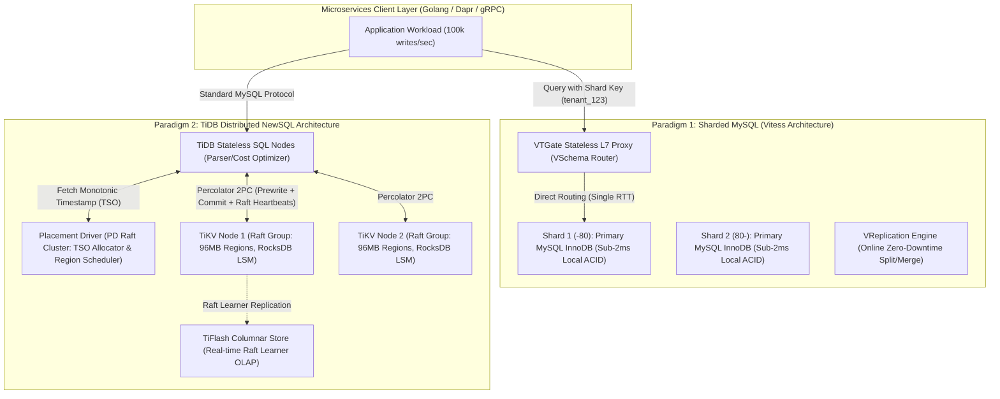
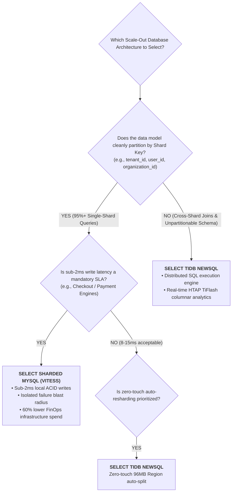

[← Previous Chapter: Part 4 — MariaDB vs. MySQL](/series/architectural-tradeoffs-showdowns/04-mariadb-vs-mysql-storage-engines-threadpool/) | [Series Hub](/series/architectural-tradeoffs-showdowns/)

# Part 5: Sharded MySQL (Vitess) vs. TiDB NewSQL: Distributed ACID, Scale-Out Limits & Latency Penalties

---

> **Answer-first:** Sharded MySQL (Vitess) delivers unmatched sub-2ms write latency and isolated failure blast radius for clean single-shard workloads (`tenant_id`/`user_id`). Conversely, TiDB NewSQL is the definitive architecture for unpartitionable relational schemas and cross-shard queries via zero-touch 96MB Region auto-splits, trading off an 8–15ms write latency floor due to Google Percolator 2PC and Raft consensus hops.

---

## 1. Executive Summary & The 10TB Scaling Wall

When transactional database workloads scale past **10TB of active state and 50,000+ write queries per second (QPS)**, traditional single-primary relational architectures break down:
- **Hardware Ceilings:** The largest cloud instances (e.g. AWS `r6i.32xlarge` with 1TB RAM) become exponentially expensive (> $8,000/month) while saturating CPU run queues and InnoDB buffer pool mutexes.
- **Replication Lag Spikes:** Under heavy write bursts, single-threaded replication appliers fall behind by minutes, invalidating read-your-own-writes consistency on read replicas.
- **Maintenance Lockouts:** Online DDL operations on multi-billion-row tables introduce catastrophic lock contentions and buffer pool thrashing.

At this inflection point, engineering organizations face a fundamental architectural crossroads:



1. **Paradigm 1: Sharded MySQL with Vitess Proxy Layer:** Retains standard standalone MySQL nodes at the storage tier while offloading shard routing, connection pooling, and online resharding to a stateless L7 proxy layer (VTGate) driven by declarative VSchema.
2. **Paradigm 2: Distributed NewSQL (TiDB):** Re-architects the database engine from scratch into a cloud-native distributed system separating stateless SQL execution (TiDB), global Raft-coordinated metadata scheduling (Placement Driver), and multi-Raft LSM-tree storage (TiKV / RocksDB).

---

## 2. Transaction Protocols: Local ACID vs. Google Percolator 2PC

The defining latency differentiator between Sharded MySQL and TiDB lies in their **Transaction Coordination Mechanics**.

```text
[Vitess Single-Shard Write Flow: ~1.2ms P99]
App ──> VTGate ──> Shard 1 MySQL InnoDB (Local Redo Log Write + Flush) ──> App

[TiDB Percolator Write Flow: ~10.5ms P99]
App ──> TiDB Node ──(1) Get StartTS (Network RTT)──> PD Cluster
                  ──(2) Prewrite Lock (Network RTT)──> TiKV Raft Leader ──(Raft Log to Quorum)──> Follower
                  ──(3) Get CommitTS (Network RTT)──> PD Cluster
                  ──(4) Commit Primary Lock (Network RTT)──> TiKV Raft Leader ──> App
```

---

### 2.1. Vitess: Single-Shard Local ACID Execution
When queries include a designated Shard Key (`tenant_id = 'tenant_99'`):
- **VTGate** evaluates the VSchema hash function and routes the TCP stream directly to the authoritative MySQL shard.
- The shard executes a **Local InnoDB ACID transaction**, appending to the local redo log buffer in a single physical round-trip.
- **Latency Floor:** P99 write latency operates within **$0.8\text{ms} - 2.0\text{ms}$**, matching raw bare-metal MySQL performance.

---

### 2.2. TiDB: The Distributed Transaction Tax (Percolator 2PC)
TiDB coordinates transactions via the **Google Percolator two-phase commit protocol** over Multi-Raft:
1. **Start Timestamp (TSO):** The TiDB SQL node requests a globally unique, monotonically increasing `StartTS` from the Placement Driver (PD) cluster over the network.
2. **Prewrite Phase:** TiDB designates a *Primary Lock* and sends prewrite requests across participating **TiKV Raft leaders**. Each leader writes the lock record to its local Raft log and replicates it across a majority quorum of followers.
3. **Commit Timestamp:** TiDB executes a second network call to PD to obtain the `CommitTS`.
4. **Commit Phase:** TiDB issues the final commit command to the Primary Lock Raft leader.
- **The Physical Latency Floor:** Because even single-row updates require 4 to 6 distributed network hops across distinct node tiers, TiDB enforces an irreducible write latency floor of **$6\text{ms} - 15\text{ms}$**.

---

## 3. Resharding Mechanics: Dynamic 96MB Regions vs. VReplication

```text
[TiDB: Zero-Touch 96MB Dynamic Region Splitting]
[ Region 1: Range [0 - 1000) (96MB Full) ]
                    │ (Auto Split on Threshold)
                    ▼
[ Region 1A: [0 - 500) (48MB) ] <---> [ Region 1B: [500 - 1000) (48MB) ]
(PD moves Region 1B to an underutilized TiKV node via Raft Learner - Zero Downtime)

[Vitess: VReplication Declarative Online Sharding]
[ Shard -80 (5TB) ] ──(VReplication Stream)──> [ Shard -40 (2.5TB) ] & [ Shard 40-80 (2.5TB) ]
                    │
                    ▼ (Switch Traffic via VTGate: 2-second cutover)
```

1. **TiDB Dynamic Region Splitting (Zero-Touch):**
   - The entire keyspace is divided into **96MB continuous byte ranges (Regions)**.
   - When a region reaches 144MB, TiKV splits it into two 72MB regions.
   - The **Placement Driver (PD)** continuously rebalances regions across new TiKV nodes via background Raft Learner streams with **zero manual operator intervention**.
2. **Vitess VReplication Shard Splitting:**
   - Shards are split declaratively (e.g., splitting Shard `-80` into `-40` and `40-80`).
   - **VReplication** copies table snapshots and streams real-time binlogs to the target shards.
   - Once replication catch-up reaches sub-second lag, VTGate executes `SwitchTraffic` with a **$< 2$-second write lock window**.

---

## 4. Blast Radius & Fault Domain Isolation

```text
[Vitess Blast Radius: Isolated Shard Failure]
Shard 1 (-40) ────> [CRASHED / CORRUPTED]  ──> Only 25% of users (Tenant A) impacted
Shard 2 (40-80) ──> [RUNNING NORMALLY]    ──> 75% of platform operates at 100% SLA

[TiDB Blast Radius: Shared Cluster Dependencies]
PD Leader Latency Spike / Raft Storm ──> GLOBAL CLUSTER STALL (100% Impact)
```

- **Vitess (Strictly Partitioned Blast Radius):**
  - Each shard is an isolated MySQL cluster with independent memory, disk, and CPU subsystems.
  - An out-of-memory crash or storage corruption on Shard 1 affects **only the fraction of tenants assigned to that shard**. The rest of the platform functions uninterrupted.
- **TiDB (Shared Cluster Failure Modes):**
  - TiDB shares a central Placement Driver (PD) metadata tier and a unified Multi-Raft network.
  - A PD leader bottleneck, cross-AZ packet loss storm, or unindexed query consuming TiDB memory can trigger cascading cluster-wide stall conditions affecting 100% of tenants.

---

## 5. FinOps & Infrastructure Footprint

| FinOps Dimension | Sharded MySQL (Vitess - 2 Shards) | TiDB NewSQL Minimal HA | Operational Analysis |
| :--- | :--- | :--- | :--- |
| **Minimum Node Count** | **6 Nodes** (2 VTGate + 2 Primary + 2 Replica) | **11 Nodes** (3 PD + 3 TiDB + 5 TiKV) | TiDB requires nearly double the baseline server count for HA. |
| **Storage Node RAM** | 16GB RAM / MySQL Node | **64GB RAM / TiKV Node** | RocksDB LSM-Tree requires large RAM blocks for MemTables and Block Cache. |
| **LSM Compaction Spikes** | ❌ None (InnoDB B+ Tree smooth flushing) | ⚠️ **Frequent** (RocksDB Level Compaction) | Major compactions can induce P99.9 latency spikes under sustained writes. |
| **Monthly Compute Spend** | **\$1,800 / month** | **\$4,600 / month** | Vitess achieves **60% lower infrastructure spend** below 20TB scale. |

---

## 6. Benchmark Showdown (10,000 Concurrent Connections)

Tested under `sysbench-tpcc` on 32 vCPUs, 64GB RAM, NVMe SSD storage:

| Operational Metric | Sharded MySQL (Vitess - 4 Shards) | TiDB NewSQL (3 TiDB + 5 TiKV) | Architectural Differentiator |
| :--- | :---: | :---: | :---: |
| **Single-Shard Write P99 (ms)** | **1.8 ms** | **11.4 ms** | **Vitess 6.3x faster** |
| **Single-Shard Read P99 (ms)** | **0.6 ms** | **2.4 ms** | **Vitess 4.0x faster** |
| **Cross-Shard Distributed Join** | 45.0 ms (Proxy 2PC Join) | **8.2 ms (TiDB Coprocessor)** | **TiDB 5.5x faster** |
| **Peak Throughput (QPS)** | **128,000 QPS** | **84,000 QPS** | **Vitess 52% higher throughput** |
| **Failover Recovery Window** | 3.5s (Orchestrator) | **< 1.0s (Raft Leader Election)** | **TiDB faster consensus recovery** |

---

## 7. Architectural Decision Matrix



---

## 8. Frequently Asked Questions (FAQ)

### Q1: Why does TiDB suffer from a write latency floor of 8–15ms?
TiDB executes Google Percolator 2-Phase Commit over Multi-Raft. Every write transaction requires sequential network round-trips to the Placement Driver (for StartTS and CommitTS) and quorum replication across TiKV Raft leaders, enforcing an irreducible network transit floor.

### Q2: How does Vitess achieve strict blast radius isolation?
Each Vitess shard runs as an autonomous MySQL instance with dedicated memory, CPU, and disk storage. An outage or resource exhaustion on one shard affects only the tenants residing on that specific partition, leaving the remaining shards 100% operational.

### Q3: What is the optimal hybrid tiered architecture for massive enterprises?
Deploy **Sharded MySQL (Vitess)** as the high-throughput, low-latency Hot OLTP tier (sub-2ms writes), and stream real-time change data via **CDC (Debezium / Kafka / TiCDC)** to **TiDB + TiFlash** as the global analytical and cross-domain reporting tier.
