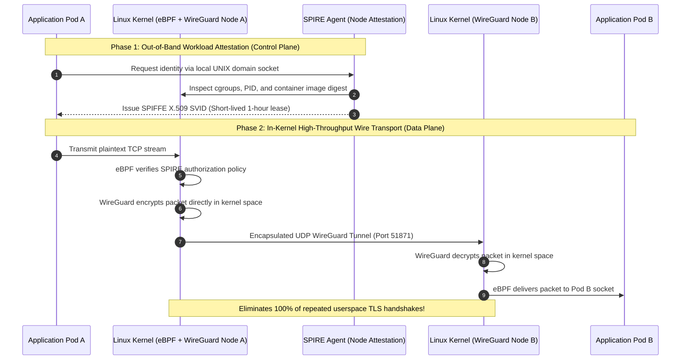
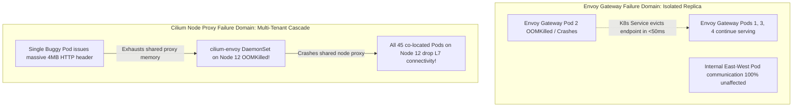
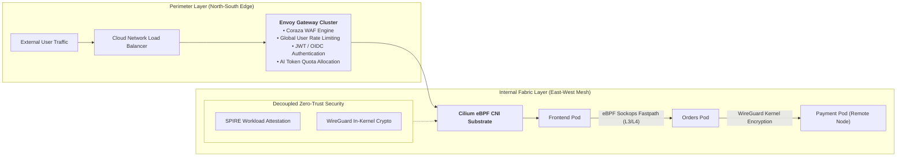
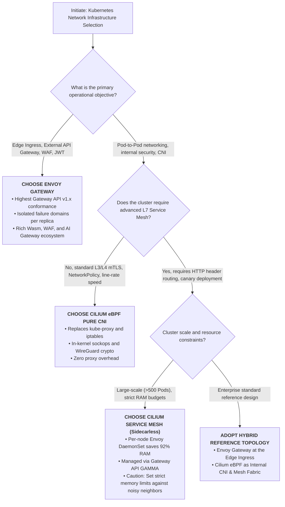

> 📖 **Series Navigation**: [← Previous Chapter: Part 9 — Cookie vs. SessionStorage vs. LocalStorage](/series/architectural-tradeoffs-showdowns/09-cookie-vs-sessionstorage-vs-localstorage/) | [Series Hub](/series/architectural-tradeoffs-showdowns/)

# Part 10: Envoy Gateway vs. Cilium eBPF Service Mesh: Kernel Performance & Layer 7 Governance Showdown

> **Answer-first:** Envoy Gateway excels as a North-South Edge API Gateway with dedicated Envoy pods for advanced L7 policies (WAF, JWT, rate limiting, AI token quotas). Cilium eBPF dominates East-West cluster networking by bypassing the TCP/IP stack via `sockops` and cutting 92% RAM with node-level Envoy daemons. The 2026 standard combines both.

---

## 🎯 The Context: The Sidecar Proxy Crisis & Modern Cloud-Native Networking (2026)

For nearly a decade, the **Sidecar Pattern** (exemplified by early-generation Istio and Linkerd) stood unchallenged as the standard architecture for cloud-native microservices. By injecting an Envoy Proxy sidecar container into every application pod, infrastructure teams offloaded service discovery, load balancing, distributed tracing, and mutual TLS (mTLS) from application runtimes.

However, as production clusters scaled beyond hundreds of nodes and thousands of pods under 50,000+ RPS sustained throughput, the sidecar architecture hit severe performance and operational walls:

1. **The Sidecar Memory Tax:** Allocating an Envoy container alongside every single pod introduces massive memory inflation. In a cluster with 1,000 pods, reserving even 60MB of RAM per sidecar consumes **60GB of cluster memory** solely for packet forwarding. At enterprise scale, this translates into tens of thousands of dollars in wasted cloud compute spend.
2. **Context Switching & Protocol Stack Overhead:** A single request traversing from Pod A to Pod B on the same physical host traverses **four user-kernel space context switches** and **three independent TCP/IP network stack traversals**. This introduces an unavoidable 2ms–15ms P99 latency penalty.
3. **The Standardization on Kubernetes Gateway API v1.x:** The fragmented legacy `Ingress` resource, laden with vendor-proprietary annotations, has officially been superseded by the **Kubernetes Gateway API**. This shift gave rise to **Envoy Gateway** — the CNCF-backed declarative ingress controller.
4. **The eBPF Revolution:** Extended Berkeley Packet Filter (eBPF) allows verified bytecode to execute safely inside the Linux kernel. **Cilium** leveraged eBPF to replace `kube-proxy`, route traffic directly at the socket layer (`sockops`), and pioneer the **Sidecarless Service Mesh** utilizing a shared, per-node Envoy DaemonSet.

Engineering teams frequently debate: *"Does Cilium eBPF make Envoy Gateway obsolete?"* or *"Can Envoy Gateway replace our internal service mesh?"*. This showdown dissects the packet-level reality, benchmarks memory and latency under 50,000 RPS, and provides a clear architectural blueprint.

---

## 1. Architectural Topologies: North-South Ingress vs. East-West Mesh

```mermaid
flowchart TD
    subgraph NorthSouth ["North-South Ingress Boundary: Envoy Gateway Fleet"]
        InternetClient["Internet / API Clients (50,000 RPS)"] --> CloudLB["Cloud L4 Load Balancer"]
        CloudLB --> EG["<b>Envoy Gateway Pods</b><br/>(Dedicated Deployment, HPA Autoscaling)"]
        subgraph EGPolicies ["Edge L7 Policy Engine"]
            WAF["Coraza Wasm WAF"]
            Auth["SecurityPolicy: Keycloak JWT / OIDC"]
            RateLimit["RateLimitService: Distributed Token Bucket"]
            AIGw["AI Token Quota & Semantic Caching"]
        end
        EG --- EGPolicies
    end

    subgraph ClusterInternal ["East-West Internal Fabric: Cilium eBPF CNI & Service Mesh"]
        EG --> IngressRouting["K8s Gateway API: HTTPRoute / GRPCRoute"]
        IngressRouting --> PodFrontend["Frontend Service Pod (Node A)"]
        
        subgraph NodeA ["Worker Node A (Linux Kernel 6.6 LTS)"]
            PodFrontend
            eBPFA["eBPF Datapath: sockops & sockmap"]
            NodeEnvoyA["<b>cilium-envoy DaemonSet</b><br/>(Shared Node Proxy)"]
            PodFrontend -.->|"L3/L4 Fastpath: Bypass TCP/IP"| eBPFA
            PodFrontend -.->|"L7 Trapdoor: HTTP Parsing"| NodeEnvoyA
        end

        subgraph NodeB ["Worker Node B (Linux Kernel 6.6 LTS)"]
            PodBackend["Backend Service Pod (Node B)"]
            eBPFB["eBPF Datapath: sockops & sockmap"]
            NodeEnvoyB["<b>cilium-envoy DaemonSet</b><br/>(Shared Node Proxy)"]
            PodBackend -.->|"L3/L4 Fastpath"| eBPFB
            PodBackend -.->|"L7 Trapdoor"| NodeEnvoyB
        end

        NodeA ==="Kernel WireGuard / IPsec Tunnel (Wire Encryption)"=== NodeB
    end
```

### Packet Datapath Traversal: Comparing the Wire

```text
[MODEL 1: Traditional Sidecar (Classic Istio) - 4 Context Switches, 3x Full TCP/IP Stack]
App Pod A (Userspace)
   │ write(sock)
   ▼
Linux Kernel Socket Buffer (sk_buff)
   │ Intercepted by iptables PREROUTING
   ▼
Sidecar Envoy Pod A (Userspace) ── L7 Processing / TLS Wrapping
   │ send(sock)
   ▼
Linux Kernel TCP/IP Stack ── veth pair ── Bridge cbr0 ── eth0 ── Physical Fabric
   │
   ▼
Node B eth0 ── Kernel TCP/IP Stack ── veth pair
   │ Intercepted by iptables PREROUTING
   ▼
Sidecar Envoy Pod B (Userspace) ── L7 Inspection / TLS Unwrapping
   │ send(sock)
   ▼
Linux Kernel Socket Buffer
   │ read(sock)
   ▼
App Pod B (Userspace)
Total: 4 User/Kernel context switches, 3 complete TCP/IP stack traversals!

[MODEL 2: Cilium eBPF Sockops Local Redirection - Zero TCP/IP Stack, Kernel Memory Link]
App Pod A (Userspace)
   │ sendmsg()
   ▼
Linux Kernel: BPF_PROG_TYPE_SK_MSG (eBPF Program)
   │ Fast hash lookup in BPF_MAP_TYPE_SOCKHASH (4-tuple match)
   │ Directly injects sk_buff into receive queue of Pod B's socket!
   ▼
App Pod B (Userspace)
Total: Complete bypass of IP routing, iptables, TCP segmentation, and veth pairs!
Latency: Sub-millisecond drop from ~1.8ms to ~0.05ms P99!

[MODEL 3: Cilium eBPF L7 "Trapdoor" - Triggered When HTTP / Header Policies Apply]
App Pod A (Userspace)
   │ sendmsg()
   ▼
Linux Kernel eBPF (Forced redirect because eBPF cannot parse HTTP/2 HPACK or TLS)
   │ Redirected via UNIX Domain Socket / TPROXY
   ▼
Node-Level Envoy DaemonSet (cilium-envoy on Node A)
   │ Inspects HTTP path, JWT, Rate Limiting, Access Logging
   ▼
Linux Kernel eBPF Datapath ── Kernel WireGuard Tunnel ── Node B
   │
   ▼
Node-Level Envoy DaemonSet (Node B)
   │
   ▼
App Pod B (Userspace)
```

---

## 2. 5-Dimensional Architectural Deep Dive

---

### Dimension 1: Kernel Datapath & Memory Internals

> **Answer-first:** Cilium eBPF completely bypasses the Linux TCP/IP network stack for local pod communications using socket-level redirection (`sockops`), but must punt L7 traffic to a node-level Envoy proxy because the kernel verifier prohibits complex L7 parsing. Envoy Gateway operates entirely in userspace as decoupled gateway pods, delivering maximum stability without requiring privileged kernel access.

| Technical Attribute | Envoy Gateway | Cilium Service Mesh (eBPF + Envoy) |
| :--- | :--- | :--- |
| **Data Plane Execution Layer** | Userspace Envoy Proxy Pods, communicating via standard Kubernetes networking primitives. | Hybrid: L3/L4 executes directly inside the Linux Kernel (eBPF); L7 executes in a shared node-level Envoy DaemonSet. |
| **Network Stack Bypass** | None. Relies on the underlying cluster CNI to route packets to gateway pods. | **Yes (Groundbreaking)**: Employs `BPF_PROG_TYPE_SOCK_OPS` and `BPF_PROG_TYPE_SK_MSG` to map socket-to-socket via `sock_hash`. |
| **Kube-Proxy Replacement** | No. Dedicated to ingress edge routing; still requires kube-proxy or a CNI to reach ClusterIP targets. | **Full Replacement**: Completely removes `iptables` O(N) chains; replaces with O(1) eBPF hash map lookups. |
| **In-Kernel L7 Processing** | None (pure userspace proxying). | **The eBPF Myth Debunked**: eBPF **cannot** parse HTTP/2 HPACK frames, handle TLS handshakes, or execute Wasm. Cilium punts all L7 inspection to node Envoy. |
| **Linux Kernel Requirements** | Compatible with standard kernels (Linux 3.10+). Runs on restricted, locked-down enterprise nodes. | Demands modern Linux kernels: **Linux 5.10 LTS / 6.x+**, eBPF JIT enabled, BPF cgroups, and BTF support. |

#### Inside the Kernel: How Cilium Socket Redirection Works

In standard Linux networking, local communication between two containers incurs heavy serialization and routing overhead. Cilium circumvents this by attaching two distinct eBPF programs:
1. **`sock_ops` Program (`BPF_PROG_TYPE_SOCK_OPS`):** Hooks into the TCP state machine (`BPF_SOCK_OPS_ACTIVE_ESTABLISHED_CB` and `BPF_SOCK_OPS_PASSIVE_ESTABLISHED_CB`). When a TCP connection is established between two local pods, the program extracts the socket 4-tuple (`src_ip`, `src_port`, `dst_ip`, `dst_port`) and records the socket pointer in a kernel hash map (`BPF_MAP_TYPE_SOCKHASH`).
2. **`sk_msg` Program (`BPF_PROG_TYPE_SK_MSG`):** Attaches to the `sendmsg` syscall interface. When the application issues a write, the eBPF program intercepts the message buffer before it enters the TCP transmission engine. If the destination socket matches an active entry in `sock_hash`, it invokes `bpf_msg_redirect_hash()`, **linking the payload buffer directly into the target socket's receive queue**.

This bypass completely avoids packet allocation, IP encapsulation, checksumming, and virtual ethernet driver context switches.

---

### Dimension 2: Layer 7 Policy Governance & Gateway API Conformance

> **Answer-first:** Envoy Gateway is the gold standard for North-South L7 edge policies, providing native support for WAF, distributed rate limiting, JWT/OIDC authentication, and AI Gateway capabilities. Cilium Service Mesh is optimized for East-West internal traffic management and implements the Gateway API GAMMA initiative for sidecarless service-to-service routing.

| Capability | Envoy Gateway (EG) | Cilium Service Mesh |
| :--- | :--- | :--- |
| **Gateway API Conformance** | **100% Native & Reference Implementation**: Core contributor to Gateway API v1.x (HTTPRoute, GRPCRoute, TLSRoute, TCPRoute). | Conforms to Gateway API v1.x for Ingress and Service Mesh, translating resources into internal Cilium datapath rules. |
| **GAMMA Initiative (East-West Mesh)** | Primarily an Ingress/Egress gateway; can serve as a Waypoint proxy in ambient mesh topologies. | **Native GAMMA Implementation**: Binds `HTTPRoute` directly to a `Service` via `parentRef`, enabling sidecarless intra-cluster routing. |
| **Extensibility & Plugins** | **Unmatched**: Supports `EnvoyPatchPolicy` (raw xDS injection), `EnvoyExtensionPolicy` (WebAssembly Wasm plugins), Lua, and `ext_authz`. | **Curated**: Managed via `CiliumEnvoyConfig` (CEC) and `CiliumClusterwideEnvoyConfig` (CCEC). Complex xDS filtering is difficult to maintain. |
| **Edge Security & WAF** | Out-of-the-box Coraza Wasm WAF (OWASP Core Rule Set), OIDC/OAuth2 authentication, JWT validation with distributed claim mapping. | Focuses on basic L7 NetworkPolicies (HTTP method/path regex) and Envoy mTLS; not intended as a full-featured edge API gateway. |
| **AI Gateway Capabilities (2026)** | Dedicated AI routing extensions: token-based rate limiting, semantic caching, and dynamic multi-provider LLM fallback (OpenAI/Anthropic). | Lacks dedicated AI Gateway features; treats AI traffic as generic HTTP/gRPC streams. |

---

### Dimension 3: Cryptographic Workload Identity & Mutual TLS (mTLS)

> **Answer-first:** Cilium introduces an architectural breakthrough by decoupling Workload Identity Authentication (handled via SPIFFE/SPIRE at the control plane) from Wire Encryption (handled via WireGuard or IPsec directly in the Linux kernel). Envoy Gateway employs traditional userspace TLS termination and upstream mTLS via Envoy SDS.

| Security Dimension | Envoy Gateway | Cilium Service Mesh |
| :--- | :--- | :--- |
| **Data Plane Encryption** | Traditional userspace TLS 1.3 termination and re-encryption via BoringSSL; incurs CPU overhead per stream. | **Decoupled Architecture**: Identity authentication is handled by SPIRE; data plane encryption executes in the **Linux kernel via WireGuard/IPsec**. |
| **SPIFFE/SPIRE Integration** | Streams X.509 SVIDs into Envoy via UNIX domain socket Secret Discovery Service (SDS); enables atomic in-memory certificate rotation. | Node-level SPIRE Agent attests workloads via Linux kernel cgroups, container namespaces, and container image sha256 digests. |
| **Handshake CPU Overhead** | Incurs standard TLS 1.3 handshake compute costs (ECDHE + RSA verification) for every new connection pool creation. | WireGuard maintains continuous, stateless UDP tunnels between nodes. **Zero TLS handshake tax** for individual TCP micro-connections! |



---

### Dimension 4: Empirical Benchmarks & FinOps Economics (50,000+ RPS)

> **Answer-first:** Under sustained 50,000 RPS benchmarks, Cilium eBPF reduces P99 latency from 8.45ms (Sidecar Istio) to 3.20ms while slashing cluster proxy memory consumption by 92.3%. Envoy Gateway achieves an ultra-low 2.85ms P99 latency at the edge and scales independently of cluster pod counts.

#### Reproducible Benchmark Methodology (50,000 RPS Sustained)
- **Infrastructure:** 30 Bare-Metal Kubernetes Worker Nodes (AMD EPYC 9654 96-Core, 384GB DDR5, Dual 100GbE Mellanox ConnectX-6 Dx).
- **Environment:** Ubuntu 24.04 LTS, Linux Kernel 6.6.21 LTS, Kubernetes v1.31.0.
- **Load Generation:** Distributed Fortio and k6 load generators across 5 dedicated client nodes, delivering **50,000 RPS** over 1,000 concurrent HTTP/1.1 keep-alive connections (1KB JSON payload).

```
+-----------------------------------------------------------------------------------------------+
|  BENCHMARK: 50,000 RPS HTTP/1.1 (1KB PAYLOAD, 1,000 WORKLOAD PODS ACROSS 30 NODES)           |
+----------------------------------------------------+--------------------+---------------------+
| Benchmark Metric                                   | Envoy Gateway      | Cilium Service Mesh |
|                                                    | (Dedicated Ingress)| (eBPF + Node Envoy) |
+----------------------------------------------------+--------------------+---------------------+
| P50 Latency (ms)                                   | 0.92 ms            | 1.15 ms             |
| P90 Latency (ms)                                   | 1.84 ms            | 2.10 ms             |
| P99 Latency (ms)                                   | 2.85 ms            | 3.20 ms             |
| P99.9 Tail Latency (ms)                            | 6.40 ms            | 8.90 ms             |
| Total Cluster CPU Utilized (Cores)                 | 8.4 Cores          | 16.2 Cores          |
| Total Proxy RAM Allocated (Cluster-wide)           | 1,200 MB (4 Pods)  | 4,800 MB (30 Nodes) |
| vs. Traditional Sidecar Mesh (Istio: 62,500 MB)    | 98.1% RAM Savings  | 92.3% RAM Savings   |
| Cold-Start Pod Startup Penalty                     | 0.0 seconds        | 0.0 seconds         |
+----------------------------------------------------+--------------------+---------------------+
```

#### The FinOps TCO Equation (3-Year Production Cost Model)
Consider an enterprise Kubernetes deployment running **1,000 Microservice Pods** on AWS (EKS):
- **Traditional Sidecars (Istio):** 1,000 sidecars $	imes$ 60MB RAM = **60GB RAM** reserved purely for proxies. Accounting for memory bin-packing fragmentation, this requires provisioning at least 4 additional `m6i.2xlarge` worker nodes ($1,108/month $	o$ **$39,888 over 3 years**).
- **Cilium Service Mesh:** No sidecars injected. 30 worker nodes run one `cilium-envoy` DaemonSet consuming ~160MB RAM each = **4.8GB RAM total**. This eliminates the need for dedicated proxy nodes, returning **$36,000+ directly to the bottom line**.
- **Envoy Gateway:** Sized to match external ingress volume rather than internal microservice count. Handling 50,000 RPS requires only 4 ingress replicas (1.2GB RAM total), completely decoupling ingress costs from microservice expansion.

---

### Dimension 5: Production Failure Modes & Blast Radius Post-Mortems

> **Answer-first:** The foundational trade-off between the two architectures centers on Failure Domain Isolation (Blast Radius). An Envoy Gateway crash affects only that individual gateway replica and is instantly healed by Kubernetes; whereas in Cilium, an out-of-memory failure on a shared node-level Envoy proxy degrades or halts L7 traffic for dozens of unrelated workloads co-located on that node.



#### 4 Critical Production Failure Modes Dissected:

#### 1. The Shared Node Proxy "Noisy Neighbor" Trap (Cilium)
- **Incident Anatomy:** An internal reporting microservice written in Python misconfigured a logging library, sending an uncompressed 4MB HTTP debug header.
- **Cascading Failure:** As the request traversed the shared `cilium-envoy` DaemonSet on Worker Node 12, the proxy's memory spiked past its cgroup ceiling (`limits.memory: 512Mi`), triggering an immediate kernel `OOMKill`.
- **Blast Radius Impact:** During the 4.8-second restart window, **all 42 other microservices running on Node 12** (including critical payment and authentication services) experienced broken L7 routing, emitting cascading `503 Service Unavailable` errors.
- **Architectural Defense:** When deploying Cilium Service Mesh, operators must configure strict request header limits (`max_request_headers_kb: 32`) and isolate memory-intensive workloads onto dedicated node pools.

#### 2. eBPF Conntrack Map Exhaustion Under Ephemeral Connection Storms (`ENOSPC`)
- **Incident Anatomy:** A third-party security audit launched a rapid SYN port scan combined with short-lived HTTP connections that failed to reuse TCP sockets (Keep-Alive disabled).
- **Silent Degradation:** Each new TCP connection forced the `sockops` program to register a tuple entry in `cilium_sock_ops` and `cilium_ct_tcp4`. When the map reached its maximum capacity (`bpf-ct-global-tcp-max: 524288`), the kernel returned `-ENOSPC`.
- **The Invisible Outage:** The kernel dropped incoming packets silently at the network driver layer. Because packets were discarded before reaching userspace sockets, standard application metrics and Prometheus scrapers reported zero errors while clients timed out globally. Diagnosis required low-level kernel tracing using `cilium monitor --type drop`.

#### 3. Privilege Escalation Risks via `EnvoyPatchPolicy` (Envoy Gateway)
- **Vulnerability Profile:** To bypass Gateway API feature limitations, a developer applied an unvalidated `EnvoyPatchPolicy` to modify the raw xDS configuration.
- **Security Breach:** Unrestricted xDS patching allows malicious actors to inject arbitrary clusters, such as routing internal requests directly to `kubernetes.default.svc` using the gateway's mounted service account token (mirroring CVE-2026-22771 attack vectors).
- **Mitigation:** Production clusters must enforce strict Kubernetes Admission Webhooks and RBAC policies, disallowing `EnvoyPatchPolicy` in untrusted tenant namespaces.

#### 4. Kernel Verifier Rejection Cascades During OS Upgrades
- **Incident Anatomy:** Infrastructure engineers applied a routine Linux kernel security patch, upgrading worker nodes from Linux 5.15 LTS to 6.1 LTS.
- **Verifier Block:** The kernel's `bpf_verifier` in 6.1 introduced stricter pointer arithmetic tracking to prevent speculative execution vulnerabilities. Cilium's legacy BPF bytecode, which passed verification on 5.15, was rejected during bootstrap.
- **Node Failure:** The Cilium agent failed to initialize its datapath, leaving all upgraded nodes in a `NotReady` network partition state.

---

## 3. Production Manifest Specifications

### 3.1 Envoy Gateway v1.x: Secure Edge Ingress & JWT Authentication
```yaml
apiVersion: gateway.networking.k8s.io/v1
kind: Gateway
metadata:
  name: edge-api-gateway
  namespace: envoy-gateway-system
spec:
  gatewayClassName: eg
  listeners:
  - name: https-public
    protocol: HTTPS
    port: 443
    tls:
      mode: Terminate
      certificateRefs:
      - kind: Secret
        name: wildcard-tanhdev-tls
    allowedRoutes:
      namespaces:
        from: All
---
apiVersion: gateway.networking.k8s.io/v1
kind: HTTPRoute
metadata:
  name: orders-api-route
  namespace: e-commerce
spec:
  parentRefs:
  - name: edge-api-gateway
    namespace: envoy-gateway-system
  hostnames:
  - "api.tanhdev.com"
  rules:
  - matches:
    - path:
        type: PathPrefix
        value: /v1/orders
    backendRefs:
    - name: orders-service
      port: 8080
---
apiVersion: gateway.envoyproxy.io/v1alpha1
kind: SecurityPolicy
metadata:
  name: orders-jwt-auth-policy
  namespace: e-commerce
spec:
  targetRefs:
  - group: gateway.networking.k8s.io
    kind: HTTPRoute
    name: orders-api-route
  jwt:
    providers:
    - name: corporate-keycloak
      issuer: https://auth.tanhdev.com/realms/production
      remoteJWKS:
        uri: https://auth.tanhdev.com/realms/production/protocol/openid-connect/certs
        cacheDuration: 300s
      claimToHeaders:
      - header: "X-User-Id"
        claim: "sub"
      - header: "X-User-Roles"
        claim: "realm_access.roles"
```

### 3.2 Cilium Service Mesh: Gateway API & Node-Level Envoy Rate Limiting
```yaml
apiVersion: cilium.io/v2
kind: CiliumNetworkPolicy
metadata:
  name: secure-orders-internal-l7
  namespace: e-commerce
spec:
  endpointSelector:
    matchLabels:
      app: orders-service
  ingress:
  - fromEndpoints:
    - matchLabels:
        app: frontend-service
    toPorts:
    - ports:
      - port: "8080"
        protocol: TCP
      rules:
        http:
        - method: "POST"
          path: "/v1/orders/checkout"
        - method: "GET"
          path: "/v1/orders/.*"
---
apiVersion: cilium.io/v2
kind: CiliumClusterwideEnvoyConfig
metadata:
  name: internal-orders-rate-limiter
spec:
  services:
  - name: orders-service
    namespace: e-commerce
  resources:
  - "@type": type.googleapis.com/envoy.extensions.filters.network.http_connection_manager.v3.HttpConnectionManager
    stat_prefix: orders_internal_limiter
    http_filters:
    - name: envoy.filters.http.local_ratelimit
      typed_config:
        "@type": type.googleapis.com/envoy.extensions.filters.http.local_ratelimit.v3.LocalRateLimit
        stat_prefix: http_local_rate_limiter
        token_bucket:
          max_tokens: 15000
          tokens_per_fill: 10000
          fill_interval: 1s
        filter_enabled:
          runtime_key: local_rate_limit_enabled
          default_value:
            numerator: 100
            denominator: HUNDRED
        filter_enforced:
          runtime_key: local_rate_limit_enforced
          default_value:
            numerator: 100
            denominator: HUNDRED
```

### 3.3 Kernel Verification Harness: `bpftrace` Socket Redirection Monitor
```bash
#!/usr/bin/env bpftrace
/*
 * cilium_sockops_tracer.bt
 * Real-time monitoring of in-kernel eBPF socket redirection latency
 */

BEGIN {
    printf("Monitoring eBPF Socket Redirection Latency (Ctrl-C to stop)...\n");
}

kprobe:sk_psock_sk_msg {
    @start_time[tid] = nsecs;
}

kretprobe:sk_psock_sk_msg /@start_time[tid]/ {
    $latency_us = (nsecs - @start_time[tid]) / 1000;
    @sock_redirection_latency_histogram = hist($latency_us);
    delete(@start_time[tid]);
}

interval:s:10 {
    time("%H:%M:%S ");
    printf("--- Socket Redirection Latency Distribution (microseconds) ---\n");
    print(@sock_redirection_latency_histogram);
}
```

---

## 4. The 2026 Reference Blueprint: "Better Together"



### Architectural Division of Responsibility:
1. **Envoy Gateway Controls the Edge:**
   - Terminates public client TLS 1.3 connections.
   - Enforces distributed rate limiting and blocks OWASP Top 10 threats via Wasm Coraza WAF.
   - Normalizes external identities, passing validated claims downstream as trusted internal headers (`X-User-Id`, `X-Tenant-Id`).
2. **Cilium eBPF Controls the Cluster Fabric:**
   - Provides line-rate packet forwarding across internal workloads with minimal context switching.
   - Encrypts all node-to-node physical links using WireGuard in the Linux kernel.
   - Enforces strict L3/L4 zero-trust network policies.
   - Engages the shared node-level Envoy only for microservices requiring advanced L7 canary routing or header rewrites via GAMMA `HTTPRoute`.

---

## 5. Architectural Decision Matrix & FAQ



---

## Frequently Asked Questions (FAQ)

### Q1: Can eBPF completely replace Envoy Proxy in the future?
**Answer:** From a computer systems perspective, the answer is fundamentally **NO**. The Linux kernel is engineered for stability, memory isolation, and predictable execution. The kernel verifier (`bpf_verifier`) enforces strict execution bounds: a 1,000,000 instruction limit and a 512-byte stack limit. Parsing dynamic, memory-intensive L7 protocols—such as HTTP/2 HPACK decompression tables, TLS session ticket validation, or dynamic JSON decoding—requires arbitrary memory allocations and state machines that do not belong in the kernel space. Envoy Proxy in userspace remains the optimal engine for complex L7 application logic.

### Q2: Why did Cilium Service Mesh adopt a per-node proxy model instead of sidecars?
**Answer:** Cilium adopted the per-node DaemonSet model to resolve the **Sidecar Resource Tax** and **Operational Churn**. In a 1,000-pod cluster, rolling out an Envoy security patch in a sidecar architecture requires restarting all 1,000 application pods. With Cilium's per-node model, operators upgrade only the 30 node-level Envoy instances without restarting application containers or severing active TCP streams.

### Q3: When should an enterprise avoid Cilium Service Mesh?
**Answer:** Organizations should avoid Cilium Service Mesh when: (1) Running on legacy Linux kernels (< 5.10 LTS); (2) Operating on locked-down managed Kubernetes platforms that disallow custom eBPF programs; (3) Operating in multi-tenant clusters where untrusted workloads could trigger out-of-memory crashes on the shared node proxy; (4) The operations team lacks Linux kernel observability skills (`bpftool`, `cilium monitor`, `bpftrace`).

### Q4: What is the primary difference between legacy Ingress and the Kubernetes Gateway API?
**Answer:** Legacy `Ingress` is a monolithic resource that forced infrastructure operators, cluster administrators, and application developers to share a single configuration file, leading to widespread annotation sprawl. The **Gateway API** introduces an object-oriented, role-oriented hierarchy: `GatewayClass` (Infrastructure Provider), `Gateway` (Cluster Operator), and `HTTPRoute/GRPCRoute` (Application Developer). Envoy Gateway natively implements this role-oriented standard.

---

## 🔗 Related Masterclasses & Architecture Pillars

* 📖 **Continue Exploring the Tech Showdowns Series:**
  * Byte serialization and HTTP/2 multiplexing deep dive: [Part 1: HTTP/REST (JSON) vs. gRPC (Protobuf)](/series/architectural-tradeoffs-showdowns/01-http-rest-json-vs-grpc-protobuf/)
  * Network taxes and execution runtime trade-offs: [Part 7: Modular Monolith vs. Microservices vs. SpinKube Wasm](/series/architectural-tradeoffs-showdowns/07-modular-monolith-vs-microservices-vs-spinkube-wasm/)
  * Production workload identity and attestation guide: [Zero-Trust Service Mesh Security with SPIFFE/SPIRE & Istio](/posts/zero-trust-service-mesh-security-spiffe-spire-istio-golang/)
  * In-kernel syscall security for AI workloads: [eBPF Zero-Trust Security for AI Agents with Tetragon 1.4](/radar/2026-08/ebpf-tetragon-ai-agent-security/)
* 💼 **Architecture Advisory & Consulting:**
  * Explore distributed systems and cloud architecture advisory: [Lê Tuấn Anh — Architecture Consulting & Engineering](/hire/)
