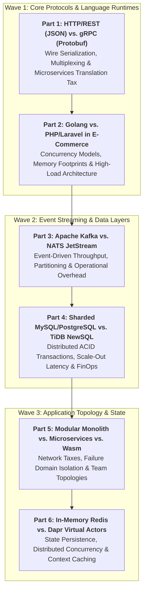

> **Answer-first:** "There are no solutions in software architecture, only trade-offs." The **Architectural Trade-offs & Tech Showdowns** series provides an open-ended, practitioner-led engineering framework comparing conflicting technical stacks, transport protocols, and data layers. Each showdown evaluates memory allocations, wire formats, P99 latency benchmarks, cloud FinOps, and production failure modes under sustained 50,000+ RPS loads.

---

## 🎯 Series Philosophy: Beyond Dogma & Hype

In production engineering, choosing a technology stack is never a binary question of "which is better." A tool that delivers sub-millisecond serialization for internal microservices may introduce crippling operational complexity for mobile clients. A language that enables instant feature prototyping may collapse under flash-sale concurrency.

This masterclass dissects core technical showdowns using our **5-Dimension Engineering Framework**:
1. **Executive Verdict & Decision Matrix:** Instant clarity on when to adopt, when to avoid, and hybrid scenarios.
2. **Wire Formats & Memory Allocator Internals:** Byte-level inspection of protocols, stack frames, and GC overhead.
3. **Reproducible Production Benchmarks:** Real-world throughput (RPS), P99 latency, and cloud compute cost (FinOps).
4. **Production Failure Modes & Traps:** Real-world post-mortems, lock contentions, and network saturation traps.
5. **Migration & Co-existence Blueprints:** Strangler-fig patterns and hybrid topologies for enterprise transition.

---

## 🗺️ Masterclass Chapters (Living Series Roadmap)

### 🚀 Wave 1 (Active Releases)

- **[Part 1: HTTP/REST (JSON) vs. gRPC (Protobuf): Wire Serialization, HTTP/2 Multiplexing & Microservices Translation Tax](/series/architectural-tradeoffs-showdowns/01-http-rest-json-vs-grpc-protobuf/)**  
  *Deep-dive into byte serialization efficiency, HTTP/2 streaming vs HTTP/3 QUIC, CPU cycles spent on JSON unmarshaling, and when dual-protocol Kratos gateways beat pure gRPC.*

- **[Part 2: Golang vs. PHP/Laravel in High-Concurrency E-Commerce: Memory Footprint, Event Loops & Architecture Lifecycle](/series/architectural-tradeoffs-showdowns/02-golang-vs-php-laravel-ecommerce/)**  
  *Rigorous comparison between PHP-FPM process isolation and Go goroutine multiplexing under 50k RPS flash-sale conditions, hybrid co-existence architectures, and FinOps cloud spend.*

### 🔮 Wave 2 & Wave 3 (Upcoming Showdowns)

- **Part 3: Apache Kafka vs. NATS JetStream: Event Streaming, Partition Ordering & Operational Overhead**
- **Part 4: Sharded MySQL/PostgreSQL vs. TiDB NewSQL: Distributed ACID, Scale-Out Limits & Latency Penalties**
- **Part 5: Modular Monolith vs. Microservices vs. SpinKube Wasm: The True Cost of Distributed Boundaries**
- **Part 6: Redis In-Memory State vs. Dapr Virtual Actors: Concurrency Locking & Long-Lived Agent Context**

---

## 💡 Architectural Decision Matrix (Quick Reference)

| Technical Dimension | Technology A | Technology B | Recommended Sweet Spot |
| :--- | :--- | :--- | :--- |
| **Inter-Service Transport** | **HTTP/REST (JSON)** | **gRPC (Protobuf)** | Use gRPC for high-frequency internal microservice mesh; use HTTP/REST for public edge APIs and third-party webhooks. |
| **E-Commerce Engine** | **PHP / Laravel** | **Golang** | Use PHP/Laravel for rapid domain modeling and admin portals; extract checkout, inventory locking, and order allocation to Golang. |
| **Event Streaming** | **Apache Kafka** | **NATS JetStream** | Use Kafka for long-retention analytics & event replay; use NATS JetStream for lightweight, ultra-low latency agent messaging and RPC. |
| **Relational Storage** | **Sharded PostgreSQL** | **TiDB (NewSQL)** | Use Sharded PG when data models cleanly partition by tenant/org; use TiDB when cross-node distributed joins and global queries dominate. |

---

## ❓ Frequently Asked Questions (FAQ)


Standalone comparison articles often suffer from fragmented context, topic cannibalization, and inconsistent evaluation criteria. By anchoring all technical showdowns under a unified 5-Dimension Framework, readers gain a cohesive, continuous engineering reference with cross-linked benchmark suites and reproducible decision trees.



Every benchmark in this series is executed with real-world constraints: connection pooling limits, TLS encryption overhead, distributed tracing spans enabled, and database roundtrips included, avoiding deceptive "Hello World" micro-benchmarks.



Yes! As a living series, new architectural showdowns (e.g. Envoy vs Cilium, Vector RAG vs GraphRAG) are continuously evaluated and incorporated into subsequent waves based on engineering community demand.


---

## Related Masterclasses & Architecture Pillars

- [Go Microservices Production Engineering Guide](/posts/go-microservices/)
- [Real-Time Fleet Routing (CVRP/VRPTW) with ALNS & Go 1.24](/posts/cvrp-vrptw-alns-fleet-optimization-golang-architecture/)
- [Zero-Trust Service Mesh Security with SPIFFE/SPIRE & Istio](/posts/zero-trust-service-mesh-security-spiffe-spire-istio-golang/)
