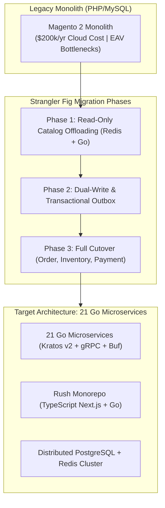

> **Answer-first:** Decomposing a monolithic Magento deployment into 21 independent Go microservices reduces AWS infrastructure hosting costs from $200k/year to under $18k/year, eliminates EAV relational bottlenecks, and scales checkout throughput to 50,000+ RPS. This living playbook documents every architecture decision record (ADR), schema migration script, gRPC gateway pipeline, and zero-downtime Strangler Fig phase.

---
## 🎯 Series Overview & Problem Space

Monolithic e-commerce engines like Magento 2 / Adobe Commerce impose severe operational, latency, and financial penalties on fast-growing retail enterprises:
* **Crippling Cloud Compute Costs:** Resource-heavy PHP/FPM workers and MySQL connection exhaustion drive annual AWS infrastructure bills beyond $200,000.
* **EAV Database Bottlenecks:** Relational entity-attribute-value (EAV) schema designs require 20+ joins for simple product catalog queries, crashing under flash-sale traffic spikes.
* **Release Velocity Paralysis:** A single bug in payment checkout blocks deployment across marketing, catalog, and warehouse operations.

This series provides an actionable, battle-tested engineering blueprint for migrating enterprise e-commerce platforms to **Composable Architecture** powered by **Golang, Kratos v2, Rush Monorepo, gRPC-Gateway, and Kafka**.

---

## 🗺️ Masterclass Chapters

- **[Part 0: Executive Summary — Why You Can Avoid the $200k/year Magento Trap](/series/composable-commerce-migration/part-0-executive-summary/)**  
  *Business case, total cost of ownership (TCO) FinOps breakdown, and the high-level composable commerce architecture.*
- **[Part 1: DDD & Bounded Contexts — Decomposing Magento into 21 Go Microservices](/series/composable-commerce-migration/part-1-ddd-bounded-contexts/)**  
  *Domain-Driven Design bounded context mapping, service responsibility boundaries, and database-per-service topology.*
- **[Part 2: Rush Monorepo — Managing 21 Go & 2 Next.js Microservices](/series/composable-commerce-migration/part-2-rush-monorepo/)**  
  *Monorepo governance, pnpm workspace isolation, versioning strategies, and shared proto generation pipelines.*
- **[Part 3: Go + Kratos v2 Framework Deep Dive](/series/composable-commerce-migration/part-3-golang-kratos/)**  
  *Microservice skeleton, wire dependency injection, middleware chain (auth, metrics, tracing), and clean architecture layering.*
- **[Part 4: gRPC Internal + REST Gateway — API Contract Lifecycle](/series/composable-commerce-migration/part-4-grpc-rest-gateway/)**  
  *Protobuf contract design, Money value types, cursor pagination, and automated OpenAPI 3.1 generation via gRPC-Gateway.*
- **[Part 5: Migrating Magento EAV Schema to Clean Relational PostgreSQL](/series/composable-commerce-migration/part-5-eav-schema-migration/)**  
  *De-normalizing Magento EAV tables into structured PostgreSQL JSONB and relational tables with zero data loss.*
- **[Part 6: Phase 1 — Strangler Fig: Offloading the Product Catalog](/series/composable-commerce-migration/part-6-phase1-strangler-fig/)**  
  *Traffic splitting at Cloudflare Edge, cache warming with Redis, and zero-downtime routing strategies.*
- **[Part 7: Phase 2 — Dual-Write: CDC & Kafka Synchronization](/series/composable-commerce-migration/part-7-phase2-dual-write/)**  
  *Change Data Capture (Debezium), dual-write synchronization, and data reconciliation pipelines.*
- **[Part 8: Phase 3 — Full Cutover & Decommissioning the Monolith](/series/composable-commerce-migration/part-8-phase3-full-cutover/)**  
  *Final cutover checklist, DNS switchover, fallback rollback runbooks, and Magento teardown.*
- **[Part 9: Transactional Outbox & Distributed Sagas](/series/composable-commerce-migration/part-9-outbox-saga/)**  
  *Guaranteeing distributed consistency across Order, Payment, and Inventory services without 2PC.*
- **[Part 10: ADR Walkthrough — 24 Architecture Decisions Decoded](/series/composable-commerce-migration/part-10-adr-walkthrough/)**  
  *Complete architectural decision records covering storage engines, messaging queues, telemetry, and auth patterns.*
