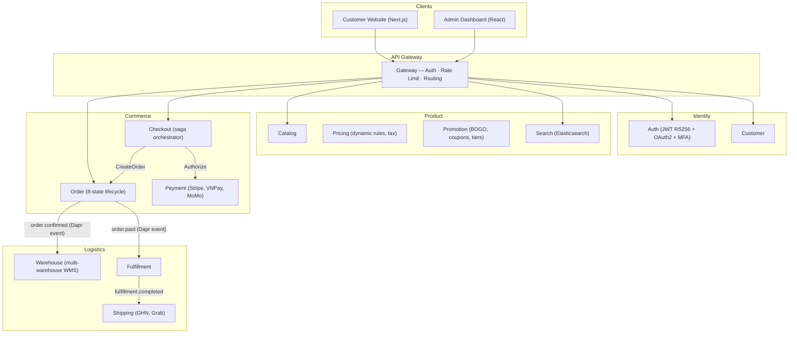
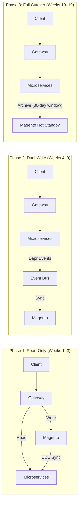

---

title: "Part 0: Why the $200K/Year Magento Trap Is Avoidable"
description: "The real cost of Magento 2 Enterprise: $125K–200K/year in licensing, scaling limits, and PHP coupling. How 21 Go microservices replaced it entirely."
date: "2026-04-01T10:00:00+07:00"
lastmod: "2026-07-03T15:41:55+07:00"
draft: false
weight: 1
slug: "part-0-executive-summary"
ShowToc: true
TocOpen: true
categories: ["Series", "Software Engineering", "Backend Architecture"]
tags: ["Magento", "Microservices", "Golang", "Composable Commerce", "Architecture", "CTO"]
author: "Lê Tuấn Anh"
cover:
  image: "images/posts/ecommerce-composable-cover.png"
  alt: "Composable Commerce Migration series: Magento 2 to microservices Golang step-by-step"
  relative: false
canonicalURL: "https://tanhdev.com/series/composable-commerce-migration/part-0-executive-summary/"
mermaid: true
---

Every engineering team that's built seriously on Magento eventually hits the same three walls: the **licensing wall**, the **scaling wall**, and the **developer velocity wall**. The question is whether you hit them before or after they cost you real money and real customers.

**Answer-first:** A Composable Commerce Platform built on 21 Go microservices, Kratos v2, and Dapr PubSub can replace Magento Enterprise — delivering the same commerce capabilities (multi-warehouse, payment saga, loyalty engine, real-time search) — at **zero license cost**, with the ability to scale individual services independently during peak traffic.

This is not a theory. This series documents the architecture decisions, migration playbook, and Golang implementation of exactly that platform.

## 1. The Three Walls of Magento Enterprise

### Wall 1: The Licensing Wall

Magento Open Source is free. But the moment your business needs real enterprise features — B2B catalogs, multi-source inventory, advanced promotions engine, dedicated support — you're looking at **Magento Commerce (now Adobe Commerce)**:

| Edition | Annual Cost |
|---|---|
| Magento Open Source | $0 (self-hosted) |
| Adobe Commerce (Cloud, Starter) | ~$22,000/year |
| Adobe Commerce (Cloud, Pro) | $40,000–$125,000/year |
| Adobe Commerce (On-Premise, Enterprise) | $125,000–$200,000/year |

For a Vietnamese e-commerce company processing 5,000–10,000 orders/day, you're typically in the $40K–125K range — before counting developer costs to maintain the PHP codebase and Magento-specific module ecosystem.

### Wall 2: The Scaling Wall

Magento 2 is a monolith. When Black Friday or 11.11 traffic spikes, you cannot scale just your checkout flow. You scale the **entire PHP application**, including catalog browsing, CMS pages, admin panel, and everything else — even though only 3% of your infrastructure is handling order creation.

The operational math is brutal:

```
Peak traffic requires 10× Order + Payment capacity
→ Magento monolith requires 10× everything
→ 10× Varnish, 10× PHP-FPM, 10× Magento cron workers
→ AWS bill increases 10× for a 2-hour flash sale
```

With a microservices architecture:

```
Peak traffic requires 10× Order + Payment capacity  
→ Scale only order-service (3 pods → 30 pods)  
→ Scale only payment-service (2 pods → 20 pods)  
→ All other services: unchanged  
→ AWS bill increases 15-20% for a 2-hour flash sale
```

This is **not theoretical**. It is the exact operational pattern used by Shopee during 11.11 and PayPay during campaign days — both covered in depth in the [Shopee Architecture](/series/shopee-architecture/) and [PayPay Architecture](/series/paypay-architecture/) series on this site.

### Wall 3: The Developer Velocity Wall

Magento 2's module system — built on Zend Framework 2 patterns circa 2015 — creates a unique kind of technical debt: **every customization is a plugin, preference, or interceptor that silently breaks when you upgrade Magento core**.

The symptoms are predictable:
- A Magento version upgrade takes **2–4 weeks** of regression testing
- New engineers need **3–6 months** to become productive with the EAV schema, di.xml, events/observers, and layout XML
- Adding a new payment gateway requires touching 7+ files across 3 modules
- Running unit tests is slow because the entire Magento bootstrap must load for every test

## 2. The Composable Commerce Architecture

The platform documented in this series handles the complete customer journey without Magento:



**Tech stack** (ADR-002, ADR-005):
- **Language**: Go 1.25
- **Microservice framework**: Kratos v2 (Google's production framework, used by Bilibili)
- **Internal API**: gRPC (Protocol Buffers)
- **External API**: REST via gRPC-Gateway
- **Async communication**: Dapr PubSub (Redis Streams in dev, Kafka-compatible in prod)
- **Database**: PostgreSQL 15+ per service (database-per-service pattern, ADR-004)
- **Monorepo**: Microsoft Rush (21 Go services + Next.js + React Admin)
- **Deploy**: Kubernetes (k3d local) + ArgoCD GitOps (ADR-009)

## 3. The Migration Path: 3-Phase Strangler Fig

The critical constraint of any production migration: **you cannot take Magento offline while rebuilding**. The store continues processing orders during the entire migration, which takes 14–19 weeks end-to-end.



**Phase 1 — Read-Only Migration**: Deploy Go microservices in read-only mode. API Gateway routes GET requests to microservices, POST/PUT/DELETE still go to Magento. A CDC sync service (Debezium on MySQL binlog) keeps microservices hydrated. Risk: zero. Rollback: disable feature flag.

**Phase 2 — Dual-Write**: Enable write APIs on microservices, one domain at a time (Customer → Catalog → Order). Dapr PubSub propagates changes bidirectionally with timestamp-wins conflict resolution. Feature flags give <10-second rollback to Magento for any service.

**Phase 3 — Full Cutover**: Gradually shift 25% → 50% → 75% → 100% traffic per service. Magento stays on hot standby for 30 days as a rollback safety net. ArgoCD GitOps manages the progressive delivery.

## 4. What This Series Covers

The 3-phase migration is only possible if you solve several non-trivial technical problems first. This series walks through each one:

| Problem | Part |
|---|---|
| Magento EAV schema: `entity_varchar`, `entity_int`, `entity_decimal` sub-tables | Part 5 |
| Integer → UUID primary key identity mapping | Part 5 |
| DDD: which Magento module maps to which Go service | Part 1 |
| Rush monorepo: managing 21 Go services without polyrepo chaos | Part 2 |
| Kratos v2 internals: transport, DI, common library | Part 3 |
| gRPC internal + REST external: protocol boundary | Part 4 |
| CDC sync: Debezium + Dapr PubSub + Transactional Outbox | Parts 6–7 |
| Feature flags for zero-downtime cutover | Parts 6–8 |
| GitOps with ArgoCD: environment-specific promotion | Part 8 |
| Saga pattern: Checkout → Order → Payment → Warehouse | Part 9 |
| 24 Architecture Decision Records (ADRs) explained | Part 10 |

## Who Is This For?

This series is written for **three audiences** simultaneously:

- **PM / BA / CTO**: Parts 0, 1, 10 give you the business case, migration timeline, and architecture trade-offs without requiring Go expertise
- **Backend engineers**: Parts 3–9 include working Go code using Kratos v2, Dapr SDK, and gRPC-Gateway
- **Architects / Tech Leads**: Parts 1, 4, 9, 10 cover the DDD decomposition, protocol design, saga patterns, and ADR rationale that will define your platform for the next 5 years

Let's begin with the domain decomposition: **[Part 1 — DDD Bounded Contexts: Decomposing Magento Modules](/series/composable-commerce-migration/part-1-ddd-bounded-contexts/)**.

## FAQ



End-to-end: **14–19 weeks** for a production Magento 2 store. Phase 1 (read-only) takes 2–3 weeks. Phase 2 (dual-write, domain by domain) takes 4–6 weeks. Phase 3 (full cutover, per-service traffic shifting) takes 8–10 weeks. Your rollback window stays open throughout.



No. The migration strategy targets the backend API layer first. Your Magento Luma/PWA Studio frontend can continue pointing at the API Gateway, which proxies to the appropriate backend (Magento or microservices) depending on the feature flag state. Frontend migration is a separate workstream.



We recommend: 2–3 Go backend engineers, 1 DevOps/SRE engineer (for CDC, Kubernetes, ArgoCD), 1 DBA or data engineer (for EAV extraction and identity mapping), and 1 QA engineer. The migration can be executed with a team of 4–5 if the engineers are cross-functional.



Yes. Kratos v2 (go-kratos.dev) is maintained by Bilibili's engineering team and used in production by multiple large-scale Go services in China and Southeast Asia. It provides a clean abstraction over gRPC + HTTP transport, Wire-based dependency injection, and a pluggable middleware chain — making it a natural fit for a 21-service platform where consistency of patterns matters more than framework flexibility.



---

*This article is part of the **[Composable Commerce Migration Series](/series/composable-commerce-migration/)**. Check out the full index to see the complete architectural context.*

*Need help assessing the risks of your own platform migration? → [Book a 1:1 Architecture Consultation](/hire/)*
