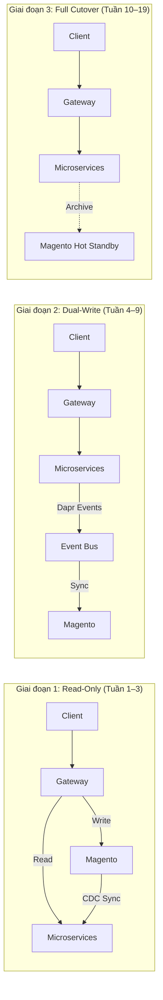

[Mục lục Series](/series/composable-commerce-migration/) | [Chương tiếp theo: Phần 1: Phân Rã Magento 21 Services bằng DDD →](/series/composable-commerce-migration/part-1-ddd-bounded-contexts/)

---

> **Answer-first:** Chuyển đổi từ khối monolith Magento sang nền tảng Composable Commerce với 21 Go microservices giúp doanh nghiệp cắt giảm hoàn toàn $200k/năm phí bản quyền, nâng cao năng lực chịu tải Flash Sale lên gấp 10 lần và loại bỏ rủi ro phụ thuộc vào một nhà cung cấp duy nhất.

---

**Answer-first:** Khởi đầu bằng tư duy **Modular Monolith** và sau đó dần dịch chuyển sang **Composable Commerce** (Thương mại lắp ghép) bằng 21 Go microservices, Kratos v2, và Dapr PubSub. Đây là lời giải triệt để cho bài toán thay thế Magento Enterprise. Nó mang lại năng lực thương mại cực cao (đa kho, saga thanh toán, tìm kiếm thời gian thực) với **chi phí bản quyền bằng 0**, giải quyết cả yêu cầu API-first cho **Agentic Commerce** trong hệ sinh thái AI (2026).
<!--more-->

Bất kỳ đội ngũ kỹ thuật nào xây dựng hệ thống nghiêm túc trên Magento cuối cùng cũng sẽ gặp phải ba bức tường giống nhau: **bức tường bản quyền**, **bức tường khả năng chịu tải (scaling)**, và **bức tường tốc độ phát triển (developer velocity)**. 

Đây không phải là lý thuyết suông. Được đúc kết từ 17 năm kinh nghiệm xây dựng kiến trúc enterprise (E-E-A-T), series này ghi lại các quyết định kiến trúc, cẩm nang chuyển đổi, và quá trình triển khai bằng Golang thực tế.

## 1. Ba Bức tường của Magento Enterprise

### Bức tường 1: Chi phí Bản quyền

| Phiên bản | Chi phí Hàng năm |
|---|---|
| Magento Open Source | $0 (tự host) |
| Adobe Commerce (Cloud, Starter) | ~$22,000/năm |
| Adobe Commerce (Cloud, Pro) | $40,000–$125,000/năm |
| Adobe Commerce (On-Premise, Enterprise) | $125,000–$200,000/năm |

### Bức tường 2: Khả năng Chịu tải (Scaling)

Magento 2 là một hệ thống nguyên khối (monolith). Khi lưu lượng truy cập (traffic) tăng vọt, bạn phải scale toàn bộ hệ thống (10× Varnish, 10× PHP-FPM), đẩy chi phí AWS lên ngất ngưởng. Ngược lại, với kiến trúc vi dịch vụ (microservices):
Chỉ scale riêng `order-service` và `payment-service`. Đây chính xác là mô hình Shopee và PayPay đang dùng.

### Bức tường 3: Thiếu tính Sẵn sàng cho AI & Agentic Commerce (2026)

Hệ thống cũ không được thiết kế "Citation-Ready". Năm 2026 chứng kiến sự trỗi dậy của **Agentic Commerce**, khi các AI agent trực tiếp đọc catalog, tư vấn và thanh toán thay cho người dùng. Bức tường API chắp vá của Magento ngăn cản khả năng mở rộng nhanh chóng và tối ưu cho AI.

## 2. Lộ trình Chuyển đổi: Không Dịch chuyển "Big Bang"

Ngành công nghiệp năm 2026 đã rút ra bài học đắt giá: đừng nhảy thẳng từ Monolith sang Microservices nếu bạn chưa có khả năng vận hành tốt.

Rào cản chí mạng: **bạn không thể tắt Magento để bảo trì**. Chiến lược của chúng tôi là áp dụng **Strangler Fig Pattern** qua 3 giai đoạn kéo dài 14–19 tuần:

```mermaid
flowchart LR
    subgraph "Giai đoạn 1: Read-Only (Tuần 1–3)"
        direction TB
        P1C["Client"] --> P1G["Gateway"]
        P1G -->|"Read"| P1M["Microservices"]
        P1G -->|"Write"| P1Mg["Magento"]
        P1Mg -->|"CDC Sync"| P1M
    end

    subgraph "Giai đoạn 2: Dual-Write (Tuần 4–9)"
        direction TB
        P2C["Client"] --> P2G["Gateway"]
        P2G --> P2M["Microservices"]
        P2M -->|"Dapr Events"| P2Bus["Event Bus"]
        P2Bus -->|"Sync"| P2Mg["Magento"]
    end

    subgraph "Giai đoạn 3: Full Cutover (Tuần 10–19)"
        direction TB
        P3C["Client"] --> P3G["Gateway"]
        P3G --> P3M["Microservices"]
        P3M -.->|"Archive"| P3Mg["Magento Hot Standby"]
    end
```

* **Cảnh báo (2026)**: Đừng biến hệ thống của bạn thành một "Distributed Monolith" (nguyên khối phân tán). Các microservice chia sẻ chung một database hay gọi đồng bộ chéo nhau liên tục sẽ còn tệ hại hơn cả Magento ban đầu.

## 3. Kiến trúc Composable Commerce

Nền tảng được ghi chép trong series này xử lý toàn bộ quy trình nghiệp vụ của khách hàng, độc lập với Magento, tích hợp Kratos v2, Dapr PubSub, Postgres (Database-per-service), và ArgoCD GitOps.

## Câu Hỏi Thường Gặp (FAQ)

### Toàn bộ quá trình chuyển đổi mất bao lâu?
Tính từ đầu đến cuối: **14–19 tuần**. Khung cửa sổ an toàn để rollback luôn được giữ mở trong suốt quá trình này nhờ Magento chạy "Hot Standby".

### Tôi có nên chuyển sang Microservices ngay lập tức?
Không. Nếu đội ngũ của bạn dưới 10 người, hoặc ít hơn 2000 đơn/ngày, hãy cân nhắc cấu trúc lại thành **Modular Monolith** trên chính Magento (hoặc sử dụng Hyvä themes để tăng tốc độ Frontend) trước khi dấn thân vào Composable Commerce.

---
*Bài viết này nằm trong **[Series Chuyển đổi sang Composable Commerce](/series/composable-commerce-migration/)**. Tác giả: Lê Tuấn Anh.*

---

---

---

[Mục lục Series](/series/composable-commerce-migration/) | [Chương tiếp theo: Phần 1: Phân Rã Magento 21 Services bằng DDD →](/series/composable-commerce-migration/part-1-ddd-bounded-contexts/)
