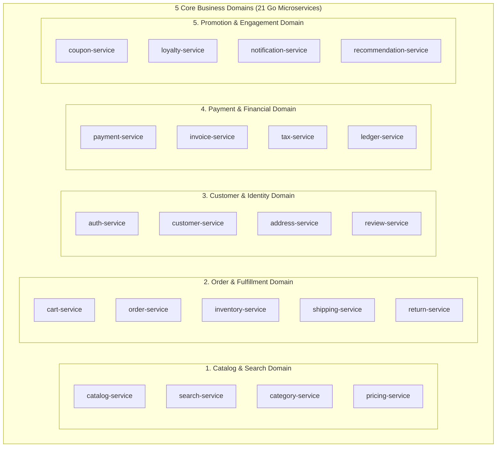

[← Previous Chapter: Part 0: Executive Summary](/series/composable-commerce-migration/part-0-executive-summary/) | [Series Hub](/series/composable-commerce-migration/) | [Next Chapter: Part 2: Rush Monorepo Architecture →](/series/composable-commerce-migration/part-2-rush-monorepo/)

---

> **Answer-first:** Decomposing Magento requires Domain-Driven Design (DDD) bounded contexts across 5 core domains: Catalog & Search, Order & Fulfillment, Customer & Identity, Marketing & Promotion, and Financial Accounting. Each microservice owns its private PostgreSQL database to eliminate coupling.

---
Monolithic Magento tightly couples product catalogs, tax rules, user sessions, inventory locks, and payment processing within a single shared database. A schema change to customer addresses can inadvertently lock product catalog tables.

To build a fault-tolerant Composable Architecture, we apply **Domain-Driven Design (DDD)** to establish strict Bounded Contexts and autonomous service boundaries.

---

## 1. The 5 Core Domains and Service Breakdown

### Domain 1: Catalog & Product Discovery
* **`catalog-service`:** Product entities, variations, attributes, brand associations. Backed by PostgreSQL (relational JSONB attributes).
* **`search-service`:** Multi-faceted search, autocomplete, typo-tolerance. Backed by Meilisearch / Elasticsearch.
* **`pricing-service`:** Dynamic tier pricing, wholesale customer group pricing, currency conversion.

### Domain 2: Order Management & Fulfillment
* **`cart-service`:** High-speed in-memory shopping cart sessions backed by Redis Cluster.
* **`order-service`:** Core state machine for order creation, status transitions, and audit logging.
* **`inventory-service`:** Real-time stock reservations, multi-warehouse stock allocations, and backorder tracking.

### Domain 3: Customer Identity & Access
* **`auth-service`:** OAuth2 / OpenID Connect tokens, Passkey authentication, JWT issuance.
* **`customer-service`:** Customer profile metadata, KYC compliance, segmentation.

### Domain 4: Payment & Settlement
* **`payment-service`:** Payment gateway integrations (Stripe, PayPal, VNPay, MoMo) with idempotent webhooks.
* **`tax-service`:** Geolocation-based tax calculation (Avalara / TaxJar integration).

### Domain 5: Promotions & Marketing
* **`coupon-service`:** Coupon code redemption limits, basket discounts, promotion engine.
* **`notification-service`:** Transactional emails, SMS, Web Push, Telegram alerts.

---

## 2. Database-Per-Service Rule & Cross-Domain Communication

A non-negotiable rule in composable microservices is **Database Isolation**: no service may ever query another service's database directly.

* **Synchronous Queries:** Inter-service queries execute over high-speed **gRPC (Protobuf)** via service mesh (Istio/Envoy).
* **Asynchronous Events:** State mutations (e.g. `OrderCreatedEvent`, `InventoryReservedEvent`) publish to **Apache Kafka / NATS JetStream**.

---

## Frequently Asked Questions (FAQ)

### Q1: How do you handle joint queries across Catalog and Orders?
Client applications query the **API Gateway / BFF (Backend-For-Frontend)** which orchestrates parallel gRPC calls to `order-service` and `catalog-service`, assembling the unified JSON payload in memory.

### Q2: What prevents distributed deadlocks between Order and Inventory services?
We implement the **Transactional Outbox & Saga Pattern** (Choreography or Orchestration). Instead of distributed 2-Phase Commit locks, services execute local transactions and emit compensating events upon failure.

### Q3: How are shared domain entities like Money and Address managed?
Shared Value Objects are defined in common Protobuf contracts (`api/common/v1/money.proto`) managed within the Rush monorepo.
