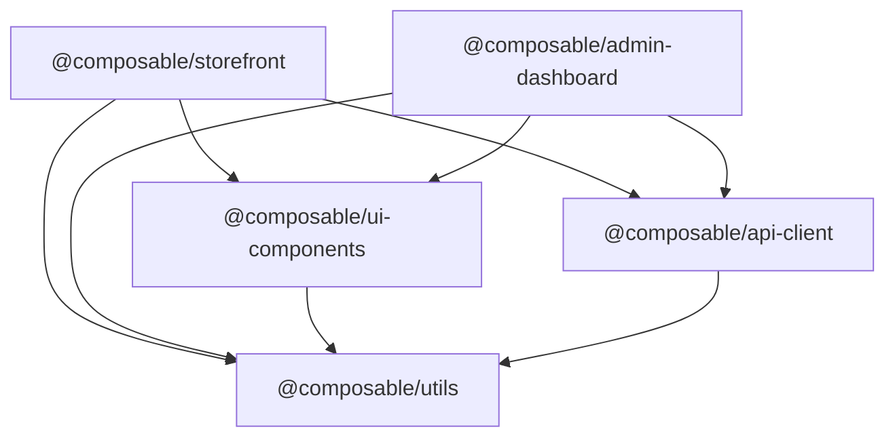

When you have 21 Go microservices and 2 frontend applications, the first infrastructure question isn't Kubernetes or CI/CD — it's **how do you manage the code itself?**

Two options fail immediately: polyrepo (21+ separate Git repos, impossible to maintain consistent versions) and a naive monorepo (everything dumped in one folder, phantom dependencies everywhere). You need a proper monorepo manager.

> **Scope note:** Rush manages the frontend layer (Next.js, TypeScript packages). Go microservices are managed independently via `go.mod` and Go workspaces. The structure below reflects the platform's recommended approach — verify `rush.json` specifics against your team's actual repository before adopting wholesale.

**Answer-first:** Microsoft Rush is the right choice for a platform with strict dependency governance requirements, a mix of Go services and TypeScript frontends, and the need to publish internal packages (the `api-client` TypeScript SDK generated from your Go protobuf definitions). This article documents the setup, directory structure, and the key integration between your Go protos and your frontend types.

## 1. Why Rush Over Nx or Turborepo?

The short comparison:

| Feature | Rush | Nx | Turborepo |
|---|---|---|---|
| **Dependency governance** | ✅ `common-versions.json` — enforced | ⚠️ Project-level | ⚠️ Project-level |
| **Phantom dependency prevention** | ✅ Strict PNPM isolation | ⚠️ Configurable | ✅ Strict |
| **Mixed language (Go + TS)** | ✅ Custom bulk commands | ✅ Plugins | ⚠️ JS-only native |
| **Package publishing** | ✅ First-class `rush publish` | ⚠️ Requires plugins | ⚠️ Manual |
| **Learning curve** | 🔴 Steeper | 🟡 Moderate | 🟢 Low |
| **Corporate backing** | Microsoft (Rush Stack) | Nrwl (acquired by VSHN) | Vercel |

The decisive factor for the Composable Commerce Platform: **`common-versions.json`**. When you have a storefront and an admin dashboard both consuming the same `api-client` package, you cannot allow one to run `react@18.1.0` and the other `react@18.3.0`. Rush enforces identical dependency versions across the entire repo — Nx and Turborepo require you to configure this yourself per project.

The second factor: the Magento PHP ecosystem taught us the cost of **phantom dependencies** — where a package works locally because it's installed somewhere in node_modules, but fails in production because it's not a declared dependency. Rush + PNPM's strict isolation prevents this class of bug entirely.

## 2. Repository Structure



```
composable-commerce/               ← root of the monorepo
├── rush.json                      ← Rush config: pnpm version, project list
├── .npmrc                         ← PNPM config
├── common/                        ← Rush-managed (do NOT edit manually)
│   ├── config/
│   │   ├── rush/
│   │   │   └── common-versions.json   ← Pinned versions for all shared deps
│   │   └── .npmrc
│   └── temp/                      ← Rush working dir (gitignored)
│
├── apps/
│   ├── storefront/                ← Next.js customer storefront (SSR)
│   │   └── package.json
│   └── admin-dashboard/           ← React admin panel
│       └── package.json
│
├── packages/
│   ├── ui-components/             ← Shared design system (Radix + Tailwind)
│   │   └── package.json
│   ├── api-client/                ← TypeScript SDK generated from Go proto
│   │   ├── package.json
│   │   └── generated/             ← Auto-generated, do not edit
│   └── utils/                     ← Shared validators, formatters
│       └── package.json
│
└── services/                      ← Go microservices (Rush manages builds)
    ├── order-service/
    │   ├── go.mod
    │   └── ...
    ├── catalog-service/
    │   ├── go.mod
    │   └── ...
    └── ... (21 services total)
```

Key constraint: `services/` contains Go modules. Rush does not manage `go.mod` — it only orchestrates builds via custom `rush.json` commands that shell out to `go build`. Go dependency management (`go mod tidy`, `go.sum`) is entirely separate.

## 3. rush.json Configuration

```json
{
  "$schema": "https://developer.microsoft.com/json-schemas/rush/v5/rush.schema.json",
  "rushVersion": "5.140.0",
  "pnpmVersion": "9.4.0",
  "nodeSupportedVersionRange": ">=20.0.0 <22.0.0",

  "projects": [
    { "packageName": "@composable/storefront",       "projectFolder": "apps/storefront" },
    { "packageName": "@composable/admin-dashboard",  "projectFolder": "apps/admin-dashboard" },
    { "packageName": "@composable/ui-components",    "projectFolder": "packages/ui-components" },
    { "packageName": "@composable/api-client",       "projectFolder": "packages/api-client" },
    { "packageName": "@composable/utils",            "projectFolder": "packages/utils" }
  ]
}
```

Go services are added as custom bulk commands, not as Rush projects — because they have no `package.json`:

```json
{
  "commands": [
    {
      "commandKind": "bulk",
      "name": "build:go",
      "description": "Build all Go microservices",
      "enableParallelism": true,
      "allowWarningsInSuccessfulBuild": false,
      "shellCommand": "go build ./..."
    },
    {
      "commandKind": "bulk",
      "name": "test:go",
      "description": "Run Go unit tests",
      "shellCommand": "go test ./... -race -count=1"
    }
  ]
}
```

## 4. Dependency Version Governance

`common/config/rush/common-versions.json` pins shared dependencies:

```json
{
  "preferredVersions": {
    "typescript":          "~5.4.0",
    "react":               "^18.3.0",
    "react-dom":           "^18.3.0",
    "next":                "^14.2.0",
    "@tanstack/react-query": "^5.40.0",
    "zod":                 "^3.23.0",
    "tailwindcss":         "^3.4.0",
    "@radix-ui/react-dialog": "^1.1.0"
  },
  "allowedAlternativeVersions": {}
}
```

When a developer runs `rush add -p react@18.2.0` in any project, Rush rejects it if the preferred version is `^18.3.0`. This is the corporate governance feature that justifies Rush's steeper learning curve.

## 5. The api-client Bridge: Go Proto → TypeScript

This is the most valuable structural decision in the entire monorepo setup: **your TypeScript types are generated from your Go proto definitions**.

The flow:

```
services/order-service/api/order/v1/order.proto
    ↓ buf generate (buf.gen.yaml)
packages/api-client/generated/
    ├── order/v1/order_pb.ts          ← Proto message types
    ├── order/v1/order_connect.ts     ← ConnectRPC client (or grpc-gateway)
    └── index.ts                      ← Re-exports
    ↓ rush build --to @composable/api-client
apps/storefront/                      ← imports @composable/api-client
apps/admin-dashboard/                 ← imports @composable/api-client
```

The `buf.gen.yaml` in the repo root:

```yaml
version: v2
plugins:
  - plugin: es
    out: packages/api-client/generated
    opt: target=ts
  - plugin: connect-es
    out: packages/api-client/generated
    opt: target=ts
inputs:
  - directory: services
    paths:
      - "*/api/**/*.proto"
```

Running `buf generate` from the repo root regenerates all TypeScript clients whenever a proto changes. This is run as a CI check: if the generated files differ from the committed files, the build fails. **Protobuf is the contract; TypeScript types are derived from it.**

The result in the storefront:

```typescript
import { OrderServiceClient } from "@composable/api-client/order/v1";
import { CreateOrderRequest } from "@composable/api-client/order/v1";

// Types are exact mirrors of your Go proto — no manual duplication
const req: CreateOrderRequest = {
  customerId: session.userId,
  items: cart.items.map(item => ({
    productId: item.id,
    quantity: item.qty,
    unitPrice: item.price, // Money type: { currencyCode, units, nanos }
  })),
  shippingAddress: shippingAddr,
  requestId: crypto.randomUUID(), // Idempotency key
};
```

When the Go backend team adds a field to `CreateOrderRequest`, the TypeScript type is automatically updated after the next `buf generate` run — with compile-time errors in frontend code that doesn't handle the new field.

## 6. Selective Builds in CI

CI is where the monorepo investment pays off:

```bash
# Full rebuild (for main branch, after any change)
rush build

# Incremental: only build what's affected by changes in this PR
rush build --from packages/api-client  # Rebuild api-client and everything that depends on it
rush build --to apps/storefront         # Only build storefront and its dependencies

# Example: a developer changes packages/utils/src/formatters.ts
# CI automatically detects this affects:
# - @composable/utils (the changed package)
# - @composable/api-client (imports utils for validation)
# - @composable/storefront (imports api-client)
# - @composable/admin-dashboard (imports api-client)
# Rush rebuilds and retests exactly these 4 packages, skipping the rest
```

This matters at scale: a change to `packages/ui-components/Button.tsx` should not trigger a rebuild of `packages/api-client` or `services/order-service`. Rush's dependency graph ensures it doesn't.

## 7. The Strangler Fig for Frontend

The Rush monorepo also implements the Strangler Fig pattern at the **frontend layer** — mirroring the backend migration phases from [Part 6](/series/composable-commerce-migration/part-6-phase1-strangler-fig/) through [Part 8](/series/composable-commerce-migration/part-8-phase3-full-cutover/).

During Phase 1 (read-only migration), the CDN config routes:
```
GET /products/*  → new Next.js storefront (Catalog Service reads)
GET /checkout/*  → Magento frontend (writes still go to Magento)
POST /*          → Magento frontend (all writes)
```

The Next.js storefront in `apps/storefront/` handles only the pages that have been migrated. Unhandled routes fall through to a Magento reverse proxy. As migration progresses through Phase 2 and Phase 3, more routes shift to the new storefront — without any frontend rebuild or deployment.

```typescript
// apps/storefront/next.config.ts
const nextConfig = {
  async rewrites() {
    return {
      fallback: [
        {
          source: "/:path*",
          destination: `${process.env.MAGENTO_URL}/:path*`, // Magento fallback
        },
      ],
    };
  },
};
```

## 8. Essential Rush Commands

```bash
# First-time setup
npm install -g @microsoft/rush
rush install         # Install all dependencies (pnpm)

# Development
rush build           # Build all packages in dependency order
rush test            # Test all packages
rush rebuild         # Force rebuild (skip cache)
rush watch           # Watch mode for development

# Adding dependencies
rush add -p react --make-consistent          # Add to current project + pin globally
rush add -p @composable/utils --caret        # Add internal package dependency

# Publishing
rush publish --apply --target-branch main   # Bump versions and publish

# Go services
rush build:go        # Build all 21 Go microservices
rush test:go         # Test all 21 Go microservices

# CI
rush build --to apps/storefront              # Only what storefront needs
rush build --from packages/api-client       # Everything that uses api-client
```

## 9. One Important Caveat

The Rush monorepo in this series describes the **recommended structure** for managing the Composable Commerce Platform's frontend layer. The architecture documentation for the Go backend services (`Composable-Commerce-Service-Architecture`) is comprehensive — 24 ADRs, full API guidelines, migration playbooks. The frontend monorepo configuration details are inferred from the platform's overall design goals.

If you're implementing this for your own migration, validate the `buf.gen.yaml` setup against your specific proto layout and the ConnectRPC version your team prefers. The structure is proven; the exact toolchain versions evolve.

## What's Next

With the repository structure established, we can go deep on what a single Go microservice looks like. [Part 3: Kratos v2 Internals](/series/composable-commerce-migration/part-3-golang-kratos/) covers the full anatomy — from the 5-layer directory structure to Wire dependency injection to the `common` library that eliminates 4,150 lines of boilerplate across all 21 services.

## FAQ



Use plain pnpm workspaces if you have ≤4 packages and no strict version governance requirements. Rush becomes worthwhile at 5+ packages when you need `common-versions.json` enforcement (preventing one package from upgrading React while another stays behind), `rush publish` lifecycle, and project-level build caching. For this platform — 2 apps, 3 shared packages, 21 Go services — Rush's governance features pay off.



No. Rush only manages packages with a `package.json`. Go services live in `services/` and are orchestrated via custom `rush.json` bulk commands that shell out to `go build ./...`. Rush tracks Go build artifacts in its cache but does not parse `go.mod` or `go.sum`. Go dependency management remains entirely within the standard Go toolchain.



The TypeScript SDK in `packages/api-client/generated/` goes stale. CI enforces freshness: if generated files differ from committed files, the pipeline fails with `buf lint` + `buf generate --check`. This prevents the frontend from shipping with a TypeScript type that no longer matches the backend's proto contract.



---

*This article is part of the **[Composable Commerce Migration Series](/series/composable-commerce-migration/)**. Check out the full index to see the complete architectural context.*

*Need help assessing the risks of your own platform migration? → [Book a 1:1 Architecture Consultation](/hire/)*
