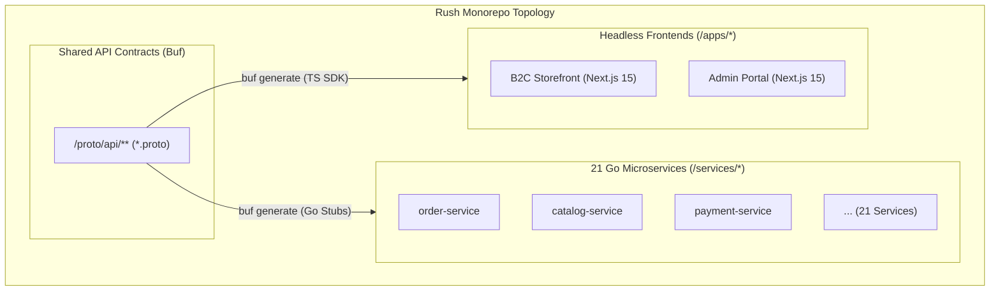

[← Previous Chapter: Part 1: DDD & Bounded Contexts](/series/composable-commerce-migration/part-1-ddd-bounded-contexts/) | [Series Hub](/series/composable-commerce-migration/) | [Next Chapter: Part 3: Go + Kratos v2 Framework Deep Dive →](/series/composable-commerce-migration/part-3-golang-kratos/)

---

> **Answer-first:** Using Microsoft Rush with PNPM workspaces enables polyglot monorepo management across 21 Go microservices and 2 Next.js frontends. It automates Protobuf code generation via Buf, enforces dependency boundaries, and slashes CI build times by 70% with incremental build caching.

---
Managing 21 independent Git repositories creates severe operational friction: version mismatch across shared Protobuf contracts, fragmented CI pipelines, and delayed end-to-end integration testing.

A **Polyglot Monorepo** powered by **Microsoft Rush** provides unified version control, automated proto generation, and deterministic builds across Go backend microservices and TypeScript storefronts.


```mermaid
flowchart TD
    subgraph MonorepoRoot ["Rush Monorepo Topology"]
        subgraph ProtoLayer ["Shared API Contracts (Buf)"]
            Proto["/proto/api/** (*.proto)"]
        end
        subgraph GoServices ["21 Go Microservices (/services/*)"]
            S1["order-service"]
            S2["catalog-service"]
            S3["payment-service"]
            S21["... (21 Services)"]
        end
        subgraph Frontends ["Headless Frontends (/apps/*)"]
            NextStore["B2C Storefront (Next.js 15)"]
            AdminUI["Admin Portal (Next.js 15)"]
        end
    end

    Proto -->|"buf generate (Go Stubs)"| GoServices
    Proto -->|"buf generate (TS SDK)"| Frontends
```

---

## 1. Directory Layout and Project Structure

```text
├── apps/
│   ├── storefront/              # Next.js 15 App Router (B2C)
│   └── admin-portal/            # Next.js 15 Dashboard (Operations)
├── services/
│   ├── order-service/           # Go Kratos v2 microservice
│   ├── catalog-service/         # Go Kratos v2 microservice
│   └── payment-service/         # Go Kratos v2 microservice
├── proto/
│   ├── api/order/v1/order.proto
│   ├── api/catalog/v1/catalog.proto
│   └── buf.yaml
├── common/
│   ├── config/rush/
│   └── scripts/
└── rush.json
```

---

## 2. Automated Protobuf Generation Pipeline with Buf

With `buf.gen.yaml`, running `rush build:proto` regenerates Go gRPC interfaces and TypeScript SDKs simultaneously:

```yaml
version: v2
managed:
  enabled: true
plugins:
  - remote: buf.build/protocolbuffers/go
    out: gen/go
    opt: paths=source_relative
  - remote: buf.build/grpc/go
    out: gen/go
    opt: paths=source_relative
  - remote: buf.build/connectrpc/es
    out: gen/ts
    opt: target=ts
```

---

## Frequently Asked Questions (FAQ)

### Q1: Why choose Rush over Turborepo or Nx for Go projects?
Rush natively isolates `node_modules` via strict symlink trees with PNPM, preventing phantom dependencies, and seamlessly orchestrates non-Node build tools (such as Go compiler and Buf) through custom command plugins.

### Q2: Does a monorepo slow down git clone operations as history grows?
No. In enterprise CI/CD pipelines, we use Git Sparse Checkout and shallow clones (`git clone --depth 1`), fetching only the required service directory during testing.
