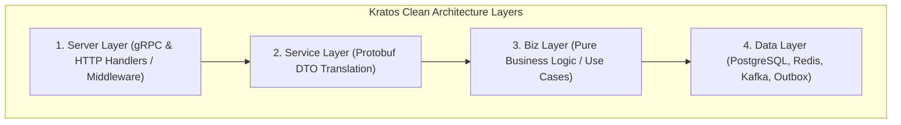

[← Previous Chapter: Part 2: Rush Monorepo](/series/composable-commerce-migration/part-2-rush-monorepo/) | [Series Hub](/series/composable-commerce-migration/) | [Next Chapter: Part 4: gRPC Internal + REST Gateway →](/series/composable-commerce-migration/part-4-grpc-rest-gateway/)

---

> **Answer-first:** Go-Kratos v2 provides a battle-tested microservice foundation combining Clean Architecture layers (Server, Service, Biz, Data), Google Wire compile-time dependency injection, and dual gRPC/HTTP protocol handlers.

---
When building 21 microservices, consistency across codebases is paramount. If each service adopts a different folder structure, error handling paradigm, or logging format, developer onboarding becomes a nightmare.

**Kratos v2** (a CNCF-landscape Go microservice framework developed by Bilibili) provides a rigorous, standardized microservice layout based on Uncle Bob's **Clean Architecture**.



---

## 1. The 4 Clean Architecture Layers in Kratos

1. **`server/`:** Configures HTTP and gRPC listeners, attaches middleware (JWT authentication, rate limiting, Prometheus metrics, OpenTelemetry tracing).
2. **`service/`:** Implements auto-generated Protobuf interfaces, performs request parameter validation, and maps proto messages to domain models.
3. **`biz/`:** The pure business core. Contains domain entities, business validation rules, and use-case orchestrators. Zero dependencies on databases or external frameworks.
4. **`data/`:** Implements repository interfaces defined in `biz/`. Handles SQL queries via Ent/GORM, Redis cache invalidation, and Kafka event publishing.

---

## 2. Compile-Time Dependency Injection with Google Wire

Kratos utilizes **Google Wire** for compile-time dependency injection, eliminating runtime reflection overhead:

```go
// cmd/server/wire.go
//go:build wireinject

package main

import (
	"github.com/google/wire"
	"ta-microservices/order-service/internal/biz"
	"ta-microservices/order-service/internal/data"
	"ta-microservices/order-service/internal/server"
	"ta-microservices/order-service/internal/service"
)

func wireApp(*conf.Server, *conf.Data, log.Logger) (*kratos.App, func(), error) {
	panic(wire.Build(server.ProviderSet, data.ProviderSet, biz.ProviderSet, service.ProviderSet, newApp))
}
```

---

## Frequently Asked Questions (FAQ)

### Q1: Why Kratos instead of Go-Zero or Gin?
Kratos offers superior gRPC-first design, native Protobuf annotation bindings for HTTP routes, compile-time Wire injection, and standard OpenTelemetry instrumentation out of the box.

### Q2: How does Kratos handle configuration hot-reloading?
Kratos config supports dynamic source watchers (consul, etcd, kubernetes configmaps, local yaml), automatically reloading secrets without restarting pods.
