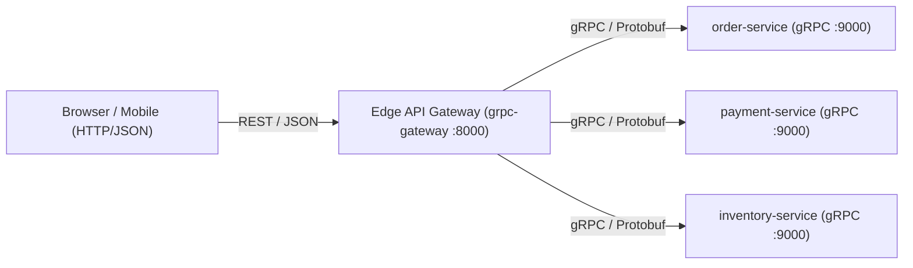

[← Previous Chapter: Part 3: Go + Kratos v2 Framework Deep Dive](/series/composable-commerce-migration/part-3-golang-kratos/) | [Series Hub](/series/composable-commerce-migration/) | [Next Chapter: Part 5: Migrating Magento EAV Schema to PostgreSQL →](/series/composable-commerce-migration/part-5-eav-schema-migration/)

---

> **Answer-first:** Every API in our Composable Commerce system starts with a Protocol Buffers (`.proto`) contract. Internal microservices communicate over binary gRPC for 7x faster serialization, while gRPC-Gateway automatically exposes standard REST/JSON endpoints with OpenAPI 3.1 specs for web and mobile clients.

---
In modern 2026 cloud architectures, internal services communicate over gRPC (type-safe, binary format, ~7x faster than JSON over HTTP/1.1). External clients (web browsers, mobile apps) communicate over standard REST via a Gateway Service (using `grpc-gateway` or Connect by Buf running at the edge).

The `.proto` file serves as the **Single Source of Truth** for the entire API lifecycle.



---

## 1. Protobuf Contract Design: Contract-First Workflow

Before writing any Go or TypeScript code, the API contract is defined in proto3:

```protobuf
// api/order/v1/order.proto
syntax = "proto3";

package api.order.v1;

import "google/api/annotations.proto";
import "google/protobuf/timestamp.proto";
import "validate/validate.proto";

option go_package = "gitlab.com/ta-microservices/order-service/api/order/v1;orderv1";

service OrderService {
    rpc CreateOrder (CreateOrderRequest) returns (CreateOrderResponse) {
        option (google.api.http) = {
            post: "/api/v1/orders"
            body: "*"
        };
    };
    rpc GetOrder (GetOrderRequest) returns (GetOrderResponse) {
        option (google.api.http) = {
            get: "/api/v1/orders/{order_id}"
        };
    };
}

message Money {
    string currency_code = 1 [(validate.rules).string = {len: 3}];
    int64 units = 2; // Whole units (e.g. $10)
    int32 nanos = 3 [(validate.rules).int32 = {gte: 0, lt: 1000000000}]; // Fractional cents (e.g. 50 cents = 500,000,000 nanos)
}

message CreateOrderRequest {
    string customer_id = 1 [(validate.rules).string.uuid = true];
    repeated OrderItem items = 2 [(validate.rules).repeated.min_items = 1];
}

message CreateOrderResponse {
    string order_id = 1;
    string status = 2;
    Money total_amount = 3;
    google.protobuf.Timestamp created_at = 4;
}

message OrderItem {
    string product_id = 1 [(validate.rules).string.min_len = 1];
    int32 quantity = 2 [(validate.rules).int32.gt = 0];
    Money unit_price = 3;
}

message GetOrderRequest {
    string order_id = 1 [(validate.rules).string.min_len = 1];
}

message GetOrderResponse {
    string order_id = 1;
    string customer_id = 2;
    string status = 3;
    Money total_amount = 4;
}
```

---

## 2. The Three Cardinal Rules of Production Protobuf

### Rule 1: The Money Pattern (Never Use Floats for Currency)
Floating-point numbers (`float`, `double`) introduce rounding errors (e.g. `$0.1 + $0.2 = $0.30000000000000004`). In Protobuf, financial values MUST use a structured `Money` type consisting of integer `units` and `nanos`.

### Rule 2: Cursor-Based Pagination (Never Use SQL Offsets)
Offset pagination (`OFFSET 100000 LIMIT 20`) causes severe $O(N)$ database table scan performance degradation. APIs must use opaque Cursor tokens:

```protobuf
message ListOrdersRequest {
    int32 page_size = 1 [(validate.rules).int32 = {gte: 1, lte: 100}];
    string page_token = 2; // Opaque base64 cursor
}
```

### Rule 3: Declarative Field Validation
Use `protoc-gen-validate` (PGV) annotations directly in the proto contract. Validation executes in the generated gRPC interceptor before reaching business logic.

---

## Frequently Asked Questions (FAQ)

### Q1: How do you handle backward compatibility when updating proto fields?
Never change field numbers or delete existing fields. Mark deprecated fields with `[deprecated = true]` and add new fields with unique sequential field tags.

### Q2: Does gRPC-Gateway introduce significant CPU latency?
gRPC-Gateway overhead is negligible (< 1.5ms), translating JSON to Protobuf in memory with zero intermediate disk I/O.
