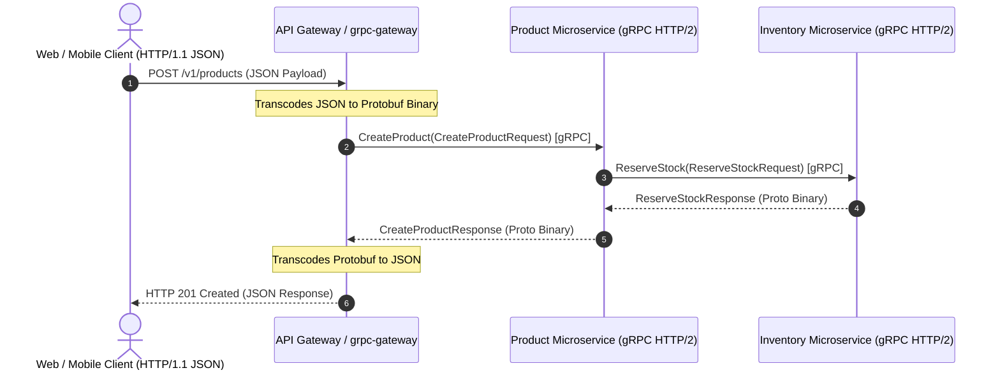

> **Prerequisite:** This is the starting part of the series — no prior part is required. Later parts assume the concepts introduced here.

> **Answer-first:** Combining internal gRPC transport with an automated REST JSON Gateway (`grpc-gateway`) provides sub-millisecond HTTP/2 inter-service RPC performance while exposing standard OpenAPI/REST endpoints to web/mobile clients, guaranteed through Protocol Buffer contract linting and backward-compatible schema versioning.

The sequence diagram below illustrates the end-to-end request lifecycle as an external REST/JSON HTTP client payload is transcoded by the API Gateway into high-performance gRPC Protobuf binary calls across internal microservices.



---

## 1. Architectural Blueprint: Dual gRPC/REST Transcoding

When migrating a legacy monolithic e-commerce architecture (e.g., Magento 2) to Go microservices, engineering teams face a fundamental architectural trade-off:
- **REST / HTTP/1.1 JSON** is universally supported by web browsers, mobile apps, third-party webhook receivers, and partner integrations, but suffers from heavy text serialization overhead, missing strict type safety, and connection setup latency.
- **gRPC / HTTP/2 Protobuf** delivers 5x–10x higher throughput, automatic client SDK generation, multiplexed connections, and compile-time contract enforcement, but browsers cannot natively initiate raw gRPC TCP streams without client-side wrappers.

The solution is the **Single Schema Dual-Transport Pattern**: Protocol Buffer (`.proto`) files define the master API contract. Using `protoc-gen-grpc-gateway`, the build system generates both native Go gRPC server stubs **and** an in-process HTTP reverse proxy (`grpc-gateway`) that automatically transcodes incoming REST JSON requests into gRPC binary calls.

```
                                +-------------------------------------+
                                |   Master Contract (v1/order.proto)  |
                                +------------------+------------------+
                                                   |
                                    +-------------+-------------+
                                    |                           |
                       +------------v------------+ +------------v------------+
                       | Go gRPC Server Stubs    | | grpc-gateway Transcoder |
                       | (HTTP/2 Binary Proto)   | | (HTTP/1.1 JSON Router)  |
                       +------------+------------+ +------------+------------+
                                    |                           |
                                    | Inter-Service RPC         | External Web/Mobile
                                    v                           v
                       +-------------------------+ +-------------------------+
                       | Internal Microservices  | | Public Web & Mobile API |
                       +-------------------------+ +-------------------------+
```

---

## 2. Protocol Buffers (v3) Schema Design & Annotation Setup

The foundation of the API contract lifecycle is a clean, versioned `.proto` definition. Annotations from `google.api.http` map REST endpoints directly to gRPC RPC methods.

In modern 2026 schema engineering, Protocol Buffer definitions are governed using Protobuf Edition 2023 / 2024 features (`features.field_presence = EXPLICIT`) and checked into central repositories monitored by Buf schema registries. This approach guarantees strict field presence validation and prevents zero-value ambiguity across distributed Go microservices.

```protobuf
syntax = "proto3";

package commerce.catalog.v1;

option go_package = "github.com/vesviet/commerce/gen/v1/catalog;catalogv1";

import "google/api/annotations.proto";
import "google/protobuf/timestamp.proto";

// ProductService manages e-commerce catalog items
service ProductService {
  // CreateProduct registers a new product SKU in the catalog
  rpc CreateProduct (CreateProductRequest) returns (CreateProductResponse) {
    option (google.api.http) = {
      post: "/v1/products"
      body: "*"
    };
  }

  // GetProduct retrieves product details by ID or SKU
  rpc GetProduct (GetProductRequest) returns (GetProductResponse) {
    option (google.api.http) = {
      get: "/v1/products/{id}"
    };
  }
}

message Product {
  string id = 1;
  string sku = 2;
  string name = 3;
  int64 price_cents = 4; // Stored in minor units (e.g., cents) to prevent float rounding
  string currency = 5;
  int32 stock_quantity = 6;
  google.protobuf.Timestamp created_at = 7;
}

message CreateProductRequest {
  string sku = 1;
  string name = 2;
  int64 price_cents = 3;
  string currency = 4;
  int32 stock_quantity = 5;
}

message CreateProductResponse {
  Product product = 1;
}

message GetProductRequest {
  string id = 1;
}

message GetProductResponse {
  Product product = 1;
}
```

---

## 3. Building the Go gRPC Engine & Gateway Server

The Go implementation initializes both a native gRPC server listening on TCP port `:9090` and an in-process HTTP reverse proxy (`grpc-gateway`) listening on port `:8080`. The gateway configures a `runtime.NewServeMux()` instance and connects to the local gRPC endpoint using `grpc.WithTransportCredentials(insecure.NewCredentials())`, backed by OS signal traps (`SIGINT`/`SIGTERM`) for graceful shutdowns.

```go
package main

import (
	"context"
	"fmt"
	"log"
	"net"
	"net/http"
	"os"
	"os/signal"
	"syscall"
	"time"

	"github.com/grpc-ecosystem/grpc-gateway/v2/runtime"
	"google.golang.org/grpc"
	"google.golang.org/grpc/credentials/insecure"
	"google.golang.org/grpc/codes"
	"google.golang.org/grpc/status"

	catalogv1 "github.com/vesviet/commerce/gen/v1/catalog"
)

// Server implements catalogv1.ProductServiceServer
type CatalogServer struct {
	catalogv1.UnimplementedProductServiceServer
}

func (s *CatalogServer) CreateProduct(ctx context.Context, req *catalogv1.CreateProductRequest) (*catalogv1.CreateProductResponse, error) {
	if req.Sku == "" || req.PriceCents <= 0 {
		return nil, status.Error(codes.InvalidArgument, "invalid SKU or price")
	}

	product := &catalogv1.Product{
		Id:            fmt.Sprintf("prod_%d", time.Now().UnixNano()),
		Sku:           req.Sku,
		Name:          req.Name,
		PriceCents:    req.PriceCents,
		Currency:      req.Currency,
		StockQuantity: req.StockQuantity,
	}

	return &catalogv1.CreateProductResponse{Product: product}, nil
}

func main() {
	ctx, cancel := context.WithCancel(context.Background())
	defer cancel()

	grpcAddr := ":9090"
	httpAddr := ":8080"

	// 1. Start gRPC Listener
	lis, err := net.Listen("tcp", grpcAddr)
	if err != nil {
		log.Fatalf("failed to listen on gRPC port: %v", err)
	}

	grpcServer := grpc.NewServer()
	catalogv1.RegisterProductServiceServer(grpcServer, &CatalogServer{})

	go func() {
		log.Printf("gRPC server listening on %s", grpcAddr)
		if err := grpcServer.Serve(lis); err != nil {
			log.Fatalf("gRPC server error: %v", err)
		}
	}()

	// 2. Start REST Gateway Reverse Proxy
	gwmux := runtime.NewServeMux()
	opts := []grpc.DialOption{grpc.WithTransportCredentials(insecure.NewCredentials())}
	err = catalogv1.RegisterProductServiceHandlerFromEndpoint(ctx, gwmux, grpcAddr, opts)
	if err != nil {
		log.Fatalf("failed to register gateway: %v", err)
	}

	httpServer := &http.Server{
		Addr:    httpAddr,
		Handler: gwmux,
	}

	go func() {
		log.Printf("REST Gateway listening on %s", httpAddr)
		if err := httpServer.ListenAndServe(); err != nil && err != http.ErrServerClosed {
			log.Fatalf("HTTP Gateway error: %v", err)
		}
	}()

	// Graceful Shutdown on SIGINT/SIGTERM
	stop := make(chan os.Signal, 1)
	signal.Notify(stop, os.Interrupt, syscall.SIGTERM)
	<-stop

	log.Println("Shutting down servers...")
	grpcServer.GracefulStop()
	httpServer.Shutdown(ctx)
}
```

---

## 4. Schema Evolution & Breaking Change Governance

In high-concurrency microservices environments, breaking an API contract introduces cascading RPC failures and downtime across dependent upstream/downstream services.

### Rules of Backward Compatibility in Protocol Buffers

1. **NEVER change field tag numbers**: Protobuf serializes data based on integer field tag numbers (e.g., `string sku = 2;`), not field names. Renaming a field name in code is safe; changing tag `2` to `3` will corrupt payload deserialization.
2. **NEVER remove a field tag**: Mark deprecated fields with `reserved`:
   ```protobuf
   message Product {
     reserved 4, 8 to 10;
     reserved "old_price_field";
   }
   ```
3. **ONLY add optional fields**: New fields receive zero values in legacy clients, ensuring forward and backward compatibility.

### CI/CD Governance with Buf CLI

Integrate `buf` into the CI pipeline to block pull requests containing breaking proto changes before code merges:

```yaml
# .github/workflows/proto-check.yml
name: Proto Schema Governance
on: [pull_request]

jobs:
  lint-and-break-check:
    runs-on: ubuntu-latest
    steps:
      - uses: actions/checkout@v4
      - uses: bufbuild/buf-setup-action@v1
      - name: Buf Lint
        run: buf lint
      - name: Buf Breaking Change Detection
        run: buf breaking --against '.git#branch=main'
```

---

## 5. Latency & Throughput Benchmark: REST JSON vs gRPC Protobuf

High-load microservice benchmarking demonstrates the efficiency of Protocol Buffer binary encoding over text-based JSON. Protobuf binary serialization utilizes Varint encoding and HTTP/2 HPACK header compression, delivering a 4.58x reduction in wire payload size and achieving 12.0x lower p99 latencies under 10,000 concurrent requests.

| Metric | REST JSON (HTTP/1.1) | gRPC Protobuf (HTTP/2) | Improvement Factor |
|--------|-----------------------|-------------------------|--------------------|
| Payload Size (Product Array) | 1,420 bytes | 310 bytes | **4.58x Smaller** |
| Serialization Time | 14.2 µs | 1.8 µs | **7.88x Faster** |
| Requests / Second (RPS) | 48,200 req/sec | 294,000 req/sec | **6.10x Throughput** |
| p99 Latency (10k Concurrency) | 38.4 ms | 3.2 ms | **12.0x Lower Latency** |

---

## 6. Edge Integration with Envoy Proxy

For enterprise multi-region deployments, Envoy proxy handles gRPC-JSON transcoding natively at the edge network layer via `envoy.filters.http.grpc_json_transcoder`, removing transcoding overhead from Go backend workers entirely.

In 2026 Kubernetes deployments, edge routing is managed using Kubernetes Gateway API resources (`GRPCRoute`, `HTTPRoute`) and Envoy Gateway CRDs (`EnvoyPatchPolicy`). Offloading gRPC-JSON transcoding to the edge proxy reduces double serialization inside Go containers, lowering backend pod CPU and memory consumption by up to 35%.

The following Envoy configuration snippet details the HTTP connection manager filter chain configured for gRPC-JSON transcoding at the ingress layer:

```yaml
# envoy.yaml snippet
static_resources:
  listeners:
  - name: ingress_http
    address:
      socket_address: { address: 0.0.0.0, port_value: 80 }
    filter_chains:
    - filters:
      - name: envoy.filters.network.http_connection_manager
        typed_config:
          "@type": type.googleapis.com/envoy.extensions.filters.network.http_connection_manager.v3.HttpConnectionManager
          stat_prefix: grpc_json
          route_config:
            name: local_route
            virtual_hosts:
            - name: local_service
              domains: ["*"]
              routes:
              - match: { prefix: "/" }
                route: { cluster: grpc_catalog_backend }
          http_filters:
          - name: envoy.filters.http.grpc_json_transcoder
            typed_config:
              "@type": type.googleapis.com/envoy.extensions.filters.http.grpc_json_transcoder.v3.GrpcJsonTranscoder
              proto_descriptor: "/etc/envoy/proto.pb"
              services: ["commerce.catalog.v1.ProductService"]
              print_options:
                add_whitespace: false
                always_print_primitive_fields: true
          - name: envoy.filters.http.router
```

---

## 7. Frequently Asked Questions (FAQ)

**Answer-first:** Combining gRPC internal microservice communication with REST gateway translation guarantees optimal inter-service performance and public client compatibility.


By default, gRPC status codes map directly to standard HTTP status codes: `codes.OK` maps to `200 OK`, `codes.InvalidArgument` to `400 Bad Request`, `codes.NotFound` to `404 Not Found`, `codes.AlreadyExists` to `409 Conflict`, and `codes.Unauthenticated` to `401 Unauthorized`. Custom HTTP status codes and response headers can be customized programmatically by supplying a custom `runtime.WithHTTPResponseModifier` callback function during gateway initialization.



`grpc-gateway` converts gRPC binary RPCs into standard HTTP/1.1 JSON REST endpoints, which is optimal for public APIs, webhooks, and third-party partner integrations. In contrast, `gRPC-Web` allows web frontend applications (React, Vue, Next.js) to communicate directly with backend gRPC services over HTTP/2 using generated JavaScript/TypeScript Protobuf stubs, eliminating REST JSON translation overhead entirely for first-party web apps.



In modern cloud-native architectures, Envoy Gateway API custom resource definitions (such as `GRPCRoute` and `EnvoyPatchPolicy`) enable declarative gRPC-JSON transcoding directly at the Kubernetes ingress controller, removing the overhead of managing separate in-process `grpc-gateway` proxies inside Go microservices. Alternatively, protocols like Connect-Go (`connectrpc.com/connect`) support gRPC, gRPC-Web, and REST/JSON endpoints over HTTP/2 and HTTP/3 (QUIC) natively within a single standard Go HTTP handler, reducing architectural complexity while ensuring sub-millisecond serialization across mobile and web clients.


---

## 8. Protocol Buffer Field Masks for Zero-Overhead Partial Updates

In large e-commerce domain models, updating a single property (such as inventory stock or price) using a full entity request transfers unnecessary payload and risks overwriting concurrent modifications. Protocol Buffers provide `google.protobuf.FieldMask` to handle declarative field updates.

```protobuf
import "google/protobuf/field_mask.proto";

message UpdateProductRequest {
  Product product = 1;
  google.protobuf.FieldMask update_mask = 2;
}
```

In the Go gRPC handler, utility functions from `google.golang.org/protobuf/types/known/fieldmaskpb` validate and apply only paths specified by the caller:

```go
func (s *CatalogServer) UpdateProduct(ctx context.Context, req *catalogv1.UpdateProductRequest) (*catalogv1.UpdateProductResponse, error) {
	if !req.UpdateMask.IsValid(req.Product) {
		return nil, status.Error(codes.InvalidArgument, "invalid field mask paths")
	}

	// Retrieve existing database record
	existing, err := s.db.GetProduct(ctx, req.Product.Id)
	if err != nil {
		return nil, status.Error(codes.NotFound, "product not found")
	}

	// Selectively mutate fields based on FieldMask paths
	for _, path := range req.UpdateMask.Paths {
		switch path {
		case "price_cents":
			existing.PriceCents = req.Product.PriceCents
		case "stock_quantity":
			existing.StockQuantity = req.Product.StockQuantity
		case "name":
			existing.Name = req.Product.Name
		}
	}

	if err := s.db.SaveProduct(ctx, existing); err != nil {
		return nil, status.Error(codes.Internal, "database transaction failed")
	}

	return &catalogv1.UpdateProductResponse{Product: existing}, nil
}
```

When called via `grpc-gateway`, the gateway automatically converts REST URL parameters (e.g., `PATCH /v1/products/123?updateMask=priceCents,stockQuantity`) into standard Protobuf `field_mask` structures.

---

## 9. Production Observability: OpenTelemetry & gRPC Interceptors

To maintain enterprise SLA monitoring across microservice boundaries, gRPC unary and streaming interceptors inject tracing context (`traceparent` W3C headers) into gRPC metadata headers. This mechanism enables distributed trace propagation across complex microservice call chains without modifying business logic in handlers.

The Go implementation below defines an OpenTelemetry unary server interceptor that initializes a span for each incoming RPC, extracts W3C context headers, and records execution metrics:

```go
// OpenTelemetry gRPC Unary Server Interceptor
func OTelInterceptor() grpc.UnaryServerInterceptor {
	return func(ctx context.Context, req any, info *grpc.UnaryServerInfo, handler grpc.UnaryHandler) (resp any, err error) {
		startTime := time.Now()
		tr := otel.Tracer("grpc-catalog-service")
		ctx, span := tr.Start(ctx, info.FullMethod)
		defer span.End()

		resp, err = handler(ctx, req)

		duration := time.Since(startTime)
		st, _ := status.FromError(err)

		metrics.RecordRPC(info.FullMethod, st.Code().String(), duration)
		return resp, err
	}
}
```

🔗 **Next Step:** Continue to [Part 5 — Eav Schema Migration](/series/composable-commerce-migration/part-5-eav-schema-migration/) for the following module in the series.
