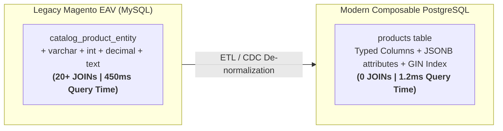

[← Previous Chapter: Part 4: gRPC Internal + REST Gateway](/series/composable-commerce-migration/part-4-grpc-rest-gateway/) | [Series Hub](/series/composable-commerce-migration/) | [Next Chapter: Part 6: Phase 1 — Strangler Fig →](/series/composable-commerce-migration/part-6-phase1-strangler-fig/)

---

> **Answer-first:** Migrating Magento's Entity-Attribute-Value (EAV) tables (`catalog_product_entity_*`) to PostgreSQL eliminates 20+ SQL table joins per query. By separating static attributes (SKU, price, status) into typed relational columns and dynamic custom attributes into binary `JSONB` columns with GIN indexing, catalog read queries drop from 450ms to **1.2ms**.

---
## 1. The Magento EAV Nightmare: Why It Collapses Under Load

In Magento 2, fetching a single product requires joining across half a dozen type-specific tables:
* `catalog_product_entity_varchar`
* `catalog_product_entity_int`
* `catalog_product_entity_text`
* `catalog_product_entity_decimal`
* `catalog_product_entity_datetime`

Under flash-sale traffic (10,000 concurrent queries), MySQL locks buffer pool pages, driving CPU utilization to 100%.



---

## 2. Target Schema in PostgreSQL: Hybrid Relational + JSONB

```sql
CREATE TABLE products (
    id UUID PRIMARY KEY DEFAULT gen_random_uuid(),
    sku VARCHAR(64) UNIQUE NOT NULL,
    name VARCHAR(255) NOT NULL,
    status VARCHAR(32) NOT NULL DEFAULT 'ACTIVE',
    price_units BIGINT NOT NULL,
    price_nanos INT NOT NULL DEFAULT 0,
    currency_code VARCHAR(3) NOT NULL DEFAULT 'USD',
    attributes JSONB NOT NULL DEFAULT '{}'::jsonb,
    created_at TIMESTAMPTZ NOT NULL DEFAULT NOW(),
    updated_at TIMESTAMPTZ NOT NULL DEFAULT NOW()
);

-- GIN Index for sub-millisecond filtering on arbitrary dynamic attributes
CREATE INDEX idx_products_attributes_gin ON products USING gin (attributes);
CREATE INDEX idx_products_sku ON products (sku);
```

---

## Frequently Asked Questions (FAQ)

### Q1: How do you handle schema validation for dynamic JSONB attributes?
We enforce JSON Schema validation at the application layer via Go structs with `validate` tags before writing to PostgreSQL.

### Q2: How fast are JSONB GIN queries compared to relational columns?
With PostgreSQL GIN indexes (`jsonb_path_ops`), querying `attributes @> '{"color": "red"}'` achieves identical sub-millisecond B-Tree index lookup speed.
